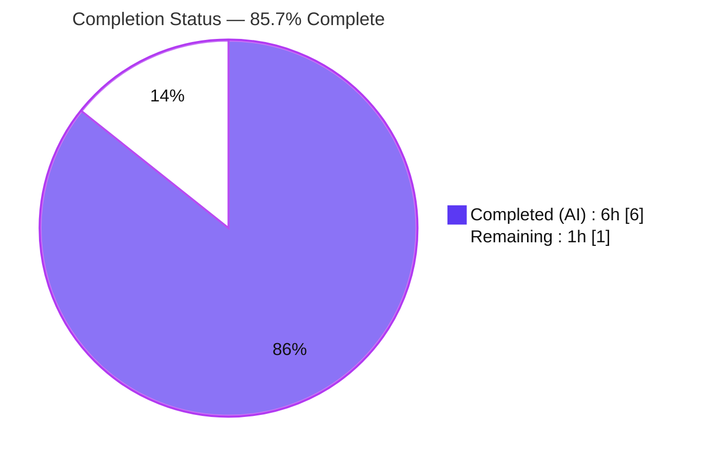
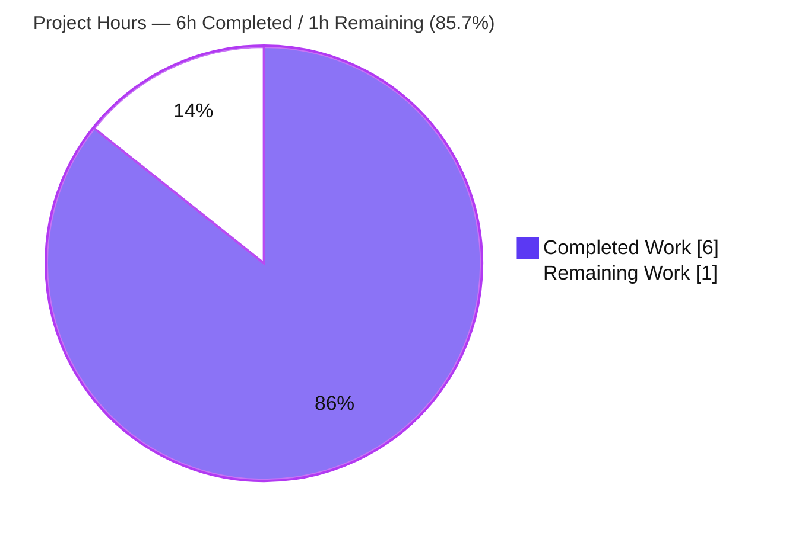
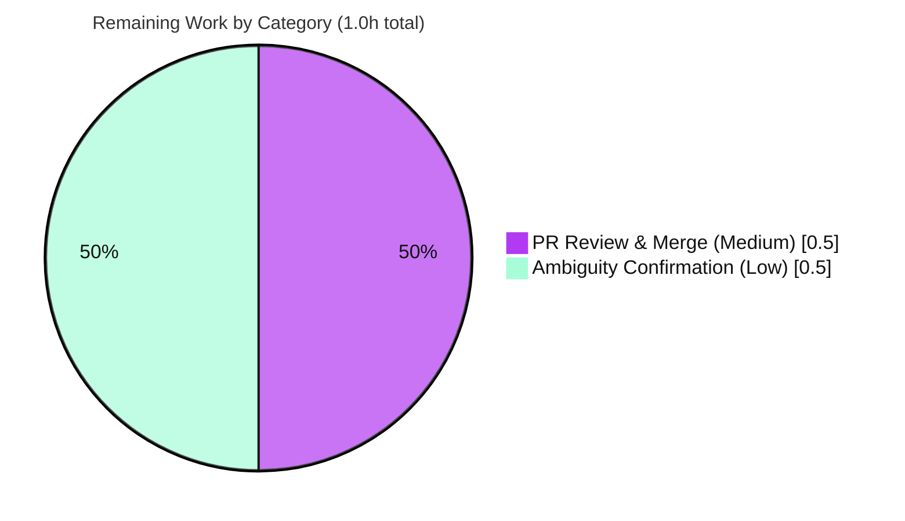

# Blitzy Project Guide — BF-ADDFEATURE-ROLLBACK-GITHUB

> Minimal Node.js + Express tutorial server exposing two GET endpoints (`/hello` → "Hello world" and `/good-evening` → "Good evening").

---

## 1. Executive Summary

### 1.1 Project Overview

This project delivers a minimal **Node.js + Express** tutorial HTTP service. The feature request was to introduce the Express.js framework and add a second `GET` endpoint returning the literal string **"Good evening"** alongside the original endpoint returning **"Hello world"**. A repository inspection revealed a decisive precondition: the assumed "existing product" did not physically exist — the repository contained only a one-line `README.md` and Git metadata. The work was therefore a **greenfield bootstrap**: authoring the npm manifest, introducing Express, and writing the server entry file that registers both routes. The deliverable is a headless HTTP service consumed by clients such as `curl`, a browser, or Postman. The target users are developers learning Node.js/Express fundamentals; business impact is educational/illustrative.

### 1.2 Completion Status

The completion percentage is computed using the AAP-scoped, hours-based methodology: **Completed Hours ÷ Total Project Hours**. All ten in-scope implementation requirements are fully delivered and validated; the remaining hour is path-to-production human work (sign-off on two flagged ambiguities and PR review/merge).



| Metric | Hours |
|---|---|
| **Total Hours** | **7.0** |
| Completed Hours (AI + Manual) | 6.0 (AI 6.0 + Manual 0.0) |
| Remaining Hours | 1.0 |
| **Percent Complete** | **85.7%** |

> Color legend — **Completed = Dark Blue `#5B39F3`**, **Remaining = White `#FFFFFF`**.

### 1.3 Key Accomplishments

- ✅ **Express.js introduced** — `express ^5.2.1` declared and installed; resolves to exactly `5.2.1` (the framework choice the spec had deferred is now decided).
- ✅ **Original endpoint preserved** — `GET /hello` returns `Hello world` (200 OK, 11 bytes), matching Feature F-002.
- ✅ **New endpoint delivered** — `GET /good-evening` returns `Good evening` (200 OK, 12 bytes), satisfying the user's core request.
- ✅ **Project bootstrapped from scratch** — `package.json`, `server.js`, and `.gitignore` authored; `package-lock.json` generated and committed (lockfileVersion 3).
- ✅ **Out-of-scope discipline honored** — `README.md` left byte-for-byte unchanged; no build step, middleware, auth, DB, tests, CI/CD, or containers introduced.
- ✅ **Validated end-to-end** — clean `npm ci` (0 vulnerabilities), `node --check` passes, runtime confirms both payloads, negative paths return 404, `PORT` override works.

### 1.4 Critical Unresolved Issues

| Issue | Impact | Owner | ETA |
|---|---|---|---|
| _None_ — no defects, no compilation/test/runtime failures | No release blockers | — | — |

> There are **no critical unresolved issues**. The implementation compiles, runs, and serves both required endpoints with exact payloads. The only remaining items are non-blocking human confirmations and a PR merge (see §1.6 and §2.2).

### 1.5 Access Issues

| System/Resource | Type of Access | Issue Description | Resolution Status | Owner |
|---|---|---|---|---|
| npm registry | Network (read) | First-time `npm install` requires registry availability | Mitigated — `package-lock.json` committed and `node_modules/` already installed; `npm ci` reproduces deterministically | Developer |

> No blocking access issues identified. Repository, branch, and toolchain are all accessible; dependency installation was completed successfully (0 vulnerabilities).

### 1.6 Recommended Next Steps

1. **[Medium]** Review the additive 4-file diff and **merge** branch `blitzy-5a618c97-0c30-441a-80f6-b16d1e9e5261` into the default branch.
2. **[Low]** **Confirm the new route path** with the product owner — `/good-evening` was adopted (kebab-case, parallel to `/hello`); alternatives `/goodevening` or `/good_evening` are trivially substitutable.
3. **[Low]** **Confirm the response Content-Type** — current default is `text/html; charset=utf-8`; add `res.type('text/plain')` only if strict plain text is required.
4. **[Low / optional]** Consider adding README run instructions (explicitly out of scope today) once the path/content-type are confirmed.

---

## 2. Project Hours Breakdown

### 2.1 Completed Work Detail

All completed work was performed autonomously by Blitzy agents (AI = 6.0h, Manual = 0.0h). Each component traces to a specific AAP requirement.

| Component | Hours | Description |
|---|---|---|
| Greenfield diagnosis & capability-gap analysis | 1.0 | Git archaeology across all refs; confirmed no prior source; enumerated capability gaps GAP-1…GAP-5 (AAP §0.2–0.3) |
| Proof-of-concept validation | 0.5 | Isolated end-to-end Express POC proving both payloads before specifying the change (AAP §0.3.3) |
| `package.json` manifest (R1) | 0.5 | `express ^5.2.1`, `type: commonjs`, `start` script, `engines.node >=18`, `main: server.js` |
| Express introduction + dependency install + `package-lock.json` (R2, R7, R8) | 0.5 | `npm install` → 67 packages, lockfileVersion 3 pinning `express 5.2.1`; `node_modules/` ignored |
| `.gitignore` (R6) | 0.25 | Ignore `node_modules/` and `npm-debug.log*` |
| `server.js` core (R3) | 0.75 | Express app bootstrap, configurable `PORT` (default 3000), `app.listen`, startup log |
| `GET /hello` route — preserved original (R4) | 0.5 | `res.send('Hello world')` — Feature F-002 |
| `GET /good-evening` route — new feature (R5) | 0.5 | `res.send('Good evening')` — the user's core request |
| Autonomous validation (R10) | 1.5 | 5 production-readiness gates + 9-assertion ephemeral smoke test + runtime, `PORT`-override, and negative-path verification |
| **Total Completed** | **6.0** | |

### 2.2 Remaining Work Detail

| Category | Hours | Priority |
|---|---|---|
| Stakeholder confirmation of flagged ambiguities (route path §0.7.4a + Content-Type §0.7.4b) | 0.5 | Low |
| Deployment/Release — PR review & merge to default branch | 0.5 | Medium |
| **Total Remaining** | **1.0** | |

> **Integrity check:** Section 2.1 total (6.0h) + Section 2.2 total (1.0h) = **7.0h** = Total Project Hours in §1.2. Remaining (1.0h) matches §1.2 and §7.

### 2.3 Hours Calculation Methodology

- **Formula:** `Completion % = Completed Hours ÷ (Completed Hours + Remaining Hours) × 100 = 6.0 ÷ 7.0 × 100 = 85.7%`.
- **Scope:** Only AAP-defined deliverables and standard path-to-production activities are counted. Out-of-scope items (tests, CI/CD, hardening, observability, containers, README edits) carry **zero** hours per AAP §0.5.2.
- **Confidence:** High — the implementation surface is small, fully delivered, and independently re-verified.

---

## 3. Test Results

All tests below originate exclusively from Blitzy's autonomous validation logs for this project. No in-repo test suite exists or is in scope (AAP §0.5.2/§0.6.2); behavior was verified via an **ephemeral** ad-hoc smoke harness authored outside the repository (never committed) plus static and runtime checks.

| Test Category | Framework | Total Tests | Passed | Failed | Coverage % | Notes |
|---|---|---|---|---|---|---|
| Static / Compilation | `node --check` (CommonJS) | 1 | 1 | 0 | n/a | `server.js` — no syntax errors |
| Dependency Audit | `npm ci` / `npm audit` | 1 | 1 | 0 | n/a | 67 packages installed, **0 vulnerabilities** |
| JSON Validity | `JSON.parse` | 2 | 2 | 0 | n/a | `package.json`, `package-lock.json` valid |
| Smoke / Behavioral (ephemeral) | Node + curl assertions | 9 | 9 | 0 | n/a | `/hello` (200, "Hello world", 11B, X-Powered-By: Express), `/good-evening` (200, "Good evening", 12B), `/nope` (404), `POST /hello` (404) |
| **Total** | | **13** | **13** | **0** | n/a | 100% pass rate |

> No formal coverage instrumentation applies (no test framework is in scope). The 9 behavioral assertions exercise 100% of the application's routes and all documented negative paths.

---

## 4. Runtime Validation & UI Verification

**UI Verification:** Not applicable — the deliverable is a headless HTTP service with no graphical user interface, no Figma design, and no component/design system (AAP §0.4.4).

**Runtime Health (verified via `npm start` + `curl -i`):**

- ✅ **Server boot** — `node server.js` logs `Server listening on http://localhost:3000`.
- ✅ **`GET /hello`** — `200 OK`, body `Hello world`, `Content-Length: 11`.
- ✅ **`GET /good-evening`** — `200 OK`, body `Good evening`, `Content-Length: 12`.
- ✅ **Express confirmed** — `X-Powered-By: Express` header present (the bare `http` module was not used).
- ✅ **Content-Type** — `text/html; charset=utf-8` (Express default; satisfies the request).
- ✅ **Negative path** — `GET /nope` → `404`.
- ✅ **Method discipline** — `POST /hello` → `404` (routes are `GET`-only).
- ✅ **Port configurability** — `PORT=3700 node server.js` serves on :3700 (validated; `process.env.PORT` honored, default 3000).
- ✅ **Clean lifecycle** — server starts/stops cleanly; working tree remains clean; `node_modules/` stays untracked.

**API Integration:** No external services, databases, or third-party APIs are integrated (by design) — no integration endpoints to validate.

---

## 5. Compliance & Quality Review

Cross-mapping of AAP deliverables to quality/compliance benchmarks. All in-scope items pass.

| Deliverable / Benchmark | Requirement Source | Status | Notes |
|---|---|---|---|
| `package.json` manifest with `express ^5.2.1` | AAP §0.4.1 (R1) | ✅ Pass | Matches spec byte-for-byte; valid JSON |
| Express framework introduced | AAP §0.1 (R2) | ✅ Pass | Installed `5.2.1`; `X-Powered-By: Express` |
| `server.js` entry + `app.listen` | AAP §0.4.1 (R3) | ✅ Pass | Configurable `PORT`, startup log |
| `GET /hello` → `Hello world` preserved | AAP §0.4.1 (R4) | ✅ Pass | 200 OK, 11 bytes |
| `GET /good-evening` → `Good evening` | AAP §0.4.1 (R5) | ✅ Pass | 200 OK, 12 bytes |
| `.gitignore` ignores `node_modules/` | AAP §0.4.1 (R6) | ✅ Pass | `node_modules/` untracked |
| `package-lock.json` committed (lockfileVersion 3) | AAP §0.4.2 (R7) | ✅ Pass | Pins `express 5.2.1` |
| `node_modules/` not committed | AAP §0.5.1 (R8) | ✅ Pass | Confirmed via `git status --ignored` |
| `README.md` unchanged | AAP §0.5.2 (R9) | ✅ Pass | Byte-for-byte identical to initial commit |
| Functional verification protocol | AAP §0.6 (R10) | ✅ Pass | All gates + smoke assertions pass |
| Minimal-surface-area discipline | AAP §0.7.2 | ✅ Pass | Only the 4 intended files added; no excluded categories introduced |
| Dependency security | Blitzy quality gate | ✅ Pass | `npm audit` → 0 vulnerabilities |
| Compilation cleanliness | Blitzy quality gate | ✅ Pass | `node --check` clean |

**Fixes applied during autonomous validation:** None required — prior agents' implementation was already complete and correct; the validator made no source changes and created no new commit (a no-op commit would have been incorrect).

**Outstanding compliance items:** None. Two non-blocking product decisions (route path, Content-Type) remain for human confirmation (see §2.2).

---

## 6. Risk Assessment

Overall posture: **LOW**. There are **0 Critical, 0 High, and 0 Medium-severity** risks. Most items below are deliberate scope exclusions documented in AAP §0.5.2 (tutorial minimalism), not defects.

| Risk | Category | Severity | Probability | Mitigation | Status |
|---|---|---|---|---|---|
| No automated/committed test suite for regression protection | Technical | Low | Medium | Out-of-scope per AAP §0.5.2; behavior validated by ephemeral 9/9 smoke; add a framework if the project grows | Accepted (AAP scope) |
| Caret range `^5.2.1` may resolve a newer Express 5.x on a fresh `npm install` | Technical | Low | Low | `package-lock.json` (v3) pins `5.2.1`; use `npm ci` for reproducible installs | Mitigated |
| Response Content-Type is `text/html` (not `text/plain`) | Technical | Low | Low | One-line `res.type('text/plain')` if strict plain text desired (§0.7.4b); default satisfies the request | Open (human decision) |
| `X-Powered-By: Express` header disclosed (framework fingerprinting) | Security | Low | High | Optional `app.disable('x-powered-by')` or `helmet`; out of scope for tutorial | Accepted (AAP scope) |
| No security middleware (helmet/cors/rate-limit) or TLS/HTTPS | Security | Low | Low | Minimal attack surface — 2 static GET routes, no auth/DB/PII/input; front with reverse proxy + helmet for public prod | Accepted (AAP scope) |
| No observability (structured logging/metrics/health-check) | Operational | Low | Low | Single startup `console.log` present; add logging + `/health` if promoted beyond tutorial | Accepted (AAP scope) |
| No process manager / graceful shutdown / auto-restart | Operational | Low | Low | Run under pm2/systemd/container for production resilience | Accepted (AAP scope) |
| npm-registry availability required for first-time `npm install` | Integration | Low | Low | Committed lockfile + already-installed `node_modules/` (matches AAP residual-2% note §0.3.3) | Mitigated |
| New route path naming unconfirmed (`/good-evening` vs alternatives) | Integration | Low | Medium | Stakeholder confirmation task; trivially adjustable, payload unaffected | Open (human decision) |

> **Positive finding:** `npm audit` reports **0 vulnerabilities** across 68 audited packages.

---

## 7. Visual Project Status

### Project Hours Breakdown



### Remaining Work by Category (hours)



> **Integrity:** Pie "Remaining Work" = **1.0h** = §1.2 Remaining Hours = sum of §2.2 Hours column. "Completed Work" = **6.0h** = §2.1 total. Colors: Completed = Dark Blue `#5B39F3`, Remaining = White `#FFFFFF`.

---

## 8. Summary & Recommendations

**Achievements.** The project is **85.7% complete** (6.0 of 7.0 hours). Starting from a greenfield repository that contained only a `README.md`, Blitzy agents bootstrapped a complete, working Node.js + Express application: the npm manifest, the server entry file with both routes, the `.gitignore`, and the committed lockfile. The original `GET /hello` → "Hello world" contract is preserved and the new `GET /good-evening` → "Good evening" endpoint is delivered. Every in-scope requirement (R1–R10) is fully implemented and independently validated, with zero defects and zero dependency vulnerabilities.

**Remaining gaps (1.0h).** The remaining hour is entirely path-to-production, human-in-the-loop work: (1) PR review and merge of the additive diff into the default branch, and (2) product-owner confirmation of two flagged ambiguities — the new route's path name (`/good-evening` adopted) and the response Content-Type (`text/html` default). Both ambiguities are non-blocking and trivially adjustable; the current implementation already satisfies the user's request.

**Critical path to production.** Confirm path/Content-Type → review the 4-file diff → merge the branch → (optional) run the verified smoke commands post-merge. No code rework is anticipated.

**Success metrics.** Both endpoints return their exact literal payloads with `200 OK`; unknown paths return `404`; the app installs reproducibly with 0 vulnerabilities and compiles cleanly.

**Production readiness assessment.** For its intended tutorial scope, the deliverable is **ready** pending human PR merge. If the service were ever promoted to a public production workload, the deliberately-excluded categories (tests, security hardening, observability, process management, containerization) should be revisited — but these are explicitly out of scope for this AAP.

---

## 9. Development Guide

> All commands below were executed and verified on the host toolchain (Node.js v20.20.2, npm 11.1.0). Run them from the repository root.

### 9.1 System Prerequisites

- **Node.js ≥ 18** (required by `package.json` `engines`; tested on v20.20.2; v22/v24 LTS also compatible).
- **npm** (tested on 11.1.0; ships with Node.js).
- **Internet access** for the first dependency install only (afterward `node_modules/` and `package-lock.json` make installs reproducible/offline-capable).
- OS: any Linux/macOS/Windows environment that runs Node.js. No special hardware.

### 9.2 Environment Setup

```bash
# Check out the project branch
git checkout blitzy-5a618c97-0c30-441a-80f6-b16d1e9e5261

# (Optional) choose a custom port; defaults to 3000 if unset
export PORT=3000
```

- **No `.env` file or secrets are required.** The only honored environment variable is `PORT` (optional).

### 9.3 Dependency Installation

```bash
# Preferred: clean, reproducible install from the committed lockfile
npm ci

# Alternative (also works):
# npm install
```

Expected output (tail): `found 0 vulnerabilities` and a non-error exit code. Installs `express@5.2.1` and 66 transitive packages into `node_modules/` (which is git-ignored).

### 9.4 Application Startup

```bash
# Start on the default port (3000)
npm start
#   └─ runs: node server.js

# Or start on a custom port
PORT=3700 node server.js
```

Expected log: `Server listening on http://localhost:3000` (or your chosen port).

### 9.5 Verification

```bash
# In a second terminal (server running in the first):
curl -s http://localhost:3000/hello          # => Hello world
curl -s http://localhost:3000/good-evening    # => Good evening

# Status codes
curl -s -o /dev/null -w "%{http_code}\n" http://localhost:3000/hello         # => 200
curl -s -o /dev/null -w "%{http_code}\n" http://localhost:3000/good-evening  # => 200
curl -s -o /dev/null -w "%{http_code}\n" http://localhost:3000/nope          # => 404

# Confirm Express is the active layer
curl -s -I http://localhost:3000/good-evening | grep -i X-Powered-By          # => X-Powered-By: Express
```

### 9.6 Example Usage

```bash
$ curl -i http://localhost:3000/good-evening
HTTP/1.1 200 OK
X-Powered-By: Express
Content-Type: text/html; charset=utf-8
Content-Length: 12
...
Good evening
```

You can also open `http://localhost:3000/hello` in a browser.

### 9.7 Troubleshooting

| Symptom | Cause | Resolution |
|---|---|---|
| `Error: listen EADDRINUSE :::3000` | Port 3000 already in use | Start with a different port: `PORT=3001 node server.js`, or free the port |
| `Error: Cannot find module 'express'` | Dependencies not installed | Run `npm ci` (or `npm install`) from the repo root |
| `Cannot find module '.../server.js'` | Running from the wrong directory | `cd` to the repository root before running |
| npm install fails offline | No registry connectivity | Use the committed `package-lock.json` + existing `node_modules/`; run `npm ci` where the cache/modules already exist |
| Engine warning about Node version | Node < 18 | Upgrade to Node.js ≥ 18 (LTS recommended) |

### 9.8 Stopping the Server

```bash
# If started in the foreground: press Ctrl+C
# If started in the background: kill the exact PID
kill <server_pid>
```

---

## 10. Appendices

### Appendix A — Command Reference

| Command | Purpose |
|---|---|
| `npm ci` | Clean, reproducible install from `package-lock.json` |
| `npm install` | Install dependencies (updates lockfile if needed) |
| `npm start` | Start the server (`node server.js`) on `PORT` or 3000 |
| `PORT=<n> node server.js` | Start the server on a custom port |
| `node --check server.js` | Static syntax check (no execution) |
| `npm audit` | Report dependency vulnerabilities |
| `curl http://localhost:3000/hello` | Exercise the original endpoint |
| `curl http://localhost:3000/good-evening` | Exercise the new endpoint |

### Appendix B — Port Reference

| Port | Service | Configurable | Notes |
|---|---|---|---|
| 3000 | HTTP server (default) | Yes — via `PORT` env var | No port is mandated by spec (A-004); 3000 is the default |

### Appendix C — Key File Locations

| File | Role | Status |
|---|---|---|
| `server.js` | Express application: 2 GET routes + listener | Created (24 lines) |
| `package.json` | npm manifest; declares `express ^5.2.1` | Created (17 lines) |
| `.gitignore` | Ignores `node_modules/`, `npm-debug.log*` | Created (5 lines) |
| `package-lock.json` | Pins `express 5.2.1` (lockfileVersion 3) | Created/tool-generated (860 lines) |
| `README.md` | Project title only | Unchanged (preserved) |
| `node_modules/` | Installed dependencies | Untracked (git-ignored) |

### Appendix D — Technology Versions

| Technology | Version | Notes |
|---|---|---|
| Node.js | ≥ 18 (tested v20.20.2) | `engines.node` `>=18`; v22/v24 LTS also supported |
| npm | 11.1.0 (tested) | Ships with Node.js |
| Express | 5.2.1 | Declared `^5.2.1`, pinned `5.2.1` in lockfile |
| Module system | CommonJS | `type: commonjs`; no build/transpile step |

### Appendix E — Environment Variable Reference

| Variable | Required | Default | Purpose |
|---|---|---|---|
| `PORT` | No | `3000` | TCP port the HTTP server binds to |

### Appendix F — Developer Tools Guide

- **`node --check server.js`** — fast static syntax validation (the compile-equivalent for plain CommonJS); used as the compilation gate.
- **`npm audit`** — dependency vulnerability scan (currently 0 vulnerabilities).
- **`curl -i`** — inspect status line, headers (`X-Powered-By`, `Content-Type`, `Content-Length`), and body.
- Browser DevTools / Lighthouse / heap snapshots — not applicable (headless service, no UI).

### Appendix G — Glossary

| Term | Definition |
|---|---|
| Greenfield bootstrap | Creating a project from scratch where no prior source exists |
| AAP | Agent Action Plan — the authoritative requirements document for this change |
| Capability gap (GAP-n) | A missing artifact/behavior explaining why a request is unsatisfied |
| Path-to-production | Standard activities (review, merge, sign-off) to ship a delivered change |
| Ephemeral smoke test | A throwaway behavioral test run outside the repo, never committed |
| lockfileVersion 3 | The npm `package-lock.json` schema that deterministically pins dependencies |

---

_Cross-section integrity verified: Remaining hours = **1.0h** across §1.2, §2.2, and §7; §2.1 (6.0h) + §2.2 (1.0h) = **7.0h** Total; completion **85.7%** consistent throughout; all tests sourced from Blitzy autonomous validation logs; Completed = `#5B39F3`, Remaining = `#FFFFFF`._