# Technical Specification

# 1. Introduction

## 1.1 EXECUTIVE SUMMARY

### 1.1.1 Project Overview

This Technical Specification documents the design and intended implementation of a minimal Node.js tutorial project that exposes a single HTTP endpoint. The project, hosted in the repository identified as `BF-ADDFEATURE-ROLLBACK-GITHUB`, is a greenfield initiative: at the time of this specification, the repository contains only a placeholder `README.md` file with no source code, package manifests, configuration files, or directory structure. All architectural, implementation, and operational decisions described in this document are net-new and must be realized from scratch.

The system to be built is intentionally narrow in scope. It consists of a single HTTP server process that listens for inbound requests, recognizes the route `/hello`, and returns the literal response body `"Hello world"` to the calling HTTP client. No other endpoints, persistence layers, authentication mechanisms, or downstream integrations are within scope.

### 1.1.2 Core Business Problem

The project addresses a foundational educational need: providing a canonical, working "Hello World" implementation that demonstrates the minimum viable pattern for serving HTTP traffic from Node.js. Developers approaching the Node.js runtime for the first time — or instructors creating onboarding material — require a reproducible reference artifact that:

- Establishes the smallest possible end-to-end request/response cycle in Node.js.
- Demonstrates how a single route is registered, matched, and handled.
- Returns a deterministic, predictable payload so that the correctness of the implementation can be verified instantly.

By solving the "first endpoint" problem in the simplest possible form, the project removes the cognitive overhead of unrelated concerns (databases, authentication, build pipelines) and isolates the core competency: standing up an HTTP server in Node.js.

### 1.1.3 Key Stakeholders and Users

| Stakeholder | Role | Primary Interaction |
|---|---|---|
| Learner / Developer | Consumes the codebase as instructional material | Reads, runs, and modifies source files locally |
| Instructor / Tutorial Author | Maintains the project as teaching content | Authors source code, README, and walkthroughs |
| HTTP Client | Issues runtime requests to the server | Sends GET requests to `/hello` and consumes the response |
| Repository Maintainer | Owns the long-term state of the codebase | Manages commits, branches, and project hygiene |

The "HTTP Client" category encompasses any conforming HTTP user-agent capable of issuing a request, including command-line tools (e.g., `curl`, `wget`), browser address bars, API testing utilities (e.g., Postman, Insomnia), and programmatic clients written in any language.

### 1.1.4 Expected Business Impact and Value Proposition

Because the project is educational in nature rather than a commercial or operational system, its value is measured in learning outcomes rather than financial or operational metrics. The expected value proposition is summarized below:

| Value Dimension | Expected Outcome |
|---|---|
| Time-to-First-Endpoint | A developer can clone the repository, run the server, and observe a successful `/hello` response within minutes |
| Conceptual Clarity | The codebase contains nothing beyond what is required to serve one route, making the request/response model immediately apparent |
| Reusability | The pattern serves as a template that learners can extend with additional routes, middleware, or integrations |
| Verification Simplicity | Correctness can be confirmed by a single HTTP request returning the expected string `"Hello world"` |

---

## 1.2 SYSTEM OVERVIEW

### 1.2.1 Project Context

#### 1.2.1.1 Business Context and Market Positioning

The project occupies the well-established category of "introductory tutorial application" within the Node.js learning ecosystem. It is not a commercial product, does not compete in any market, and is not subject to commercial KPIs, service-level commitments, or customer-facing obligations. Its positioning is pedagogical: it exists to illustrate a single concept (serving an HTTP route in Node.js) with the minimum required code surface area.

#### 1.2.1.2 Current System Limitations and Greenfield Status

There is no existing system to upgrade, replace, or migrate from. The repository state has been verified to contain:

| Repository Attribute | Observed State |
|---|---|
| Root-level files | `README.md` only |
| Source code files | None present |
| Package manifest (`package.json`) | Not present |
| Subdirectories (e.g., `src/`, `lib/`, `routes/`) | None present |
| Build, CI, or container artifacts | None present |

Because no prior implementation exists, the specification proceeds without legacy constraints, deprecation considerations, or backward-compatibility requirements. The repository name `BF-ADDFEATURE-ROLLBACK-GITHUB`, observed in the `README.md` heading, appears to follow an internal branch- or workflow-naming convention and does not constrain the project's functional purpose.

#### 1.2.1.3 Integration with Existing Enterprise Landscape

No enterprise integration landscape is in scope. The system is self-contained and does not interact with identity providers, message brokers, databases, third-party APIs, monitoring platforms, or any other external services. The only external interaction surface is the inbound HTTP boundary used by the calling client.

### 1.2.2 High-Level Description

#### 1.2.2.1 Primary System Capabilities

The system exposes exactly one capability:

| Capability | Description |
|---|---|
| Serve `/hello` route | Accept an inbound HTTP request directed at the path `/hello` and return the response body `"Hello world"` to the requesting client |

No other capabilities — such as user management, content negotiation, parameter handling, or state mutation — are part of the system.

#### 1.2.2.2 Major System Components

At a conceptual level, the system comprises a single deployable component: a Node.js process that binds to a network port and listens for inbound HTTP traffic. Within that process, two logical responsibilities are colocated:

| Logical Component | Responsibility |
|---|---|
| HTTP Listener | Bind to a network port, accept inbound TCP connections, and parse HTTP requests |
| Route Handler for `/hello` | Match incoming requests against the `/hello` path and produce the `"Hello world"` response |

These responsibilities may be implemented using Node.js's built-in `http` module or a higher-level framework; the specific technology choice is deferred to subsequent sections of this specification.

#### 1.2.2.3 Core Technical Approach

The technical approach is built on the Node.js runtime executing JavaScript in a single-threaded, event-driven model. A server is instantiated, configured to listen on a network port, and registers a handler that matches the `/hello` route. When a matching request arrives, the handler writes the response payload back to the client and terminates the response.

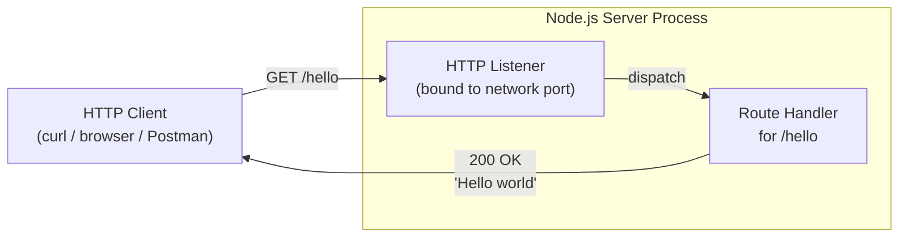

### 1.2.3 Success Criteria

#### 1.2.3.1 Measurable Objectives

Because the user requirements specify only the functional behavior of the endpoint, the measurable objectives are limited to functional correctness rather than performance or availability metrics:

| Objective | Measurement Method |
|---|---|
| Server reaches a listening state | The Node.js process starts without error and binds to its configured port |
| `/hello` returns the expected payload | An HTTP GET to `/hello` returns the exact response body `"Hello world"` |
| Single-endpoint scope is honored | No routes beyond `/hello` are implemented |

#### 1.2.3.2 Critical Success Factors

| Success Factor | Description |
|---|---|
| Minimal Surface Area | The implementation contains only what is required to serve `/hello`; no extraneous code is introduced |
| Reproducibility | A developer following the documented setup steps can stand up the server identically on any compatible Node.js installation |
| Deterministic Response | The response is a fixed literal string; no variability, randomness, or environmental dependence is acceptable |
| Tutorial Readability | The codebase remains compact and self-explanatory so that it serves its educational purpose |

#### 1.2.3.3 Key Performance Indicators (KPIs)

No quantitative performance, throughput, latency, or availability KPIs are specified by the user requirements. Any introduction of such metrics (e.g., requests-per-second targets, p99 latency budgets, uptime percentages) is explicitly out of scope for this tutorial project. The sole binary KPI is functional: the `/hello` endpoint either returns `"Hello world"` correctly, or it does not.

---

## 1.3 SCOPE

### 1.3.1 In-Scope Elements

#### 1.3.1.1 Core Features and Functionalities

| Category | In-Scope Item |
|---|---|
| Must-Have Capability | A single HTTP endpoint at the path `/hello` |
| Must-Have Capability | A response body containing the literal text `"Hello world"` |
| Primary User Workflow | An HTTP client issues a request to `/hello` and receives the expected response |
| Essential Technical Requirement | The implementation is written in JavaScript and executes on the Node.js runtime |
| Essential Technical Requirement | The server accepts inbound HTTP requests over a network port |

#### 1.3.1.2 Implementation Boundaries

| Boundary Dimension | In-Scope Definition |
|---|---|
| System Boundary | A single Node.js process serving HTTP traffic locally |
| User Groups Covered | Developers, instructors, and any HTTP-conformant client |
| Geographic / Market Coverage | Not applicable — the project is a local tutorial artifact with no geographic deployment footprint |
| Data Domains | None — the endpoint returns a static literal string and processes no input data |

### 1.3.2 Out-of-Scope Elements

The following capabilities are explicitly excluded from this specification. They are listed exhaustively to prevent scope creep and to clarify what stakeholders should not expect from the deliverable.

#### 1.3.2.1 Excluded Features and Capabilities

| Category | Excluded Item | Rationale |
|---|---|---|
| Endpoints | Any route other than `/hello` | User context specifies exactly one endpoint |
| Security | Authentication, authorization, API keys, tokens | Not requested by the user |
| Security | HTTPS / TLS termination | Not requested by the user |
| Data | Database integration, persistence layer, caching | The response is a fixed literal string |
| Input Handling | Query parameters, request body parsing, validation | The endpoint accepts no input |
| Observability | Structured logging, metrics, tracing, monitoring | Not requested by the user |
| API Design | Versioning (e.g., `/v1/hello`), OpenAPI/Swagger documentation | Not requested by the user |
| Reliability | Rate limiting, throttling, circuit breakers | Not requested by the user |
| Localization | Internationalization or multi-language responses | The response is a fixed English string |
| Front-End | Web UI, single-page application, client-side rendering | The consumer is an HTTP client, not a browser-rendered UI |
| Testing | Automated test suites, test framework configuration | Not requested by the user |
| Deployment | Containerization (Dockerfile), Kubernetes manifests, CI/CD pipelines | No deployment infrastructure was specified |
| Configuration | Multi-environment configuration files, `.env` handling | Not requested by the user |

#### 1.3.2.2 Future Phase Considerations

The following items are not committed to any future phase but are noted as natural extensions a learner might pursue independently:

- Adding additional routes that demonstrate parameterized paths.
- Introducing middleware patterns (logging, error handling).
- Exploring framework alternatives (e.g., Express, Fastify, Koa) for comparison.
- Adding a test harness to validate the endpoint programmatically.

These items are mentioned solely for stakeholder awareness and are **not** deliverables of the present specification.

#### 1.3.2.3 Integration Points Not Covered

No integrations with external systems are in scope. This explicitly excludes — but is not limited to — identity providers, message queues, relational databases, NoSQL stores, third-party SaaS APIs, payment gateways, analytics platforms, and centralized logging or monitoring services.

#### 1.3.2.4 Unsupported Use Cases

| Use Case | Status |
|---|---|
| Production hosting at scale | Unsupported — the project is a tutorial artifact, not a production system |
| Handling concurrent load beyond local-development volumes | Unsupported — no performance engineering is in scope |
| Serving any payload other than `"Hello world"` | Unsupported — the response is fixed by requirement |
| Acting as a backend for a real application | Unsupported — the endpoint provides no real business value |

---

## 1.4 References

### 1.4.1 Files Examined

- `README.md` — The sole file present in the repository; contains only the title heading `# BF-ADDFEATURE-ROLLBACK-GITHUB` and confirms the greenfield state of the codebase.

### 1.4.2 Folders Explored

- `/` (repository root, depth 0) — Confirmed to contain only `README.md` with no subdirectories such as `src/`, `lib/`, `routes/`, `tests/`, `config/`, or `.github/`.

### 1.4.3 Repository-Wide Searches Performed

- Recursive search for `.blitzyignore` files — None found; no path exclusion rules apply.
- Recursive search for Node.js artifacts (`package.json`, `*.js`, `*.ts`, `.gitignore`, `Dockerfile`) — No repository-internal matches, confirming the absence of any implementation files.
- Semantic search for Node.js source code or package configuration — Empty result set.
- Semantic search for source-code folders, application files, or server implementation directories — Empty result set.

### 1.4.4 Technical Specification Cross-References

- No prior Technical Specification sections were available for retrieval (the section list was empty). This Introduction is authored without cross-references to other specification sections; subsequent sections of this document will build upon the scope and context established here.

### 1.4.5 User Context Reference

- The authoritative functional requirement — a Node.js tutorial project featuring one endpoint `/hello` that returns `"Hello world"` to the calling HTTP client — was provided directly by the requesting user and serves as the primary input shaping every facet of this Introduction.

# 2. Product Requirements

This section enumerates the discrete, testable features that compose the Node.js tutorial system specified in Section 1. Because the repository is in a verified greenfield state — containing only a placeholder `README.md` with no source code, package manifest, or directory structure — every feature described here is **prospective** and carries an initial status of **Proposed**. The feature catalog and requirements that follow are derived authoritatively from the user-provided functional requirement (a Node.js tutorial featuring one `/hello` endpoint returning `"Hello world"`) and the scope boundaries established in Section 1.3.

## 2.1 FEATURE CATALOG

Section 1.2.2.2 identifies that the system, while deployed as a single Node.js process, decomposes into two logical components: an **HTTP Listener** responsible for binding to a network port and parsing inbound HTTP requests, and a **Route Handler** for the `/hello` path responsible for producing the response. To support precise requirements tracing and verification, each logical component is documented below as a discrete feature.

No additional features are introduced. Per Section 1.3.2.1, all categories such as authentication, persistence, observability, versioning, rate limiting, internationalization, front-end UI, automated testing, containerization, and multi-environment configuration are explicitly excluded.

### 2.1.1 F-001: HTTP Server Listener

#### 2.1.1.1 Feature Metadata

| Attribute | Value |
|---|---|
| Unique ID | F-001 |
| Feature Name | HTTP Server Listener |
| Feature Category | Infrastructure — Network Transport |
| Priority Level | Critical |
| Status | Proposed |

#### 2.1.1.2 Description

**Overview**: F-001 establishes the inbound network surface for the tutorial system. A single Node.js process binds to a configurable network port, accepts inbound TCP connections, parses HTTP requests, and dispatches matched routes to their corresponding handlers. This component is the precondition for any HTTP-based interaction with the system, as illustrated by the request/response flowchart in Section 1.2.2.3.

**Business Value**: As an educational artifact, F-001 demonstrates the smallest viable pattern for accepting HTTP traffic in Node.js. It directly supports the *Time-to-First-Endpoint* value dimension defined in Section 1.1.4, allowing a learner to observe a working HTTP server within minutes of cloning the repository.

**User Benefits**:
- Provides Learners with a concrete reference implementation of HTTP socket binding in Node.js.
- Enables Instructors to point students at a minimal, distraction-free server boot sequence.
- Allows any HTTP-conformant Client (curl, browser, Postman, Insomnia, programmatic clients) to reach the system over a network port, per the stakeholder definition in Section 1.1.3.

**Technical Context**: The listener executes on the Node.js runtime using its single-threaded, event-driven model (Section 1.2.2.3). The implementation may use Node.js's built-in `http` module or a higher-level framework; per Section 1.2.2.2, that choice is intentionally deferred to subsequent specification sections.

#### 2.1.1.3 Dependencies

| Dependency Type | Specification |
|---|---|
| Prerequisite Features | None — F-001 is the foundational feature of the system |
| System Dependencies | Node.js runtime installed on the host; one available TCP port |
| External Dependencies | None at integration level (Section 1.2.1.3); optional npm framework |
| Integration Requirements | None — no identity providers, brokers, databases, or third-party APIs |

### 2.1.2 F-002: `/hello` Route Handler

#### 2.1.2.1 Feature Metadata

| Attribute | Value |
|---|---|
| Unique ID | F-002 |
| Feature Name | `/hello` Route Handler |
| Feature Category | Application Logic — Request Handling |
| Priority Level | Critical |
| Status | Proposed |

#### 2.1.2.2 Description

**Overview**: F-002 implements the singular user-facing capability of the system as defined in Section 1.2.2.1: matching inbound HTTP requests against the path `/hello` and writing the literal response body `"Hello world"` back to the calling client. This is the only externally observable behavior the system exposes.

**Business Value**: F-002 delivers the canonical "Hello World" pattern in HTTP form, providing the deterministic verification target by which the tutorial's correctness is judged. It directly supports the *Verification Simplicity* and *Conceptual Clarity* value dimensions enumerated in Section 1.1.4.

**User Benefits**:
- Learners gain a clear, isolated example of route registration and response writing without unrelated concerns (databases, authentication, build pipelines), per the core business problem in Section 1.1.2.
- HTTP Clients receive a predictable, deterministic payload upon issuing a GET request to `/hello`.
- Instructors can verify a learner's working implementation with a single HTTP request, in line with the success criteria of Section 1.2.3.1.

**Technical Context**: F-002 is colocated with F-001 within the same Node.js process. It is invoked by F-001 upon path match and writes a fixed literal string to the response stream. No input is read from the request beyond the path itself, consistent with the implementation boundary stated in Section 1.3.1.2 ("processes no input data").

#### 2.1.2.3 Dependencies

| Dependency Type | Specification |
|---|---|
| Prerequisite Features | F-001 (HTTP Server Listener) must be bound and accepting connections |
| System Dependencies | Same Node.js process as F-001 |
| External Dependencies | None |
| Integration Requirements | Internal in-process dispatch from F-001 |

---

## 2.2 FUNCTIONAL REQUIREMENTS TABLE

This subsection translates each feature into discrete, testable requirements following the identifier convention `F-XXX-RQ-YYY`. Each requirement is decomposed across four perspectives to satisfy the section prompt: requirement details, technical specifications, acceptance criteria, and validation rules.

### 2.2.1 F-001 HTTP Server Listener — Functional Requirements

#### 2.2.1.1 Requirement Details

| Req ID | Description | Priority | Complexity |
|---|---|---|---|
| F-001-RQ-001 | The Node.js process MUST bind to a network port and enter a listening state | Must-Have | Low |
| F-001-RQ-002 | The process MUST start without runtime errors on a compatible Node.js installation | Must-Have | Low |
| F-001-RQ-003 | The listener MUST accept inbound HTTP requests over the bound port | Must-Have | Low |

#### 2.2.1.2 Acceptance Criteria

| Req ID | Acceptance Criteria |
|---|---|
| F-001-RQ-001 | Executing the documented start command results in a Node.js process holding an open socket on the configured port (per success criterion in Section 1.2.3.1) |
| F-001-RQ-002 | No uncaught exceptions or fatal startup errors are emitted during process initialization |
| F-001-RQ-003 | A subsequent HTTP request to the bound port is received by the listener without connection refusal |

#### 2.2.1.3 Technical Specifications

| Aspect | Specification |
|---|---|
| Input Parameters | Process start invocation; runtime-resolved port number |
| Output / Response | Open TCP socket on the configured port; parsed HTTP requests handed off to the route dispatch logic |
| Performance Criteria | **Not Specified** — Section 1.2.3.3 explicitly disclaims all quantitative latency, throughput, and availability KPIs |
| Data Requirements | None — F-001 reads no domain data and persists no state |

#### 2.2.1.4 Validation Rules

| Rule Category | Specification |
|---|---|
| Business Rules | The listener exists solely to support `/hello`; no other endpoints are exposed (Section 1.2.3.1) |
| Data Validation | Not applicable — no domain inputs are processed |
| Security Requirements | **None in scope** — authentication, authorization, API keys, tokens, and TLS termination are explicitly excluded (Section 1.3.2.1) |
| Compliance Requirements | None — the project is a local tutorial artifact with no regulatory footprint (Section 1.3.1.2) |

### 2.2.2 F-002 `/hello` Route Handler — Functional Requirements

#### 2.2.2.1 Requirement Details

| Req ID | Description | Priority | Complexity |
|---|---|---|---|
| F-002-RQ-001 | The system MUST match inbound HTTP requests whose path equals `/hello` and dispatch them to the handler | Must-Have | Low |
| F-002-RQ-002 | The handler MUST return the exact literal response body `Hello world` | Must-Have | Low |
| F-002-RQ-003 | The handler MUST return an HTTP 200 OK status code on a successful match | Must-Have | Low |
| F-002-RQ-004 | No routes other than `/hello` MUST be implemented | Must-Have | Low |

#### 2.2.2.2 Acceptance Criteria

| Req ID | Acceptance Criteria |
|---|---|
| F-002-RQ-001 | An HTTP GET request to `/hello` reaches the handler logic; non-`/hello` paths are not served by this feature |
| F-002-RQ-002 | The response body, byte-for-byte, equals the string `Hello world` (per Section 1.2.3.1 success criterion) |
| F-002-RQ-003 | Inspection of the response status line reveals HTTP 200 OK (per request/response flow in Section 1.2.2.3) |
| F-002-RQ-004 | Source code review confirms exactly one route registration exists; no additional handlers are defined |

#### 2.2.2.3 Technical Specifications

| Aspect | Specification |
|---|---|
| Input Parameters | Dispatched HTTP request with path `/hello`; no query parameters, headers, or body are consumed |
| Output / Response | HTTP 200 OK response with body equal to the literal string `Hello world` |
| Performance Criteria | **Not Specified** — Section 1.2.3.3 explicitly disclaims performance KPIs |
| Data Requirements | None — response is a fixed literal; no data is read, written, or persisted (Section 1.3.1.2) |

#### 2.2.2.4 Validation Rules

| Rule Category | Specification |
|---|---|
| Business Rules | The response payload is fixed and deterministic; no variability, randomization, or environmental dependence (Section 1.2.3.2 — *Deterministic Response*) |
| Data Validation | Not applicable — no request parameters or body are consumed (Section 1.3.2.1) |
| Security Requirements | **None in scope** — the endpoint accepts no input data, eliminating injection vectors by design (Section 1.3.1.2) |
| Compliance Requirements | None |

---

## 2.3 FEATURE RELATIONSHIPS

This subsection documents only those relationships that are clearly evident from the system overview in Section 1.2 and the request/response flowchart in Section 1.2.2.3. No speculative or invented relationships are included.

### 2.3.1 Feature Dependencies Map

The feature dependency surface is deliberately minimal. F-002 depends on F-001 because route dispatch cannot occur without an active listener. There are no other feature-to-feature relationships because no other features exist within scope.

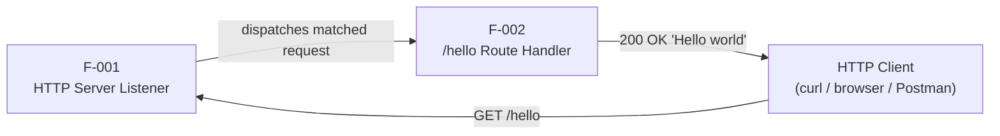

This diagram is a direct reflection of the request/response flow defined in Section 1.2.2.3, recast in feature-identifier terms.

### 2.3.2 Integration Points

| Integration Point | Feature(s) Involved | Nature |
|---|---|---|
| Inbound HTTP Boundary | F-001 | External — receives requests from any HTTP-conformant client |
| Internal Dispatch | F-001 → F-002 | Internal — in-process function invocation |
| Outbound HTTP Response | F-002 | External — writes the response body back to the requesting client |

No external system integrations exist, consistent with Sections 1.2.1.3 and 1.3.2.3 (no identity providers, message brokers, databases, third-party APIs, payment gateways, analytics platforms, or monitoring services).

### 2.3.3 Shared Components

| Shared Component | Used By | Description |
|---|---|---|
| Node.js Process | F-001, F-002 | Single deployable host process in which both features execute |
| Node.js Runtime | F-001, F-002 | Single-threaded, event-driven JavaScript execution environment (Section 1.2.2.3) |
| HTTP Protocol Stack | F-001, F-002 | Built-in `http` module or the chosen higher-level framework |

### 2.3.4 Common Services

No common application services exist beyond the Node.js runtime itself. Per the explicit exclusions in Section 1.3.2.1 and 1.3.2.3, there are no shared databases, caches, message buses, logging services, configuration providers, or monitoring agents.

---

## 2.4 IMPLEMENTATION CONSIDERATIONS

For each feature, the considerations below are bounded by the explicit scope statements in Sections 1.2.3 and 1.3. No performance targets, scalability targets, security mechanisms, or operational concerns are introduced beyond what the Technical Specification authorizes.

### 2.4.1 F-001 HTTP Server Listener — Implementation Considerations

#### 2.4.1.1 Technical Constraints

| Constraint | Detail |
|---|---|
| Runtime | Implementation MUST execute on the Node.js runtime (Section 1.3.1.1) |
| Language | Implementation MUST be authored in JavaScript (Section 1.3.1.1) |
| Architecture | Single Node.js process, single-port binding (Section 1.2.2.2) |
| Framework Choice | Deferred — built-in `http` module or a higher-level framework is permitted (Section 1.2.2.2) |

#### 2.4.1.2 Non-Functional Considerations

| Aspect | Specification |
|---|---|
| Performance Requirements | None specified; no latency or throughput KPIs in scope (Section 1.2.3.3) |
| Scalability Considerations | Out of scope — production hosting at scale and handling concurrent load beyond local-development volumes are explicitly Unsupported (Section 1.3.2.4) |
| Security Implications | None — TLS, authentication, authorization, rate limiting, and throttling are explicitly excluded (Section 1.3.2.1) |
| Maintenance Requirements | The *Minimal Surface Area* and *Tutorial Readability* success factors (Section 1.2.3.2) MUST be preserved across any future modifications |

### 2.4.2 F-002 `/hello` Route Handler — Implementation Considerations

#### 2.4.2.1 Technical Constraints

| Constraint | Detail |
|---|---|
| Response Determinism | Output MUST be the exact literal string `Hello world` with no variability, randomness, or environmental dependence (Section 1.2.3.2) |
| Single-Route Scope | Only the `/hello` route may be registered; serving any payload other than `Hello world` is Unsupported (Section 1.3.2.4) |
| Input Handling | The endpoint MUST NOT consume query parameters, request bodies, or perform input validation (Section 1.3.2.1) |
| Internationalization | The response is a fixed English string; localization or multi-language responses are excluded (Section 1.3.2.1) |

#### 2.4.2.2 Non-Functional Considerations

| Aspect | Specification |
|---|---|
| Performance Requirements | None specified (Section 1.2.3.3) |
| Scalability Considerations | Not applicable — the handler is stateless and serves one fixed response |
| Security Implications | None — the handler accepts no input, eliminating injection vectors by design (Section 1.3.1.2) |
| Maintenance Requirements | Compactness and self-explanatory implementation per the *Tutorial Readability* success factor (Section 1.2.3.2) |

---

## 2.5 TRACEABILITY MATRIX

The traceability matrix links each functional requirement back to its originating Technical Specification source and forward to its verification method, enabling end-to-end auditability of every requirement.

### 2.5.1 Requirement → Specification Source

| Req ID | Source Section | Source Objective |
|---|---|---|
| F-001-RQ-001 | 1.2.3.1 | Server reaches a listening state |
| F-001-RQ-002 | 1.2.3.1 | Node.js process starts without error |
| F-001-RQ-003 | 1.3.1.1 | Server accepts inbound HTTP requests over a network port |
| F-002-RQ-001 | 1.2.2.1 | Serve `/hello` route |
| F-002-RQ-002 | 1.2.2.1, 1.2.3.1 | Return response body `"Hello world"` |
| F-002-RQ-003 | 1.2.2.3 | 200 OK in the request/response flow |
| F-002-RQ-004 | 1.2.3.1, 1.3.1.1 | Single-endpoint scope is honored |

### 2.5.2 Requirement → Verification Method

| Req ID | Verification Method |
|---|---|
| F-001-RQ-001 | Inspect process state and bound port after starting the server |
| F-001-RQ-002 | Observe absence of startup errors on stdout/stderr |
| F-001-RQ-003 | Issue an HTTP request to the bound port and confirm receipt by the listener |
| F-002-RQ-001 | Issue an HTTP GET request to `/hello` and confirm handler invocation |
| F-002-RQ-002 | Compare response body byte-for-byte to the literal string `Hello world` |
| F-002-RQ-003 | Inspect the HTTP response status line |
| F-002-RQ-004 | Source code review confirming a single route registration |

### 2.5.3 Feature → Stakeholder Benefit

| Feature | Primary Stakeholder Benefit | Stakeholder (per Section 1.1.3) |
|---|---|---|
| F-001 | Establishes the listening HTTP boundary required for any client interaction | HTTP Client |
| F-001 | Provides a minimal example of socket binding for learning | Learner / Developer |
| F-002 | Returns a predictable, deterministic payload for verification | HTTP Client; Instructor |
| F-002 | Demonstrates route registration and response writing | Learner / Developer |

---

## 2.6 ASSUMPTIONS AND CONSTRAINTS

### 2.6.1 Assumptions

The following assumptions are derived from explicit statements in the Technical Specification's Introduction and the user's authoritative requirement. None are speculative.

| ID | Assumption | Source |
|---|---|---|
| A-001 | The HTTP method exercised against `/hello` is GET | Section 1.1.3 ("Sends GET requests to `/hello`"); Section 1.2.2.3 flowchart |
| A-002 | The response is plain-text and equals the literal string `Hello world` | Sections 1.1.1, 1.2.2.1 |
| A-003 | The successful response status code is 200 OK | Section 1.2.2.3 request/response flowchart |
| A-004 | A network port is configurable but no specific port number is mandated | Section 1.2.3.1 ("binds to its configured port") |
| A-005 | The system is consumed locally by HTTP-conformant clients | Sections 1.1.3, 1.3.1.2 |

### 2.6.2 Constraints

| ID | Constraint | Source |
|---|---|---|
| C-001 | Greenfield implementation with no legacy or backward-compatibility constraints | Section 1.2.1.2 |
| C-002 | Implementation MUST be JavaScript executing on the Node.js runtime | Section 1.3.1.1 |
| C-003 | The system is realized as a single Node.js process serving HTTP traffic locally | Section 1.3.1.2 |
| C-004 | Tutorial/educational positioning — the project is not a commercial system | Section 1.2.1.1 |
| C-005 | No performance, throughput, or availability KPIs may be introduced | Section 1.2.3.3 |
| C-006 | No items listed in Section 1.3.2.1 (excluded categories) may be reintroduced as requirements | Section 1.3.2.1 |

### 2.6.3 Requirement Versioning

All requirements documented in this section are at version **1.0 (Initial)**, authored against the user's foundational requirement and the verified greenfield repository state. Future revisions will be tracked at the requirement level via the `F-XXX-RQ-YYY` identifier convention, with version increments recorded when acceptance criteria, descriptions, or priorities change.

### 2.6.4 Future Phase Considerations (Non-Binding)

Per Section 1.3.2.2, the following are explicitly **not deliverables** of this specification but are listed for stakeholder awareness as natural learner extensions. They MUST NOT be treated as features or requirements of the current scope:

- Adding additional routes demonstrating parameterized paths.
- Introducing middleware patterns (e.g., logging, error handling).
- Exploring framework alternatives (Express, Fastify, Koa) for comparison.
- Adding a test harness to validate the endpoint programmatically.

---

## 2.7 References

### 2.7.1 Files Examined

- `README.md` — Sole file present in the repository at authoring time; contained only the title heading `# BF-ADDFEATURE-ROLLBACK-GITHUB`. Used to confirm the greenfield state and that no features can be derived from existing code, justifying the `Proposed` status assigned to F-001 and F-002.

### 2.7.2 Folders Explored

- `/` (repository root, depth 0) — Verified to contain no subdirectories such as `src/`, `lib/`, `routes/`, `tests/`, `config/`, or `.github/`. Used to confirm that all features in this section must be prospective rather than derived from observed code structure.

### 2.7.3 Repository-Wide Searches Performed

- Search for Node.js source artifacts (`package.json`, `*.js`, `*.ts`, `.gitignore`, `Dockerfile`) — Returned empty, confirming no implementation files exist.
- Search for HTTP endpoint or route handler implementations — Returned empty, confirming no `/hello` handler is yet implemented.
- Search for source-code folders or application directories — Returned empty, confirming no project structure exists.

### 2.7.4 Technical Specification Sections Referenced

- **Section 1.1 EXECUTIVE SUMMARY** — Sourced project overview (1.1.1), core business problem (1.1.2), stakeholder identification (1.1.3), and value proposition dimensions (1.1.4) used in feature descriptions and benefits.
- **Section 1.2 SYSTEM OVERVIEW** — Sourced greenfield status (1.2.1.2), single-capability statement (1.2.2.1), two-component decomposition (1.2.2.2), request/response flowchart (1.2.2.3), success criteria (1.2.3.1), critical success factors (1.2.3.2), and the explicit disclaimer of performance KPIs (1.2.3.3).
- **Section 1.3 SCOPE** — Sourced in-scope items (1.3.1.1), implementation boundaries (1.3.1.2), the exhaustive out-of-scope exclusions (1.3.2.1), future phase considerations (1.3.2.2), integration exclusions (1.3.2.3), and unsupported use cases (1.3.2.4).
- **Section 1.4 References** — Confirmed the verified repository state and that the user-provided requirement is the authoritative input shaping all features and requirements.

### 2.7.5 User Context Reference

- **Authoritative User Requirement**: *"Can you create a nodejs tutorial project that features one end point '/hello' that returns 'Hello world' to the calling HTTP client?"* — Treated as the primary input from which features F-001 and F-002 and their constituent requirements are derived.

# 3. Technology Stack

## 3.1 Technology Stack Overview

### 3.1.1 Stack Selection Methodology

The technology stack for this project is derived from a strict prioritization hierarchy: (1) the user's authoritative requirement for a Node.js tutorial serving a single `/hello` endpoint, (2) the explicit constraints enumerated in Section 2.6.2, and (3) the exhaustive exclusion table in Section 1.3.2.1. Where the Default Technology Stack provided in the project brief conflicts with these constraints, the Technical Specification's explicit scope statements take precedence per Constraints C-002, C-003, and C-006.

This approach yields a deliberately minimal stack — a direct realization of the *Minimal Surface Area* and *Tutorial Readability* critical success factors documented in Section 1.2.3.2. Every technology that does not directly contribute to serving the `/hello` route is excluded, not deferred.

### 3.1.2 Layered Architecture View

The technology layers active in the runtime are limited to a host operating system, the Node.js runtime, an HTTP-handling layer (built-in module or framework), and the small JavaScript application code that realizes Features F-001 and F-002.

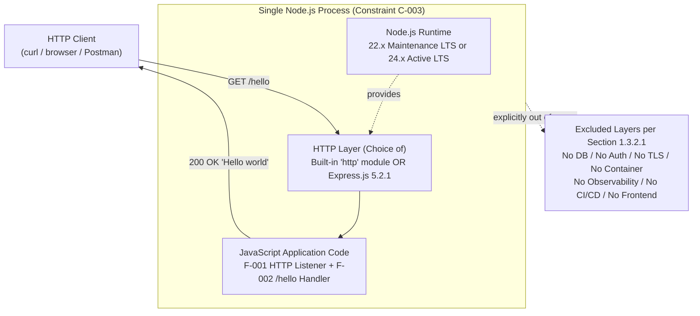

### 3.1.3 Default Technology Stack Deviation Summary

The Default Technology Stack supplied in the project brief is largely inapplicable to this tutorial. The table below documents each default item and the authoritative basis for accepting, replacing, or excluding it.

| Default Stack Item | Status | Authoritative Basis |
|---|---|---|
| Python (Primary Language) | **Replaced by JavaScript** | Constraint C-002 (Section 2.6.2); Section 1.3.1.1 |
| Flask (Framework) | **Replaced** — JavaScript ecosystem required | Constraint C-002 |
| Auth0 (Authentication) | **Excluded** | Section 1.3.2.1 — "Authentication, authorization, API keys, tokens" |
| MongoDB (Database) | **Excluded** | Section 1.3.2.1 — "Database integration, persistence layer, caching" |
| Langchain (AI Framework) | **Not Applicable** | No AI/ML in scope |
| Docker (Containerization) | **Excluded** | Section 1.3.2.1 — "Containerization (Dockerfile), Kubernetes manifests" |
| AWS (Cloud Platform) | **Excluded** | Section 1.3.2.1 — "No deployment infrastructure was specified" |
| Terraform (IaC) | **Excluded** | Section 1.3.2.1 — out of scope |
| GitHub Actions (CI/CD) | **Excluded** | Section 1.3.2.1 — "CI/CD pipelines" |
| React with TypeScript (Web) | **Excluded** | Section 1.3.2.1 — "Web UI, single-page application, client-side rendering" |
| TailwindCSS | **Excluded** | No frontend in scope |
| React Native (Mobile) | **Not Applicable** | No mobile client in scope |
| Swift/Kotlin/Objective-C/ElectronJS | **Not Applicable** | No native applications in scope |

The remainder of this section documents only the technologies that survive these constraints.

---

## 3.2 Programming Languages

### 3.2.1 JavaScript — Primary and Sole Implementation Language

JavaScript is the mandatory and only language used in this project. The selection is non-negotiable: Constraint C-002 explicitly requires that "Implementation MUST be JavaScript executing on the Node.js runtime" (Section 2.6.2), and the in-scope element table in Section 1.3.1.1 lists this as an Essential Technical Requirement.

| Attribute | Specification |
|---|---|
| Component | All application code (F-001 HTTP Listener and F-002 `/hello` Route Handler) |
| Language | JavaScript (ECMAScript) |
| Required ECMAScript Version | Not specified by the user requirement; any ECMAScript version supported by the chosen Node.js LTS release is acceptable |
| Compilation/Transpilation | None — JavaScript is executed directly by the Node.js runtime |

**Selection Justification:**

- **Authoritative Requirement Alignment.** The user explicitly requested a "nodejs tutorial project," making JavaScript the only language consistent with the request.
- **Pedagogical Alignment.** JavaScript is the native language of the Node.js runtime. Choosing JavaScript eliminates language-translation overhead (such as TypeScript transpilation) that would conflict with the *Tutorial Readability* success factor (Section 1.2.3.2).
- **Zero Build Overhead.** Source files are interpreted directly, preserving the *Minimal Surface Area* success factor (Section 1.2.3.2).
- **Constraint Compliance.** No alternative language may be introduced without violating Constraint C-002.

### 3.2.2 Node.js Runtime — Mandatory Execution Environment

While technically a runtime rather than a language, Node.js is treated as a first-class element of the programming-language layer because it is the mandated execution context for all JavaScript code in this project.

| Attribute | Specification |
|---|---|
| Runtime | Node.js |
| Recommended Version (Production-Stable) | Node.js 22.x (Maintenance LTS) or Node.js 24.x (Active LTS) |
| Current Release (as of June 2026) | Node.js 26.x — released May 5, 2026; suitable for experimentation but Current releases are not generally recommended for stability-sensitive use |
| V8 JavaScript Engine | Bundled with Node.js (V8 14.6.x in Node.js 26.x) |
| Selection Constraint Source | Constraint C-002 (Section 2.6.2); Section 1.2.2.3 ("The technical approach is built on the Node.js runtime executing JavaScript in a single-threaded, event-driven model") |

**Version Selection Justification:**

- **LTS Preference for Tutorial Stability.** The *Reproducibility* success factor (Section 1.2.3.2) requires that "A developer following the documented setup steps can stand up the server identically on any compatible Node.js installation." LTS lines provide multi-year support windows and stable API surfaces, maximizing reproducibility for learners over time.
- **Active LTS (24.x) vs. Maintenance LTS (22.x).** Either is acceptable. Active LTS (24.x) receives feature backports and bug fixes; Maintenance LTS (22.x) receives critical bug fixes and security patches. A learner can choose either based on availability in their environment.
- **No Specific Version Mandated by Spec.** Section 2.6.2 does not pin a Node.js version, so the project remains compatible with any modern LTS line. If Express.js (Section 3.3.3) is selected as the HTTP layer, Express 5.x requires Node.js 18 or higher, which is satisfied by all supported LTS lines.

### 3.2.3 Excluded Languages

The following languages, despite appearing in the Default Technology Stack or being common in adjacent ecosystems, are explicitly excluded:

| Excluded Language | Reason for Exclusion |
|---|---|
| Python | Replaced by JavaScript per Constraint C-002 |
| TypeScript | Not specified by the user requirement; adds transpilation overhead that conflicts with *Minimal Surface Area* and *Tutorial Readability* (Section 1.2.3.2); no `tsconfig.json`, no `@types/*` packages, no build step |
| Swift, Kotlin, Objective-C | No native iOS/Android/MacOS applications are in scope |
| Any other language | Constraint C-002 forbids non-JavaScript implementations |

---

## 3.3 Frameworks & Libraries

### 3.3.1 Framework Selection Strategy

The Technical Specification deliberately defers the HTTP-framework choice. Section 1.2.2.2 states that the HTTP Listener and Route Handler "may be implemented using Node.js's built-in `http` module or a higher-level framework; the specific technology choice is deferred to subsequent sections of this specification." Section 2.4.1.1 reiterates this in the F-001 Technical Constraints table:

> "Framework Choice | Deferred — built-in `http` module or a higher-level framework is permitted (Section 1.2.2.2)"

Accordingly, this section documents the two architecturally valid options, their version coordinates, their compatibility requirements, and a decision matrix that aligns each option with the project's success factors.

### 3.3.2 Option A — Built-in Node.js `http` Module (Zero-Dependency Path)

The Node.js standard library ships an `http` module that provides server creation, request parsing, and response writing. This module is the lowest-overhead path to satisfying Features F-001 and F-002.

| Attribute | Specification |
|---|---|
| Source | Node.js Standard Library (bundled with the runtime) |
| Version | Tied to the Node.js runtime version (no independent semantic version) |
| External Dependencies | None |
| Manifest File Required | None (no `package.json` required) |
| Key APIs | `http.createServer()`, `request.url`, `response.writeHead()`, `response.end()` |

**Justification:**

- **Maximum Alignment with Success Factors.** Selecting the built-in module produces the smallest possible code surface (single JavaScript file, zero npm dependencies), most directly satisfying *Minimal Surface Area* (Section 1.2.3.2).
- **Maximum Reproducibility.** With no third-party dependencies, the project cannot break due to upstream package changes, deprecations, or security advisories. This maximizes the *Reproducibility* success factor.
- **No Install Step.** Because no manifest or `node_modules/` directory is needed, a learner can run the server with `node server.js` immediately after writing the file.

### 3.3.3 Option B — Express.js 5.2.1 (Higher-Level Framework Path)

Express.js is the most widely adopted higher-level Node.js HTTP framework. Selecting Express introduces a single direct npm dependency in exchange for a more declarative route-registration syntax (`app.get('/hello', handler)`).

| Attribute | Specification |
|---|---|
| Package Name | `express` |
| Latest Stable Version (as of June 2026) | 5.2.1 |
| Express 5 Status | Production-recommended release per the Express Technical Committee |
| Express 4 Status | Maintenance mode since April 1, 2025; targeted End-of-Life no sooner than October 1, 2026 |
| Minimum Node.js Version | Node.js 18 or higher (satisfied by all current LTS lines) |
| Distribution Channel | npm registry (`registry.npmjs.org`) |
| Declared Dependency Form | `"express": "^5.2.1"` in `package.json` |
| Transitive Dependencies | Approximately 30 packages (e.g., `body-parser`, `cookie`, `debug`, `accepts`, `path-to-regexp`), managed automatically by npm |

**Justification (if selected):**

- **Industry-Standard Pedagogy.** Express's route-registration idiom is widely taught and documented; selecting it exposes learners to a pattern they will encounter in most production Node.js projects.
- **Reduced Boilerplate.** Express collapses request parsing and response formatting into idiomatic methods, slightly improving *Tutorial Readability* at the cost of one additional dependency.
- **Maturity and Compatibility.** Express 5's compatibility floor of Node.js 18 is satisfied by all supported Node.js LTS versions identified in Section 3.2.2.

**Trade-off Acknowledgment:**

Selecting Express adds a `package.json`, a `package-lock.json`, a `node_modules/` directory, and an `npm install` step. These additions slightly erode the *Minimal Surface Area* success factor but remain within the deferred-choice latitude granted by Section 1.2.2.2.

### 3.3.4 Decision Matrix

The following matrix compares the two valid framework options against the project's critical success factors (Section 1.2.3.2). Either option satisfies the Technical Specification; the matrix is provided so the implementer can make a transparent trade-off.

| Criterion | Option A: `http` Module | Option B: Express 5.2.1 |
|---|---|---|
| Minimal Surface Area | **Strongest** — no manifest, no dependencies | Weaker — adds `package.json`, lockfile, `node_modules/` |
| Reproducibility | **Strongest** — no upstream package drift possible | Strong — lockfile constrains transitive versions |
| Tutorial Readability | Moderate — slightly more verbose handler code | **Strongest** — declarative `app.get('/hello', ...)` |
| Deterministic Response | Equivalent | Equivalent |
| Time-to-First-Endpoint | **Fastest** — no install step | Requires `npm install` |
| Industry-Pattern Exposure | Lower | **Higher** — exposes the Express idiom |

**Recommendation:** When in doubt, Option A (the built-in `http` module) most rigorously satisfies the Technical Specification's *Minimal Surface Area* success factor. Option B remains fully compliant and may be preferred when the learner's pedagogical goal includes exposure to the canonical Express routing pattern.

### 3.3.5 Excluded Frameworks and Libraries

| Excluded Item | Category | Reason |
|---|---|---|
| Fastify | Alternative HTTP Framework | Listed only as a non-binding "Future Phase Consideration" (Section 2.6.4); MUST NOT be treated as a deliverable |
| Koa | Alternative HTTP Framework | Same as above (Section 2.6.4) |
| Next.js, Nest.js, Hapi | Higher-level Frameworks | Out of scope; introduce architecture that exceeds the single-endpoint requirement |
| Flask | Python Framework | Default Stack item replaced by JavaScript ecosystem per C-002 |
| React, React Native, TailwindCSS | Frontend Frameworks | Section 1.3.2.1 — "Web UI, single-page application, client-side rendering" excluded |
| Middleware libraries (`morgan`, `helmet`, `cors`, etc.) | Cross-cutting Middleware | Not requested; logging, security headers, and CORS are all excluded by Section 1.3.2.1 |

---

## 3.4 Open Source Dependencies

### 3.4.1 Dependency Posture

The project adopts a deliberately minimal dependency posture. Per the framework decision in Section 3.3, the dependency footprint takes one of two shapes:

- **Option A (built-in `http` module):** **Zero** direct or transitive third-party dependencies. No `package.json` is required.
- **Option B (Express.js):** **One** direct dependency (`express@^5.2.1`), plus its transitive dependency tree managed automatically by npm.

### 3.4.2 Direct Dependencies by Framework Option

| Option | Direct Dependency | Version Constraint | Registry |
|---|---|---|---|
| A — Built-in `http` | None | N/A | N/A |
| B — Express.js | `express` | `^5.2.1` | npm (`registry.npmjs.org`) |

If Option B is selected, the `package.json` manifest declares Express as a runtime dependency, and npm generates a `package-lock.json` file to pin transitive package versions for reproducible installs.

### 3.4.3 Package Registry

When npm dependencies are used (Option B only), the registry is the default public npm registry at `https://registry.npmjs.org`. No private registry, scoped namespace, or registry proxy is required.

| Registry Attribute | Specification |
|---|---|
| Registry URL | `https://registry.npmjs.org` (default) |
| Authentication | None (public registry, public package) |
| npm Client Version | 10.x or 11.x (bundled with the chosen Node.js LTS) |

### 3.4.4 Explicitly Excluded Dependency Categories

The following categories are excluded by Section 1.3.2.1 and Constraint C-006. No packages from these categories may be added without amending the Technical Specification.

| Category | Excluded Examples | Excluded By |
|---|---|---|
| Database drivers/ORMs | `mongodb`, `mongoose`, `pg`, `mysql2`, `redis`, `sequelize`, `prisma` | Section 1.3.2.1 (Database integration) |
| Authentication libraries | `passport`, `jsonwebtoken`, `bcrypt`, `oauth2-server` | Section 1.3.2.1 (Authentication, authorization, API keys, tokens) |
| Input validation | `joi`, `zod`, `express-validator`, `ajv` | Section 1.3.2.1 (Query parameters, request body parsing, validation) |
| Logging | `winston`, `pino`, `morgan`, `bunyan` | Section 1.3.2.1 (Structured logging) |
| Metrics/Tracing | `prom-client`, `@opentelemetry/*`, `dd-trace` | Section 1.3.2.1 (Metrics, tracing, monitoring) |
| Testing | `jest`, `mocha`, `vitest`, `supertest`, `chai`, `sinon` | Section 1.3.2.1 (Automated test suites) |
| TypeScript tooling | `typescript`, `ts-node`, `@types/*`, `tsx` | TypeScript not in scope (Section 3.2.3) |
| Environment management | `dotenv`, `config`, `nconf` | Section 1.3.2.1 (Multi-environment configuration files, `.env` handling) |
| Process management | `pm2`, `forever` | Out of scope; the system is a single foreground Node.js process per C-003 |
| HTTP middleware | `helmet`, `cors`, `compression`, `cookie-parser` | Not requested by the user; cross-cutting concerns are excluded |

---

## 3.5 Third-Party Services

### 3.5.1 Applicability Statement

**This subsection is Not Applicable to the present scope.** The Technical Specification's Section 1.2.1.3 states unambiguously:

> "The system is self-contained and does not interact with identity providers, message brokers, databases, third-party APIs, monitoring platforms, or any other external services. The only external interaction surface is the inbound HTTP boundary used by the calling client."

The entries below are documented to explicitly preserve scope boundaries and to formalize the rejection of corresponding Default Technology Stack items.

### 3.5.2 External APIs and Integrations

| Subcategory | Status | Authoritative Source |
|---|---|---|
| Outbound REST/GraphQL API calls | **None in scope** | Section 1.2.1.3; Section 1.3.2.3 |
| Webhook integrations | **None in scope** | Section 1.3.2.3 |
| Message broker integration (Kafka, RabbitMQ, SQS) | **None in scope** | Section 1.3.2.3 |
| Payment, analytics, or SaaS APIs | **None in scope** | Section 1.3.2.3 |

### 3.5.3 Authentication Services

| Subcategory | Status | Authoritative Source |
|---|---|---|
| Auth0 (Default Stack item) | **Excluded** | Section 1.3.2.1 (Authentication, authorization, API keys, tokens) |
| OAuth/OpenID Connect providers | **Excluded** | Section 1.3.2.1 |
| Identity providers (Okta, Cognito, Firebase Auth) | **Excluded** | Section 1.2.1.3; Section 1.3.2.1 |

### 3.5.4 Monitoring Tools

| Subcategory | Status | Authoritative Source |
|---|---|---|
| Application Performance Monitoring (Datadog, New Relic, etc.) | **Excluded** | Section 1.3.2.1 (Structured logging, metrics, tracing, monitoring) |
| Error tracking (Sentry, Bugsnag) | **Excluded** | Section 1.3.2.1 |
| Distributed tracing (OpenTelemetry collectors) | **Excluded** | Section 1.3.2.1 |
| Uptime monitoring | **Excluded** | Section 1.3.2.1; no availability KPIs per C-005 |

### 3.5.5 Cloud Services

| Subcategory | Status | Authoritative Source |
|---|---|---|
| AWS (Default Stack item) | **Excluded** | Section 1.3.2.1 — "No deployment infrastructure was specified" |
| GCP, Azure, or any other cloud platform | **Excluded** | Section 1.3.2.1 |
| Serverless platforms (Lambda, Cloud Functions) | **Excluded** | Section 1.3.2.1 |
| Object storage (S3, GCS) | **Excluded** | Section 1.3.2.1; no data domains in scope per Section 1.3.1.2 |

---

## 3.6 Databases & Storage

### 3.6.1 Applicability Statement

**This subsection is Not Applicable to the present scope.** The system is stateless by design. Section 1.3.1.2 documents that the Data Domain is "None — the endpoint returns a static literal string and processes no input data," and Section 1.3.2.1 explicitly excludes "Database integration, persistence layer, caching" with the rationale "The response is a fixed literal string."

### 3.6.2 Primary and Secondary Databases

| Storage Concern | Status |
|---|---|
| Primary database | **None** — no domain data exists |
| Secondary/read-replica database | **None** |
| MongoDB (Default Stack item) | **Excluded** per Section 1.3.2.1 |
| Relational databases (PostgreSQL, MySQL, SQLite) | **Excluded** per Section 1.3.2.1 |
| NoSQL stores (DynamoDB, Cassandra, etc.) | **Excluded** per Section 1.3.2.1 |

### 3.6.3 Data Persistence Strategies

The system performs **no persistence operations of any kind**. Per the F-001 and F-002 requirement entries:

- F-001 reads no domain data and persists no state.
- F-002's response "is a fixed literal; no data is read, written, or persisted."

No write-ahead logs, no journals, no append-only files, no checkpointing — the entire request/response cycle is in-memory and ephemeral.

### 3.6.4 Caching Solutions

| Caching Layer | Status |
|---|---|
| In-memory cache (Redis, Memcached) | **Excluded** per Section 1.3.2.1 |
| HTTP caching (CDN, reverse proxy cache) | **Excluded** — no deployment infrastructure in scope |
| Application-level memoization | **Not Applicable** — the response is already a static literal |

### 3.6.5 Storage Services

| Storage Service | Status |
|---|---|
| Object storage (S3, GCS, Azure Blob) | **Excluded** per Section 1.3.2.1 |
| Block storage / mounted volumes | **Excluded** per Section 1.3.2.1 |
| File-based persistence (writes to local disk) | **Not Applicable** — no data domain |

---

## 3.7 Development & Deployment

### 3.7.1 Development Tools

The development toolchain is intentionally minimal. Only tools necessary to author, run, and verify the single-endpoint server are documented.

| Tool | Purpose | Version Constraint | Notes |
|---|---|---|---|
| Node.js Runtime | JavaScript execution; required to start the server | 22.x Maintenance LTS or 24.x Active LTS | Mandatory per C-002 |
| npm | Package installation (only if Express option is selected) | Bundled with the chosen Node.js LTS (npm 10.x or 11.x) | Optional — required only for Option B |
| Text Editor / IDE | Source authoring | Learner's choice | Not specified by spec; VS Code, vim, Sublime, or any editor is acceptable |
| HTTP Client (for verification) | Issue GET requests to `/hello` to verify the response | Learner's choice | Examples permitted by Section 1.1.3 / Section 2.5.2: curl, browser, Postman, Insomnia, wget |

### 3.7.2 Build System

The project requires **no build system**. JavaScript is interpreted directly by the Node.js runtime, eliminating the need for transpilation, bundling, or asset compilation.

| Build Concern | Specification |
|---|---|
| Transpilation (Babel, SWC) | Not required — no language features outside the runtime's native support |
| Bundling (Webpack, Rollup, esbuild, Vite) | Not required — server-side code is not bundled for the browser |
| Asset compilation | Not applicable — no frontend assets |
| Build artifact format | Source files served directly to Node.js (`node server.js`) |

If Option B (Express) is selected, the only pre-run step is `npm install`, which fetches `express` and its transitive dependencies into `node_modules/`. This is a package-install step, not a build step.

### 3.7.3 Project Structure

The recommended directory layout depends on the framework option chosen in Section 3.3.

**Option A — Built-in `http` Module Layout:**

```
/
├── README.md          # Repository documentation
└── server.js          # Single file containing F-001 Listener and F-002 /hello Handler
```

**Option B — Express.js Layout:**

```
/
├── README.md          # Repository documentation
├── package.json       # Declares "express": "^5.2.1" as a runtime dependency
├── package-lock.json  # Auto-generated by npm; pins transitive versions
├── node_modules/      # Generated by `npm install`; should be gitignored
├── .gitignore         # Excludes node_modules/
└── server.js          # Single file containing F-001 Listener and F-002 /hello Handler
```

In both options, the application code is colocated in a single source file, reflecting the *Minimal Surface Area* success factor and the colocation of F-001 and F-002 documented in Section 1.2.2.2.

### 3.7.4 Startup Command

| Option | Startup Command |
|---|---|
| A — Built-in `http` | `node server.js` |
| B — Express.js | `node server.js`, or `npm start` if `package.json` defines a `start` script |

The verification workflow described in Section 2.5.2 ("Inspect process state and bound port after starting the server") is satisfied identically by both options.

### 3.7.5 Containerization (Excluded)

| Containerization Concern | Status | Authoritative Basis |
|---|---|---|
| Dockerfile | **Excluded** | Section 1.3.2.1 — "Containerization (Dockerfile)" |
| Docker Compose | **Excluded** | Section 1.3.2.1 |
| Kubernetes manifests | **Excluded** | Section 1.3.2.1 — "Kubernetes manifests" |
| Container registry | **Excluded** | No deployment infrastructure in scope |
| Docker (Default Stack item) | **Excluded** | Section 1.3.2.1 |

### 3.7.6 CI/CD Requirements (Excluded)

| CI/CD Concern | Status | Authoritative Basis |
|---|---|---|
| GitHub Actions (Default Stack item) | **Excluded** | Section 1.3.2.1 — "CI/CD pipelines" |
| Jenkins, GitLab CI, CircleCI, Buildkite | **Excluded** | Section 1.3.2.1 |
| Automated test execution in pipeline | **Excluded** | Section 1.3.2.1 — "Automated test suites, test framework configuration" |
| Release automation / semantic versioning | **Excluded** | Section 1.3.2.1 |
| Infrastructure as Code (Terraform — Default Stack item) | **Excluded** | Section 1.3.2.1 — out of scope |

The verification method documented in Section 2.5 relies on manual HTTP requests by the learner, not automated pipelines.

---

## 3.8 Security and Integration Considerations

### 3.8.1 Security Implications of Technology Choices

Per Section 2.4.1.2 and Section 2.4.2.2, the security posture of the technology stack is:

| Security Aspect | Status | Source |
|---|---|---|
| TLS / HTTPS | Not in scope | Section 1.3.2.1; Section 2.4.1.2 |
| Authentication / Authorization | Not in scope | Section 1.3.2.1; Section 2.4.1.2 |
| API keys / tokens | Not in scope | Section 1.3.2.1 |
| Rate limiting / throttling | Not in scope | Section 1.3.2.1; Section 2.4.1.2 |
| Input validation | Not applicable | Section 2.4.2.1 — handler MUST NOT consume query parameters or request bodies |
| Injection vectors | None by design | Section 2.4.2.2 — "the handler accepts no input, eliminating injection vectors by design" |

**Implication for Technology Selection:** No security-oriented libraries (e.g., `helmet`, `bcrypt`, `jsonwebtoken`, `express-rate-limit`) are added to the dependency footprint. The absence of such libraries is intentional and compliant with C-006.

**Reminder:** Section 1.3.2.4 marks "Production hosting at scale" as **Unsupported**. The technology stack documented here is appropriate for a local tutorial only and MUST NOT be deployed to production environments without first addressing the excluded security concerns through a separate scoping effort.

### 3.8.2 Integration Surface

The complete external integration surface of this technology stack consists of a single inbound HTTP boundary. No outbound integrations are present.

| Integration Point | Direction | Technology Implication |
|---|---|---|
| Inbound HTTP Boundary | External → System | Realized by either the Node.js `http` module or Express.js, whichever is selected per Section 3.3 |
| Internal Dispatch (Listener → Handler) | In-process | In-memory function invocation within the single Node.js process; no IPC, no message queue |
| Outbound HTTP Response | System → External | Realized by the same HTTP-layer technology used inbound |

There are no other integration points. No outbound calls to databases, identity providers, message brokers, or external APIs occur in any code path.

### 3.8.3 Version Compatibility Matrix

| Component | Version | Compatible With |
|---|---|---|
| Node.js | 22.x Maintenance LTS | Built-in `http` module; Express 5.2.1 (Node 18+ requirement satisfied) |
| Node.js | 24.x Active LTS | Built-in `http` module; Express 5.2.1 (Node 18+ requirement satisfied) |
| Node.js | 26.x Current | Built-in `http` module; Express 5.2.1 (compatible but Current line not recommended for stable tutorials) |
| Express.js | 5.2.1 | Node.js 18.x or higher |
| npm | 10.x / 11.x | Bundled with the corresponding Node.js LTS line |

---

## 3.9 References

### 3.9.1 Files and Folders Examined

- `README.md` — 31 bytes containing only the heading `# BF-ADDFEATURE-ROLLBACK-GITHUB`; verified greenfield repository state and established the absence of any prior technology selections.
- `/` (repository root) — Verified to contain only `README.md` and `.git`; no source files, no `package.json`, no Dockerfile, no CI configuration, no subdirectories. This empty baseline drives every technology choice documented in this section.

### 3.9.2 Technical Specification Sections Cross-Referenced

- **Section 1.1 EXECUTIVE SUMMARY** — Project pedagogical positioning, GET-request workflow against `/hello`, learner-as-consumer model.
- **Section 1.2 SYSTEM OVERVIEW** — Greenfield status, two-component decomposition (HTTP Listener + Route Handler), explicit framework deferral language ("built-in `http` module or a higher-level framework"), critical success factors (*Minimal Surface Area*, *Reproducibility*, *Deterministic Response*, *Tutorial Readability*), and exclusion of performance KPIs.
- **Section 1.3 SCOPE** — In-scope JavaScript-on-Node.js requirement (Section 1.3.1.1), single-process boundary (Section 1.3.1.2), and the authoritative exhaustive exclusion table (Section 1.3.2.1) that disqualifies database, authentication, TLS, observability, containerization, CI/CD, frontend, testing, and configuration-management tooling.
- **Section 2.2 FUNCTIONAL REQUIREMENTS TABLE** — F-001 and F-002 "Data Requirements: None" rationale supporting the absence of any storage technology.
- **Section 2.3 FEATURE RELATIONSHIPS** — Integration points table establishing the single inbound HTTP boundary and confirming no external system integrations.
- **Section 2.4 IMPLEMENTATION CONSIDERATIONS** — F-001 Technical Constraints (Runtime: Node.js, Language: JavaScript, Architecture: single-process/single-port, Framework: deferred), F-002 Technical Constraints (Response Determinism, Input Handling prohibition), and Non-Functional Considerations confirming no performance, scalability, or security requirements in scope.
- **Section 2.6 ASSUMPTIONS AND CONSTRAINTS** — Constraints C-001 through C-006, particularly C-002 (JavaScript on Node.js mandatory), C-003 (single process), and C-006 (no reintroduction of excluded items). Section 2.6.4 confirms that alternative frameworks (Fastify, Koa) and testing harnesses are non-binding future considerations only.

### 3.9.3 External Research Sources

- **Node.js Release Schedule (June 2026 state)** — Node.js 24.x as the current Active LTS, Node.js 22.x in Maintenance LTS, and Node.js 26.x as the Current release (released May 5, 2026, with V8 14.6.x). Used to inform the LTS version recommendation in Section 3.2.2.
- **Express.js Package Metadata on npm** — Confirms Express 5.2.1 as the latest stable release (with Node.js 18+ requirement), Express 5 as the Express Technical Committee's production-recommended release, and Express 4's Maintenance status with End-of-Life target no sooner than October 1, 2026. Used to inform the Express version constraint in Section 3.3.3.

# 4. Process Flowchart

## 4.1 INTRODUCTION AND SCOPE NOTES

### 4.1.1 Workflow Documentation Approach

This section translates the functional requirements of Section 2 and the system overview of Section 1.2 into explicit process flowcharts, sequence diagrams, and state transition diagrams. Every flow documented here is anchored in an evidence-based requirement (`F-XXX-RQ-YYY`), an assumption (`A-XXX`), or a constraint (`C-XXX`) drawn from prior sections of the specification. No speculative flow steps, optional branches, or aspirational integrations have been introduced.

The system under specification consists of a single Node.js process exposing exactly one HTTP endpoint, `/hello`, which returns the literal string `Hello world` over HTTP 200 OK. Because the system has only one capability, only one user-facing decision point, and zero external integrations beyond the inbound HTTP boundary, the process flow surface is intentionally compact. This section documents that compact surface comprehensively rather than padding it with concepts the specification has explicitly excluded.

### 4.1.2 Explicit Scope Boundaries for Process Flows

The author prompt for this section enumerates several flow concepts that are **explicitly excluded** from this project by Sections 1.3.2, 1.2.3.3, 2.6.2, and the F-XXX requirement validation rules. Rather than fabricate flows for excluded concepts, the following table documents their exclusion and the authoritative source. Subsequent subsections therefore omit these concepts from the diagrams and tables.

| Author-Prompt Concept | Scope Status | Authoritative Source |
|---|---|---|
| Authorization checkpoints | Out of scope (none in scope) | Sections 2.2.1.4, 2.2.2.4, 1.3.2.1 |
| Regulatory compliance checks | Not applicable | Sections 2.2.1.4, 2.2.2.4 — "Compliance Requirements: None" |
| Retry mechanisms | Out of scope | Section 1.3.2.1 (Reliability exclusions); Constraint C-006 |
| Circuit breakers, rate limiting, throttling | Out of scope | Section 1.3.2.1 (Reliability exclusions); Constraint C-006 |
| Fallback processes | Out of scope | Not present in any requirement; Constraint C-006 |
| Error notification flows | Out of scope | Section 1.3.2.1 (no observability/logging in scope) |
| Recovery procedures | Out of scope | Not requested by user; Constraint C-006 |
| Caching requirements | Out of scope | Section 1.3.2.1; Section 2.2.2.4 |
| Transaction boundaries | Not applicable | Section 2.2.2.3 — "no data is read, written, or persisted" |
| Data persistence points | Not applicable | Section 2.2.1.3, 2.2.2.3 — no domain data, no persistence |
| Timing and SLA considerations | Excluded | Sections 1.2.3.3, 2.2.1.3, 2.2.2.3; Constraint C-005 |
| Batch processing sequences | Not applicable | No batch domain in scope |
| Event processing flows | Not applicable | No event-driven integration in scope |
| External API interactions | Not applicable | Section 2.3.2 — only inbound HTTP boundary exists |

Subsection 4.6 ("Error Handling") and Subsection 4.7 ("Timing and SLA Considerations") elaborate on these exclusions where the author prompt explicitly required their consideration.

### 4.1.3 Actors and System Boundaries

The flowcharts in this section employ swim lanes (modeled in Mermaid via `subgraph` blocks) to separate actor responsibilities. The complete actor set is derived from Section 1.1 and Section 2.3.2 and is enumerated below:

| Actor / System Boundary | Role in Process Flow | Sourced From |
|---|---|---|
| HTTP Client | Issues runtime HTTP requests; consumes response bodies | Sections 1.1.3, 1.2.2.3, 2.3.1 |
| Node.js Process | Hosts both F-001 and F-002 in a single deployable unit | Sections 1.2.2.2, 2.3.3 |
| HTTP Listener (F-001) | Binds to a network port, accepts TCP connections, parses HTTP requests, dispatches to handlers | Section 2.2.1 |
| `/hello` Route Handler (F-002) | Matches `/hello` path, writes literal `Hello world` payload with HTTP 200 OK | Section 2.2.2 |
| Learner / Developer / Instructor | Out-of-band — invokes the documented start command; not part of the runtime request flow | Section 1.1.3 |

The "HTTP Client" category encompasses `curl`, `wget`, browser address bars, Postman, Insomnia, and any programmatic HTTP-conformant client. Per Assumption A-005, all clients are local consumers; per Assumption A-001, the HTTP method exercised against `/hello` is `GET`.

---

## 4.2 SYSTEM WORKFLOWS

### 4.2.1 Core Business Process — High-Level System Workflow

The end-to-end business process is the receipt of a `GET /hello` request and the return of a `Hello world` response. The high-level workflow below extends the diagram in Section 1.2.2.3 by enumerating intermediate process steps, the single decision point, and explicit terminal nodes.

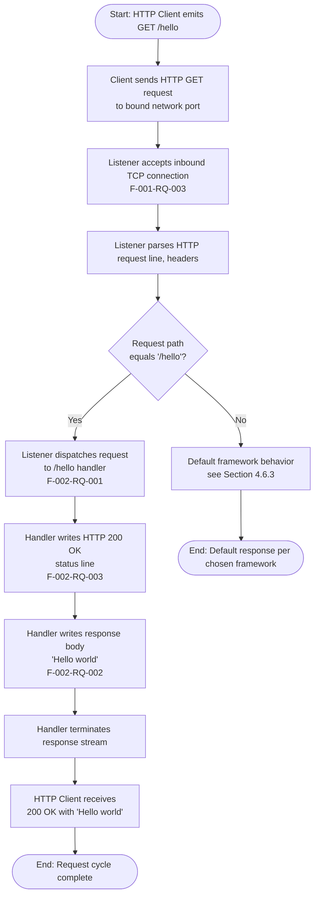

**Flow Annotations:**

- Per Section 2.2.2.1, the only `must-have` route registration is `/hello`; per F-002-RQ-004, no other routes may be implemented.
- Per Section 2.2.2.2, the response body, byte-for-byte, equals the string `Hello world`.
- Per Section 1.2.3.2 (*Deterministic Response*) and Section 2.2.2.4 (Business Rules), the response is fixed and deterministic with no variability, randomization, or environmental dependence.

### 4.2.2 Server Startup Workflow (F-001)

The server startup workflow covers the process initialization steps that must succeed before the listening state is reached. This satisfies F-001-RQ-001 and F-001-RQ-002 as defined in Section 2.2.1.

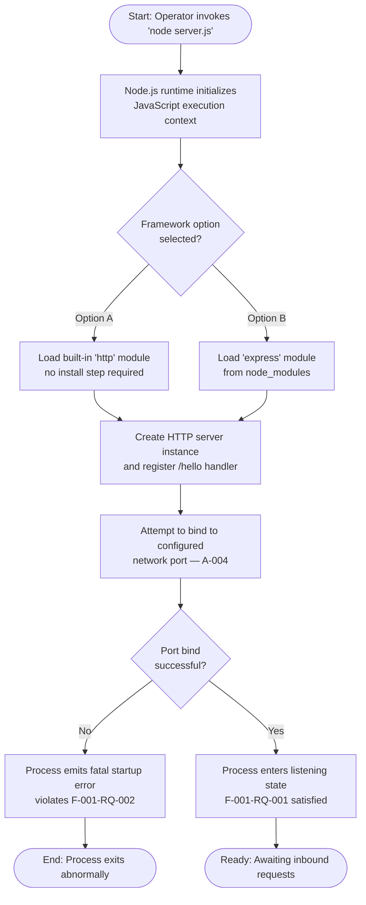

**Flow Annotations:**

- The two framework options shown reflect Section 3.3 — Option A (built-in `http` module, zero dependencies) and Option B (Express 5.2.1, single direct dependency requiring `npm install`).
- Per Assumption A-004, a network port is configurable but no specific port number is mandated by the specification.
- Per F-001-RQ-002 (Section 2.2.1.2 acceptance criteria), no uncaught exceptions or fatal startup errors are emitted during process initialization. The "Bind Fail" branch is shown for completeness as the failure mode that would violate this acceptance criterion; no recovery procedure is in scope (see Section 4.6).

### 4.2.3 `/hello` Request Processing Workflow (F-002)

The request-processing workflow zooms in on the steady-state behavior once the listener is active. This flow satisfies F-001-RQ-003, F-002-RQ-001, F-002-RQ-002, and F-002-RQ-003.

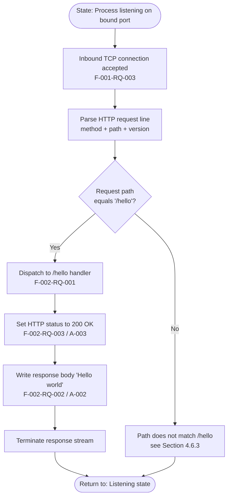

**Flow Annotations:**

- The single decision point in the entire system is "request path equals `/hello`?" — see Section 4.4.1.
- Per Section 2.2.2.2, an HTTP GET to `/hello` returns a response body byte-equal to `Hello world`, and inspection of the response status line reveals HTTP 200 OK.
- After response termination, the process returns to the listening state without persisting any intermediate data, consistent with Section 2.2.2.3 ("no data is read, written, or persisted").

### 4.2.4 End-to-End User Journey with Swim Lanes

The diagram below depicts the same request cycle from Section 4.2.1 but organizes activities into swim lanes corresponding to the actors identified in Section 4.1.3.

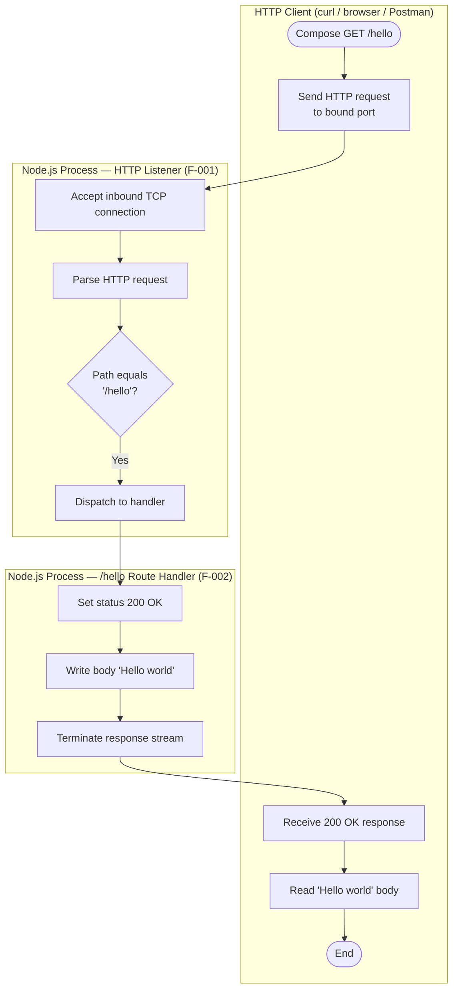

**Swim-Lane Annotations:**

- The Client lane and the Node.js Process lanes communicate exclusively across the inbound HTTP boundary identified in Section 2.3.2.
- The Listener-to-Handler transition is an **in-process function invocation** ("Internal Dispatch" in Section 2.3.2), not a network call.
- No additional swim lanes (database, cache, identity provider, message broker, third-party API, observability backend) are present because no such systems are in scope (Section 2.3.4).

---

## 4.3 INTEGRATION WORKFLOWS

### 4.3.1 Integration Surface Overview

Per Section 2.3.2, the complete integration surface of this system consists of three integration points only. The table below restates them in flow terms:

| Integration Point | Direction | Feature(s) | Boundary Type |
|---|---|---|---|
| Inbound HTTP Boundary | External → Process | F-001 | Network — TCP/HTTP |
| Internal Dispatch | F-001 → F-002 | F-001, F-002 | In-process function call |
| Outbound HTTP Response | Process → External | F-002 | Network — TCP/HTTP |

No data flows exist between distinct systems because no external systems are integrated. There are no API interactions beyond the inbound HTTP request and outbound HTTP response. There are no event processing flows because the system is purely request/response. There are no batch processing sequences because no batch domain is in scope.

### 4.3.2 Inbound HTTP Request Sequence Diagram

The following sequence diagram depicts the message exchange for a single successful `GET /hello` invocation, including the actor-to-actor message ordering and the inputs/outputs at each boundary.

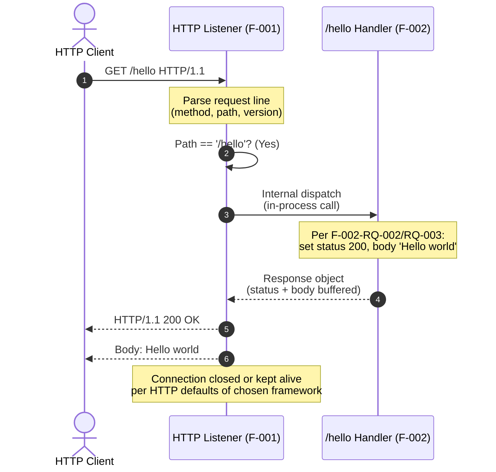

**Sequence Annotations:**

- Messages 1, 7, and 8 cross the **external** inbound/outbound HTTP boundary identified in Section 2.3.2.
- Messages 4 and 6 are **internal** — they represent in-process function invocations and not network traffic.
- Per Section 2.2.2.3, the handler consumes no query parameters, headers, or body content.

### 4.3.3 Excluded Integration Workflows

The following integration workflows commonly appear in production system specifications and are documented here as **explicitly absent** to prevent scope creep:

| Excluded Workflow | Reason for Exclusion |
|---|---|
| Database read/write sequence | No persistence layer is in scope (Sections 1.3.2.1, 2.2.2.3) |
| Cache lookup / cache write sequence | Caching explicitly excluded (Section 1.3.2.1) |
| Authentication / authorization handshake | Security requirements "None in scope" (Sections 2.2.1.4, 2.2.2.4) |
| Message queue publish / consume | No message broker in scope (Section 1.2.1.3) |
| Third-party API call sequence | No external services integrated (Section 2.3.4) |
| Webhook event processing | No event-driven integration in scope (Section 2.3.2) |
| Batch job orchestration | No batch domain in scope |
| Health check / liveness probe sequence | Observability excluded (Section 1.3.2.1) |
| CI/CD deployment pipeline | Deployment pipelines excluded (Section 1.3.2.1) |

---

## 4.4 FLOWCHART DETAILS AND DECISION POINTS

### 4.4.1 Decision Points Inventory

Across the entire system, exactly **one** decision point exists in the request-processing logic. It is documented exhaustively in the table below.

| Decision ID | Decision Question | Branches | Anchored In |
|---|---|---|---|
| D-001 | Does the inbound request path equal `/hello`? | Yes → F-002 handler invoked; No → Default framework behavior (see Section 4.6.3) | F-002-RQ-001, F-002-RQ-004 |

A secondary, startup-time decision implicit in F-001-RQ-002 is whether the port bind succeeds; this is shown in Section 4.2.2 but is not a runtime request-routing decision.

### 4.4.2 Path Match Decision — Detailed Flow

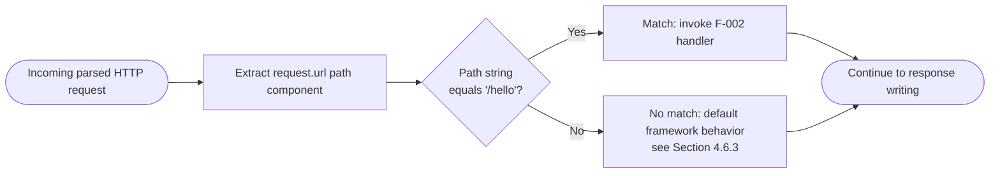

**Annotations:**

- Per F-002-RQ-001, the match criterion is path equality against the literal string `/hello`.
- Per Section 2.2.2.3, no query parameters or headers participate in the match criterion.
- Per Assumption A-001, the method exercised is `GET`; the specification does not require explicit method dispatch logic beyond what the chosen framework provides by default.

### 4.4.3 Validation Rules Application at Each Step

The table below maps every flow step to the applicable validation rules from Sections 2.2.1.4 and 2.2.2.4.

| Flow Step | Business Rule | Data Validation | Security | Compliance |
|---|---|---|---|---|
| Port bind (startup) | Listener exists solely to support `/hello` (no other ports/endpoints) | N/A — no domain input | None in scope | None |
| Accept inbound connection | N/A | N/A — no payload validation | None in scope | None |
| Parse HTTP request | N/A | N/A — no body/query parameters consumed | None in scope | None |
| Path match decision | Only `/hello` routes to F-002; F-002-RQ-004 prohibits other routes | N/A | None in scope | None |
| Set status code | Status MUST be 200 OK on match (F-002-RQ-003) | N/A | None in scope | None |
| Write response body | Response body MUST equal literal `Hello world` (F-002-RQ-002); deterministic, no variability | N/A | None in scope — no input to validate, no injection vectors by design | None |
| Terminate response | N/A | N/A | None in scope | None |

**Compliance Note:** Per Sections 2.2.1.4 and 2.2.2.4, "Compliance Requirements: None — the project is a local tutorial artifact with no regulatory footprint." No regulatory compliance checkpoints are present at any step in the flow.

**Authorization Note:** Per Sections 2.2.1.4 and 2.2.2.4, "Security Requirements: **None in scope** — authentication, authorization, API keys, tokens, and TLS termination are explicitly excluded." No authorization checkpoints exist in the flow.

---

## 4.5 STATE MANAGEMENT

### 4.5.1 Process Lifecycle State Diagram

The only meaningful state model in the system is the lifecycle of the Node.js process itself. There are no domain entity states, session states, or workflow states because no domain entities, sessions, or multi-step workflows exist.

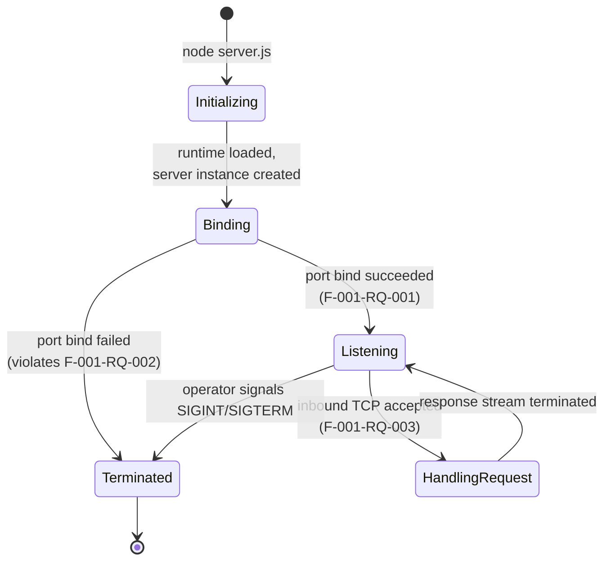

### 4.5.2 State Transitions Table

| From State | To State | Trigger | Anchored In |
|---|---|---|---|
| `[*]` | Initializing | Operator invokes `node server.js` | Section 3.3.2 / 3.3.3 startup commands |
| Initializing | Binding | Node.js runtime loaded; HTTP server instance constructed | Section 2.2.1.1 |
| Binding | Listening | Successful bind to configured port | F-001-RQ-001 |
| Binding | Terminated | Failed bind (e.g., port in use) — violates F-001-RQ-002 | F-001-RQ-002 |
| Listening | HandlingRequest | Inbound TCP connection accepted; HTTP request parsed | F-001-RQ-003 |
| HandlingRequest | Listening | Response stream terminated; loop returns to event loop idle | Section 2.2.2 |
| Listening | Terminated | Operator-issued signal (SIGINT / SIGTERM) | Implicit OS process control |
| Terminated | `[*]` | Process exit | Implicit |

### 4.5.3 Data Persistence, Caching, and Transaction Boundaries — Not Applicable

The author prompt requests documentation of data persistence points, caching requirements, and transaction boundaries. None apply to this system:

| Concept | Status | Authoritative Source |
|---|---|---|
| Data Persistence Points | **None** — no data is read, written, or persisted at any step in the flow | Section 2.2.1.3 ("F-001 reads no domain data and persists no state"); Section 2.2.2.3 ("response is a fixed literal; no data is read, written, or persisted") |
| Caching Requirements | **Not applicable** — caching is explicitly excluded; application-level memoization is unnecessary because the response is already a static literal | Section 1.3.2.1; Section 3.3 (no caching libraries selected) |
| Transaction Boundaries | **Not applicable** — no database or transactional resource is integrated; no transactions exist to bound | Section 2.2.2.3; Section 2.3.4 (no shared databases, caches, message buses) |

The request/response cycle is **in-memory and ephemeral**: parsed request data lives only on the call stack for the duration of the handler invocation and is discarded when the response stream terminates.

---

## 4.6 ERROR HANDLING

### 4.6.1 Scope-Bounded Error Conditions

Error handling in this system is intentionally minimal. Per Section 1.3.2.1, no reliability features such as retry mechanisms, circuit breakers, fallback processes, or rate limiting are in scope. Per Constraint C-006, none of the items in Section 1.3.2.1 may be reintroduced as requirements. The two error conditions that are anchored in the specification are documented below; no additional error-handling flows are fabricated.

| Error Condition | Anchored In | In-Scope Treatment |
|---|---|---|
| Fatal startup error (e.g., port bind failure, syntax error) | F-001-RQ-002 acceptance criterion | Process exits abnormally; **no recovery procedure is in scope** |
| Inbound request to a path other than `/hello` | F-002-RQ-001, F-002-RQ-004 | Default framework behavior of the chosen HTTP layer (see Section 4.6.3); **no custom handler is specified** |

### 4.6.2 Startup Error Flow

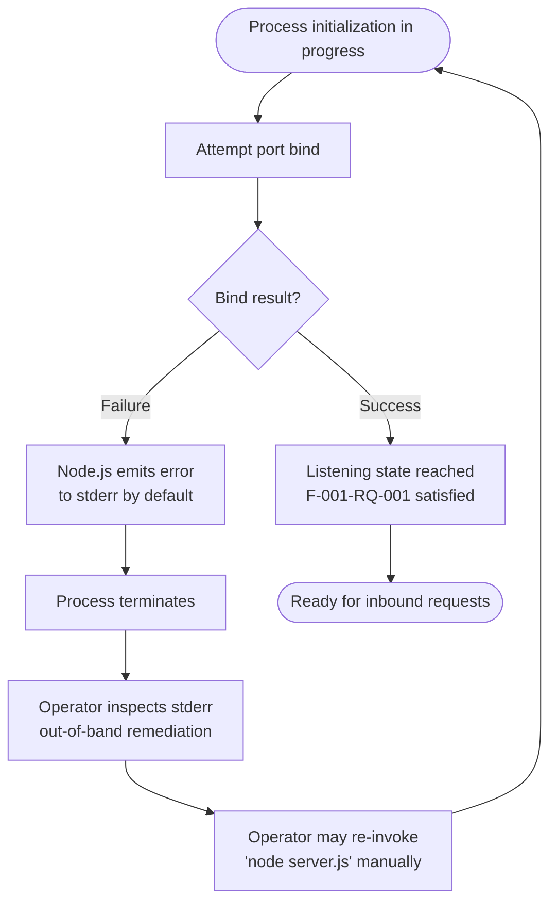

**Startup Error Annotations:**

- The "operator inspects stderr / manual re-invocation" loop is shown as the only available remediation pathway because no automated retry mechanism, supervisor, or process manager is in scope (Section 1.3.2.1).
- No structured error response is emitted because no observability layer (logging, metrics, tracing) is in scope (Section 1.3.2.1).
- No error notification flow exists; the specification does not define alerting, paging, or notification channels.

### 4.6.3 Default Framework Handling for Unmatched Paths

When an inbound request arrives at a path other than `/hello`, the system response is determined entirely by the default behavior of the chosen HTTP layer (Option A or Option B per Section 3.3). The specification deliberately defers to framework defaults rather than mandating a custom not-found handler, because F-002-RQ-004 prohibits implementing routes other than `/hello`.

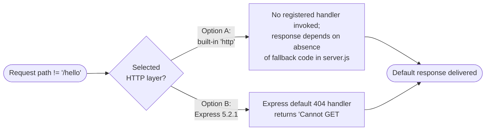

**Annotations:**

- Per F-002-RQ-004 (Section 2.2.2.1), no routes other than `/hello` MUST be implemented; this constraint deliberately leaves non-`/hello` behavior to framework defaults.
- Section 3.3.3 documents that Express 5.2.1 ships standard route-not-found behavior; Option A relies on the absence of any handler registration, leaving the underlying `http` server's default empty-response behavior.

### 4.6.4 Excluded Error-Handling Concepts

The following error-handling patterns are commonly documented in production system flowcharts but are **explicitly excluded** from this specification and therefore omitted from all process flows in this section:

| Excluded Pattern | Authoritative Exclusion Source |
|---|---|
| Retry mechanisms with backoff | Section 1.3.2.1 (Reliability exclusions); Constraint C-006 |
| Circuit breakers | Section 1.3.2.1 (Reliability exclusions) |
| Fallback processes / degraded-mode handlers | Not requested; Constraint C-006 |
| Error notification flows (email, paging, webhooks) | Section 1.3.2.1 (no observability) |
| Structured error responses (e.g., RFC 7807 problem details) | Not specified in F-001 or F-002 requirements |
| Dead-letter queues | No message broker in scope (Section 1.2.1.3) |
| Automated recovery procedures | Not requested; Constraint C-006 |
| Health-check-driven self-healing | Observability excluded (Section 1.3.2.1) |
| Error logging to centralized aggregator | Centralized logging excluded (Section 1.3.2.1) |

---

## 4.7 TIMING AND SLA CONSIDERATIONS

Per Section 1.2.3.3, **no quantitative performance, throughput, latency, or availability KPIs are specified by the user requirements**, and any introduction of such metrics is explicitly out of scope. Per Constraint C-005, no performance, throughput, or availability KPIs may be introduced. Per Sections 2.2.1.3 and 2.2.2.3, "Performance Criteria: **Not Specified**" appears in both the F-001 and F-002 technical specifications.

Accordingly, **no timing constraints are annotated on any flow step in this section**. The sole binary KPI restated from Section 1.2.3.3 is functional: the `/hello` endpoint either returns `Hello world` correctly, or it does not. No request-latency targets, no requests-per-second throughput targets, no p50/p95/p99 percentiles, no SLA budgets, no uptime percentages, and no time-to-recovery objectives are part of this specification.

This omission is intentional and aligned with the tutorial positioning of the project (Section 1.2.1.1) and the deterministic-response success criterion of Section 1.2.3.2.

---

## 4.8 VALIDATION RULES SUMMARY

The following consolidated table cross-references each flow step with the validation rule categories required by the section prompt. The contents are drawn verbatim from the validation rules tables in Sections 2.2.1.4 and 2.2.2.4.

| Step / Stage | Business Rule | Data Validation | Authorization | Compliance |
|---|---|---|---|---|
| Server startup (F-001) | Listener exists solely to support `/hello`; no other endpoints exposed | Not applicable — no domain inputs | None in scope | None |
| Inbound request accept (F-001) | Listener accepts only HTTP traffic on bound port | Not applicable | None in scope | None |
| Path match (F-002) | Only `/hello` is dispatched; F-002-RQ-004 prohibits additional routes | Not applicable — no request parameters/body consumed | None in scope | None |
| Status code (F-002) | Status MUST be 200 OK (F-002-RQ-003) | Not applicable | None in scope | None |
| Response body (F-002) | Body MUST equal literal `Hello world`; deterministic; no variability or randomization | Not applicable — no input to validate, no injection vectors by design | None in scope | None |
| Response completion (F-002) | Single response per request; no follow-up emissions | Not applicable | None in scope | None |

**Reading Note:** The repeated "None in scope" / "Not applicable" cells are not omissions — they are positive assertions sourced directly from Sections 2.2.1.4 and 2.2.2.4. Documenting them explicitly forecloses scope-creep risk per Constraint C-006.

---

## 4.9 TRACEABILITY OF FLOW ELEMENTS TO REQUIREMENTS

Every node, edge, and decision in the flowcharts above traces back to a specific requirement, assumption, or constraint. The mapping is summarized below for verification.

| Flow Element | Source Identifier | Section Reference |
|---|---|---|
| Server startup → Binding → Listening | F-001-RQ-001, F-001-RQ-002 | Section 2.2.1.1 |
| Accept inbound TCP connection | F-001-RQ-003 | Section 2.2.1.1 |
| Path match decision (`/hello`?) | F-002-RQ-001, F-002-RQ-004 | Section 2.2.2.1 |
| Set HTTP 200 OK | F-002-RQ-003 | Section 2.2.2.1; Assumption A-003 |
| Write `Hello world` body | F-002-RQ-002 | Section 2.2.2.1; Assumption A-002 |
| HTTP method assumed to be GET | Assumption A-001 | Section 2.6.1 |
| Configurable port (no fixed value) | Assumption A-004 | Section 2.6.1 |
| Local HTTP-conformant client consumption | Assumption A-005 | Section 2.6.1 |
| Single Node.js process boundary | Constraint C-003 | Section 2.6.2 |
| JavaScript on Node.js runtime | Constraint C-002 | Section 2.6.2 |
| No SLAs / performance metrics on any step | Constraint C-005 | Section 2.6.2 |
| No excluded categories (auth, DB, cache, retries) | Constraint C-006 | Section 2.6.2 |

---

## 4.10 References

#### Files Examined

- `README.md` — Verified greenfield repository state; contains only the `# BF-ADDFEATURE-ROLLBACK-GITHUB` heading and no implementation artifacts that could establish or override flow steps.

#### Folders Explored

- Repository root (depth 0) — Confirmed absence of `src/`, `lib/`, `routes/`, `package.json`, `Dockerfile`, CI manifests, and any source files; flowcharts therefore describe prospective workflows, not existing implementations.

#### Technical Specification Sections Cross-Referenced

- **Section 1.1 EXECUTIVE SUMMARY** — Stakeholder definitions (Learner, Instructor, HTTP Client, Maintainer) used for actor / swim-lane modeling.
- **Section 1.2 SYSTEM OVERVIEW** — System overview flowchart (1.2.2.3) extended in Section 4.2.1; success criteria (1.2.3.1) used as flow terminal nodes; explicit KPI exclusion (1.2.3.3) cited in Section 4.7.
- **Section 1.3 SCOPE** — In-scope items used to anchor flow steps; out-of-scope items (1.3.2.1) cited extensively to justify excluded patterns in Sections 4.1.2, 4.3.3, 4.6.4.
- **Section 2.1 FEATURE CATALOG** — F-001 and F-002 used as the structural backbone for Sections 4.2.2 and 4.2.3.
- **Section 2.2 FUNCTIONAL REQUIREMENTS TABLE** — F-001-RQ-001 through F-002-RQ-004 used to label every flow step and decision point; validation rule tables (2.2.1.4, 2.2.2.4) used to populate Section 4.4.3 and Section 4.8.
- **Section 2.3 FEATURE RELATIONSHIPS** — Dependency map (2.3.1) and integration points table (2.3.2) used to define the integration workflow in Section 4.3; shared components (2.3.3) used in actor enumeration.
- **Section 2.6 ASSUMPTIONS AND CONSTRAINTS** — Assumptions A-001 through A-005 and Constraints C-001 through C-006 cited in Section 4.9 traceability matrix.
- **Section 3.3 Frameworks & Libraries** — Option A (`http` module) and Option B (Express 5.2.1) used to define the two parallel branches in the startup workflow (Section 4.2.2) and the default-handler behavior (Section 4.6.3).

# 5. System Architecture

## 5.1 HIGH-LEVEL ARCHITECTURE

### 5.1.1 System Overview

#### 5.1.1.1 Architectural Style and Rationale

The system is realized as a **single-process, single-endpoint, request/response HTTP server** executing on the Node.js runtime. There is no microservices decomposition, no service mesh, no client tier, and no out-of-process collaborator — the deployable unit is exactly one Node.js process that binds to a configurable network port and responds to inbound HTTP requests addressed to a single route.

This monolithic, single-process style is the deliberate consequence of the project's tutorial positioning. Because the system exposes exactly one capability — "Serve `/hello` route" returning the literal response body `"Hello world"` — any additional architectural complexity would directly undermine the four critical success factors enumerated in Section 1.2.3.2: *Minimal Surface Area*, *Reproducibility*, *Deterministic Response*, and *Tutorial Readability*. The architecture is therefore the smallest viable structure capable of satisfying the two in-scope features, F-001 (HTTP Server Listener) and F-002 (`/hello` Route Handler).

The runtime execution model is Node.js's native single-threaded, event-driven loop. A single JavaScript execution context is instantiated, an HTTP server instance is constructed and bound to a network port, and the process then idles in its event loop awaiting inbound TCP connections. When a connection arrives, the listener parses the request and synchronously dispatches matching paths to the `/hello` handler, which writes a fixed response and returns control to the event loop.

#### 5.1.1.2 Key Architectural Principles and Patterns

The architecture rests on a small set of principles, each anchored directly in the Technical Specification:

- **Statelessness by design.** No data is read, written, or persisted at any step in the flow. The request/response cycle is in-memory and ephemeral, with parsed request data living only on the call stack for the duration of the handler invocation and discarded when the response stream terminates.
- **Single-process colocation.** F-001 and F-002 execute within the same Node.js process. There is no IPC, no inter-service network call, and no shared in-memory data structure between distinct components.
- **In-process dispatch only.** The transition from listener to handler is realized as a synchronous in-memory function invocation. It is *not* a network call, queue publish, or remote procedure call.
- **Zero external integrations.** The system does not interact with identity providers, message brokers, databases, third-party APIs, monitoring platforms, or any other external services. The only external interaction surface is the inbound HTTP boundary.
- **Deterministic, fixed-literal response.** The response body is a static literal with no variability, randomness, or environmental dependence; this principle is both a behavioral requirement (F-002-RQ-002) and an architectural simplifier (no template engine, no content negotiation, no caching layer needed).

#### 5.1.1.3 System Boundaries and Major Interfaces

The architecture exposes exactly three integration points. Two cross the external boundary at the network edge of the Node.js process; the third is an internal in-process boundary between F-001 and F-002.

| Boundary | Direction | Realization |
|---|---|---|
| Inbound HTTP Boundary | External HTTP Client → F-001 | Network — TCP/HTTP socket on bound port |
| Internal Dispatch | F-001 → F-002 | In-memory function invocation within one Node.js process |
| Outbound HTTP Response | F-002 → External HTTP Client | Network — TCP/HTTP write on the same socket |

There are no other external systems integrated. The complete external integration surface of this technology stack consists of a single inbound HTTP boundary, and no outbound integrations are present.

### 5.1.2 Core Components

The system decomposes into two logical components colocated within a single Node.js process, plus the shared runtime substrate that hosts them. Each logical component corresponds 1:1 to a feature in the Feature Catalog (Section 2.1).

| Component Name | Primary Responsibility | Key Dependencies |
|---|---|---|
| F-001 HTTP Server Listener | Bind to a network port, accept inbound TCP connections, parse HTTP requests, dispatch matched routes to handlers | Node.js runtime; one available TCP port; optional npm framework |
| F-002 `/hello` Route Handler | Match inbound requests to the `/hello` path; write HTTP 200 OK with body `Hello world`; terminate the response stream | F-001 must be bound and accepting connections; same Node.js process |
| Node.js Process (Shared) | Single deployable host process in which both F-001 and F-002 execute | Node.js 22.x Maintenance LTS or 24.x Active LTS |
| Node.js Runtime (Shared) | Single-threaded, event-driven JavaScript execution environment | V8 JavaScript engine bundled with Node.js |
| HTTP Protocol Stack (Shared) | Wire-level encoding/decoding of HTTP/1.1 messages | Built-in `http` module *or* the chosen higher-level framework |

The following table summarizes the integration touch points and critical considerations for each component.

| Component Name | Integration Points | Critical Considerations |
|---|---|---|
| F-001 HTTP Server Listener | Inbound HTTP boundary (external); Internal dispatch to F-002 | Foundational feature — no other feature operates without it; framework choice deferred per Section 1.2.2.2 |
| F-002 `/hello` Route Handler | Internal dispatch from F-001; Outbound HTTP response to client | Response MUST be byte-equal to `Hello world`; no input is consumed, eliminating injection vectors by design |
| Node.js Process | Hosts F-001 and F-002 | Single process, single-port binding; no clustering, no worker threads |
| Node.js Runtime | Executes JavaScript for both features | Single-threaded event loop is sufficient because no scalability targets exist |
| HTTP Protocol Stack | Realizes both inbound and outbound HTTP messaging | Implementation is the same module on both sides (built-in `http` *or* Express 5.2.1 — never mixed) |

### 5.1.3 Data Flow Description

#### 5.1.3.1 Primary Data Flow Between Components

The system supports exactly one end-to-end data flow: a synchronous request/response cycle initiated by an external HTTP client. The flow proceeds as a strictly linear sequence of in-process steps with a single decision point.

The HTTP client emits a `GET /hello` request to the bound network port. F-001 accepts the inbound TCP connection, then parses the HTTP request line, method, path, and headers. F-001 evaluates the only runtime decision point in the system — decision D-001 — which asks whether the request path equals the literal string `/hello`. On a match, F-001 performs an in-process synchronous dispatch to F-002. F-002 sets the HTTP response status to 200 OK (satisfying F-002-RQ-003 and Assumption A-003), writes the response body `Hello world` (satisfying F-002-RQ-002 and Assumption A-002), and terminates the response stream. Control returns to F-001, which closes or keeps the connection open per the chosen framework's HTTP defaults, and the process returns to its listening state to await the next request.

On a non-match — any path other than `/hello` — the request is handled by the default behavior of the chosen HTTP layer. There is no custom not-found handler, because F-002-RQ-004 prohibits implementing routes other than `/hello`.

#### 5.1.3.2 Integration Patterns and Protocols

The system uses two distinct integration patterns at the architectural level:

- **External request/response over HTTP/1.1.** The inbound and outbound boundaries carry standard HTTP messages over TCP. The handler consumes no query parameters, headers, or body content from the request, and the response is plain text.
- **Internal synchronous function invocation.** The F-001 → F-002 transition is an in-memory call within the single Node.js process. No serialization, no message queue, and no network hop is involved.

No asynchronous integration patterns (event publishing, queue-based decoupling, fire-and-forget) are present, and no streaming protocols (WebSockets, gRPC streams, Server-Sent Events) are in use.

#### 5.1.3.3 Data Transformation Points

There are no substantive data transformations along the flow. F-001 performs the HTTP wire-format parsing inherent to any HTTP server, F-002 reads only the path (already extracted by F-001) for comparison, and F-002 writes a fixed literal string back. No serialization frameworks, no marshaling layers, no schema validators, and no DTO mappers are present.

#### 5.1.3.4 Data Stores and Caches

The system contains **no data stores and no caches of any kind**. Per the F-001 and F-002 specifications, F-001 reads no domain data and persists no state, and F-002's response is a fixed literal with no data read, written, or persisted. The following negative inventory is documented to prevent scope drift:

- No primary database (MongoDB, PostgreSQL, MySQL, DynamoDB, SQLite, or any other engine).
- No secondary/read-replica database.
- No in-memory cache (Redis, Memcached) and no application-level memoization (the response is already a static literal, so memoization adds no value).
- No HTTP-layer cache (CDN, reverse proxy cache).
- No object storage (S3, GCS, Azure Blob), no block storage, no local file persistence.
- No write-ahead logs, journals, or append-only files.

The entire request/response cycle is in-memory and ephemeral; the Node.js call stack is the only "data store" that participates in the flow, and it is reclaimed at handler exit.

### 5.1.4 External Integration Points

The system has only one external integration surface: the inbound HTTP boundary itself. The table below documents this single integration point for completeness. All other categories of external integration — identity providers, monitoring backends, databases, message brokers, third-party APIs, payment gateways, analytics platforms, object storage, webhooks — are explicitly out of scope per Section 1.2.1.3 and Section 1.3.2.1, and Constraint C-006 prohibits their reintroduction.

| System Name | Integration Type | Protocol / Format |
|---|---|---|
| HTTP Client (curl, browser, Postman, Insomnia, or any HTTP-conformant client) | Inbound synchronous request/response | HTTP/1.1 over TCP; plain-text response body |

The data exchange pattern at this single point is **synchronous request/response with no callback or polling mechanism**. The client issues a `GET /hello` request and blocks on the response; the server returns the response within the same TCP connection. There is no asynchronous return channel, webhook callback, or long-polling exchange.

**SLA Requirements.** None. No quantitative performance, throughput, latency, or availability KPIs are specified by the user requirements, and any introduction of such metrics is explicitly out of scope. Constraint C-005 prohibits introducing performance, throughput, or availability KPIs. The sole binary functional KPI is: the `/hello` endpoint either returns `Hello world` correctly, or it does not.

---

## 5.2 COMPONENT DETAILS

### 5.2.1 F-001 — HTTP Server Listener

#### 5.2.1.1 Purpose and Responsibilities

F-001 establishes the inbound network surface for the tutorial system. It is the foundational feature of the system — no other feature operates without it. Its responsibilities, in order of execution, are:

- Bind a server instance to a configurable network port.
- Enter a listening state and remain there until a process termination signal is received.
- Accept inbound TCP connections directed at the bound port.
- Parse HTTP request lines, methods, paths, and headers from each accepted connection.
- Evaluate decision point D-001 (path equality against `/hello`) and dispatch matching requests to F-002.

#### 5.2.1.2 Technologies and Frameworks

F-001 executes on the Node.js runtime using the single-threaded, event-driven model. The HTTP framework choice is intentionally deferred per Section 1.2.2.2: implementers may use either the built-in `http` module (Option A) or Express.js 5.2.1 (Option B). Either option fulfills the F-001 requirements; the decision matrix is documented in Section 5.3.6.

| Attribute | Specification |
|---|---|
| Runtime | Node.js 22.x Maintenance LTS or 24.x Active LTS (per Section 3.8.3) |
| Language | JavaScript only (Constraint C-002) |
| Framework Option A | Node.js built-in `http` module — zero external dependencies |
| Framework Option B | Express.js 5.2.1 — one direct npm dependency; ~30 transitive dependencies |

#### 5.2.1.3 Key Interfaces and APIs

The external interface of F-001 is the HTTP/1.1 inbound socket on the bound port. The internal interface to F-002 is a synchronous function invocation passing the parsed request object and the response object handle.

For Option A (built-in `http`), the implementation-facing APIs are `http.createServer()`, `request.url`, `response.writeHead()`, and `response.end()`. For Option B (Express 5.2.1), the route registration uses the declarative `app.get('/hello', handler)` idiom, and request/response objects are framework wrappers over the underlying Node.js objects.

#### 5.2.1.4 Data Persistence Requirements

**None.** F-001 reads no domain data and persists no state. The listener holds only ephemeral connection state in memory (managed by the chosen HTTP layer) and no application-level data is retained beyond the lifecycle of an individual request.

#### 5.2.1.5 Scaling Considerations

Scaling is explicitly out of scope. Production hosting at scale and handling concurrent load beyond local-development volumes are explicitly Unsupported per Section 1.3.2.4. The single Node.js process model is sufficient for the tutorial's pedagogical purpose. No clustering, no worker threads, no horizontal scale-out, and no load balancing are documented in this architecture.

### 5.2.2 F-002 — `/hello` Route Handler

#### 5.2.2.1 Purpose and Responsibilities

F-002 implements the singular user-facing capability of the system: matching inbound HTTP requests against the path `/hello` and writing the literal response body `"Hello world"` back to the calling client. This is the only externally observable behavior the system exposes. Its responsibilities are:

- Receive the parsed request via in-process dispatch from F-001.
- Set the HTTP response status to 200 OK (F-002-RQ-003 / Assumption A-003).
- Write the response body byte-equal to the literal string `Hello world` (F-002-RQ-002 / Assumption A-002).
- Terminate the response stream and return control to F-001.

#### 5.2.2.2 Technologies and Frameworks

F-002 is colocated with F-001 within the same Node.js process and uses the same HTTP-layer technology as F-001. There is no separate framework choice for F-002 — Option A and Option B from Section 3.3 each cover both features simultaneously.

#### 5.2.2.3 Key Interfaces and APIs

The inbound interface of F-002 is the in-process call from F-001. The outbound interface is the HTTP response stream that ultimately reaches the external client. The handler accepts no input data: it MUST NOT consume query parameters, request bodies, or perform input validation. No request fields beyond the path are read.

#### 5.2.2.4 Data Persistence Requirements

**None.** F-002's response is a fixed literal; no data is read, written, or persisted at any point in the handler's execution. No database, cache, file, or external storage interaction occurs.

#### 5.2.2.5 Scaling Considerations

Not applicable. The handler is stateless and serves one fixed response. Because no domain state is involved, horizontal scaling would be trivially possible — but is not a deliverable of this specification.

### 5.2.3 Component Interaction Diagram

The following diagram depicts the steady-state interaction between the external HTTP client, F-001, and F-002 within the single Node.js process. The diagram is the direct architectural elaboration of the request/response flowchart in Section 1.2.2.3 and the feature dependency map in Section 2.3.1.

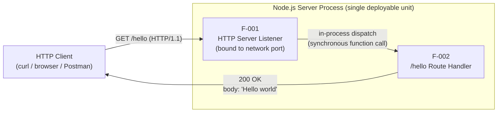

### 5.2.4 Process Lifecycle State Diagram

The only meaningful state model in the system is the lifecycle of the Node.js process itself. There are no domain entity states, session states, or workflow states because no domain entities, sessions, or multi-step workflows exist.


The state transitions are summarized below.

| From State | To State | Trigger |
|---|---|---|
| `[*]` (start) | Initializing | Operator invokes `node server.js` |
| Initializing | Binding | Runtime loaded; server instance constructed |
| Binding | Listening | Successful bind to configured port (F-001-RQ-001) |
| Binding | Terminated | Failed bind — violates F-001-RQ-002 |
| Listening | HandlingRequest | Inbound TCP accepted (F-001-RQ-003) |
| HandlingRequest | Listening | Response stream terminated |
| Listening | Terminated | Operator signals SIGINT/SIGTERM |
| Terminated | `[*]` (end) | Process exits |

### 5.2.5 Sequence Diagram for the `GET /hello` Flow

The following sequence diagram depicts the message exchange for a single successful `GET /hello` invocation. Messages crossing the external HTTP boundary (1, 7, 8) are network traffic; messages 4 and 6 are in-process function invocations and do not traverse the network.


---

## 5.3 TECHNICAL DECISIONS

### 5.3.1 Architecture Style Decision

The architecture style is a **single-process, single-endpoint monolith**. The decision was driven by the radical simplicity of the user requirement — one route returning one fixed string — and the pedagogical positioning of the project. The trade-off table below documents the considered alternatives and the rationale for rejection.

| Style Considered | Outcome | Rationale |
|---|---|---|
| Single-process monolith | **Selected** | Smallest viable structure for one endpoint; aligns with all four success factors (Section 1.2.3.2) |
| Microservices / service mesh | Rejected | Introduces inter-service network calls; violates Minimal Surface Area for a single-capability system |
| Serverless / Function-as-a-Service | Rejected | Introduces cloud-platform dependencies; cloud platforms are excluded by Section 1.3.2.1 |
| Multi-process / clustered Node.js | Rejected | Scaling is out of scope (Section 1.3.2.4); clustering adds complexity without benefit |

### 5.3.2 Communication Pattern Decision

The communication pattern between F-001 and F-002 is **synchronous in-process function invocation**. The external integration uses **synchronous HTTP request/response**.

| Pattern Decision | Choice Made | Rationale |
|---|---|---|
| Listener-to-Handler dispatch | Synchronous in-process function call | No IPC overhead; both features colocated; preserves minimal surface area |
| External client integration | Synchronous HTTP/1.1 request/response | Matches the user's stated need ("returns 'Hello world' to the calling HTTP client") |
| Asynchronous messaging | Not used | No message broker in scope (Section 1.2.1.3); no events to publish or consume |
| Streaming (WebSockets, SSE, gRPC) | Not used | Single fixed response body; streaming would add complexity without benefit |

### 5.3.3 Data Storage Decision

**No data storage is used.** This is a first-class architectural decision rather than an omission. The response is a fixed literal, the handler consumes no input, and no domain entities exist.

| Storage Decision | Status | Rationale |
|---|---|---|
| Relational database | Excluded | No domain data exists (Section 3.6.2) |
| NoSQL document store | Excluded | No domain data exists; MongoDB-from-default-stack replaced (Section 3.6.2) |
| Object storage | Excluded | No binary assets to store (Section 3.6.5) |
| File-based persistence | Not applicable | No data domain (Section 3.6.5) |

### 5.3.4 Caching Strategy Decision

**No caching layer is used.** Application-level memoization would also add no value because the response is already a static literal. HTTP caching at a reverse proxy or CDN is excluded because no deployment infrastructure is in scope.

| Caching Decision | Status | Rationale |
|---|---|---|
| In-memory cache (Redis, Memcached) | Excluded | No upstream data source exists to cache (Section 3.6.4) |
| Application-level memoization | Not applicable | Response is already a static literal (Section 3.6.4) |
| HTTP / CDN cache | Excluded | No deployment infrastructure in scope (Section 3.6.4) |

### 5.3.5 Security Mechanism Decision

**No security mechanisms are introduced.** Section 1.3.2.1 explicitly excludes TLS/HTTPS, authentication, authorization, API keys, tokens, and rate limiting. Section 2.4.2.2 documents that "the handler accepts no input, eliminating injection vectors by design."

| Security Decision | Status | Rationale |
|---|---|---|
| TLS / HTTPS | Excluded | Not in scope (Section 3.8.1); tutorial runs locally |
| Authentication / Authorization | Excluded | Not in scope (Section 3.8.1); no protected resources exist |
| API keys / tokens | Excluded | Not in scope (Section 3.8.1) |
| Rate limiting / throttling | Excluded | Not in scope (Section 3.8.1) |
| Input validation | Not applicable | Handler consumes no input (Section 3.8.1) |
| Security middleware (`helmet`, `cors`, etc.) | Excluded | Not requested; would expand dependency footprint (Section 3.3.5) |

**Critical Reminder:** Section 1.3.2.4 marks production hosting at scale as Unsupported. The technology stack documented here is appropriate for a local tutorial only and MUST NOT be deployed to production environments without first addressing the excluded security concerns through a separate scoping effort.

### 5.3.6 HTTP Framework Selection Decision Tree

The Technical Specification deliberately defers the HTTP framework choice between Option A (built-in `http` module) and Option B (Express.js 5.2.1). The decision tree below distills the choice based on the implementer's pedagogical priorities.

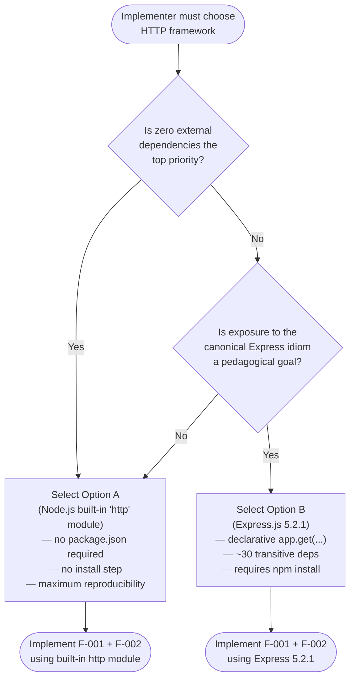

The decision matrix from Section 3.3.4 ranks the two options against the project's critical success factors. Option A is the recommended default when in doubt because it most rigorously satisfies the *Minimal Surface Area* success factor; Option B remains fully compliant and is preferred when exposing learners to the canonical Express routing pattern is an explicit pedagogical goal.

### 5.3.7 Architecture Decision Records

The following ADR-style entries consolidate the binding decisions made for this architecture. Each is anchored in a specific Technical Specification section and one or more constraint identifiers from Section 2.6.

| ADR Title | Decision | Anchored In |
|---|---|---|
| ADR-001: Language Selection | JavaScript only; TypeScript explicitly excluded | C-002; Section 3.2 |
| ADR-002: Runtime Selection | Node.js 22.x LTS or 24.x LTS | Section 3.8.3 |
| ADR-003: Architecture Style | Single-process, single-endpoint monolith | Section 1.2.2.2; C-003 |
| ADR-004: HTTP Framework Choice | Deferred — Option A (built-in `http`) or Option B (Express 5.2.1) both valid | Section 3.3; Section 1.2.2.2 |
| ADR-005: Data Persistence | None — no databases, caches, or files | Section 3.6; A-002 |
| ADR-006: Security Posture | None — no TLS, auth, or rate limiting | Section 3.8.1; C-006 |
| ADR-007: Observability Stack | None — no logging libraries, no metrics, no tracing | Section 1.3.2.1; C-006 |
| ADR-008: Performance / SLA | None — no quantitative KPIs introduced | C-005; Section 4.7 |
| ADR-009: Deployment Model | Local Node.js process only; production hosting Unsupported | Section 1.3.2.4 |
| ADR-010: Default-Stack Deviations | Python/Flask/MongoDB/Docker/AWS/etc. all excluded | Section 1.3.2.1; C-006 |

The decision-traceability tree below visualizes how the architectural decisions cascade from the core constraints.

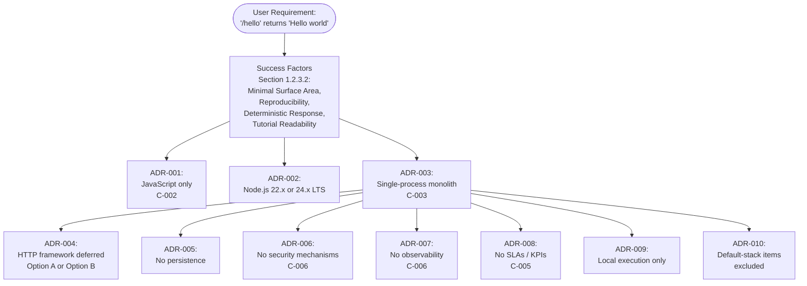

---

## 5.4 CROSS-CUTTING CONCERNS

This subsection documents the cross-cutting concerns commonly addressed in production system architectures. For this tutorial system, virtually every such concern is **explicitly excluded** rather than implemented. These exclusions are deliberate architectural choices anchored in Section 1.3.2.1 and Constraint C-006, and must not be reintroduced as implementation requirements.

### 5.4.1 Monitoring and Observability Approach

**No monitoring or observability layer is in scope.** APM tools, error tracking platforms, distributed tracing, and uptime monitoring are all excluded. No metrics libraries (e.g., `prom-client`, `@opentelemetry/*`, `dd-trace`) are added to the dependency footprint.

| Observability Concern | Status |
|---|---|
| Application Performance Monitoring (Datadog, New Relic) | Excluded |
| Error tracking (Sentry, Rollbar) | Excluded |
| Distributed tracing (OpenTelemetry, Jaeger, Zipkin) | Excluded |
| Metrics export (Prometheus, StatsD) | Excluded |
| Uptime / synthetic monitoring | Excluded |
| Health-check / liveness probe endpoints | Excluded |

### 5.4.2 Logging and Tracing Strategy

**No structured logging libraries are introduced.** Libraries such as `winston`, `pino`, `morgan`, and `bunyan` are explicitly excluded. The only logging that occurs is Node.js's default emission of uncaught errors to `stderr` during fatal startup conditions (see Section 5.4.3).

| Logging Concern | Status |
|---|---|
| Structured logging library | Excluded |
| Centralized log aggregation | Excluded |
| Request access logs | Excluded |
| Distributed trace correlation IDs | Excluded |
| Default Node.js `stderr` output for fatal errors | In scope — implicit runtime behavior only |

### 5.4.3 Error Handling Patterns

Error handling in this system is intentionally minimal. Per Section 1.3.2.1 and Constraint C-006, no reliability features such as retry mechanisms, circuit breakers, fallback processes, or rate limiting are in scope. Exactly two error conditions are anchored in the specification:

| Error Condition | Anchored In | In-Scope Treatment |
|---|---|---|
| Fatal startup error (e.g., port bind failure, syntax error) | F-001-RQ-002 | Process exits abnormally; **no recovery procedure in scope** |
| Inbound request to a path other than `/hello` | F-002-RQ-001, F-002-RQ-004 | Default behavior of the chosen HTTP layer (Option A or Option B) |

The following error-handling patterns commonly appear in production architectures and are **explicitly excluded** here to prevent scope creep:

- Retry mechanisms with backoff.
- Circuit breakers.
- Fallback processes / degraded-mode handlers.
- Error notification flows (email, paging, webhooks).
- Structured error responses (e.g., RFC 7807 problem details).
- Dead-letter queues.
- Automated recovery procedures.
- Health-check-driven self-healing.
- Error logging to a centralized aggregator.

### 5.4.4 Authentication and Authorization Framework

**No authentication or authorization framework is used.** No identity providers, no API keys, no tokens, no session management, no RBAC/ABAC policies, and no security middleware are present.

| Security Concern | Status |
|---|---|
| TLS / HTTPS termination | Excluded |
| Authentication (any mechanism) | Excluded |
| Authorization (any mechanism) | Excluded |
| API keys / bearer tokens | Excluded |
| Rate limiting / throttling | Excluded |
| Input validation | Not applicable — handler consumes no input |
| Injection vectors | None by design — handler accepts no input |
| Security middleware (`helmet`, `cors`, `express-rate-limit`) | Excluded |
| Cryptographic libraries (`bcrypt`, `jsonwebtoken`) | Excluded |

### 5.4.5 Performance Requirements and SLAs

**No performance requirements or SLAs are defined.** Per Constraint C-005, no performance, throughput, or availability KPIs may be introduced. Per Sections 2.2.1.3 and 2.2.2.3, "Performance Criteria: Not Specified" appears in both the F-001 and F-002 technical specifications.

| SLA / KPI Category | Status |
|---|---|
| Request latency (p50/p95/p99) | Not specified |
| Requests-per-second throughput target | Not specified |
| Concurrent connection target | Not specified |
| Uptime / availability percentage | Not specified |
| Mean Time To Recovery (MTTR) | Not specified |
| Mean Time Between Failures (MTBF) | Not specified |

The sole binary functional KPI restated from Section 1.2.3.3 is: the `/hello` endpoint either returns `Hello world` correctly, or it does not. This omission is intentional and aligned with the tutorial positioning of the project and the deterministic-response success criterion of Section 1.2.3.2.

### 5.4.6 Disaster Recovery Procedures

**No disaster recovery procedures are in scope.** Section 1.3.2.4 marks "Production hosting at scale" as Unsupported. There are no backup strategies, no failover targets, no replication configurations, and no recovery point/recovery time objectives.

The only recovery mechanism documented in the specification is operator-initiated manual restart: after a fatal startup error emits to `stderr`, the operator inspects the output and may re-invoke `node server.js` manually. This is the entire recovery surface.

| Disaster Recovery Concern | Status |
|---|---|
| Recovery Point Objective (RPO) | Not applicable — no data to recover |
| Recovery Time Objective (RTO) | Not specified |
| Backup strategy | Not applicable — no data to back up |
| Failover / hot-standby | Excluded |
| Multi-region replication | Excluded |
| Operator manual restart | The sole "recovery procedure" — `node server.js` re-invoked by hand |

### 5.4.7 Error Handling Flow Diagram

The diagram below depicts the two scope-bounded error pathways: the startup error flow (port bind failure or other fatal initialization error) and the unmatched-path flow (any inbound path other than `/hello`).

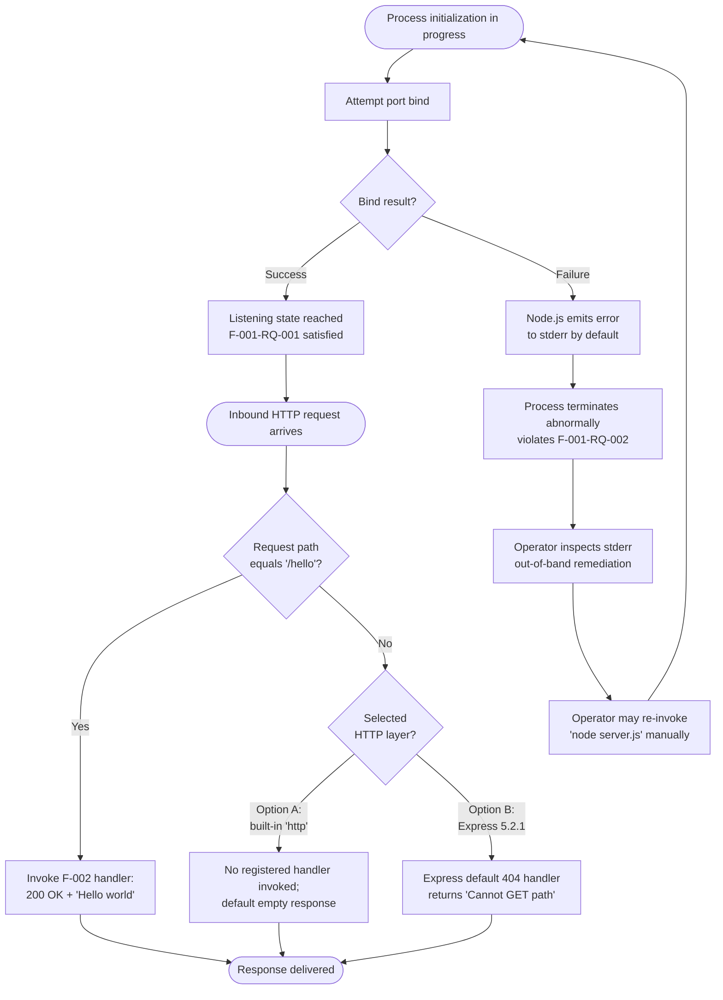

The diagram intentionally shows **no** retry loops, circuit breakers, fallback handlers, error notification channels, or automated recovery flows, in compliance with Constraint C-006 and the exclusions enumerated in Section 5.4.3.

---

## 5.5 References

### 5.5.1 Repository Artifacts Examined

- `README.md` — Sole file present in the repository root; contains a single first-level heading and confirms the greenfield state from which all architecture in this section is derived prescriptively rather than descriptively.
- Repository root (depth 0) — Verified to contain no source files, no `package.json`, no subdirectories, no build or CI artifacts. This greenfield state is the foundational fact for the architecture documented in this section.

### 5.5.2 Technical Specification Sections Referenced

- **1.1 EXECUTIVE SUMMARY** — Tutorial positioning; stakeholder definitions; value dimensions.
- **1.2 SYSTEM OVERVIEW** — Greenfield repository state; primary capability; two-component decomposition (Listener + Handler); critical success factors; binary functional KPI.
- **1.3 SCOPE** — In-scope items; exhaustive out-of-scope exclusions; Unsupported use cases (production hosting at scale).
- **2.1 FEATURE CATALOG** — F-001 (HTTP Server Listener) and F-002 (`/hello` Route Handler) definitions, dependencies, and integration requirements.
- **2.2 FUNCTIONAL REQUIREMENTS TABLE** — F-001-RQ-001/002/003 and F-002-RQ-001/002/003/004 acceptance criteria and validation rules.
- **2.3 FEATURE RELATIONSHIPS** — Feature dependency map; the three integration points (Inbound HTTP, Internal Dispatch, Outbound HTTP); shared components (Node.js process, runtime, HTTP stack).
- **2.4 IMPLEMENTATION CONSIDERATIONS** — Technical constraints for F-001 and F-002; non-functional considerations (performance/scalability/security all "None in scope").
- **2.6 ASSUMPTIONS AND CONSTRAINTS** — A-001 through A-005 (assumptions on method, body, status, port, client); C-001 through C-006 (constraints).
- **3.2 Programming Languages** — JavaScript-only mandate per C-002; Node.js 22.x and 24.x LTS lines.
- **3.3 Frameworks & Libraries** — Option A (built-in `http`) vs. Option B (Express 5.2.1); decision matrix against success factors; explicitly excluded frameworks.
- **3.6 Databases & Storage** — Explicit exclusion of all persistence, caching, and storage categories.
- **3.8 Security and Integration Considerations** — Security exclusions table; integration surface (only inbound HTTP); version compatibility matrix.
- **4.2 SYSTEM WORKFLOWS** — Core process flowchart; startup workflow; request processing workflow; swim-lane end-to-end journey.
- **4.3 INTEGRATION WORKFLOWS** — Integration surface table; sequence diagram for `GET /hello`; explicit list of excluded integration workflows.
- **4.4 FLOWCHART DETAILS AND DECISION POINTS** — Single decision point D-001 (path equals `/hello`?); validation-rules-per-step table.
- **4.5 STATE MANAGEMENT** — Node.js process lifecycle state diagram; state transitions table; non-applicability of persistence, caching, and transactions.
- **4.6 ERROR HANDLING** — Scope-bounded error conditions; startup error flow; default framework handling for unmatched paths; explicit exclusions list.
- **4.7 TIMING AND SLA CONSIDERATIONS** — Explicit absence of timing and SLA constraints; binary functional KPI only.

# 6. SYSTEM COMPONENTS DESIGN

## 6.1 Core Services Architecture

### 6.1.1 Applicability Determination

**Core Services Architecture is not applicable for this system.**

The repository under specification — a Node.js tutorial project whose sole user-facing capability is to serve `GET /hello` with the literal response `Hello world` — is realized as a single-process, single-endpoint, request/response HTTP server with no service decomposition, no inter-process collaborators, and no distributed components of any kind. Per Section 5.1.1.1, *"the deployable unit is exactly one Node.js process that binds to a configurable network port and responds to inbound HTTP requests addressed to a single route."* Because no services exist to delineate, communicate, discover, balance, scale, or recover, none of the architectural sub-topics enumerated in the Core Services Architecture rubric (service components, scalability design, resilience patterns) have any in-scope implementation surface in this specification.

This determination is not an omission. It is a deliberate, binding architectural decision recorded in ADR-003 (Section 5.3.7) and enforced by Constraints C-003, C-005, and C-006 (Section 2.6.2). Any subsequent introduction of service architecture concerns would violate the specification's Minimal Surface Area success factor (Section 1.2.3.2) and the explicit exclusions enumerated in Section 1.3.2.1.

#### 6.1.1.1 Summary of the Determination

| Architectural Dimension | Status | Authoritative Anchor |
|---|---|---|
| Microservices decomposition | Not present | Section 5.1.1.1; ADR-003 (Section 5.3.1) |
| Distributed components | Not present | Section 5.1.1.1; Constraint C-003 |
| Distinct service boundaries | Not present | Section 5.1.2 (two logical components colocated in one process) |
| Out-of-process collaborators | Not present | Section 5.1.1.1; Section 5.1.4 |

#### 6.1.1.2 Scope of This Section

This section serves three purposes only:

1. To formally record the "Not Applicable" determination for Core Services Architecture concerns.
2. To document the architectural rationale — drawn entirely from anchored Technical Specification sources — that produces this determination.
3. To map each prompt sub-topic (Service Components, Scalability Design, Resilience Patterns) to its specific exclusion source, so future readers can verify the determination's grounding without re-deriving it.

No service-level designs, capacity plans, failover topologies, circuit breaker policies, retry budgets, or auto-scaling rules are introduced here, because Constraint C-006 prohibits the reintroduction of any item listed in Section 1.3.2.1, and Constraint C-005 prohibits the introduction of performance, throughput, or availability KPIs.

---

### 6.1.2 Architectural Rationale for Non-Applicability

#### 6.1.2.1 The Single-Process, Single-Endpoint Monolith

Section 5.1.1.1 establishes the binding architectural style: *"The system is realized as a single-process, single-endpoint, request/response HTTP server executing on the Node.js runtime. There is no microservices decomposition, no service mesh, no client tier, and no out-of-process collaborator."* This style is the smallest viable structure capable of satisfying the two in-scope features:

| Feature | Responsibility | Hosting |
|---|---|---|
| F-001 HTTP Server Listener | Bind to a network port, accept TCP, parse HTTP, dispatch matched routes | Inside the single Node.js process |
| F-002 `/hello` Route Handler | Write HTTP 200 OK with body `Hello world`; terminate the response | Inside the same Node.js process |

Both components share the runtime substrate (the single Node.js process and its V8 execution context per Section 5.1.2). They are not two services; they are two logical responsibilities co-resident inside one deployable artifact.

#### 6.1.2.2 In-Process Dispatch, Not Inter-Service Communication

Section 5.1.1.2 names this as a first-class architectural principle: *"In-process dispatch only. The transition from listener to handler is realized as a synchronous in-memory function invocation. It is not a network call, queue publish, or remote procedure call."* The corollary, stated in Section 5.3.2, is that the standard categories of inter-service communication (asynchronous messaging, streaming, RPC) are all marked "Not used" in the communication-pattern decision table.

This eliminates, by construction, every concern typically addressed in a "Service Components" architectural treatment: there is no protocol to choose, no schema to govern, no contract to version, no transport to harden, no discovery mechanism to provision, no broker to operate.

#### 6.1.2.3 ADR-003 Explicitly Rejected Service-Oriented Alternatives

Per ADR-003 in Section 5.3.1, four architectural styles were considered. The trade-off table is reproduced below; every alternative that would invoke Core Services Architecture concerns was explicitly rejected.

| Style Considered | Outcome | Rejection Rationale |
|---|---|---|
| Single-process monolith | **Selected** | Smallest viable structure for one endpoint |
| Microservices / service mesh | Rejected | Introduces inter-service network calls; violates Minimal Surface Area |
| Serverless / Function-as-a-Service | Rejected | Introduces cloud-platform dependencies excluded by Section 1.3.2.1 |
| Multi-process / clustered Node.js | Rejected | Scaling is out of scope; clustering adds complexity without benefit |

#### 6.1.2.4 Binding Constraints That Preclude Service Architecture

Three constraints from Section 2.6.2 collectively forbid any reintroduction of service architecture concerns at the requirements level:

| Constraint | Statement | Effect on Core Services Architecture |
|---|---|---|
| C-003 | The system is realized as a single Node.js process serving HTTP traffic locally | Forbids multiple processes; eliminates the topological precondition for services |
| C-005 | No performance, throughput, or availability KPIs may be introduced | Removes the measurement basis for scalability targets, SLOs, or auto-scaling triggers |
| C-006 | No items listed in Section 1.3.2.1 may be reintroduced as requirements | Forbids reintroducing rate limiting, throttling, circuit breakers, deployment infrastructure, and observability |

---

### 6.1.3 Per-Topic Applicability Analysis

The three sub-rubrics requested by the section prompt — Service Components, Scalability Design, and Resilience Patterns — are addressed below in the structured form requested. Each row maps a sub-topic to its applicability status, the authoritative source, and the specific reason it does not apply.

#### 6.1.3.1 Service Components

| Prompt Sub-Topic | Status | Anchoring Section |
|---|---|---|
| Service boundaries and responsibilities | Not applicable — no distinct services exist | Section 5.1.1.1; Section 5.1.2 |
| Inter-service communication patterns | Not applicable — listener-to-handler dispatch is a synchronous in-process function call | Section 5.3.2 |
| Service discovery mechanisms | Not applicable — only three integration points exist (inbound HTTP, in-process dispatch, outbound HTTP response) | Section 5.1.1.3 |
| Load balancing strategy | None — no clustering, worker threads, or horizontal scale-out are documented | Section 5.2.1.5 |
| Circuit breaker patterns | Explicitly excluded under "Reliability" in the out-of-scope table | Section 1.3.2.1; Section 5.4.3 |
| Retry and fallback mechanisms | Explicitly excluded — retry-with-backoff and degraded-mode handlers are listed in the exclusion inventory | Section 5.4.3 |

**Component model in scope.** The Section 5.1.2 component decomposition lists exactly two logical components (F-001, F-002) plus the shared runtime substrate (the Node.js process, the V8 runtime, and the HTTP protocol stack module of the chosen framework). Both logical components share a single process, single thread of execution, and single port binding. There is no second runtime, no remote endpoint, no out-of-process queue, and no peer process; consequently, "service-to-service communication patterns" have no referent.

**Integration surface in scope.** Section 5.1.1.3 enumerates exactly three integration points: an external inbound HTTP boundary, an internal in-process dispatch, and the external outbound HTTP response. There is no second external endpoint, no broker, no upstream API, and no downstream consumer. Service discovery — whether DNS-based, registry-based, or sidecar-mediated — has nothing to discover.

#### 6.1.3.2 Scalability Design

| Prompt Sub-Topic | Status | Anchoring Section |
|---|---|---|
| Horizontal/vertical scaling approach | Out of scope — "Production hosting at scale" and "Handling concurrent load beyond local-development volumes" are marked Unsupported | Section 1.3.2.4; Section 5.2.1.5 |
| Auto-scaling triggers and rules | Not applicable — no deployment infrastructure is in scope; no cloud platform is permitted (Section 3.5 marked Not Applicable) | Section 1.3.2.1 |
| Resource allocation strategy | Not applicable — the single Node.js process model is sufficient for the tutorial's pedagogical purpose | Section 5.2.1.5 |
| Performance optimization techniques | No KPIs exist against which to optimize — Constraint C-005 prohibits introducing any | Section 5.4.5; Constraint C-005 |
| Capacity planning guidelines | Not applicable — no quantitative performance, throughput, latency, or availability KPIs are specified | Section 5.1.4; Section 5.4.5 |

**Anchoring quotation.** Section 5.2.1.5 is unequivocal: *"Scaling is explicitly out of scope. Production hosting at scale and handling concurrent load beyond local-development volumes are explicitly Unsupported per Section 1.3.2.4. The single Node.js process model is sufficient for the tutorial's pedagogical purpose. No clustering, no worker threads, no horizontal scale-out, and no load balancing are documented in this architecture."*

**Implication for KPIs.** Section 5.4.5 records that "Request latency (p50/p95/p99)," "Requests-per-second throughput target," "Concurrent connection target," "Uptime / availability percentage," "MTTR," and "MTBF" are all "Not specified." Because no KPIs exist, no auto-scaling triggers, no capacity envelopes, and no performance-engineering deliverables can be authored without violating Constraint C-005.

#### 6.1.3.3 Resilience Patterns

| Prompt Sub-Topic | Status | Anchoring Section |
|---|---|---|
| Fault tolerance mechanisms | Excluded — retry, circuit breaker, fallback, dead-letter, automated recovery, and health-check self-healing are all in the exclusion list | Section 5.4.3 |
| Disaster recovery procedures | None — "No disaster recovery procedures are in scope" | Section 5.4.6 |
| Data redundancy approach | Not applicable — the system contains no data stores and no caches of any kind | Section 5.1.3.4; Section 5.3.3 |
| Failover configurations | Excluded — "Failover / hot-standby" and "Multi-region replication" are explicitly marked Excluded | Section 5.4.6 |
| Service degradation policies | Excluded — "Fallback processes / degraded-mode handlers" appear in the exclusion inventory | Section 5.4.3 |

**Anchoring quotation.** Section 5.4.6 reads: *"No disaster recovery procedures are in scope ... The only recovery mechanism documented in the specification is operator-initiated manual restart."* The two scope-bounded error conditions identified in Section 5.4.3 — a fatal startup error (e.g., port-bind failure) and an inbound request to a path other than `/hello` — are handled by Node.js's default `stderr` emission and the default behavior of the chosen HTTP layer respectively. Neither pathway invokes a resilience pattern.

**Negative inventory of resilience constructs.** The following resilience patterns commonly used in production architectures are confirmed by Section 5.4.3 as **not present** in this specification:

- Retry mechanisms with exponential or jittered backoff.
- Circuit breakers (closed/open/half-open state machines).
- Fallback processes and degraded-mode handlers.
- Error notification flows (email, paging, webhooks).
- Dead-letter queues for unprocessable messages.
- Automated recovery procedures triggered by health checks.
- Health-check-driven self-healing routines.
- Structured error responses (e.g., RFC 7807 problem details).

---

### 6.1.4 Required Diagrams

The section prompt requests three Mermaid diagrams: a service interaction diagram, a scalability architecture diagram, and a resilience pattern implementation diagram. Because no service-level, scalability, or resilience constructs exist in this system, the diagrams below depict the **architectural facts that produce the Not Applicable determination**. Each is annotated to make the absent constructs explicit, so the diagrams are themselves authoritative artifacts of the determination.

#### 6.1.4.1 Diagram 1 — "Service Interaction" Realized as Single-Process Component Interaction

The canonical interaction diagram for this system is the in-process component interaction diagram already published in Section 5.2.3. There is no separate service-level diagram because there are no separate services. The diagram below restates that interaction with explicit annotations clarifying that no service boundary is crossed.

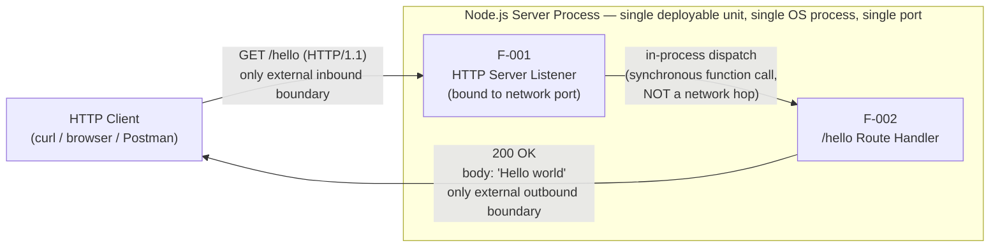

**Interpretation.** The only external boundaries crossed are the inbound HTTP request and the outbound HTTP response — both at the same process, on the same socket. The F-001 → F-002 transition is an in-memory synchronous call. No service registry, broker, sidecar, gateway, mesh proxy, or load balancer appears in this diagram because none exists in the architecture.

#### 6.1.4.2 Diagram 2 — "Scalability Architecture" as Topologically Single-Instance

The system's scalability topology is a single instance: one process, one port, one event loop. The diagram below renders this fact and explicitly negates each scaling construct that the prompt's rubric would normally request.

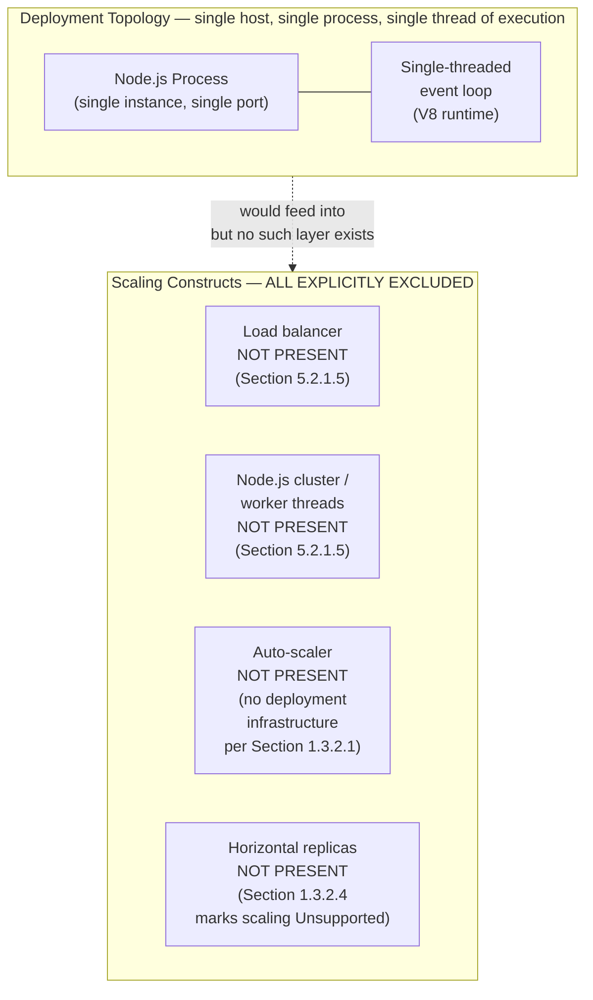

**Interpretation.** The "Topology" subgraph is the entire scalability surface this specification permits. The "ExcludedConstructs" subgraph enumerates the standard scaling primitives explicitly precluded by the cited sections. The dotted edge expresses that, in a typical production architecture, the single instance would be fronted by these constructs; here, they are absent by binding decision.

#### 6.1.4.3 Diagram 3 — "Resilience Pattern Implementation" as the Exclusion Surface

The resilience posture of this system is fully described by the two in-scope error pathways (startup error, unmatched path) plus an explicit enumeration of excluded patterns. The diagram below renders both. The in-scope pathways are reproduced in shape from Section 5.4.7; the exclusion subgraph makes the negative inventory visually authoritative.

```mermaid
flowchart TB
    Start([Process initialization])
    Start --> BindAttempt[Attempt port bind]
    BindAttempt --> BindResult{Bind succeeded?}
    BindResult -->|Yes| Listening[Listening state<br/>F-001-RQ-001 satisfied]
    BindResult -->|No| StderrEmit[Node.js default<br/>stderr emission]
    StderrEmit --> ProcessExit[Process exits abnormally]
    ProcessExit --> ManualRestart["Operator manually<br/>re-invokes 'node server.js'<br/>— the entire recovery surface<br/>per Section 5.4.6"]
    ManualRestart --> Start
    Listening --> ReqArrives([Inbound HTTP request])
    ReqArrives --> PathCheck{Path == '/hello'?}
    PathCheck -->|Yes| HandlerOK[F-002: 200 OK + 'Hello world']
    PathCheck -->|No| FrameworkDefault[Default behavior of<br/>chosen HTTP layer<br/>Option A or Option B]
    HandlerOK --> Done([Response delivered])
    FrameworkDefault --> Done

    subgraph ExcludedPatterns["Resilience Patterns — ALL EXPLICITLY EXCLUDED per Section 5.4.3 / 5.4.6"]
        ExRetry["Retry with backoff<br/>EXCLUDED"]
        ExCircuit["Circuit breaker<br/>EXCLUDED"]
        ExFallback["Fallback / degraded mode<br/>EXCLUDED"]
        ExDLQ["Dead-letter queue<br/>EXCLUDED"]
        ExSelfHeal["Health-check self-healing<br/>EXCLUDED"]
        ExFailover["Failover / hot-standby<br/>EXCLUDED"]
        ExReplication["Multi-region replication<br/>EXCLUDED"]
    end
```

**Interpretation.** The non-excluded portion of the diagram contains exactly two pathways: (a) a startup-error pathway terminating in operator-initiated manual restart, and (b) a request-time pathway terminating in either the F-002 success response or the chosen HTTP layer's default for unmatched paths. Every other resilience construct named in the prompt's rubric appears in the "ExcludedPatterns" subgraph, which is anchored verbatim in Sections 5.4.3 and 5.4.6.

---

### 6.1.5 Conditions Under Which This Section Would Become Applicable

The Not Applicable determination is conditional on the current specification scope. For traceability, the following table records the specific scope changes that would re-introduce Core Services Architecture concerns. None of these changes are committed deliverables of this specification; per Section 2.6.4 they are non-binding future-phase considerations only.

| Hypothetical Scope Change | Section That Would Need Revision |
|---|---|
| Introduction of a second deployable process (e.g., a separate auth service) | Section 5.1.1.1 (style); ADR-003 (Section 5.3.7); Constraint C-003 |
| Introduction of horizontal scaling, clustering, or multi-instance deployment | Section 1.3.2.4; Section 5.2.1.5; Constraint C-005 |
| Introduction of any out-of-process integration (database, queue, third-party API) | Section 1.3.2.3; Section 5.1.4 |
| Introduction of any resilience pattern (retry, circuit breaker, fallback) | Section 1.3.2.1; Section 5.4.3; Constraint C-006 |
| Introduction of failover, replication, or disaster recovery procedures | Section 5.4.6; Constraint C-006 |

Until one or more of the cited sections is formally revised through a scope-change process, **Core Services Architecture remains Not Applicable**, and the diagrams and tables in this section constitute the authoritative documentation of that determination.

---

### 6.1.6 References

#### 6.1.6.1 Technical Specification Sections Cited

- **Section 1.1 EXECUTIVE SUMMARY** — Establishes the single-capability, tutorial positioning of the project.
- **Section 1.2 SYSTEM OVERVIEW** — Documents the single-process architecture and the four success factors (1.2.3.2).
- **Section 1.3 SCOPE** — Provides the exhaustive Out-of-Scope inventory (1.3.2.1) and the Unsupported use cases (1.3.2.4) including "Production hosting at scale" and "Handling concurrent load beyond local-development volumes."
- **Section 2.6 ASSUMPTIONS AND CONSTRAINTS** — Source of binding constraints C-003 (single Node.js process), C-005 (no KPIs), and C-006 (no reintroduction of excluded items).
- **Section 5.1 HIGH-LEVEL ARCHITECTURE** — Principal source for the "single-process, single-endpoint, request/response HTTP server" determination (5.1.1.1); enumerates the two logical components (5.1.2); enumerates the three integration points (5.1.1.3); confirms no data stores or caches (5.1.3.4); confirms the single inbound integration surface (5.1.4).
- **Section 5.2 COMPONENT DETAILS** — Source of the component interaction diagram (5.2.3) reused in Diagram 1; explicit "Scaling is out of scope" determination for F-001 (5.2.1.5) and F-002 (5.2.2.5).
- **Section 5.3 TECHNICAL DECISIONS** — Source of ADR-003 (5.3.1) rejecting microservices, service mesh, serverless, and clustered alternatives; source of the communication-pattern decision table (5.3.2) marking asynchronous messaging and streaming as "Not used"; consolidated ADR table (5.3.7).
- **Section 5.4 CROSS-CUTTING CONCERNS** — Source of the exclusion inventory for resilience patterns (5.4.3); source of the disaster-recovery exclusions (5.4.6); source of the performance/SLA exclusions (5.4.5); resilience pattern diagram referenced in Diagram 3 (5.4.7).

#### 6.1.6.2 Repository Artifacts Examined

- `README.md` — The only file present in the repository. Contains a single line (`# BF-ADDFEATURE-ROLLBACK-GITHUB`); confirms the greenfield state documented in Section 1.2.1.2 and corroborates that no service-architecture artifacts (no `package.json`, no `src/`, no infrastructure manifests, no deployment configuration) exist in the repository.
- `/` (repository root) — Contains only `README.md`; no subdirectories, no build artifacts, no CI/CD configuration, no containerization assets. The empty repository state is consistent with — and reinforces — the single-process determination for this section.

## 6.2 Database Design

### 6.2.1 Applicability Determination

**Database Design is not applicable to this system.**

The repository under specification — a Node.js tutorial project whose sole user-facing capability is to serve `GET /hello` with the literal response body `Hello world` — is realized as a single-process, single-endpoint, request/response HTTP server with zero data domain, zero persistence layers, and zero data stores of any kind. Per Section 1.3.1.2, the in-scope Data Domains are *"None — the endpoint returns a static literal string and processes no input data,"* and per Section 1.3.2.1, "Database integration, persistence layer, caching" is explicitly excluded with the rationale *"The response is a fixed literal string."*

This determination is not an omission. It is a deliberate, binding architectural decision recorded in **ADR-005** (Section 5.3.7: *"None — no databases, caches, or files"*) and enforced by Constraints **C-003**, **C-005**, and **C-006** (Section 2.6.2). Any subsequent introduction of database concerns would violate the specification's *Minimal Surface Area* success factor (Section 1.2.3.2) and the explicit exclusions enumerated in Section 1.3.2.1.

#### 6.2.1.1 Summary of the Determination

| Database Dimension | Status | Authoritative Anchor |
|---|---|---|
| Domain data exists to be modeled | No — Data Domains: "None" | Section 1.3.1.2 |
| Primary database in scope | None — first-class architectural decision | Section 3.6.2; ADR-005 (Section 5.3.7) |
| Secondary / replica database in scope | None | Section 3.6.2; Section 5.4.6 |
| Caching layer in scope | Excluded — no upstream data to cache | Section 3.6.4; Section 5.3.4 |
| File-based persistence in scope | Not applicable — no data domain | Section 3.6.5; Section 5.1.3.4 |
| Default Stack item (MongoDB) | Excluded per Section 1.3.2.1 | Section 3.6.2; ADR-010 (Section 5.3.7) |

#### 6.2.1.2 Scope of This Section

This section serves three purposes only:

1. To formally record the "Not Applicable" determination for Database Design concerns, mirroring the precedent established by Section 6.1 for Core Services Architecture.
2. To document the architectural rationale — drawn entirely from anchored Technical Specification sources — that produces this determination.
3. To map each prompt sub-topic (Schema Design, Data Management, Compliance Considerations, Performance Optimization) to its specific exclusion source, so future readers can verify the determination's grounding without re-deriving it.

No schemas, ER diagrams, entity catalogs, index strategies, partitioning rules, replication topologies, migration scripts, caching policies, query plans, connection pool configurations, or retention rules are introduced here, because Constraint C-006 prohibits the reintroduction of any item listed in Section 1.3.2.1 — and that exclusion inventory explicitly names "Database integration, persistence layer, caching" as a category that cannot be re-introduced as a requirement.

---

### 6.2.2 Architectural Rationale for Non-Applicability

#### 6.2.2.1 Statelessness by Design

The defining architectural principle that produces this determination is captured in Section 5.1.1.2 as a first-class principle: *"Statelessness by design. No data is read, written, or persisted at any step in the flow. The request/response cycle is in-memory and ephemeral, with parsed request data living only on the call stack for the duration of the handler invocation and discarded when the response stream terminates."*

Section 5.1.3.4 reinforces this with an explicit negative inventory of data stores, confirming that *"the entire request/response cycle is in-memory and ephemeral; the Node.js call stack is the only 'data store' that participates in the flow, and it is reclaimed at handler exit."* Because no data domain exists and no data is ever held beyond the lifetime of a function frame, the entire conceptual surface that Database Design exists to address — schemas, entities, persistence, durability, consistency, replication, recovery — has no referent.

#### 6.2.2.2 ADR-005 — No Data Persistence

The "no data persistence" determination is one of ten consolidated Architecture Decision Records published in Section 5.3.7. Its row is reproduced verbatim:

| ADR | Decision | Anchored In |
|---|---|---|
| **ADR-005: Data Persistence** | **None — no databases, caches, or files** | **Section 3.6; A-002** |

The anchoring assumption (A-002, Section 2.6.1) states that *"the response is plain-text and equals the literal string `Hello world`"* — i.e., the response is a compile-time constant. Because the response value is determined at authoring time and depends on no environmental, user-supplied, or historical data, no read path exists; because no write path is requested, no write path exists.

Section 5.3.3 formalizes this as the **Data Storage Decision** with explicit per-engine exclusions:

| Storage Decision | Status | Rationale |
|---|---|---|
| Relational database | Excluded | No domain data exists (Section 3.6.2) |
| NoSQL document store | Excluded | No domain data exists; MongoDB-from-default-stack replaced |
| Object storage | Excluded | No binary assets to store (Section 3.6.5) |
| File-based persistence | Not applicable | No data domain (Section 3.6.5) |

Section 5.3.4 formalizes the parallel **Caching Strategy Decision**, marking every caching tier — in-memory cache, application-level memoization, HTTP/CDN cache — as either Excluded or Not Applicable.

#### 6.2.2.3 Default Technology Stack Deviation: MongoDB Excluded

The Default Technology Stack referenced by the project brief included MongoDB. ADR-010 (Section 5.3.7) records that the entire database tier of the Default Stack was removed:

| Default Stack Item | Disposition | Authoritative Basis |
|---|---|---|
| MongoDB (Database) | **Excluded** | Section 1.3.2.1 — "Database integration, persistence layer, caching" |

Section 3.6.2 reinforces this by tagging MongoDB explicitly as *"Excluded per Section 1.3.2.1"* in the Primary and Secondary Databases inventory. There is no negotiated substitution (no alternative document store, key-value store, or relational engine is selected); the entire database tier of the Default Stack is removed without replacement.

#### 6.2.2.4 Binding Constraints That Preclude Database Introduction

Three constraints from Section 2.6.2 collectively forbid any reintroduction of database concerns at the requirements level:

| Constraint | Statement | Effect on Database Design |
|---|---|---|
| C-003 | The system is realized as a single Node.js process serving HTTP traffic locally | Single-process model precludes out-of-process database collaborators (database servers are by definition out-of-process) |
| C-005 | No performance, throughput, or availability KPIs may be introduced | Removes any basis for performance-driven indexing, partitioning, sharding, or replication design |
| C-006 | No items listed in Section 1.3.2.1 may be reintroduced as requirements | Explicitly forbids reintroducing database integration, persistence layer, and caching |

These constraints make the determination binding rather than provisional: even if a downstream implementer were tempted to add a database "for completeness," doing so would constitute a scope violation against C-006 and would require formal revision of Section 1.3.2.1.

#### 6.2.2.5 Confirming Evidence from the Component Specifications

Both in-scope feature specifications carry explicit zero-persistence determinations:

| Feature | Data Persistence Determination | Anchor |
|---|---|---|
| F-001 HTTP Server Listener | Reads no domain data and persists no state; holds only ephemeral connection state in memory | Section 5.2.1.4 |
| F-002 `/hello` Route Handler | Response is a fixed literal; no data is read, written, or persisted at any point | Section 5.2.2.4 |

Section 4.5.3 confirms the same determination at the workflow level, marking Data Persistence Points as **None**, Caching Requirements as **Not applicable**, and Transaction Boundaries as **Not applicable** — *"no database or transactional resource is integrated; no transactions exist to bound."*

---

### 6.2.3 Per-Topic Applicability Analysis

The four sub-rubrics requested by the section prompt — Schema Design, Data Management, Compliance Considerations, and Performance Optimization — are addressed below in the structured form mandated by the prompt. Each row maps a sub-topic to its applicability status and the authoritative section that anchors the determination.

#### 6.2.3.1 Schema Design

| Prompt Sub-Topic | Status | Anchoring Section |
|---|---|---|
| Entity relationships | Not applicable — no domain entities exist | Section 1.3.1.2; Section 5.3.3 |
| Data models and structures | Not applicable — no data domain | Section 1.3.1.2; Section 3.6.3 |
| Indexing strategy | Not applicable — no data to index | Section 3.6; Section 5.3.3 |
| Partitioning approach | Not applicable — no data to partition | Section 3.6; Section 5.3.3 |
| Replication configuration | Excluded — "Multi-region replication" explicitly Excluded | Section 5.4.6 |
| Backup architecture | Not applicable — "no data to back up" | Section 5.4.6 |

**Anchoring quotation (Section 1.3.1.2).** Data Domains: *"None — the endpoint returns a static literal string and processes no input data."* Because no domain entities are defined, no entity relationships exist; consequently, no ER model can be authored, no normalization decisions can be made, and no foreign-key, uniqueness, or check constraint can be documented.

**Index inventory.** The Database Design prompt requires that "all indexes and constraints" be documented. Per the determinations above, **the authoritative index inventory and the authoritative constraint inventory are both empty**, as shown explicitly:

| Object Catalog | Count | Anchored In |
|---|---|---|
| Schemas / namespaces | 0 | Section 3.6.2 |
| Tables / collections | 0 | Section 3.6.2 |
| Columns / fields | 0 | Section 3.6.3 |
| Primary keys | 0 | Section 3.6.3 |
| Foreign keys | 0 | Section 3.6.3 |
| Unique constraints | 0 | Section 3.6.3 |
| Check constraints | 0 | Section 3.6.3 |
| Indexes (B-tree, hash, GIN, GIST, full-text) | 0 | Section 3.6.3 |
| Materialized views | 0 | Section 3.6.3 |
| Triggers / stored procedures | 0 | Section 3.6.3 |

#### 6.2.3.2 Data Management

| Prompt Sub-Topic | Status | Anchoring Section |
|---|---|---|
| Migration procedures | Not applicable — no schema exists to migrate | Section 3.6.3; Section 5.3.3 |
| Versioning strategy | Not applicable — no schema versioning needed | Section 3.6.3 |
| Archival policies | Not applicable — no data to archive | Section 3.6.3 |
| Data storage and retrieval mechanisms | Not applicable — no storage layer | Section 3.6.3; Section 5.1.3.4 |
| Caching policies | Excluded — in-memory cache, HTTP cache, memoization all not applicable | Section 3.6.4; Section 5.3.4 |

**Anchoring quotation (Section 3.6.3).** *"The system performs no persistence operations of any kind ... No write-ahead logs, no journals, no append-only files, no checkpointing — the entire request/response cycle is in-memory and ephemeral."*

**Caching specifically.** Section 5.3.4 establishes the determination that *"no caching layer is used. Application-level memoization would also add no value because the response is already a static literal. HTTP caching at a reverse proxy or CDN is excluded because no deployment infrastructure is in scope."* Section 3.6.4 itemizes the three caching tiers:

| Caching Layer | Status | Anchored In |
|---|---|---|
| In-memory cache (Redis, Memcached) | Excluded — no upstream data source exists to cache | Section 3.6.4; Section 5.3.4 |
| HTTP caching (CDN, reverse proxy) | Excluded — no deployment infrastructure in scope | Section 3.6.4; Section 5.3.4 |
| Application-level memoization | Not applicable — response is already a static literal | Section 3.6.4; Section 5.3.4 |

#### 6.2.3.3 Compliance Considerations

| Prompt Sub-Topic | Status | Anchoring Section |
|---|---|---|
| Data retention rules | Not applicable — no data is retained | Section 5.4.6 |
| Backup and fault tolerance policies | Not applicable / Excluded | Section 5.4.6 |
| Privacy controls | Not applicable — no PII or user data processed | Section 1.3.2.1; Section 5.4.4 |
| Audit mechanisms | Not applicable — no observability in scope | Section 5.4.1; Section 5.4.2 |
| Access controls | Not applicable — no authentication/authorization in scope | Section 5.4.4 |

**Anchoring quotations.**

- **No PII or input data.** Section 5.4.4 confirms *"Input validation: Not applicable — handler consumes no input"* and *"Injection vectors: None by design — handler accepts no input."* Because the handler never receives, processes, or stores user-supplied data, no privacy classification, lawful-basis analysis, or PII handling protocol applies.
- **No audit log.** Section 5.4.2 confirms *"No structured logging libraries are introduced"* and Section 5.4.1 confirms *"No monitoring or observability layer is in scope."* No audit log, no access log, no change-data-capture stream, and no compliance reporting pipeline can therefore be documented.
- **No access control.** Section 5.4.4 confirms *"Authentication (any mechanism): Excluded"* and *"Authorization (any mechanism): Excluded."* Because there is neither an authenticated principal nor a protected resource, database-level access control (grants, roles, row-level security, column masking) has no referent.

**Critical reminder.** Section 5.3.5 carries a binding admonition that applies here as well: *"The technology stack documented here is appropriate for a local tutorial only and MUST NOT be deployed to production environments without first addressing the excluded security concerns through a separate scoping effort."* If the system were to be re-scoped to handle real data, the compliance posture described in this section would require a complete re-evaluation through the formal scope-change process referenced in Section 2.6.4.

#### 6.2.3.4 Performance Optimization

| Prompt Sub-Topic | Status | Anchoring Section |
|---|---|---|
| Query optimization patterns | Not applicable — no queries exist | Section 3.6.3 |
| Caching strategy | Excluded — explicitly noted in Section 5.3.4 | Section 3.6.4; Section 5.3.4 |
| Connection pooling | Not applicable — no database connections to pool | Section 3.6.2 |
| Read/write splitting | Not applicable — no primary/replica topology exists | Section 3.6.2; Section 5.4.6 |
| Batch processing approach | Not applicable — no batch data processing in scope | Section 5.1.1.2 |

**KPI grounding.** Section 5.4.5 documents that request latency (p50/p95/p99), throughput, concurrent connections, uptime, MTTR, and MTBF are all *"Not specified."* Because no KPIs exist, no performance-engineering driver exists for indexing, partitioning, materialized views, denormalization, caching, read-replica fan-out, or batch processing. Constraint C-005 forbids introducing any such KPI without a formal scope change.

---

### 6.2.4 Required Diagrams

The section prompt requests three Mermaid diagrams: database schema diagrams, data flow diagrams, and replication architecture. Because no database, no data flow involving persistence, and no replication topology exist in this system, the diagrams below depict the **architectural facts that produce the Not Applicable determination**, following the precedent set by Section 6.1.4. Each diagram is annotated to make the absent constructs explicit, so the diagrams are themselves authoritative artifacts of the determination.

#### 6.2.4.1 Diagram 1 — Database Schema as the Empty Schema

The conventional Database Schema diagram for this system is empty: there are no tables, no collections, no entities, no relationships, and no indexes. The diagram below renders this state explicitly, with the only "data structure" that participates in request handling — the transient JavaScript call stack — shown for completeness. The call stack is reclaimed at handler exit per Section 5.1.3.4 and is not a persistence surface.

```mermaid
flowchart TB
    subgraph PersistentSchema["Persistent Schema — EMPTY by binding decision (ADR-005)"]
        EmptyMarker["No tables · No collections<br/>No entities · No columns<br/>No primary keys · No foreign keys<br/>No indexes · No constraints<br/>No views · No triggers"]
    end
    subgraph EphemeralRuntime["Ephemeral Runtime Memory — NOT a persistence surface"]
        CallStack["Node.js Call Stack<br/>(per-request frame)<br/>holds parsed request<br/>only during handler invocation"]
        FixedLiteral["Response Body Literal<br/>'Hello world'<br/>compile-time constant<br/>(Assumption A-002)"]
        CallStack -.->|"reclaimed at<br/>handler exit"| GC["Garbage collected /<br/>stack frame popped"]
    end
    subgraph ExcludedEngines["Database Engines — ALL EXCLUDED per Section 3.6.2 and ADR-005"]
        NoMongo["MongoDB<br/>EXCLUDED<br/>(Default Stack item removed)"]
        NoPostgres["PostgreSQL / MySQL / SQLite<br/>EXCLUDED"]
        NoDynamo["DynamoDB / Cassandra<br/>EXCLUDED"]
        NoRedis["Redis / Memcached<br/>EXCLUDED"]
        NoS3["S3 / GCS / Azure Blob<br/>EXCLUDED"]
    end
    PersistentSchema -.->|"would be<br/>materialized in"| ExcludedEngines
```

**Interpretation.** The `PersistentSchema` subgraph is the entire authoritative schema inventory for this system — empty by binding decision. The `EphemeralRuntime` subgraph contains the only memory artifacts that exist during request handling: a transient call-stack frame and the fixed-literal response body, neither of which is a database object. The `ExcludedEngines` subgraph enumerates the database engines explicitly precluded by Section 3.6.2 and ADR-005, with MongoDB called out as the removed Default Stack item.

#### 6.2.4.2 Diagram 2 — Data Flow Without Data Stores

The data flow for this system contains exactly one runtime decision point (D-001 in Section 5.1.3.1) and zero persistence touchpoints. The diagram below renders the request/response cycle with explicit annotations naming every absent data-flow construct.

```mermaid
flowchart LR
    Client(["HTTP Client<br/>(curl / browser / Postman)"])
    subgraph NodeProcess["Single Node.js Process — entire data-flow surface, no out-of-process collaborators"]
        F001["F-001<br/>HTTP Server Listener<br/>parses request line"]
        D001{"D-001<br/>path == '/hello'?"}
        F002["F-002<br/>/hello Route Handler<br/>writes 'Hello world' literal"]
        Default["Default behavior<br/>of chosen HTTP layer<br/>(no custom not-found handler)"]
        F001 --> D001
        D001 -->|"Yes (match)"| F002
        D001 -->|"No (non-match)"| Default
    end
    Client -->|"GET /hello (HTTP/1.1)"| F001
    F002 -->|"200 OK<br/>body: 'Hello world'<br/>connection closed/kept-alive<br/>per framework default"| Client
    Default -->|"empty response<br/>or framework 404"| Client

    subgraph AbsentFlows["Persistence and Caching Touchpoints — ALL ABSENT per Section 5.1.3.4"]
        NoRead["No database READ<br/>(no query, no fetch)"]
        NoWrite["No database WRITE<br/>(no insert, no update, no delete)"]
        NoCacheHit["No cache lookup<br/>(no Redis GET, no memo)"]
        NoCacheStore["No cache write<br/>(no Redis SET, no TTL set)"]
        NoFile["No filesystem I/O<br/>(no fs.readFile, no fs.writeFile)"]
        NoLog["No log persistence<br/>(no append-only file,<br/>no log aggregator emit)"]
    end
    NodeProcess -.->|"none of the<br/>following occur"| AbsentFlows
```

**Interpretation.** The data flow contains zero arrows crossing the process boundary on a persistence vector. Every node in the `AbsentFlows` subgraph names a class of persistence/caching interaction that a conventional Database Design diagram would render, and that is anchored by Section 5.1.3.4 and Section 4.5.3 as **not present**. The complete data-flow surface is the in-memory request-parsing, decision, write-literal, and connection-termination sequence inside the single Node.js process.

#### 6.2.4.3 Diagram 3 — Replication Architecture as Topologically Single-Instance

The replication architecture for this system is a single instance: one Node.js process, one port, one event loop, zero replicas, zero failover targets, zero data tier. The diagram below renders this fact and explicitly negates every replication construct that the prompt's rubric would normally request, anchored in Section 5.4.6.

```mermaid
flowchart TB
    subgraph SingleInstance["Authoritative Topology — one process, one host, no data tier"]
        Process["Node.js Process<br/>(single instance, single port,<br/>single-threaded event loop)"]
        NoDataTier["Data Tier<br/>NOT PRESENT<br/>(no primary DB, no replica,<br/>no cache cluster)"]
        Process --- NoDataTier
    end
    subgraph ExcludedReplication["Replication Constructs — ALL EXCLUDED per Section 5.4.6 and Section 3.6.2"]
        NoPrimary["Primary database<br/>NOT PRESENT<br/>(Section 3.6.2)"]
        NoReplica["Secondary / read-replica<br/>NOT PRESENT<br/>(Section 3.6.2)"]
        NoLeaderFollower["Leader/follower<br/>or primary/standby topology<br/>NOT PRESENT"]
        NoMultiRegion["Multi-region replication<br/>EXCLUDED<br/>(Section 5.4.6)"]
        NoFailover["Failover / hot-standby<br/>EXCLUDED<br/>(Section 5.4.6)"]
        NoQuorum["Quorum / consensus<br/>(Raft, Paxos)<br/>NOT PRESENT"]
        NoCDC["Change Data Capture /<br/>logical replication slot<br/>NOT PRESENT"]
        NoBackup["Backup strategy<br/>NOT APPLICABLE<br/>(no data to back up,<br/>Section 5.4.6)"]
    end
    subgraph ExcludedDR["Disaster Recovery Targets — NOT SPECIFIED / NOT APPLICABLE per Section 5.4.6"]
        NoRPO["RPO (Recovery Point Objective)<br/>NOT APPLICABLE<br/>— no data to recover"]
        NoRTO["RTO (Recovery Time Objective)<br/>NOT SPECIFIED"]
        ManualRestart["Sole recovery surface:<br/>operator-initiated<br/>'node server.js' re-invocation"]
    end
    SingleInstance -.->|"would normally<br/>connect to"| ExcludedReplication
    SingleInstance -.->|"would normally<br/>be governed by"| ExcludedDR
```

**Interpretation.** The `SingleInstance` subgraph is the entire authoritative topology this specification permits. The `ExcludedReplication` subgraph enumerates the standard replication primitives explicitly precluded by Section 5.4.6 (multi-region replication and failover/hot-standby are marked **Excluded**) and Section 3.6.2 (primary and secondary databases are marked **None**). The `ExcludedDR` subgraph records that RPO is **Not applicable** because there is no data to recover, RTO is **Not specified**, and the sole recovery surface documented in Section 5.4.6 is operator-initiated manual restart.

---

### 6.2.5 Conditions Under Which This Section Would Become Applicable

The Not Applicable determination is conditional on the current specification scope. For traceability, the following table records the specific scope changes that would re-introduce Database Design concerns. None of these changes are committed deliverables of this specification; per Section 2.6.4, future learner extensions are explicitly **non-binding** and not deliverables of the present specification.

| Hypothetical Scope Change | Section That Would Need Revision |
|---|---|
| Introduction of any persistent data domain (e.g., a list of greetings, user-supplied names) | Section 1.3.1.2; Section 3.6 |
| Introduction of a database engine of any type (relational, document, key-value, columnar, graph) | Section 1.3.2.1; Section 3.6; ADR-005 (Section 5.3.7); Constraint C-006 |
| Introduction of an in-memory cache (Redis, Memcached) or memoization | Section 1.3.2.1; Section 3.6.4; ADR-005; Section 5.3.4 |
| Introduction of HTTP / CDN caching | Section 1.3.2.1; Section 3.6.4; Section 5.3.4 |
| Introduction of file-based persistence (writes to local disk, append-only logs) | Section 3.6.5; Section 5.1.3.4 |
| Introduction of replication, backup, or disaster-recovery procedures | Section 5.4.6; Constraint C-006 |
| Introduction of audit logging, access controls, or compliance retention rules | Section 5.4.2; Section 5.4.4; Section 1.3.2.1 |

Until one or more of the cited sections is formally revised through a scope-change process, **Database Design remains Not Applicable**, and the diagrams and tables in this section constitute the authoritative documentation of that determination.

---

### 6.2.6 References

#### 6.2.6.1 Technical Specification Sections Cited

- **Section 1.1 EXECUTIVE SUMMARY** — Establishes the single-capability, tutorial positioning of the project with a fixed-literal response.
- **Section 1.2 SYSTEM OVERVIEW** — Documents the single-process architecture and the four success factors (1.2.3.2) that motivate the absence of a database tier.
- **Section 1.3 SCOPE** — Provides Data Domains: "None" (1.3.1.2) and the exhaustive Out-of-Scope inventory (1.3.2.1) that explicitly excludes "Database integration, persistence layer, caching"; provides "Production hosting at scale" as Unsupported (1.3.2.4).
- **Section 2.6 ASSUMPTIONS AND CONSTRAINTS** — Source of binding constraints **C-003** (single Node.js process), **C-005** (no KPIs), and **C-006** (no reintroduction of excluded items); source of Assumption **A-002** (response equals literal `Hello world`); records that future learner extensions are non-binding (2.6.4).
- **Section 3.1 Technology Stack Overview** — Documents the disposition of every Default Stack item, including the exclusion of MongoDB.
- **Section 3.6 Databases & Storage** — **Primary anchor for this section.** Already documents the Not Applicable status (3.6.1), the empty Primary/Secondary Database inventory (3.6.2), the absence of persistence strategies (3.6.3), the exclusion of caching solutions (3.6.4), and the exclusion of object/block/file storage (3.6.5).
- **Section 4.5 STATE MANAGEMENT** — Confirms Data Persistence Points: None, Caching Requirements: Not applicable, Transaction Boundaries: Not applicable (4.5.3); restricts the only stateful model to the process lifecycle itself (4.5.1, 4.5.2).
- **Section 5.1 HIGH-LEVEL ARCHITECTURE** — Source of the "single-process, single-endpoint, request/response HTTP server" determination (5.1.1.1); statelessness-by-design principle (5.1.1.2); the data-flow description with one decision point and no persistence touchpoints (5.1.3.1); the negative inventory of data stores and caches (5.1.3.4).
- **Section 5.2 COMPONENT DETAILS** — F-001 Data Persistence Requirements: None (5.2.1.4); F-002 Data Persistence Requirements: None (5.2.2.4).
- **Section 5.3 TECHNICAL DECISIONS** — Source of ADR-005 (no databases, caches, or files), ADR-010 (Default-Stack deviations); Data Storage Decision (5.3.3); Caching Strategy Decision (5.3.4); consolidated ADR table (5.3.7).
- **Section 5.4 CROSS-CUTTING CONCERNS** — Source of the observability exclusions that preclude audit mechanisms (5.4.1, 5.4.2); source of the authentication/authorization exclusions that preclude access controls (5.4.4); source of the SLA/KPI exclusions that preclude performance-driven design (5.4.5); source of the disaster-recovery exclusions including no RPO, no backup strategy, and excluded multi-region replication / failover (5.4.6).
- **Section 6.1 CORE SERVICES ARCHITECTURE** — Structural precedent for this section's "Not Applicable" treatment; provides the pattern of Applicability Determination → Rationale → Per-Topic Analysis → Required Diagrams → Conditions for Future Applicability → References that this section mirrors.

#### 6.2.6.2 Repository Artifacts Examined

- `README.md` — The only file present in the repository. Contains a single line (`# BF-ADDFEATURE-ROLLBACK-GITHUB`); confirms the greenfield, pre-implementation state and corroborates that no database artifacts (no `package.json`, no `src/`, no `models/`, no `migrations/`, no `db/`, no schema files, no ORM configuration, no connection strings, no environment files) exist in the repository.
- `/` (repository root) — Contains only `README.md`; no subdirectories of any kind. The absence of any database-related directory (`migrations/`, `models/`, `schemas/`, `db/`, `data/`) is consistent with — and reinforces — the Not Applicable determination for this section.

## 6.3 Integration Architecture

### 6.3.1 Applicability Determination

**Integration Architecture is not applicable for this system.**

The repository under specification — a Node.js tutorial project whose sole user-facing capability is to serve `GET /hello` with the literal response body `Hello world` — does not interact with any external system, service, broker, gateway, identity provider, datastore, or third-party API. Per Section 1.2.1.3, *"the system is self-contained and does not interact with identity providers, message brokers, databases, third-party APIs, monitoring platforms, or any other external services. The only external interaction surface is the inbound HTTP boundary used by the calling client."* Per Section 3.8.2, *"the complete external integration surface of this technology stack consists of a single inbound HTTP boundary. No outbound integrations are present."*

This determination is not an omission. It is a binding architectural decision anchored in ADR-003, ADR-006, ADR-007, ADR-008, ADR-009, and ADR-010 (Section 5.3.7), and enforced by Constraints C-001, C-003, C-005, and C-006 (Section 2.6.2). The determination is structurally consistent with two prior precedent sections of this Technical Specification that already adopted the "Not Applicable" pattern: **Section 3.5 (Third-Party Services)** and **Section 6.1 (Core Services Architecture)**.

#### 6.3.1.1 Summary of the Determination

| Integration Dimension | Status | Authoritative Anchor |
|---|---|---|
| Outbound API integrations | Not present | Section 1.2.1.3; Section 3.5.2 |
| Message brokers / queues | Not present | Section 1.2.1.3; Section 5.3.2 |
| Third-party service contracts | Not present | Section 3.5.2; Section 5.1.4 |
| API gateway / reverse proxy | Not present | Section 1.3.2.1; ADR-009 |
| Legacy system interfaces | Not applicable (greenfield) | Section 1.2.1.2; Constraint C-001 |
| Identity / auth providers | Excluded | Section 3.5.3; ADR-006 |
| Monitoring / observability backends | Excluded | Section 3.5.4; ADR-007 |
| Cloud platform integrations | Excluded | Section 3.5.5; ADR-010 |

#### 6.3.1.2 Scope of This Section

This section serves four purposes only:

1. To formally record the "Not Applicable" determination for Integration Architecture concerns.
2. To document the architectural rationale — drawn exclusively from anchored Technical Specification sources — that produces this determination.
3. To map each prompt sub-topic (API Design, Message Processing, External Systems) to its specific exclusion source so future readers can verify the determination without re-deriving it.
4. To render the **one** integration touchpoint that does exist — the inbound HTTP surface — with sufficient detail that it is unambiguously specified.

No authentication schemes, authorization frameworks, rate-limiting policies, API versioning strategies, OpenAPI/Swagger documents, message broker topologies, stream processors, batch jobs, third-party connectors, or API gateway configurations are introduced here. Constraint C-006 prohibits the reintroduction of any item listed in Section 1.3.2.1; Constraint C-005 prohibits the introduction of performance, throughput, or availability KPIs that would otherwise underpin rate-limit thresholds or API SLAs.

---

### 6.3.2 Architectural Rationale for Non-Applicability

#### 6.3.2.1 The Single Inbound HTTP Boundary as the Complete Integration Surface

Section 5.1.1.3 enumerates exactly three integration points in this architecture, and only one of them crosses an inter-system boundary in both directions. The table below restates them in the canonical form used throughout the specification.

| Integration Point | Direction | Boundary Type |
|---|---|---|
| Inbound HTTP Boundary | External Client → F-001 | External network (TCP/HTTP) |
| Internal Dispatch | F-001 → F-002 | In-process function invocation |
| Outbound HTTP Response | F-002 → External Client | External network (TCP/HTTP) |

The inbound HTTP request and the outbound HTTP response traverse the same TCP socket on the same bound port. They are not two integrations; they are the request and response halves of a single synchronous exchange. Per Section 5.1.4, the data exchange pattern at this single point is *"synchronous request/response with no callback or polling mechanism"* — there is no asynchronous return channel, no webhook callback, and no long-polling exchange.

#### 6.3.2.2 In-Process Dispatch Is Not Inter-System Integration

Section 5.1.1.2 records a binding architectural principle: *"In-process dispatch only. The transition from listener to handler is realized as a synchronous in-memory function invocation. It is not a network call, queue publish, or remote procedure call."* The F-001 → F-002 transition consequently does not constitute an integration in any architecturally meaningful sense. It involves no serialization, no transport, no protocol negotiation, no contract, no schema, no broker, and no remote endpoint.

Section 5.1.3.2 makes the corollary explicit: *"No asynchronous integration patterns (event publishing, queue-based decoupling, fire-and-forget) are present, and no streaming protocols (WebSockets, gRPC streams, Server-Sent Events) are in use."* The communication-pattern decision table in Section 5.3.2 marks asynchronous messaging and streaming as **"Not used"** — neither pattern has a referent in this architecture.

#### 6.3.2.3 Binding Constraints That Preclude Integration Architecture

Four constraints from Section 2.6.2 collectively forbid the reintroduction of integration architecture concerns at the requirements level.

| Constraint | Statement | Effect on Integration Architecture |
|---|---|---|
| C-001 | Greenfield implementation with no legacy or backward-compatibility constraints | Forbids legacy system interfaces |
| C-003 | The system is realized as a single Node.js process serving HTTP traffic locally | Forbids multi-process / cross-system integration |
| C-005 | No performance, throughput, or availability KPIs may be introduced | Removes the basis for rate limits and API SLAs |
| C-006 | No items listed in Section 1.3.2.1 may be reintroduced as requirements | Forbids reintroducing auth, versioning, rate limiting, etc. |

#### 6.3.2.4 ADR Decisions That Reject Integration-Heavy Patterns

The Architecture Decision Records consolidated in Section 5.3.7 collectively eliminate the foundation on which any integration architecture would normally be built.

| ADR | Decision | Implication for Integration Architecture |
|---|---|---|
| ADR-003 | Single-process, single-endpoint monolith | Rejects microservices, service mesh, serverless |
| ADR-006 | No TLS, no authentication, no rate limiting | Removes auth, authz, and rate-limit frameworks |
| ADR-007 | No logging libraries, metrics, or tracing | Removes API observability / telemetry concerns |
| ADR-008 | No quantitative KPIs | Removes SLA negotiation and rate-limit thresholds |
| ADR-009 | Local Node.js process only | Removes API gateway, load balancer, ingress |
| ADR-010 | Default-stack items excluded | Forbids cloud-native integration patterns |

---

### 6.3.3 Per-Topic Applicability Analysis

The three sub-rubrics requested by the section prompt — API Design, Message Processing, and External Systems — are addressed below. Each row maps a prompt sub-topic to its applicability status and the authoritative source within this Technical Specification.

#### 6.3.3.1 API Design Sub-Topics

| Prompt Sub-Topic | Status | Anchoring Section |
|---|---|---|
| Protocol specifications | HTTP/1.1 inbound only; no API protocol design surface | Section 5.1.3.2; Section 5.1.4 |
| Authentication methods | **Excluded** — no authentication is in scope | Section 1.3.2.1; Section 3.5.3; ADR-006 |
| Authorization framework | **Excluded** — no protected resources exist | Section 1.3.2.1; Section 5.3.5 |
| Rate limiting strategy | **Excluded** — explicitly out of scope | Section 1.3.2.1; Section 3.8.1; ADR-006 |
| Versioning approach | **Excluded** — no `/v1/hello` or semver scheme | Section 1.3.2.1; Constraint C-006 |
| Documentation standards | **Excluded** — no OpenAPI/Swagger specification | Section 1.3.2.1; Constraint C-006 |

**Anchoring quotation for API Design.** Section 1.3.2.1 explicitly excludes *"Versioning (e.g., `/v1/hello`), OpenAPI/Swagger documentation"*, *"Authentication, authorization, API keys, tokens"*, and *"Rate limiting, throttling, circuit breakers"*. Section 5.3.5 reaffirms that no security middleware (`helmet`, `cors`, `jsonwebtoken`, `express-rate-limit`, etc.) is added to the dependency footprint, and Section 3.8.1 confirms that the absence of such libraries is intentional and compliant with C-006.

#### 6.3.3.2 Message Processing Sub-Topics

| Prompt Sub-Topic | Status | Anchoring Section |
|---|---|---|
| Event processing patterns | None — system is purely request/response | Section 4.3.1; Section 5.1.3.2 |
| Message queue architecture | **Excluded** — no message broker in scope | Section 1.2.1.3; Section 1.3.2.3; Section 5.3.2 |
| Stream processing design | **Not used** — WebSockets, SSE, gRPC all rejected | Section 5.1.3.2; Section 5.3.2 |
| Batch processing flows | None — no batch domain in scope | Section 4.3.1; Section 4.3.3 |
| Messaging error-handling strategy | Not applicable — no messaging exists | Section 4.3.3; Section 5.4.3 |

**Anchoring quotation for Message Processing.** Section 5.3.2 records that asynchronous messaging is *"Not used"* because *"no message broker in scope (Section 1.2.1.3); no events to publish or consume,"* and streaming is *"Not used"* because *"single fixed response body; streaming would add complexity without benefit."* Section 4.3.1 confirms that *"there are no event processing flows because the system is purely request/response. There are no batch processing sequences because no batch domain is in scope."*

#### 6.3.3.3 External Systems Sub-Topics

| Prompt Sub-Topic | Status | Anchoring Section |
|---|---|---|
| Third-party integration patterns | **None in scope** | Section 1.2.1.3; Section 3.5.2 |
| Legacy system interfaces | Not applicable (greenfield project) | Section 1.2.1.2; Constraint C-001 |
| API gateway configuration | **Excluded** — no deployment infrastructure | Section 1.3.2.1; Section 3.5.5; ADR-009 |
| External service contracts | **None** — no external services integrated | Section 1.2.1.3; Section 5.1.4 |

**Anchoring quotation for External Systems.** Section 3.5.2 explicitly marks "Outbound REST/GraphQL API calls," "Webhook integrations," "Message broker integration (Kafka, RabbitMQ, SQS)," and "Payment, analytics, or SaaS APIs" as **"None in scope."** Section 3.5.5 marks all cloud platforms (AWS, GCP, Azure), all serverless platforms (Lambda, Cloud Functions), and all object-storage services (S3, GCS) as **"Excluded."** No external service contracts exist to document because no external services exist to contract with.

---

### 6.3.4 The Single Inbound HTTP Surface

While the section as a whole is Not Applicable, the **one** integration touchpoint that does exist deserves a complete, self-contained specification so that no implementer is left to infer it. The following subsection documents the inbound HTTP surface in full.

#### 6.3.4.1 Endpoint Specification

The single API endpoint exposed by this system is fully specified by the table below. All values are anchored in either the Feature Catalog (Section 2.1) or the Assumptions registry (Section 2.6.1).

| Attribute | Value | Source |
|---|---|---|
| HTTP method | GET | Assumption A-001 (Section 2.6.1) |
| Path | `/hello` | Sections 1.1.1, 2.1.2 (F-002) |
| Status code | 200 OK | Assumption A-003; F-002-RQ-003 |
| Response body | `Hello world` (literal, byte-equal) | Assumption A-002; F-002-RQ-002 |
| Request body | None — handler consumes no input | Section 5.1.3.3 |
| Query parameters | None | Section 5.1.3.3 |
| Request headers consumed | None | Section 5.1.3.3 |
| Authentication | None | Section 5.3.5; ADR-006 |
| Authorization | None | Section 5.3.5 |
| Rate limiting | None | Section 5.3.5; ADR-006 |
| Versioning | None — path is `/hello`, not `/v1/hello` | Section 1.3.2.1 |
| Protocol | HTTP/1.1 over TCP | Section 5.1.1.3; Section 5.1.4 |
| Transport security (TLS) | Not in scope | Section 1.3.2.1; ADR-006 |

The only runtime decision the system makes about the inbound surface is the single path-comparison documented in Section 5.1.3.1 (decision D-001): if the inbound path equals the literal string `/hello`, F-001 dispatches to F-002 in-process; otherwise the request is handled by the default behavior of the chosen HTTP layer per Section 5.1.3.1.

#### 6.3.4.2 External Dependencies (Negative Inventory)

The section prompt requires that "all external dependencies" be documented. The complete external-dependency inventory of this system is the table below, drawn directly from Section 4.3.3 ("Excluded Integration Workflows") and reformulated for the integration-architecture perspective.

| External Dependency Category | Presence | Reason for Absence |
|---|---|---|
| Relational / NoSQL databases | **None** | Section 1.3.2.1; Section 5.3.3 |
| In-memory caches (Redis, Memcached) | **None** | Section 1.3.2.1; Section 5.3.4 |
| Message brokers (Kafka, RabbitMQ, SQS) | **None** | Section 1.2.1.3; Section 5.3.2 |
| Third-party REST / GraphQL APIs | **None** | Section 1.2.1.3; Section 3.5.2 |
| Identity / auth providers (Auth0, Okta, Cognito) | **None** | Section 3.5.3; ADR-006 |
| Monitoring backends (Datadog, New Relic, Sentry) | **None** | Section 3.5.4; ADR-007 |
| Cloud platforms (AWS, GCP, Azure) | **None** | Section 3.5.5; ADR-010 |
| Object storage (S3, GCS, Azure Blob) | **None** | Section 3.5.5; Section 5.1.3.4 |
| Webhook senders / receivers | **None** | Section 1.3.2.3; Section 2.3.2 |
| Health-check / liveness probes | **None** | Section 1.3.2.1; Section 4.3.3 |
| CDN / reverse-proxy cache | **None** | Section 1.3.2.1; Section 5.3.4 |
| API gateway / load balancer | **None** | Section 1.3.2.1; ADR-009 |

The single positive external dependency is the inbound HTTP client itself, formally enumerated in Section 5.1.4 as *"HTTP Client (curl, browser, Postman, Insomnia, or any HTTP-conformant client)."* No other external dependency exists.

---

### 6.3.5 Required Diagrams

The section prompt requires three Mermaid diagrams: an integration flow diagram, an API architecture diagram, and a message flow diagram. Because no inter-system integration, no API surface beyond a single endpoint, and no messaging substrate exist in this architecture, the diagrams below depict the **architectural facts that produce the Not Applicable determination**. Each diagram is annotated to make absent constructs explicit.

#### 6.3.5.1 Integration Flow Diagram — The Canonical Request/Response Sequence

The canonical integration flow for this system is the single inbound `GET /hello` → outbound `200 OK` exchange. The sequence diagram below is reproduced from Section 4.3.2 and is the authoritative depiction of the entire integration surface.

```mermaid
sequenceDiagram
    autonumber
    actor Client as HTTP Client
    participant Listener as HTTP Listener (F-001)
    participant Handler as /hello Handler (F-002)
    Client->>Listener: GET /hello HTTP/1.1
    Note over Listener: Parse request line<br/>(method, path, version)
    Listener->>Listener: Path == '/hello'? (Yes)
    Listener->>Handler: Internal dispatch<br/>(in-process call, NOT a network hop)
    Note over Handler: Per F-002-RQ-002/RQ-003:<br/>set status 200, body 'Hello world'
    Handler-->>Listener: Response object<br/>(status + body buffered)
    Listener-->>Client: HTTP/1.1 200 OK
    Listener-->>Client: Body: Hello world
    Note over Listener: Connection closed or kept alive<br/>per HTTP defaults of chosen framework
```

**Interpretation.** Messages 1, 7, and 8 cross the **external** inbound/outbound HTTP boundary. Messages 4 and 6 are **internal** — they represent in-process function invocations and not network traffic. No additional participants appear in this diagram because no additional integration participants exist in the architecture: no broker, no gateway, no upstream API, no datastore, no identity provider.

#### 6.3.5.2 API Architecture Diagram — Single Endpoint, Single Process

The API architecture of this system is exhausted by one endpoint hosted inside one process. The diagram below renders the architecture and explicitly negates each API-layer construct that the prompt's rubric would normally request.

```mermaid
flowchart LR
    Client["HTTP Client<br/>(curl / browser / Postman)"]
    subgraph NodeProcess["Node.js Server Process — single deployable unit, single OS process, single port"]
        Listener["F-001<br/>HTTP Server Listener<br/>(bound to network port)"]
        Handler["F-002<br/>/hello Route Handler"]
        Listener -->|"in-process dispatch<br/>(synchronous function call)"| Handler
    end
    subgraph ExcludedAPILayers["API Architecture Layers — ALL EXPLICITLY EXCLUDED"]
        NoGateway["API gateway<br/>NOT PRESENT<br/>(ADR-009)"]
        NoLB["Load balancer / ingress<br/>NOT PRESENT<br/>(Section 1.3.2.1)"]
        NoAuth["Auth / authz layer<br/>NOT PRESENT<br/>(ADR-006)"]
        NoRateLimit["Rate limiter / throttler<br/>NOT PRESENT<br/>(Section 1.3.2.1)"]
        NoVersioning["URL versioning (/v1/hello)<br/>NOT PRESENT<br/>(Section 1.3.2.1)"]
        NoOpenAPI["OpenAPI / Swagger doc<br/>NOT PRESENT<br/>(Section 1.3.2.1)"]
    end
    Client -->|"GET /hello (HTTP/1.1)<br/>only external inbound boundary"| Listener
    Handler -->|"200 OK<br/>body: 'Hello world'<br/>only external outbound boundary"| Client
    Client -.->|"would traverse these layers<br/>in a typical production API<br/>— but none of them exist here"| ExcludedAPILayers
```

**Interpretation.** The `NodeProcess` subgraph contains the entire API architecture of this system. The `ExcludedAPILayers` subgraph enumerates the standard API-fronting primitives explicitly precluded by the cited sections and ADRs. The dotted edge expresses that, in a typical production API architecture, the inbound request would traverse these layers; here, they are absent by binding decision.

#### 6.3.5.3 Message Flow Diagram — Synchronous-Only, No Messaging Substrate

The message-flow surface of this system is identical to its integration-flow surface: one synchronous HTTP request, one synchronous HTTP response, one in-process dispatch. There is no asynchronous message channel. The diagram below depicts the in-scope synchronous flow alongside the explicit exclusion of every messaging primitive enumerated in Section 5.3.2 and Section 4.3.3.

```mermaid
flowchart TB
    subgraph SynchronousFlow["In-Scope Message Flow — Synchronous Request/Response Only"]
        Req["Inbound: GET /hello<br/>(HTTP/1.1 over TCP)"]
        Dispatch["In-process dispatch<br/>F-001 → F-002<br/>(synchronous function call)"]
        Resp["Outbound: 200 OK<br/>body: 'Hello world'"]
        Req --> Dispatch --> Resp
    end
    subgraph ExcludedMessaging["Messaging Constructs — ALL EXPLICITLY EXCLUDED"]
        NoBroker["Message broker<br/>(Kafka / RabbitMQ / SQS)<br/>NOT PRESENT<br/>(Section 1.2.1.3)"]
        NoEvents["Event publish / consume<br/>NOT PRESENT<br/>(Section 5.3.2)"]
        NoStream["Streaming<br/>(WebSockets / SSE / gRPC)<br/>NOT PRESENT<br/>(Section 5.3.2)"]
        NoBatch["Batch job orchestration<br/>NOT PRESENT<br/>(Section 4.3.3)"]
        NoWebhook["Webhook event processing<br/>NOT PRESENT<br/>(Section 4.3.3)"]
        NoDLQ["Dead-letter queue<br/>NOT PRESENT<br/>(Section 5.4.3)"]
        NoRetry["Retry / backoff queue<br/>NOT PRESENT<br/>(Section 5.4.3)"]
    end
    SynchronousFlow -.->|"would integrate with<br/>in a messaging architecture<br/>— but none of these exist here"| ExcludedMessaging
```

**Interpretation.** The `SynchronousFlow` subgraph is the entire message-flow surface this specification permits. The `ExcludedMessaging` subgraph enumerates the standard messaging primitives explicitly precluded by Section 1.2.1.3, Section 5.3.2, Section 4.3.3, and Section 5.4.3. The dotted edge expresses that, in a messaging architecture, the synchronous flow might emit or consume events through these primitives; here, no such primitives exist.

---

### 6.3.6 Conditions Under Which This Section Would Become Applicable

The Not Applicable determination is conditional on the current specification scope. For traceability — and following the precedent established by Section 6.1.5 — the table below records the specific scope changes that would re-introduce Integration Architecture concerns. None of these changes are committed deliverables of this specification; per Section 2.6.4 they are non-binding future-phase considerations only.

| Hypothetical Scope Change | Sections That Would Need Revision |
|---|---|
| Introduction of authentication or API keys | Section 1.3.2.1; Section 3.8.1; ADR-006 |
| Introduction of API versioning (e.g., `/v1/hello`) | Section 1.3.2.1; Constraint C-006 |
| Introduction of rate limiting or throttling | Section 1.3.2.1; Section 5.3.5; ADR-006 |
| Introduction of a message broker (Kafka, RabbitMQ, SQS) | Section 1.2.1.3; Section 1.3.2.3; Section 5.3.2 |
| Introduction of any outbound third-party API call | Section 1.2.1.3; Section 3.5.2; Section 5.1.4 |
| Introduction of an API gateway / load balancer | Section 1.3.2.1; ADR-009 |
| Introduction of webhook callbacks (inbound or outbound) | Section 1.3.2.3; Section 2.3.2 |
| Introduction of streaming (WebSockets, SSE, gRPC) | Section 5.1.3.2; Section 5.3.2 |
| Introduction of batch processing flows | Section 4.3.1; Section 4.3.3 |
| Introduction of an OpenAPI / Swagger contract | Section 1.3.2.1; Constraint C-006 |

Until one or more of the cited sections is formally revised through a scope-change process, **Integration Architecture remains Not Applicable**, and the diagrams and tables in this section constitute the authoritative documentation of that determination.

---

### 6.3.7 References

#### 6.3.7.1 Technical Specification Sections Cited

- **Section 1.1 EXECUTIVE SUMMARY** — Establishes tutorial positioning and identifies the HTTP client as the only external stakeholder.
- **Section 1.2 SYSTEM OVERVIEW** — Source of the binding "no enterprise integration landscape" statement (1.2.1.3) and confirmation that the only external interaction surface is the inbound HTTP boundary.
- **Section 1.3 SCOPE** — Source of the exhaustive Out-of-Scope inventory (1.3.2.1) covering authentication, versioning, rate limiting, OpenAPI/Swagger, observability, and deployment infrastructure; and the integration-specific exclusion (1.3.2.3).
- **Section 2.1 FEATURE CATALOG** — Definitions of F-001 (HTTP Server Listener) and F-002 (`/hello` Route Handler) used in the endpoint specification.
- **Section 2.3 FEATURE RELATIONSHIPS** — Documents the three-integration-point surface (2.3.2) and the "no external system integrations" status (2.3.4).
- **Section 2.6 ASSUMPTIONS AND CONSTRAINTS** — Source of Assumptions A-001 through A-003 used in the endpoint specification, and Constraints C-001, C-003, C-005, C-006 that bind this section's determination.
- **Section 3.5 Third-Party Services** — Already marked Not Applicable; provides direct structural precedent for this section. Source of the External APIs, Authentication Services, Monitoring Tools, and Cloud Services exclusion tables.
- **Section 3.8 Security and Integration Considerations** — Section 3.8.1 enumerates the security posture (no TLS, no auth, no rate limiting); Section 3.8.2 defines the integration surface as a single inbound HTTP boundary.
- **Section 4.3 INTEGRATION WORKFLOWS** — Source of the canonical sequence diagram reused in 6.3.5.1, the three-integration-point overview (4.3.1), and the Excluded Integration Workflows table (4.3.3) reformulated in 6.3.4.2.
- **Section 4.6 ERROR HANDLING** — Confirms the absence of messaging error-handling patterns (dead-letter queues, retries, circuit breakers) referenced in 6.3.3.2.
- **Section 5.1 HIGH-LEVEL ARCHITECTURE** — Principal source for the single-process determination (5.1.1.1); the in-process-dispatch principle (5.1.1.2); the three integration points enumeration (5.1.1.3); the absence of asynchronous and streaming patterns (5.1.3.2); the negative inventory of data stores (5.1.3.4); and the single external integration point (5.1.4).
- **Section 5.2 COMPONENT DETAILS** — Component interaction diagram adapted in 6.3.5.2.
- **Section 5.3 TECHNICAL DECISIONS** — Source of ADR-003 (architecture style), ADR-006 (security posture), ADR-007 (observability), ADR-008 (SLAs), ADR-009 (deployment model), ADR-010 (default-stack deviations), consolidated in Section 5.3.7; source of the communication-pattern decision table (5.3.2) marking asynchronous messaging and streaming as "Not used"; source of the security mechanism decision table (5.3.5).
- **Section 5.4 CROSS-CUTTING CONCERNS** — Source of the resilience-pattern exclusions (5.4.3) referenced in the message-flow diagram.
- **Section 6.1 Core Services Architecture** — Already marked Not Applicable; provides the primary structural precedent for this section's organization (6.1.1 through 6.1.6).

#### 6.3.7.2 Repository Artifacts Examined

- `README.md` — The only file present in the repository. Contains a single line (`# BF-ADDFEATURE-ROLLBACK-GITHUB`); confirms the greenfield state documented in Section 1.2.1.2 and corroborates that no integration-architecture artifacts (no `package.json`, no `src/`, no API specification files, no infrastructure manifests, no service-mesh configuration, no message-broker connectors, no third-party SDK references) exist in the repository.
- `/` (repository root, depth: 0) — Contains only `README.md`; no subdirectories, no build artifacts, no CI/CD configuration, no containerization assets, no external-service credential files. The empty repository state is consistent with — and reinforces — the "Not Applicable" determination for this section.

## 6.4 Security Architecture

### 6.4.1 Applicability Determination

**Detailed Security Architecture is not applicable for this system.**

The repository under specification — a Node.js tutorial project whose sole user-facing capability is to serve `GET /hello` with the literal response body `Hello world` — is realized as a single-process, single-endpoint, request/response HTTP server that processes no input, persists no data, and exposes no protected resources. Per **Section 5.4.4**, *"No authentication or authorization framework is used. No identity providers, no API keys, no tokens, no session management, no RBAC/ABAC policies, and no security middleware are present."* Per **Section 5.3.5**, *"No security mechanisms are introduced. Section 1.3.2.1 explicitly excludes TLS/HTTPS, authentication, authorization, API keys, tokens, and rate limiting."*

This determination is not an omission. It is a deliberate, binding architectural decision recorded in **ADR-006** (Section 5.3.7: *"None — no TLS, auth, or rate limiting"*) and enforced by Constraints **C-003**, **C-005**, and **C-006** (Section 2.6.2). The determination mirrors the precedent already set by Sections 6.1 (Core Services Architecture), 6.2 (Database Design), and 6.3 (Integration Architecture), each of which records a structurally equivalent Not Applicable determination anchored in the same exclusion inventory (Section 1.3.2.1) and constraint set (Section 2.6.2). Any subsequent introduction of security architecture concerns would violate the specification's *Minimal Surface Area* success factor (Section 1.2.3.2) and the explicit exclusions enumerated in Section 1.3.2.1.

The section prompt explicitly authorizes this disposition: *"If the system does not require specific security considerations beyond standard practices, clearly state 'Detailed Security Architecture is not applicable for this system' and explain which standard security practices will be followed instead."* The standard security practices the system relies on by design — minimizing the attack surface through zero input consumption, statelessness, and local-only execution — are catalogued in Section 6.4.3.4 below.

#### 6.4.1.1 Summary of the Determination

| Security Dimension | Status | Authoritative Anchor |
|---|---|---|
| Authentication framework | Not applicable — no principals exist | Section 5.4.4; ADR-006 (Section 5.3.7) |
| Authorization system | Not applicable — no protected resources | Section 5.4.4; Section 5.3.5 |
| Data protection (encryption, key management) | Not applicable — no data processed or stored | Section 5.3.3; ADR-005 (Section 5.3.7) |
| TLS / HTTPS termination | Excluded | Section 1.3.2.1; Section 3.8.1; ADR-006 |
| Rate limiting / throttling | Excluded | Section 1.3.2.1; Section 5.4.4 |
| Input validation | Not applicable — handler consumes no input | Section 2.4.2.1; Section 5.4.4 |
| Injection vectors | None by design — handler accepts no input | Section 2.4.2.2 |
| Audit logging | Excluded — no observability layer in scope | Section 5.4.2; ADR-007 (Section 5.3.7) |
| Default Stack auth services (Auth0, OAuth, etc.) | Excluded | Section 3.5.3; ADR-010 (Section 5.3.7) |

#### 6.4.1.2 Scope of This Section

This section serves four purposes only:

1. To formally record the **"Not Applicable"** determination for Security Architecture concerns, mirroring the precedent established by Sections 6.1, 6.2, and 6.3.
2. To document the architectural rationale — drawn entirely from anchored Technical Specification sources — that produces this determination.
3. To map each prompt sub-topic (Authentication Framework, Authorization System, Data Protection) to its specific exclusion source, so future readers can verify the determination's grounding without re-deriving it.
4. To catalogue the implicit standard security practices the system relies on by virtue of its minimal architecture — including the elimination of injection vectors by design, statelessness, and local-only execution.

No identity directories, MFA flows, session stores, token issuers, password policies, RBAC matrices, ABAC policy engines, policy enforcement points, audit log schemas, encryption key hierarchies, TLS configurations, secrets-management procedures, or compliance control inventories are introduced here. Constraint C-006 prohibits the reintroduction of any item listed in Section 1.3.2.1 — and that exclusion inventory explicitly names every category enumerated by the prompt's Authentication Framework, Authorization System, and Data Protection sub-rubrics.

---

### 6.4.2 Architectural Rationale for Non-Applicability

#### 6.4.2.1 Statelessness and Zero-Input Posture as the Foundational Premise

The defining architectural premise that produces this Not Applicable determination is captured in **Section 5.1.1.2** as a first-class principle: *"Statelessness by design. No data is read, written, or persisted at any step in the flow. The request/response cycle is in-memory and ephemeral, with parsed request data living only on the call stack for the duration of the handler invocation and discarded when the response stream terminates."*

This principle is reinforced by the zero-input determination in **Section 2.4.2.2**: *"the handler accepts no input, eliminating injection vectors by design."* The conjunction of these two principles eliminates, by construction, the conditions that make security architecture meaningful in conventional systems:

| Security Architecture Precondition | Status in This System | Anchored In |
|---|---|---|
| Existence of authenticated principals (users, services, devices) | None — no concept of identity exists | Section 5.4.4 |
| Existence of protected resources (data, operations, endpoints) | None — the only resource is a fixed-literal response | Section 5.3.5; A-002 (Section 2.6.1) |
| Existence of user-supplied input that requires validation | None — handler MUST NOT consume query parameters or request bodies | Section 2.4.2.1 |
| Existence of sensitive data requiring encryption at rest or in transit | None — no domain data exists; response is non-sensitive literal | Section 1.3.1.2; Section 5.3.3 |
| Existence of a session or state requiring secure management | None — system is stateless by design | Section 5.1.1.2 |

Because none of these preconditions hold, the conceptual surface that Security Architecture exists to address — authentication, authorization, data protection — has no referent in this specification.

#### 6.4.2.2 ADR-006 — Security Posture Is None

The "no security mechanisms" determination is one of ten consolidated Architecture Decision Records published in Section 5.3.7. Its row is reproduced verbatim:

| ADR | Decision | Anchored In |
|---|---|---|
| **ADR-006: Security Posture** | **None — no TLS, auth, or rate limiting** | **Section 3.8.1; C-006** |

**Section 5.3.5** formalizes this as the **Security Mechanism Decision** with explicit per-mechanism status:

| Security Decision | Status | Rationale |
|---|---|---|
| TLS / HTTPS | Excluded | Not in scope (Section 3.8.1); tutorial runs locally |
| Authentication / Authorization | Excluded | Not in scope (Section 3.8.1); no protected resources exist |
| API keys / tokens | Excluded | Not in scope (Section 3.8.1) |
| Rate limiting / throttling | Excluded | Not in scope (Section 3.8.1) |
| Input validation | Not applicable | Handler consumes no input (Section 3.8.1) |
| Security middleware (`helmet`, `cors`, etc.) | Excluded | Not requested; would expand dependency footprint |

**Section 3.8.1** confirms the corresponding technology-selection implication: *"No security-oriented libraries (e.g., `helmet`, `bcrypt`, `jsonwebtoken`, `express-rate-limit`) are added to the dependency footprint. The absence of such libraries is intentional and compliant with C-006."*

#### 6.4.2.3 ADR-007 — No Observability Implies No Audit Logging

A complementary architectural decision, **ADR-007** (Section 5.3.7), establishes that *"None — no logging libraries, no metrics, no tracing"* applies to the observability stack. This decision has direct consequences for the audit-logging dimension of the Authorization System sub-rubric:

| ADR | Decision | Effect on Security Audit Logging |
|---|---|---|
| **ADR-007: Observability Stack** | **None — no logging libraries, no metrics, no tracing** | No security audit trail is possible; no authentication-event log, no authorization-decision log, no access log |

**Section 5.4.2** reinforces this: *"No structured logging libraries are introduced. Libraries such as `winston`, `pino`, `morgan`, and `bunyan` are explicitly excluded."* **Section 5.4.1** further records *"No monitoring or observability layer is in scope."* The only logging that occurs is Node.js's default emission of uncaught errors to `stderr` during fatal startup conditions — a runtime behavior, not a security audit log.

#### 6.4.2.4 Default Technology Stack Deviation — Authentication Services Removed

The Default Technology Stack referenced by the project brief included Auth0 as a default identity provider. **Section 3.5.3** records that the entire authentication-services tier of the Default Stack was removed:

| Default Stack / Industry Item | Disposition | Authoritative Basis |
|---|---|---|
| Auth0 (Default Stack item) | **Excluded** | Section 1.3.2.1 (Authentication, authorization, API keys, tokens) |
| OAuth / OpenID Connect providers | **Excluded** | Section 1.3.2.1 |
| Identity providers (Okta, Cognito, Firebase Auth) | **Excluded** | Section 1.2.1.3; Section 1.3.2.1 |
| SAML / WS-Federation IdPs | **Excluded** | Section 1.3.2.1 |

ADR-010 (Section 5.3.7) records that all Default-Stack deviations are anchored in Section 1.3.2.1 and C-006. There is no negotiated substitution: no alternative identity provider, federation broker, or authentication-as-a-service offering is selected. The entire authentication-services tier of the Default Stack is removed without replacement.

#### 6.4.2.5 Binding Constraints That Preclude Security Architecture

Three constraints from **Section 2.6.2** collectively forbid any reintroduction of security architecture concerns at the requirements level:

| Constraint | Statement | Effect on Security Architecture |
|---|---|---|
| C-003 | Single Node.js process serving HTTP traffic locally | Eliminates network exposure beyond the local host; security at network perimeter does not apply |
| C-005 | No performance, throughput, or availability KPIs may be introduced | Removes basis for security-SLA targets (e.g., MFA response time, token-issuance latency) |
| C-006 | No items listed in Section 1.3.2.1 may be reintroduced as requirements | Explicitly forbids reintroducing authentication, authorization, API keys, tokens, TLS, rate limiting |

These constraints make the determination binding rather than provisional. Even if a downstream implementer were tempted to add `helmet`, `bcrypt`, `jsonwebtoken`, or `express-rate-limit` "for completeness," doing so would constitute a scope violation against C-006 and would require formal revision of Section 1.3.2.1 through the change-control process described in Section 2.6.4.

#### 6.4.2.6 Critical Reminder for Production Deployment

Both **Section 3.8.1** and **Section 5.3.5** carry an identical binding admonition that is reproduced here verbatim to ensure it is impossible for any reader of this section to miss:

> *"Production hosting at scale is Unsupported. The technology stack documented here is appropriate for a local tutorial only and MUST NOT be deployed to production environments without first addressing the excluded security concerns through a separate scoping effort."*

This reminder is the most important single statement in this section. The Not Applicable determination is conditional on the system remaining within its tutorial scope. Any deployment of the artifact described by this specification into a production setting — public-facing internet exposure, processing of user data, integration with authenticated clients — would require a complete re-derivation of Section 6.4 through the formal scope-change process referenced in Section 2.6.4.

---

### 6.4.3 Per-Topic Applicability Analysis

The three sub-rubrics requested by the section prompt — Authentication Framework, Authorization System, and Data Protection — are addressed below. Each row maps a prompt sub-topic to its applicability status and the authoritative section that anchors the determination. All status values are derived directly from Sections 1.3.2.1, 3.5.3, 3.8.1, 5.3.5, and 5.4.4.

#### 6.4.3.1 Authentication Framework

| Prompt Sub-Topic | Status | Anchoring Section |
|---|---|---|
| Identity management | Not applicable — no users, no service accounts, no principals exist | Section 1.3.2.1; Section 3.5.3 |
| Multi-factor authentication (MFA) | Not applicable — no primary authentication exists to layer MFA on | Section 5.4.4; ADR-006 |
| Session management | Not applicable — system is stateless by design; no sessions to manage | Section 5.1.1.2; Section 5.4.4 |
| Token handling (JWT, opaque tokens, refresh tokens) | Not applicable — no tokens issued, validated, or consumed | Section 5.4.4; Section 3.8.1 |
| Password policies (complexity, rotation, history, lockout) | Not applicable — no credentials exist in any form | Section 5.4.4; ADR-006 |

**Anchoring quotation (Section 5.4.4).** *"No authentication or authorization framework is used. No identity providers, no API keys, no tokens, no session management, no RBAC/ABAC policies, and no security middleware are present."*

**Cryptographic library inventory.** The Default-Stack-deviation determination in Section 3.8.1 explicitly excludes the cryptographic libraries that would underpin any authentication framework. The complete excluded inventory is:

| Library Category | Status | Anchored In |
|---|---|---|
| Password hashing (`bcrypt`, `argon2`, `scrypt`) | Excluded | Section 3.8.1; Section 5.4.4 |
| Token signing/verification (`jsonwebtoken`, `jose`) | Excluded | Section 3.8.1; Section 5.4.4 |
| Session middleware (`express-session`, `cookie-session`) | Excluded | Section 5.4.4 |
| MFA / TOTP libraries (`speakeasy`, `otplib`) | Excluded | Section 5.4.4; ADR-006 |

#### 6.4.3.2 Authorization System

| Prompt Sub-Topic | Status | Anchoring Section |
|---|---|---|
| Role-based access control (RBAC) | Not applicable — no roles defined; no principals to assign roles to | Section 5.4.4 |
| Permission management | Not applicable — no permissions exist; no resource is protected | Section 5.4.4; Section 5.3.5 |
| Resource authorization | Not applicable — the only resource is an unprotected fixed-literal endpoint | Section 5.3.5; Section 5.4.4 |
| Policy enforcement points (PEPs) | Not applicable — no policies to enforce; no policy decision point exists | Section 5.4.4; ADR-006 |
| Audit logging | Excluded — no structured logging libraries in scope; no observability layer | Section 5.4.1; Section 5.4.2; ADR-007 |

**Anchoring quotations.**

- **No RBAC / ABAC.** Section 5.4.4 confirms *"no RBAC/ABAC policies … are present."* Because there are neither role definitions nor attribute schemas, no policy decision logic, no policy administration UI, no policy retrieval protocol, and no policy enforcement middleware can be authored.
- **No protected resources.** Section 5.3.5 confirms *"Authentication / Authorization: Excluded — no protected resources exist."* The `/hello` endpoint is universally accessible by design; access decisions are degenerate (always "allow" if the path matches; default HTTP-layer behavior otherwise).
- **No audit trail.** Section 5.4.2 confirms that no structured logging libraries are introduced; consequently, no authentication-event log, authorization-decision log, or access log can be persisted, queried, or analyzed.

**Policy enforcement point inventory.** Conventional security architectures decompose authorization into PEP, PDP, PAP, and PIP roles. The complete inventory for this system is:

| Conventional Authorization Role | Presence in This System |
|---|---|
| Policy Enforcement Point (PEP) | None — no enforcement layer exists between F-001 and F-002 |
| Policy Decision Point (PDP) | None — no decision logic; access is implicit |
| Policy Administration Point (PAP) | None — no policy authoring surface |
| Policy Information Point (PIP) | None — no attribute source; no principal context |

#### 6.4.3.3 Data Protection

| Prompt Sub-Topic | Status | Anchoring Section |
|---|---|---|
| Encryption standards (AES-GCM, ChaCha20-Poly1305, etc.) | Not applicable — no data exists to encrypt at rest or in flight | Section 5.3.3; Section 1.3.1.2 |
| Key management (KMS, HSM, key rotation, envelope encryption) | Not applicable — no cryptographic keys used | Section 3.8.1; ADR-006 |
| Data masking rules | Not applicable — no PII or sensitive data processed | Section 5.4.4; Section 1.3.1.2 |
| Secure communication (TLS 1.2/1.3, mTLS) | Not applicable — TLS / HTTPS explicitly excluded | Section 1.3.2.1; ADR-006 |
| Compliance controls (GDPR, HIPAA, PCI-DSS, SOC 2) | Not applicable — no regulated data; no compliance framework in scope | Section 6.2.3.3; Section 1.3.1.2 |

**Anchoring quotations.**

- **No data to protect.** Section 1.3.1.2 declares Data Domains: *"None — the endpoint returns a static literal string and processes no input data."* Because no data of any classification ever enters, transits, or rests in the system, the entire conceptual surface that data-protection controls address — confidentiality, integrity, accountability — has no referent.
- **No TLS in transit.** Section 1.3.2.1 lists *"Security: HTTPS / TLS termination — Not requested by the user"* in the Excluded Features inventory. The single inbound HTTP boundary documented in Section 5.1.1.3 carries plain HTTP/1.1 over TCP, suitable for the local-tutorial deployment model and **only** for that model.
- **No keys, no secrets, no key management.** Because no encryption is performed, no symmetric keys, asymmetric key pairs, certificate chains, or shared secrets are generated, stored, rotated, or distributed. Per Section 3.8.1, no cryptographic libraries are added to the dependency footprint.
- **No regulated data.** Section 6.2.3.3 confirms that privacy controls, audit mechanisms, and access controls are all Not Applicable. No GDPR data subjects, no HIPAA protected health information, no PCI-DSS cardholder data, and no SOC 2 in-scope systems exist within this specification.

#### 6.4.3.4 Standard Security Practices Implicitly Followed

Although no dedicated security architecture is authored, the system passively benefits from several **standard security practices** by virtue of its minimal architectural footprint. These are not negotiated controls — they are architectural consequences of decisions documented elsewhere in this specification. They are listed here to satisfy the section prompt's instruction to *"explain which standard security practices will be followed instead."*

| Standard Security Practice | How It Is Achieved | Anchored In |
|---|---|---|
| Minimize attack surface | Single endpoint; one HTTP method (GET); one fixed response; no input parsed | Section 2.4.2.1; F-002-RQ-004 |
| Eliminate injection vectors by design | Handler consumes no input — "no query params, no body, no headers" | Section 2.4.2.2; Section 5.4.4 |
| Statelessness (no session-fixation surface) | No data is read, written, or persisted; the call stack is the only "store" | Section 5.1.1.2; Section 5.1.3.4 |
| Local-only execution (no public exposure) | Process binds to a local network port; no deployment infrastructure in scope | C-003 (Section 2.6.2); Section 5.1.4 |
| Deterministic, fixed-literal response | Response value is a compile-time constant; eliminates response variability that could leak info | F-002-RQ-002; Assumption A-002 |
| Minimal dependency footprint (no supply-chain risk amplification) | Option A uses only the built-in `http` module with zero npm dependencies | Section 3.3.5 (referenced); Section 5.3.6 |
| No persistent secrets to leak | No API keys, tokens, database credentials, or environment-variable secrets exist | Section 1.3.2.1; ADR-006 |
| No data retention obligations | No data is retained; no retention rules to enforce or audit | Section 5.4.6; Section 6.2.3.3 |

These practices are emergent properties of the architecture, not negotiated controls. They are sufficient for the tutorial-deployment scope; they are categorically insufficient for any production scope, in keeping with the Critical Reminder of Section 6.4.2.6.

---

### 6.4.4 Required Diagrams

The section prompt requests three Mermaid diagrams: an authentication flow diagram, an authorization flow diagram, and a security zone diagram. Because no authentication, authorization, or multi-zone security topology exists in this system, the diagrams below depict the **architectural facts that produce the Not Applicable determination**, following the precedent established by Sections 6.1.4 and 6.2.4. Each diagram is annotated to make the absent constructs explicit, so the diagrams themselves are authoritative artifacts of the determination.

#### 6.4.4.1 Diagram 1 — Authentication Flow as Direct Pass-Through

The conventional Authentication Flow diagram for this system collapses to a direct pass-through: there is no login step, no credential challenge, no MFA prompt, no session establishment, and no token issuance. The diagram below renders the request reaching the handler with no authentication layer interposed, alongside an explicit subgraph enumerating the authentication constructs that have been excluded by ADR-006 and Section 5.4.4.

```mermaid
flowchart LR
    Client(["HTTP Client<br/>(curl / browser / Postman)<br/>NO credentials presented"])
    subgraph NodeProcess["Single Node.js Process — no authentication layer interposed"]
        Listener["F-001<br/>HTTP Server Listener<br/>parses request line only"]
        Handler["F-002<br/>/hello Route Handler<br/>writes 'Hello world'"]
        Listener -->|"direct in-process dispatch<br/>NO auth check"| Handler
    end
    Client -->|"GET /hello (plain HTTP/1.1)<br/>NO Authorization header<br/>NO API key<br/>NO bearer token<br/>NO session cookie"| Listener
    Handler -->|"200 OK · 'Hello world'<br/>NO Set-Cookie<br/>NO auth challenge"| Client

    subgraph ExcludedAuth["Authentication Constructs — ALL EXCLUDED per ADR-006 / Section 5.4.4"]
        NoLogin["Login endpoint<br/>NOT PRESENT<br/>(no /login, no /signin)"]
        NoMFA["Multi-factor challenge<br/>NOT PRESENT<br/>(no TOTP, no SMS, no WebAuthn)"]
        NoSession["Session store<br/>NOT PRESENT<br/>(no Redis sessions,<br/>no cookie sessions)"]
        NoToken["Token issuer<br/>NOT PRESENT<br/>(no JWT signer,<br/>no refresh-token rotation)"]
        NoPassword["Password store /<br/>password policy<br/>NOT PRESENT<br/>(no bcrypt, no argon2)"]
        NoIdP["Identity provider<br/>NOT PRESENT<br/>(no Auth0, no Okta,<br/>no OAuth, no SAML)"]
    end
    NodeProcess -.->|"would normally<br/>be fronted by"| ExcludedAuth
```

**Interpretation.** The authentication flow contains zero pre-handler checks. The request travels from client to F-001 to F-002 to the response with no auth layer interposed. The `ExcludedAuth` subgraph enumerates the six categories of authentication construct that a conventional security-architecture diagram would render at this position, all of which are anchored as excluded by ADR-006 (Section 5.3.7) and Section 5.4.4.

#### 6.4.4.2 Diagram 2 — Authorization Flow as Unrestricted Direct Access

The conventional Authorization Flow diagram collapses to direct, unrestricted access: there is no policy enforcement point, no policy decision point, no role lookup, no permission check, no audit-log emission, and no consent prompt. The diagram below depicts the runtime decision graph — exactly one decision point (D-001, path equality check) — and explicitly negates every authorization construct excluded by Section 5.4.4.

```mermaid
flowchart TB
    ReqArrives(["Inbound HTTP request"])
    ReqArrives --> ParseRequest["F-001 parses<br/>request line"]
    ParseRequest --> D001{"D-001<br/>path == '/hello'?<br/>(the ONLY runtime decision)"}
    D001 -->|"Yes"| InvokeHandler["F-002 invoked<br/>writes 'Hello world'<br/>NO permission check<br/>NO role lookup<br/>NO audit-log emit"]
    D001 -->|"No"| FrameworkDefault["Default HTTP-layer<br/>not-found behavior<br/>(Option A or Option B)"]
    InvokeHandler --> Response(["200 OK delivered"])
    FrameworkDefault --> Response

    subgraph ExcludedAuthz["Authorization Constructs — ALL EXCLUDED per Section 5.4.4"]
        NoPEP["Policy Enforcement Point<br/>NOT PRESENT"]
        NoPDP["Policy Decision Point<br/>NOT PRESENT"]
        NoPAP["Policy Administration Point<br/>NOT PRESENT"]
        NoPIP["Policy Information Point<br/>NOT PRESENT"]
        NoRBAC["RBAC matrix<br/>NOT PRESENT<br/>(no roles, no permissions)"]
        NoABAC["ABAC policy engine<br/>NOT PRESENT<br/>(no attributes, no rules)"]
        NoOPA["External policy engine<br/>NOT PRESENT<br/>(no OPA, no Cedar, no XACML)"]
        NoConsent["Consent / scope check<br/>NOT PRESENT<br/>(no OAuth scopes)"]
    end

    subgraph ExcludedAudit["Audit Logging Constructs — ALL EXCLUDED per ADR-007 / Section 5.4.2"]
        NoAccessLog["Access log<br/>NOT PRESENT<br/>(no morgan, no winston)"]
        NoAuthzLog["Authorization-decision log<br/>NOT PRESENT"]
        NoSIEM["SIEM forwarder<br/>NOT PRESENT<br/>(no syslog, no Splunk HEC)"]
        NoTamperEvident["Tamper-evident audit chain<br/>NOT PRESENT"]
    end

    D001 -.->|"would normally consult"| ExcludedAuthz
    InvokeHandler -.->|"would normally emit to"| ExcludedAudit
```

**Interpretation.** The authorization flow contains a single runtime decision (path equality) that is not itself an access-control decision; it is a routing decision inherited from F-001's responsibilities. The `ExcludedAuthz` subgraph enumerates the eight canonical authorization constructs absent from this architecture; the `ExcludedAudit` subgraph enumerates the audit-logging constructs absent due to ADR-007 and Section 5.4.2. The diagram conforms to the unmatched-path treatment documented in Section 5.4.7 (the Error Handling Flow Diagram) — there is no custom not-found handler, only the default behavior of the chosen HTTP layer.

#### 6.4.4.3 Diagram 3 — Security Zones as a Single Trust Boundary

The conventional Security Zone diagram for a production system delineates multiple trust zones — public internet, DMZ, application tier, data tier, management plane — each separated by enforcement boundaries (firewalls, WAFs, bastion hosts, VPNs, service meshes). This system contains exactly **one zone**: the local Node.js process. There is no DMZ, no internal network, no privileged zone, and no zone-crossing enforcement. The diagram below renders this single-zone topology and explicitly negates the multi-zone constructs that the prompt's rubric would normally request.

```mermaid
flowchart TB
    subgraph LocalHost["Local Developer Host — the only trust boundary in the system"]
        ClientLocal["HTTP Client<br/>(curl / browser / Postman)<br/>same host as server"]
        subgraph SingleZone["Single Trust Zone — the Node.js process<br/>(no internal segmentation)"]
            ProcessZone["Node.js Process<br/>(bound to local port)<br/>contains BOTH F-001 and F-002<br/>NO privilege separation"]
        end
        ClientLocal -->|"plain HTTP/1.1<br/>over localhost loopback or LAN"| ProcessZone
    end

    subgraph ExcludedZones["Multi-Zone Constructs — ALL EXCLUDED / NOT APPLICABLE"]
        NoInternet["Public Internet zone<br/>NOT APPLICABLE<br/>(C-003: local execution only)"]
        NoDMZ["DMZ / perimeter zone<br/>NOT PRESENT<br/>(no public exposure)"]
        NoAppTier["Application tier<br/>(separate from data tier)<br/>NOT PRESENT<br/>(no data tier exists)"]
        NoDataTier["Data tier<br/>NOT PRESENT<br/>(ADR-005: no DBs, no caches)"]
        NoMgmtPlane["Management plane<br/>NOT PRESENT<br/>(no admin API, no SSH bastion)"]
    end

    subgraph ExcludedEnforcement["Zone-Crossing Enforcement — ALL EXCLUDED"]
        NoWAF["Web Application Firewall<br/>NOT PRESENT<br/>(no AWS WAF, no Cloudflare)"]
        NoLB["Reverse proxy /<br/>TLS-terminating LB<br/>NOT PRESENT<br/>(no nginx, no ALB)"]
        NoBastion["Bastion host<br/>NOT PRESENT"]
        NoVPN["VPN / Zero Trust gateway<br/>NOT PRESENT<br/>(no Tailscale, no Cloudflare Access)"]
        NoMesh["Service mesh<br/>(mTLS between services)<br/>NOT APPLICABLE<br/>(no second service)"]
        NoNetPol["Network policy / SG<br/>NOT PRESENT<br/>(no cloud SG, no NetworkPolicy)"]
    end

    LocalHost -.->|"would normally<br/>be fronted by"| ExcludedEnforcement
    LocalHost -.->|"would normally<br/>be decomposed into"| ExcludedZones
```

**Interpretation.** The `LocalHost` boundary is the entire trust topology this specification permits. The `SingleZone` subgraph contains a single process that hosts both F-001 and F-002 with no privilege separation; this is consistent with Section 5.1.2's enumeration of two logical components colocated within a single Node.js process. The `ExcludedZones` subgraph enumerates the five canonical production trust zones; the `ExcludedEnforcement` subgraph enumerates the six canonical zone-crossing enforcement primitives — all marked as Not Present and traceable to anchored exclusions (C-003 for local execution, ADR-005 for the absent data tier, Section 1.3.2.1 for the absent deployment infrastructure).

---

### 6.4.5 Security Control Matrix and Compliance Posture

The section prompt requires "security control matrices" and explicit "compliance requirements" documentation. For this system, both surfaces are authoritatively empty. The matrices below record that fact in the structured form requested.

#### 6.4.5.1 Consolidated Security Control Matrix

The control matrix below cross-references conventional control families with their applicability in this system. The four-column format is preserved per the section prompt's output format requirements.

| Control Family | Control Status | Anchoring Section |
|---|---|---|
| Identification & Authentication (IA) | None implemented | Section 5.4.4; ADR-006 |
| Access Control (AC) | None implemented | Section 5.4.4; Section 5.3.5 |
| Audit & Accountability (AU) | None implemented | Section 5.4.2; ADR-007 |
| System & Communications Protection (SC) | None implemented — no TLS, no mTLS | Section 1.3.2.1; ADR-006 |
| System & Information Integrity (SI) | None — no input validation needed (no input) | Section 2.4.2.1; Section 2.4.2.2 |
| Configuration Management (CM) | None — no environment configuration in scope | Section 1.3.2.1 |
| Incident Response (IR) | None — no incident-response runbook in scope | Section 5.4.6 |
| Contingency Planning (CP) | None — no DR procedures in scope | Section 5.4.6 |
| Risk Assessment (RA) | Trivial — local tutorial only; risk envelope is documented in Section 6.4.2.6 | Section 3.8.1; Section 5.3.5 |
| Supply Chain Risk Management (SR) | Minimized — Option A has zero npm dependencies | Section 3.3.5; Section 5.3.6 |
| Personnel Security (PS) | Not applicable — no operating staff in scope | Section 1.3.1.2 |
| Physical & Environmental Protection (PE) | Not applicable — runs on developer's local host | C-003 (Section 2.6.2) |

#### 6.4.5.2 Compliance Posture

| Regulatory / Compliance Framework | Applicability | Rationale |
|---|---|---|
| GDPR (EU General Data Protection Regulation) | Not applicable | No personal data is processed (Section 1.3.1.2) |
| CCPA / CPRA (California consumer privacy) | Not applicable | No consumer data is processed |
| HIPAA (US health data) | Not applicable | No PHI in scope |
| PCI-DSS (payment card data) | Not applicable | No cardholder data in scope |
| SOC 2 Type II | Not applicable | No service organization controls in scope; tutorial artifact only |
| ISO/IEC 27001 | Not applicable | No information security management system in scope |
| FedRAMP / FISMA | Not applicable | No federal information in scope |
| OWASP ASVS (Application Security Verification Standard) | Not applicable | No verification claim is made; tutorial scope only |

**Interpretation.** The system processes no regulated data of any class. The compliance posture is therefore Not Applicable across every framework conventionally documented in a Security Architecture section. Should the system ever be re-scoped to process regulated data, the applicability of one or more frameworks would need to be reassessed through the scope-change process referenced in Section 2.6.4 and the Critical Reminder of Section 6.4.2.6.

---

### 6.4.6 Conditions Under Which This Section Would Become Applicable

The Not Applicable determination is conditional on the current specification scope. For traceability, the following table records the specific scope changes that would re-introduce Security Architecture concerns. None of these changes are committed deliverables of this specification; per Section 2.6.4, future learner extensions are explicitly **non-binding** and not deliverables of the present specification.

| Hypothetical Scope Change | Security Architecture Domain Re-Activated |
|---|---|
| Introduction of any user-facing identity (login, signup, password reset) | Authentication Framework (Section 6.4.3.1) |
| Introduction of protected resources requiring per-user access decisions | Authorization System (Section 6.4.3.2) |
| Introduction of any persistent data of any classification | Data Protection (Section 6.4.3.3); plus all of Section 6.2 |
| Introduction of TLS/HTTPS termination or public-internet exposure | Secure Communication (Section 6.4.3.3) |
| Introduction of API keys, bearer tokens, or session cookies | Token Handling (Section 6.4.3.1); plus Audit Logging (Section 6.4.3.2) |
| Introduction of multi-tenancy, RBAC, or ABAC | Authorization System (Section 6.4.3.2) |
| Introduction of structured logging or audit trail capture | Audit Logging (Section 6.4.3.2) |
| Introduction of regulated data (PII, PHI, PCI, etc.) | Compliance Posture (Section 6.4.5.2); plus all data-protection controls |
| Introduction of any cloud / production deployment | Security Zones (Section 6.4.4.3); plus the full Critical Reminder remediation |

Each row above maps to a specific Technical Specification section that would require formal revision. **Each row would require revision of Section 1.3.2.1** to remove the corresponding exclusion, **revision of Section 2.6.2** to retire or amend Constraint C-006, and **revision of the relevant ADR(s)** in Section 5.3.7 (ADR-006 for security mechanisms; ADR-005 for data; ADR-007 for observability; ADR-009 for deployment model).

Until one or more of the cited sections is formally revised through a scope-change process, **Security Architecture remains Not Applicable**, and the diagrams, matrices, and tables in this section constitute the authoritative documentation of that determination.

---

### 6.4.7 References

#### 6.4.7.1 Technical Specification Sections Cited

- **Section 1.1 EXECUTIVE SUMMARY** — Establishes the single-capability, tutorial positioning of the project and identifies the stakeholder set as developers, instructors, and HTTP-conformant clients.
- **Section 1.2 SYSTEM OVERVIEW** — Documents the single-process architecture; lists the four success factors (1.2.3.2) that motivate the absence of a security layer; confirms (1.2.1.3) that no identity providers, message brokers, databases, third-party APIs, monitoring platforms, or any other external services are integrated.
- **Section 1.3 SCOPE** — **Primary anchor for this section.** Provides Data Domains: "None" (1.3.1.2); provides the exhaustive Out-of-Scope inventory (1.3.2.1) explicitly excluding "Authentication, authorization, API keys, tokens," "HTTPS / TLS termination," "Database integration, persistence layer, caching," "Query parameters, request body parsing, validation," "Structured logging, metrics, tracing, monitoring," and "Rate limiting, throttling, circuit breakers"; provides "Production hosting at scale" as Unsupported (1.3.2.4).
- **Section 2.4 IMPLEMENTATION CONSIDERATIONS** — Source of the F-001 non-functional consideration "Security Implications: None — TLS, authentication, authorization, rate limiting, and throttling are explicitly excluded" (2.4.1.2); source of the F-002 zero-input determination "the handler accepts no input, eliminating injection vectors by design" (2.4.2.2); source of the explicit prohibition "The endpoint MUST NOT consume query parameters, request bodies, or perform input validation" (2.4.2.1).
- **Section 2.6 ASSUMPTIONS AND CONSTRAINTS** — Source of binding constraints **C-003** (single Node.js process, local execution), **C-005** (no KPIs), and **C-006** (no reintroduction of excluded items); source of Assumption **A-002** (response equals literal `Hello world`); records that future learner extensions are non-binding (2.6.4).
- **Section 3.5 Third-Party Services** — Source of the authentication-services exclusion table (3.5.3), recording Auth0, OAuth/OpenID Connect, Okta, Cognito, Firebase Auth as Excluded; source of the monitoring-tools exclusions (3.5.4) that preclude security observability tools.
- **Section 3.8 Security and Integration Considerations** — **Primary security anchor.** Provides the security implications table (3.8.1) marking TLS, authentication, authorization, API keys, rate limiting as Not in scope; states the no-security-libraries determination "`helmet`, `bcrypt`, `jsonwebtoken`, `express-rate-limit` are not added"; carries the Critical Reminder for production deployment quoted verbatim in Section 6.4.2.6.
- **Section 5.1 HIGH-LEVEL ARCHITECTURE** — Source of the "single-process, single-endpoint, request/response HTTP server" determination (5.1.1.1); the statelessness-by-design principle (5.1.1.2); the three-integration-points enumeration (5.1.1.3); the single inbound integration surface (5.1.4); the zero-external-integrations principle.
- **Section 5.3 TECHNICAL DECISIONS** — Source of **ADR-006** (Security Posture: None — no TLS, auth, or rate limiting); **ADR-007** (Observability Stack: None); **ADR-005** (Data Persistence: None — therefore no data to protect); **ADR-009** (Deployment Model: Local only); **ADR-010** (Default-Stack Deviations); consolidated ADR table (5.3.7); Security Mechanism Decision (5.3.5) reproducing the Critical Reminder for production deployment.
- **Section 5.4 CROSS-CUTTING CONCERNS** — Source of the observability exclusions (5.4.1) that preclude security monitoring; source of the logging exclusions (5.4.2) that preclude audit logging; **source of Section 5.4.4 Authentication and Authorization Framework — the most directly anchoring sub-section** — confirming "No authentication or authorization framework is used. No identity providers, no API keys, no tokens, no session management, no RBAC/ABAC policies, and no security middleware are present"; SLA/KPI exclusions (5.4.5); disaster-recovery exclusions (5.4.6).
- **Section 6.1 Core Services Architecture** — **Structural precedent** for the "Not Applicable" determination pattern used in this section; provides the canonical six-subsection structure (Applicability Determination → Rationale → Per-Topic Analysis → Required Diagrams → Conditions for Future Applicability → References) mirrored here.
- **Section 6.2 Database Design** — **Structural precedent** for the "Not Applicable" determination pattern; also the authoritative source for the assertion that no data exists to protect, no audit log can be persisted, and no compliance posture is in scope (6.2.3.3).
- **Section 6.3 Integration Architecture** — **Structural precedent** for the "Not Applicable" determination pattern, completing the trio of cross-cutting sections that share the same anchoring exclusion set.

#### 6.4.7.2 Repository Artifacts Examined

- `README.md` — The only file present in the repository. Contains a single line (`# BF-ADDFEATURE-ROLLBACK-GITHUB`); confirms the greenfield, pre-implementation state documented in Section 1.2.1.2 and corroborates that no security artifacts (no `package.json`, no `src/`, no `auth/`, no middleware directory, no certificate files, no `.env`, no secrets manifest, no `helmet`/`bcrypt`/`jsonwebtoken` references, no `helmet.config.js`, no Passport strategies, no CORS configuration) exist in the repository.
- `/` (repository root) — Contains only `README.md`; no subdirectories of any kind. The absence of any security-related directory (`auth/`, `security/`, `middleware/`, `policies/`, `certs/`, `keys/`, `.well-known/`) is consistent with — and reinforces — the Not Applicable determination for this section.

## 6.5 Monitoring and Observability

### 6.5.1 Applicability Determination

**Detailed Monitoring and Observability Architecture is not applicable for this system.**

The repository under specification — a Node.js tutorial project whose sole user-facing capability is to serve `GET /hello` with the literal response body `Hello world` — is realized as a single-process, single-endpoint, request/response HTTP server with deterministic, fixed-literal output and no persistent state. Per **Section 5.4.1**, *"No monitoring or observability layer is in scope. APM tools, error tracking platforms, distributed tracing, and uptime monitoring are all excluded. No metrics libraries (e.g., `prom-client`, `@opentelemetry/*`, `dd-trace`) are added to the dependency footprint."* Per **Section 5.4.2**, *"No structured logging libraries are introduced. Libraries such as `winston`, `pino`, `morgan`, and `bunyan` are explicitly excluded."*

This determination is not an omission. It is a deliberate, binding architectural decision recorded in **ADR-007** (Section 5.3.7: *"Observability Stack: None — no logging libraries, no metrics, no tracing"*) and reinforced by **ADR-008** (Section 5.3.7: *"Performance / SLA: None — no quantitative KPIs introduced"*). It is further enforced by Constraints **C-003**, **C-005**, and **C-006** (Section 2.6.2). The determination mirrors the precedent already set by Sections 6.1 (Core Services Architecture), 6.2 (Database Design), 6.3 (Integration Architecture), and 6.4 (Security Architecture), each of which records a structurally equivalent Not Applicable determination anchored in the same exclusion inventory (Section 1.3.2.1) and constraint set (Section 2.6.2). Any subsequent introduction of monitoring or observability concerns would violate the specification's *Minimal Surface Area* success factor (Section 1.2.3.2) and the explicit exclusions enumerated in Section 1.3.2.1.

The section prompt explicitly authorizes this disposition: *"If the system does not require specific monitoring beyond basic health checks, clearly state 'Detailed Monitoring Architecture is not applicable for this system' and explain which basic monitoring practices will be followed instead."* It is important to note that in this system, **even basic health-check endpoints are excluded by name** in Section 5.4.1's exclusion table. The basic monitoring practices the system relies on by design — Node.js's default `stderr` emission for fatal errors, process-exit signaling, and operator-driven functional verification — are catalogued in Section 6.5.3.4 below.

#### 6.5.1.1 Summary of the Determination

| Observability Dimension | Status | Authoritative Anchor |
|---|---|---|
| Metrics collection (Prometheus, StatsD, Micrometer) | Excluded | Section 5.4.1; ADR-007 (Section 5.3.7) |
| Centralized log aggregation (ELK, Splunk, Loki) | Excluded | Section 5.4.2; ADR-007 |
| Distributed tracing (OpenTelemetry, Jaeger, Zipkin) | Excluded | Section 5.4.1; Section 3.5.4 |
| Application Performance Monitoring (Datadog, New Relic) | Excluded | Section 5.4.1; Section 3.5.4 |
| Error tracking (Sentry, Rollbar, Bugsnag) | Excluded | Section 5.4.1; Section 3.5.4 |
| Uptime / synthetic monitoring | Excluded | Section 5.4.1; Section 3.5.4 |
| Health-check / liveness probe endpoints | **Excluded by name** | Section 5.4.1 |
| Alert routing and notification channels | Excluded — no error notification flows | Section 4.6.4; Section 5.4.3 |
| SLA monitoring (latency, throughput, availability) | Not specified — no KPIs defined | Section 4.7; Section 5.4.5; ADR-008 |
| Capacity tracking / scaling telemetry | Not applicable — no capacity envelopes | Section 1.3.2.4; Section 5.4.5 |
| Dashboard surfaces (Grafana, Kibana, CloudWatch) | Not applicable — no metrics exist to render | Section 5.4.1; Section 5.4.5 |
| Default Node.js `stderr` for fatal errors | **In scope** — implicit runtime behavior only | Section 5.4.2; Section 4.6.2 |

#### 6.5.1.2 Scope of This Section

This section serves four purposes only:

1. To formally record the **"Not Applicable"** determination for Monitoring and Observability Architecture concerns, mirroring the precedent established by Sections 6.1, 6.2, 6.3, and 6.4.
2. To document the architectural rationale — drawn entirely from anchored Technical Specification sources — that produces this determination.
3. To map each prompt sub-topic (Monitoring Infrastructure, Observability Patterns, Incident Response) to its specific exclusion source, so future readers can verify the determination's grounding without re-deriving it.
4. To catalogue the implicit basic monitoring practices the system relies on by virtue of its minimal architecture — Node.js's default `stderr` emission, process-exit signaling, and operator-driven functional verification.

No APM agents, log collectors, trace exporters, metric scrapers, alerting policies, on-call rotations, paging integrations, dashboard panels, SLO budgets, error-budget burn-rate alarms, runbook automation pipelines, post-mortem templates, or incident-management workflows are introduced here. Constraint **C-006** prohibits the reintroduction of any item listed in Section 1.3.2.1 — and that exclusion inventory's Observability category explicitly names *"Structured logging, metrics, tracing, monitoring"* among the excluded categories. Constraint **C-005** independently forbids the introduction of *"performance, throughput, or availability KPIs"* — eliminating the conceptual basis on which any SLA-driven monitoring framework would operate.

---

### 6.5.2 Architectural Rationale for Non-Applicability

#### 6.5.2.1 Determinism, Statelessness, and Zero-Input Posture as the Foundational Premise

The defining architectural premise that produces this Not Applicable determination is the conjunction of three first-class principles documented elsewhere in this specification: **deterministic response**, **statelessness**, and **zero-input posture**.

| Observability Precondition | Status in This System | Anchored In |
|---|---|---|
| Response variability requiring metric collection to detect drift | None — response is a compile-time fixed literal | Section 1.2.3.2; F-002-RQ-002 |
| Persistent state requiring backup/recovery telemetry | None — system is stateless by design | Section 5.1.1.2; Section 5.4.6 |
| User inputs that may drive abnormal code paths warranting tracing | None — handler accepts no input | Section 2.4.2.2; Section 5.4.4 |
| Multi-component message paths requiring distributed-trace correlation | None — single in-process dispatch only | Section 5.1.1.1; Section 5.1.4 |
| Quantitative KPIs (latency, throughput, availability) to dashboard | None — Section 4.7 confirms zero quantitative KPIs | Section 4.7; ADR-008 |
| Business KPIs (revenue, conversion, engagement) to instrument | None — no business domain exists | Section 1.3.1.2; Section 1.2.3.3 |

Because none of these preconditions hold, the conceptual surface that Monitoring and Observability exists to address — visibility into variable behavior, correlation across components, alerting on threshold breaches, capacity forecasting, SLA conformance — has no referent in this specification.

#### 6.5.2.2 ADR-007 — The Observability Stack Is None

The "no observability stack" determination is one of ten consolidated Architecture Decision Records published in Section 5.3.7. Its row is reproduced verbatim:

| ADR | Decision | Anchored In |
|---|---|---|
| **ADR-007: Observability Stack** | **None — no logging libraries, no metrics, no tracing** | **Section 1.3.2.1; C-006** |

**Section 5.4.1** formalizes this as the **Monitoring and Observability Approach** decision with explicit per-tool status:

| Observability Concern | Status |
|---|---|
| Application Performance Monitoring (Datadog, New Relic) | Excluded |
| Error tracking (Sentry, Rollbar) | Excluded |
| Distributed tracing (OpenTelemetry, Jaeger, Zipkin) | Excluded |
| Metrics export (Prometheus, StatsD) | Excluded |
| Uptime / synthetic monitoring | Excluded |
| Health-check / liveness probe endpoints | Excluded |

**Section 5.4.2** formalizes the corresponding **Logging and Tracing Strategy** decision:

| Logging Concern | Status |
|---|---|
| Structured logging library | Excluded |
| Centralized log aggregation | Excluded |
| Request access logs | Excluded |
| Distributed trace correlation IDs | Excluded |
| Default Node.js `stderr` output for fatal errors | In scope — implicit runtime behavior only |

#### 6.5.2.3 ADR-008 — No SLAs Means No SLA Monitoring

A complementary architectural decision, **ADR-008** (Section 5.3.7), establishes that *"Performance / SLA: None — no quantitative KPIs introduced"* applies to performance and service-level targets. This decision has direct consequences for the SLA-monitoring dimension of the Observability Patterns sub-rubric:

| ADR | Decision | Effect on SLA Monitoring |
|---|---|---|
| **ADR-008: Performance / SLA** | **None — no quantitative KPIs introduced** | No latency targets to track; no throughput targets to alarm on; no availability percentage to measure |

**Section 4.7** reinforces this with three concrete prohibitions: *"No quantitative performance, throughput, latency, or availability KPIs are specified"*; *"No timing constraints are annotated on any flow step"*; and *"No request-latency targets, no requests-per-second throughput targets, no p50/p95/p99 percentiles, no SLA budgets, no uptime percentages, and no time-to-recovery objectives are part of this specification."* **Section 5.4.5** records the same conclusion in tabular form, marking every conventional SLA category as *Not specified*.

#### 6.5.2.4 Default Technology Stack Deviation — Monitoring Tooling Removed

The Default Technology Stack referenced by the project brief included Datadog, New Relic, Sentry, and OpenTelemetry as default observability building blocks. **Section 3.5.4** records that the entire monitoring-tools tier of the Default Stack was removed:

| Default Stack / Industry Item | Disposition | Authoritative Basis |
|---|---|---|
| Application Performance Monitoring (Datadog, New Relic, etc.) | **Excluded** | Section 1.3.2.1 |
| Error tracking (Sentry, Bugsnag) | **Excluded** | Section 1.3.2.1 |
| Distributed tracing (OpenTelemetry collectors) | **Excluded** | Section 1.3.2.1 |
| Uptime monitoring | **Excluded** | Section 1.3.2.1; no availability KPIs per C-005 |
| Metrics scrapers (Prometheus, StatsD, Telegraf) | **Excluded** | Section 1.3.2.1 |
| Log shippers (Fluent Bit, Logstash, Vector, Filebeat) | **Excluded** | Section 5.4.2 |

ADR-010 (Section 5.3.7) records that all Default-Stack deviations are anchored in Section 1.3.2.1 and C-006. There is no negotiated substitution: no alternative APM platform, log aggregator, trace exporter, or metrics backend is selected. The entire observability tier of the Default Stack is removed without replacement.

#### 6.5.2.5 Binding Constraints That Preclude Monitoring Architecture

Three constraints from **Section 2.6.2** collectively forbid any reintroduction of monitoring and observability concerns at the requirements level:

| Constraint | Statement | Effect on Monitoring Architecture |
|---|---|---|
| C-003 | Single Node.js process serving HTTP traffic locally | No multi-process telemetry surface; no service-mesh observability; no inter-host log shipping |
| C-005 | No performance, throughput, or availability KPIs may be introduced | Removes basis for SLA monitoring, latency dashboards, throughput alarms, error-budget tracking |
| C-006 | No items listed in Section 1.3.2.1 may be reintroduced as requirements | Explicitly forbids reintroducing structured logging, metrics, tracing, monitoring |

These constraints make the determination binding rather than provisional. Even if a downstream implementer were tempted to add `prom-client`, `pino`, `morgan`, `@opentelemetry/api`, or a Sentry SDK "for completeness," doing so would constitute a scope violation against C-006 and would require formal revision of Section 1.3.2.1 through the change-control process described in Section 2.6.4.

#### 6.5.2.6 Critical Reminder for Production Deployment

Both **Section 3.8.1** and **Section 5.3.5** carry an identical binding admonition that is reproduced here verbatim to ensure it is impossible for any reader of this section to miss:

> *"Production hosting at scale is Unsupported. The technology stack documented here is appropriate for a local tutorial only and MUST NOT be deployed to production environments without first addressing the excluded [monitoring] concerns through a separate scoping effort."*

This reminder is the most important single statement in this section. The Not Applicable determination is conditional on the system remaining within its tutorial scope. Any deployment of the artifact described by this specification into a production setting — public-facing internet exposure, sustained traffic with availability expectations, multi-instance horizontal scaling — would require a complete re-derivation of Section 6.5 through the formal scope-change process referenced in Section 2.6.4.

---

### 6.5.3 Per-Topic Applicability Analysis

The three sub-rubrics requested by the section prompt — Monitoring Infrastructure, Observability Patterns, and Incident Response — are addressed below. Each row maps a prompt sub-topic to its applicability status and the authoritative section that anchors the determination. All status values are derived directly from Sections 1.3.2.1, 3.5.4, 4.6, 4.7, 5.4.1, 5.4.2, 5.4.5, and 5.4.6.

#### 6.5.3.1 Monitoring Infrastructure

| Prompt Sub-Topic | Status | Anchoring Section |
|---|---|---|
| Metrics collection (counters, gauges, histograms) | Excluded — `prom-client`, StatsD, Micrometer excluded | Section 5.4.1; ADR-007 |
| Log aggregation (centralized ingest, indexing, search) | Excluded — no centralized aggregation; no `winston`/`pino`/`morgan`/`bunyan` | Section 5.4.2; ADR-007 |
| Distributed tracing (span emission, trace context propagation) | Excluded — `@opentelemetry/*`, Jaeger, Zipkin all excluded | Section 5.4.1; Section 3.5.4 |
| Alert management (rule engines, threshold evaluation, deduplication) | Excluded — no error notification flows (email, paging, webhooks) | Section 4.6.4; Section 5.4.3 |
| Dashboard design (Grafana panels, Kibana visualizations, etc.) | Not applicable — no metrics exist to render on a dashboard | Section 5.4.1; Section 5.4.5 |

**Anchoring quotation (Section 5.4.1).** *"No monitoring or observability layer is in scope. APM tools, error tracking platforms, distributed tracing, and uptime monitoring are all excluded. No metrics libraries (e.g., `prom-client`, `@opentelemetry/*`, `dd-trace`) are added to the dependency footprint."*

**Excluded telemetry-library inventory.** The Default-Stack-deviation determination in Section 5.4.1 and Section 5.4.2 explicitly excludes the libraries that would underpin any monitoring infrastructure. The complete excluded inventory is:

| Library Category | Status | Anchored In |
|---|---|---|
| Metrics clients (`prom-client`, `hot-shots`, `node-statsd`) | Excluded | Section 5.4.1 |
| Structured loggers (`winston`, `pino`, `bunyan`) | Excluded | Section 5.4.2 |
| HTTP access loggers (`morgan`) | Excluded | Section 5.4.2 |
| Trace SDKs (`@opentelemetry/api`, `@opentelemetry/sdk-node`) | Excluded | Section 5.4.1 |
| APM agents (`dd-trace`, `newrelic`, `elastic-apm-node`) | Excluded | Section 5.4.1 |
| Error trackers (`@sentry/node`, `bugsnag`) | Excluded | Section 5.4.1; Section 3.5.4 |

#### 6.5.3.2 Observability Patterns

| Prompt Sub-Topic | Status | Anchoring Section |
|---|---|---|
| Health checks (liveness, readiness, startup probes) | **Excluded by name** — *"Health-check / liveness probe endpoints"* | Section 5.4.1; Section 1.3.2.1 |
| Performance metrics (latency, throughput, error rate) | Not specified — no latency/throughput targets exist | Section 4.7; Section 5.4.5 |
| Business metrics (conversion, revenue, engagement) | Not applicable — no business domain; single binary functional KPI | Section 1.2.3.3; Section 1.3.1.2 |
| SLA monitoring (SLO conformance, error-budget burn) | Not specified — no SLAs defined | Section 4.7; Section 5.4.5; ADR-008 |
| Capacity tracking (CPU, memory, request queue depth) | Not applicable — no capacity envelopes; scaling out of scope | Section 1.3.2.4; Section 5.4.5 |

**Anchoring quotations.**

- **No health checks.** Section 5.4.1 explicitly excludes *"Health-check / liveness probe endpoints"* as a row entry in the Observability Concerns table. This is one of the few cases in the entire specification where an observability sub-pattern is named and excluded in the same line. Consequently, no `/health`, `/healthz`, `/livez`, `/readyz`, `/ping`, `/status`, or `/_status` endpoint may be authored.
- **No performance KPIs.** Section 4.7 confirms *"No request-latency targets, no requests-per-second throughput targets, no p50/p95/p99 percentiles, no SLA budgets, no uptime percentages, and no time-to-recovery objectives are part of this specification."*
- **No business metrics.** Section 1.2.3.3 establishes that the sole KPI is binary and functional (the `/hello` endpoint either returns `Hello world` correctly, or it does not). No business domain exists; therefore no business KPIs exist.
- **No capacity envelope.** Section 5.4.5 marks *"Concurrent connection target"* as Not specified, and Section 1.3.2.4 lists *"Production hosting at scale"* as Unsupported. No horizontal or vertical scaling telemetry is in scope.

**The Sole Binary Functional KPI.** The Observability Patterns surface in this specification reduces to a single binary check, restated from Sections 1.2.3.3 and 5.4.5: *the `/hello` endpoint either returns `Hello world` correctly, or it does not.* This is the entire monitorable surface authorized by the specification. It is verified by operator-issued HTTP request and visual inspection of the response body. No automated probe, scheduled synthetic check, or continuous-verification job is in scope.

#### 6.5.3.3 Incident Response

| Prompt Sub-Topic | Status | Anchoring Section |
|---|---|---|
| Alert routing (notification channels, routing rules) | Not applicable — no alerts; no error notification channels | Section 4.6.4; Section 5.4.3 |
| Escalation procedures (on-call rotation, paging tiers) | Not applicable — no operating staff in scope | Section 6.4.5.1 (Personnel Security: N/A) |
| Runbooks (operational procedures, recovery scripts) | Sole "runbook" exists: operator manual restart via `node server.js` | Section 5.4.6 |
| Post-mortem processes (RCA templates, blameless review) | Not in scope — tutorial system; no production operations | Section 1.2.1.1; Section 1.3.2.4 |
| Improvement tracking (action-item registry, follow-up review) | Not in scope — no operational improvement loop authored | Section 1.2.1.1 |

**Anchoring quotations.**

- **No alert routing.** Section 4.6.4 lists *"Error notification flows (email, paging, webhooks)"* as an excluded pattern, anchored in *"Section 1.3.2.1 (no observability)."* Therefore no PagerDuty, OpsGenie, VictorOps, Slack webhook, Microsoft Teams connector, SMS gateway, or email SMTP integration is in scope.
- **No escalation tiers.** Section 6.4.5.1 records *"Personnel Security (PS): Not applicable — no operating staff in scope."* By extension, no on-call rotation, no L1/L2/L3 escalation pyramid, no severity-driven paging policy, and no incident-commander role can be defined.
- **The sole runbook.** Section 5.4.6 documents *"Operator manual restart — The sole 'recovery procedure' — `node server.js` re-invoked by hand."* This is the entire incident-response runbook authorized by the specification. The recovery loop is also depicted in the Section 5.4.7 Error Handling Flow Diagram: fatal startup error → stderr emission → operator inspection → manual re-invocation.
- **No post-mortem process.** The tutorial positioning of the project (Section 1.2.1.1) precludes production operations; therefore no Five Whys analysis, no fishbone diagram, no Sev-1/Sev-2/Sev-3 classification, no blameless retrospective, and no Jira-ticketed corrective-action register is in scope.
- **No improvement tracking.** Section 1.2.1.1 establishes the project as a tutorial artifact; no operational maturity loop, KPI scorecard, or quarterly observability review is committed by this specification.

#### 6.5.3.4 Basic Monitoring Practices Implicitly Followed

Although no dedicated monitoring or observability architecture is authored, the system passively relies on a small set of **basic monitoring practices** by virtue of Node.js's default runtime behavior and the deterministic-response success criterion. These are not negotiated controls — they are architectural consequences of decisions documented elsewhere in this specification. They are listed here to satisfy the section prompt's instruction to *"explain which basic monitoring practices will be followed instead."*

| Basic Monitoring Practice | How It Is Achieved | Anchored In |
|---|---|---|
| Fatal-error visibility | Node.js default `stderr` emission for uncaught exceptions during startup | Section 5.4.2; Section 4.6.2 |
| Process-state signal | Node.js default behavior: process terminates abnormally on bind failure | Section 4.6.2; Section 5.4.7 |
| Operator-initiated remediation | Operator inspects stderr; re-invokes `node server.js` manually | Section 5.4.6 |
| Functional self-verification | Operator/developer issues HTTP request; visually verifies response equals `Hello world` | Section 1.2.3.3; Section 5.4.5 |
| Deterministic, fixed-literal response | Response is a compile-time constant; eliminates response drift that would otherwise require metric detection | Section 1.2.3.2; F-002-RQ-002 |
| Minimal blast radius | Single process; no downstream dependencies; failure is fully contained to the local host | Section 5.1.1.1; C-003 |
| Listening-state acknowledgement | Implementation-defined: implementations MAY emit a single line to `stdout` indicating listener is ready (e.g., `Listening on http://localhost:3000`); no specific format is mandated | Section 5.4.2 (implicit `stdout` usage) |

These practices are emergent properties of the architecture, not negotiated monitoring controls. They are sufficient for the tutorial-deployment scope; they are categorically insufficient for any production scope, in keeping with the Critical Reminder of Section 6.5.2.6.

---

### 6.5.4 Required Diagrams

The section prompt requests three Mermaid diagrams: a monitoring architecture diagram, an alert flow diagram, and a dashboard layout diagram. Because no monitoring infrastructure, alerting topology, or dashboard surface exists in this system, the diagrams below depict the **architectural facts that produce the Not Applicable determination**, following the precedent established by Sections 6.1.4, 6.2.4, 6.3.5, and 6.4.4. Each diagram is annotated to make the absent constructs explicit, so the diagrams themselves are authoritative artifacts of the determination.

#### 6.5.4.1 Diagram 1 — Monitoring Architecture as `stderr`-Only Telemetry

The conventional Monitoring Architecture diagram for this system collapses to a single telemetry sink: Node.js's default `stderr` stream, written to only when the process encounters a fatal startup error. There is no metrics pipeline, no log shipping path, no trace export, and no APM agent. The diagram below renders the single Node.js process alongside an explicit subgraph enumerating the monitoring infrastructure that has been excluded by ADR-007 and Section 5.4.1.

```mermaid
flowchart LR
    Operator(["Operator / Developer<br/>(local terminal)"])

    subgraph LocalHost["Local Developer Host — the only operational environment"]
        subgraph NodeProcess["Single Node.js Process — no observability instrumentation"]
            Listener["F-001<br/>HTTP Server Listener<br/>NO metrics instrumentation"]
            Handler["F-002<br/>/hello Route Handler<br/>NO span emission<br/>NO log emission"]
            Listener -->|"direct in-process dispatch"| Handler
        end
        StderrStream["Node.js default stderr<br/>(implicit runtime behavior)<br/>ONLY on fatal startup error"]
        StdoutStream["Node.js default stdout<br/>(optional listening-state line)"]
        NodeProcess -.->|"fatal startup error<br/>emits via runtime default"| StderrStream
        NodeProcess -.->|"optional ready-state log"| StdoutStream
    end

    Operator -->|"manual GET /hello<br/>(functional verification)"| Listener
    StderrStream -->|"operator reads<br/>terminal output"| Operator
    StdoutStream -->|"operator reads<br/>terminal output"| Operator

    subgraph ExcludedMonitoring["Monitoring Infrastructure — ALL EXCLUDED per ADR-007 / Section 5.4.1"]
        NoAPM["APM agent<br/>NOT PRESENT<br/>(no Datadog, no New Relic,<br/>no dd-trace, no newrelic)"]
        NoMetrics["Metrics exporter<br/>NOT PRESENT<br/>(no prom-client,<br/>no StatsD client)"]
        NoTracing["Trace exporter<br/>NOT PRESENT<br/>(no OpenTelemetry SDK,<br/>no Jaeger, no Zipkin)"]
        NoErrorTracker["Error tracker<br/>NOT PRESENT<br/>(no Sentry SDK,<br/>no Bugsnag, no Rollbar)"]
        NoLogShipper["Log shipper<br/>NOT PRESENT<br/>(no Fluent Bit,<br/>no Logstash, no Vector)"]
        NoUptimeMon["Uptime / synthetic monitor<br/>NOT PRESENT<br/>(no Pingdom, no UptimeRobot,<br/>no synthetic probes)"]
        NoHealthEndpoint["Health-check endpoint<br/>NOT PRESENT<br/>(no /health, /healthz,<br/>/livez, /readyz)"]
    end

    subgraph ExcludedBackends["Telemetry Backends — ALL EXCLUDED"]
        NoPromBackend["Prometheus server<br/>NOT PRESENT"]
        NoElastic["Elasticsearch / OpenSearch<br/>NOT PRESENT"]
        NoCloudwatch["AWS CloudWatch<br/>NOT PRESENT"]
        NoGCMon["GCP Cloud Monitoring<br/>NOT PRESENT"]
        NoSplunk["Splunk / Datadog Logs<br/>NOT PRESENT"]
    end

    LocalHost -.->|"would normally<br/>be instrumented by"| ExcludedMonitoring
    ExcludedMonitoring -.->|"would normally<br/>forward telemetry to"| ExcludedBackends
```

**Interpretation.** The active monitoring topology contains exactly two telemetry paths — both implicit runtime behaviors of Node.js: (1) `stderr` emission on fatal startup error, and (2) optional `stdout` ready-state line. The operator is the sole consumer of both streams via their local terminal. The `ExcludedMonitoring` subgraph enumerates the seven categories of monitoring infrastructure that a conventional observability diagram would render at this position; the `ExcludedBackends` subgraph enumerates the five canonical telemetry backends. All exclusions are traceable to anchored sources: ADR-007 (Section 5.3.7), Section 5.4.1, Section 5.4.2, and Section 3.5.4.

#### 6.5.4.2 Diagram 2 — Alert Flow as Manual Operator Inspection

The conventional Alert Flow diagram collapses to a single operator-mediated loop: when a fatal startup error occurs, Node.js writes to `stderr`, the operator reads the terminal output, and the operator manually re-invokes the process. There is no alert rule engine, no notification channel, no on-call rotation, and no paging policy. The diagram below depicts this sole "alert" pathway alongside an `ExcludedAlerting` subgraph enumerating the constructs absent from this architecture, conforming to the Error Handling Flow Diagram already published in Section 5.4.7.

```mermaid
flowchart TB
    StartupBegin(["Process initialization in progress<br/>node server.js invoked"])
    StartupBegin --> BindAttempt["Attempt port bind"]
    BindAttempt --> BindResult{"Bind result?"}
    BindResult -->|"Success"| Ready["Listening state reached<br/>F-001-RQ-001 satisfied<br/>NO alert / notification fired<br/>(may emit optional stdout line)"]
    BindResult -->|"Failure"| StderrEmit["Node.js runtime emits<br/>uncaught error to stderr<br/>(default behavior, no library)"]
    StderrEmit --> ProcessExit["Process terminates abnormally<br/>NO alert dispatched"]
    ProcessExit --> OperatorRead["Operator inspects<br/>local terminal stderr<br/>(the sole 'alert channel')"]
    OperatorRead --> ManualRestart["Operator manually re-invokes<br/>'node server.js'<br/>(the sole 'runbook step')"]
    ManualRestart --> StartupBegin
    Ready --> OperatorVerify["Operator may issue<br/>GET /hello and verify<br/>response == 'Hello world'<br/>(the sole functional check)"]

    subgraph ExcludedAlerting["Alert Routing Constructs — ALL EXCLUDED per Section 4.6.4 / 5.4.3"]
        NoPagerDuty["PagerDuty / OpsGenie /<br/>VictorOps integration<br/>NOT PRESENT"]
        NoSlack["Slack webhook /<br/>Teams connector<br/>NOT PRESENT"]
        NoEmail["SMTP / email gateway<br/>NOT PRESENT<br/>(no nodemailer, no SendGrid)"]
        NoSMS["SMS gateway<br/>NOT PRESENT<br/>(no Twilio, no SNS)"]
        NoWebhook["Generic webhook dispatcher<br/>NOT PRESENT"]
        NoAlertManager["Alertmanager / Grafana OnCall<br/>NOT PRESENT"]
    end

    subgraph ExcludedEscalation["Escalation Constructs — ALL EXCLUDED"]
        NoOnCall["On-call rotation<br/>NOT PRESENT<br/>(no schedule, no follow-the-sun)"]
        NoTiers["Sev-1 / Sev-2 / Sev-3<br/>severity tiers<br/>NOT PRESENT"]
        NoIC["Incident commander role<br/>NOT PRESENT"]
        NoBridge["Conference / war-room bridge<br/>NOT PRESENT"]
        NoSLA["SLA-driven escalation policy<br/>NOT PRESENT<br/>(no SLAs defined; ADR-008)"]
    end

    subgraph ExcludedPostmortem["Post-Mortem Constructs — ALL EXCLUDED"]
        NoTemplate["RCA / Five-Whys template<br/>NOT PRESENT"]
        NoBlameless["Blameless retrospective<br/>NOT PRESENT"]
        NoActionItems["Corrective-action register<br/>NOT PRESENT<br/>(no Jira project, no follow-up)"]
        NoLessons["Lessons-learned database<br/>NOT PRESENT"]
    end

    StderrEmit -.->|"would normally<br/>dispatch through"| ExcludedAlerting
    OperatorRead -.->|"would normally<br/>escalate through"| ExcludedEscalation
    ManualRestart -.->|"would normally<br/>trigger follow-up"| ExcludedPostmortem
```

**Interpretation.** The alert flow contains a single operator-mediated loop with three runtime steps: (1) `stderr` emission, (2) operator terminal inspection, (3) manual `node server.js` re-invocation. The `ExcludedAlerting` subgraph enumerates the six canonical alert-dispatch primitives; the `ExcludedEscalation` subgraph enumerates the five canonical escalation constructs; the `ExcludedPostmortem` subgraph enumerates the four canonical post-mortem artifacts. All exclusions are anchored: Section 4.6.4 lists *"Error notification flows (email, paging, webhooks)"* as excluded; Section 6.4.5.1 confirms *"Personnel Security: Not applicable — no operating staff in scope"*; ADR-008 confirms no SLAs and therefore no SLA-driven escalation.

#### 6.5.4.3 Diagram 3 — Dashboard Layout as Empty Terminal View

The conventional Dashboard Layout diagram for a production system delineates multiple panels — a service-overview panel, a latency-percentile heatmap, an error-rate burndown chart, a saturation gauge, a request-rate sparkline, alongside log-search and trace-explorer surfaces. This system contains exactly **zero metric series to dashboard**: no Grafana panels, no Kibana visualizations, no CloudWatch widgets, no Datadog dashboards. The sole "dashboard surface" is the operator's local terminal, showing the `node server.js` process output (an optional `stdout` line on startup; `stderr` output on fatal error). The diagram below renders this empty-dashboard state and explicitly negates the dashboarding constructs the prompt's rubric would normally request.

```mermaid
flowchart TB
    subgraph LocalDevTerminal["Local Developer Terminal — the only 'dashboard surface' in the system"]
        subgraph TerminalView["Terminal Pane — what the operator actually sees"]
            StdoutPanel["stdout pane<br/>(optional) ready-state line<br/>e.g., 'Listening on http://localhost:3000'<br/>NO request counter<br/>NO latency display"]
            StderrPanel["stderr pane<br/>(only on fatal error)<br/>Node.js default error trace<br/>NO formatted error report"]
            EmptyMetricsPanel["[empty]<br/>NO metric panel rendered<br/>(no series exist; ADR-007)"]
            EmptyTracePanel["[empty]<br/>NO trace explorer<br/>(no spans emitted; ADR-007)"]
            EmptyHealthPanel["[empty]<br/>NO health-status widget<br/>(health endpoint excluded;<br/>Section 5.4.1)"]
        end
    end

    subgraph ExcludedDashboards["Dashboard Surfaces — ALL EXCLUDED / NOT APPLICABLE"]
        NoGrafana["Grafana dashboard<br/>NOT PRESENT<br/>(no panels, no rows, no folders)"]
        NoKibana["Kibana dashboard<br/>NOT PRESENT<br/>(no index pattern, no visualizations)"]
        NoCloudWatch["AWS CloudWatch dashboard<br/>NOT PRESENT"]
        NoDatadog["Datadog dashboard<br/>NOT PRESENT"]
        NoNewRelic["New Relic UI<br/>NOT PRESENT"]
        NoCustom["Custom HTML / SPA dashboard<br/>NOT PRESENT<br/>(no /admin, no /metrics UI)"]
    end

    subgraph ExcludedPanelTypes["Panel Types — ALL NOT APPLICABLE (no underlying data)"]
        NoLatencyPanel["Latency percentile heatmap<br/>(p50/p95/p99)<br/>NOT APPLICABLE<br/>(no latency KPI; Section 4.7)"]
        NoThroughputPanel["Request-rate sparkline<br/>NOT APPLICABLE<br/>(no throughput KPI; C-005)"]
        NoErrorPanel["Error-rate burndown<br/>NOT APPLICABLE<br/>(no error rate tracked)"]
        NoSaturationPanel["Saturation / capacity gauge<br/>NOT APPLICABLE<br/>(no capacity envelope)"]
        NoSLOPanel["SLO conformance / burn-rate<br/>NOT APPLICABLE<br/>(no SLOs; ADR-008)"]
        NoBizPanel["Business KPI panel<br/>NOT APPLICABLE<br/>(no business domain; Section 1.3.1.2)"]
    end

    LocalDevTerminal -.->|"would normally<br/>be replaced by"| ExcludedDashboards
    ExcludedDashboards -.->|"would normally<br/>contain panels of type"| ExcludedPanelTypes
```

**Interpretation.** The `LocalDevTerminal` surface is the entire dashboard topology this specification permits. The `TerminalView` subgraph contains two populated panes (optional `stdout` line; `stderr` trace on fatal error) and three explicitly empty panes corresponding to metrics, traces, and health status — each empty because the underlying telemetry stream does not exist. The `ExcludedDashboards` subgraph enumerates the six canonical dashboard platforms; the `ExcludedPanelTypes` subgraph enumerates the six canonical panel categories conventionally rendered on a service dashboard — all marked Not Applicable and anchored to specific exclusion sources (Section 4.7 for latency; C-005 for throughput; ADR-008 for SLOs; Section 1.3.1.2 for business KPIs).

---

### 6.5.5 Metrics, Alert Thresholds, and SLA Matrices

The section prompt requires "Markdown tables for metrics definitions," "alert threshold matrices," and explicit "SLA requirements" documentation. For this system, all three surfaces are authoritatively empty. The matrices below record that fact in the structured form requested, preserving the four-column-maximum format throughout.

#### 6.5.5.1 Metrics Definition Matrix

| Metric Category | Defined Metrics | Status |
|---|---|---|
| Request-volume metrics (RED: Rate) | None defined | Excluded — no metric collection (Section 5.4.1) |
| Request-error metrics (RED: Errors) | None defined | Excluded — no error tracking (Section 5.4.1; Section 3.5.4) |
| Request-latency metrics (RED: Duration) | None defined | Excluded — no latency targets (Section 4.7; ADR-008) |
| Resource-utilization metrics (USE: Utilization) | None defined | Excluded — no capacity tracking (Section 5.4.5) |
| Resource-saturation metrics (USE: Saturation) | None defined | Excluded — no capacity envelope |
| Resource-error metrics (USE: Errors) | None defined | Excluded — no error tracking |
| Business / domain metrics | None defined | Not applicable — no business domain (Section 1.3.1.2) |
| Synthetic / blackbox probe metrics | None defined | Excluded — no synthetic monitoring (Section 5.4.1) |

**Interpretation.** Neither the RED method (Rate, Errors, Duration) nor the USE method (Utilization, Saturation, Errors) is instantiated by any metric series in this system. The metrics-definition matrix is intentionally empty by design and remains traceable to the source exclusions.

#### 6.5.5.2 Alert Threshold Matrix

| Alert Condition | Threshold | Notification Channel | Anchor |
|---|---|---|---|
| Request latency p99 exceeds threshold | Not defined | None — no notification channels in scope | Section 4.7; ADR-008 |
| Error rate exceeds threshold | Not defined | None — no error tracking in scope | Section 5.4.1; Section 3.5.4 |
| Availability falls below SLO | Not defined | None — no SLO defined; no alerting channel | ADR-008; Section 4.7 |
| Process CPU / memory saturation | Not defined | None — no resource monitoring in scope | Section 5.4.1; Section 5.4.5 |
| Health-check endpoint failure | Not applicable — endpoint excluded | Not applicable | Section 5.4.1 |
| Fatal startup error (port bind failure, syntax error) | Implicit — process exits | Node.js default `stderr` → local terminal → operator | Section 4.6.2; Section 5.4.7 |
| Unmatched-path request (path ≠ `/hello`) | Not an alert condition — default framework behavior | Not applicable — no alert fires | Section 4.6.3; F-002-RQ-004 |

**Interpretation.** Of the seven conventional alert conditions, six are excluded or not specified. The single remaining row — fatal startup error — uses Node.js's implicit runtime behavior as both detection mechanism and notification path: the runtime writes the error trace to `stderr`, the operator reads it from the local terminal, and the operator manually re-invokes the process. This is consistent with Section 4.6.2's documented startup-error flow.

#### 6.5.5.3 SLA Requirements Matrix

The section prompt requires documentation of SLA requirements. Per **ADR-008** (Section 5.3.7) and **Section 4.7**, **no SLAs are defined for this system**. The matrix below records each conventional SLA dimension and its status verbatim from Section 5.4.5.

| SLA Dimension | Target Value | Measurement Method | Status / Anchor |
|---|---|---|---|
| Request latency p50 | Not specified | None — no instrumentation | Section 4.7; Section 5.4.5 |
| Request latency p95 | Not specified | None — no instrumentation | Section 4.7; Section 5.4.5 |
| Request latency p99 | Not specified | None — no instrumentation | Section 4.7; Section 5.4.5 |
| Requests-per-second throughput target | Not specified | None — no instrumentation | Section 4.7; Section 5.4.5 |
| Concurrent connection target | Not specified | None — no instrumentation | Section 5.4.5 |
| Uptime / availability percentage | Not specified | None — no uptime monitor | Section 5.4.1; Section 5.4.5 |
| Mean Time To Recovery (MTTR) | Not specified | None — operator manual restart only | Section 5.4.5; Section 5.4.6 |
| Mean Time Between Failures (MTBF) | Not specified | None | Section 5.4.5 |
| Error budget (1 − availability) | Not applicable — no availability target | Not applicable | ADR-008 |
| Recovery Point Objective (RPO) | Not applicable — no data | Not applicable | Section 5.4.6 |
| Recovery Time Objective (RTO) | Not specified | Not applicable | Section 5.4.6 |
| **Sole functional KPI** | **`/hello` returns `Hello world` or it does not** | **Operator-issued HTTP request + visual inspection** | **Section 1.2.3.3; Section 5.4.5** |

**Interpretation.** Eleven of the twelve rows are explicitly Not Specified or Not Applicable. The single populated row is the binary functional KPI restated from Section 1.2.3.3 — the entire SLA surface authorized by this specification. The measurement method is manual and unaided: an operator issues a request to `/hello` and visually verifies the response body equals the literal string `Hello world`. No automated probe, scheduled job, or continuous verification is in scope.

#### 6.5.5.4 Consolidated Observability Control Matrix

The control matrix below cross-references conventional observability control families with their applicability in this system. The four-column format is preserved per the section prompt's output format requirements.

| Observability Control Family | Control Status | Anchoring Section |
|---|---|---|
| Metric collection and emission (M) | None implemented | Section 5.4.1; ADR-007 |
| Log emission and aggregation (L) | None implemented (default `stderr` only) | Section 5.4.2; ADR-007 |
| Distributed tracing (T) | None implemented | Section 5.4.1; ADR-007 |
| Health and liveness probes (H) | None implemented — excluded by name | Section 5.4.1 |
| Alerting rule engine (A) | None implemented | Section 4.6.4; Section 5.4.3 |
| Notification routing (N) | None implemented | Section 4.6.4 |
| Dashboarding (D) | None implemented | Section 5.4.1; Section 5.4.5 |
| SLO / error-budget management (S) | None implemented — no SLOs defined | ADR-008; Section 4.7 |
| Capacity planning telemetry (C) | None implemented — scaling out of scope | Section 1.3.2.4; Section 5.4.5 |
| Incident management (I) | None — sole runbook = manual restart | Section 5.4.6 |
| Post-mortem / RCA process (P) | None — tutorial scope only | Section 1.2.1.1 |
| Improvement / maturity loop (Q) | None — no operational improvement loop authored | Section 1.2.1.1 |

---

### 6.5.6 Conditions Under Which This Section Would Become Applicable

The Not Applicable determination is conditional on the current specification scope. For traceability, the following table records the specific scope changes that would re-introduce Monitoring and Observability concerns. None of these changes are committed deliverables of this specification; per Section 2.6.4, future learner extensions are explicitly **non-binding** and not deliverables of the present specification.

| Hypothetical Scope Change | Observability Domain Re-Activated |
|---|---|
| Introduction of any quantitative latency, throughput, or availability SLO | SLA Monitoring (Section 6.5.3.2); plus Performance Metrics |
| Introduction of any persistent data of any classification | Backup/recovery telemetry; RPO/RTO measurement (Section 6.5.5.3) |
| Introduction of multi-instance horizontal scaling | Capacity Tracking (Section 6.5.3.2); plus Saturation metrics |
| Introduction of any cloud / production deployment | Full Monitoring Infrastructure (Section 6.5.3.1); plus the Critical Reminder remediation |
| Introduction of a second cooperating service or microservice | Distributed Tracing (Section 6.5.3.1); plus correlation-ID propagation |
| Introduction of business / domain KPIs | Business Metrics (Section 6.5.3.2) |
| Introduction of structured logging or audit trail capture | Log Aggregation (Section 6.5.3.1); plus log retention policy |
| Introduction of a public-facing endpoint with availability expectations | Uptime / synthetic monitoring (Section 6.5.3.1); plus Alert Routing |
| Introduction of an on-call team or operating staff | Escalation Procedures (Section 6.5.3.3); plus paging integrations |
| Introduction of a continuous-improvement loop | Post-Mortem Processes (Section 6.5.3.3); plus Improvement Tracking |

Each row above maps to a specific Technical Specification section that would require formal revision. **Each row would require revision of Section 1.3.2.1** to remove the corresponding exclusion, **revision of Section 2.6.2** to retire or amend Constraint C-005 and/or C-006, and **revision of the relevant ADR(s)** in Section 5.3.7 (ADR-007 for the observability stack; ADR-008 for performance/SLA targets; ADR-009 for deployment model; ADR-010 for Default-Stack deviations).

Until one or more of the cited sections is formally revised through a scope-change process, **Monitoring and Observability Architecture remains Not Applicable**, and the diagrams, matrices, and tables in this section constitute the authoritative documentation of that determination.

---

### 6.5.7 References

#### 6.5.7.1 Technical Specification Sections Cited

- **Section 1.2 SYSTEM OVERVIEW** — Establishes the tutorial positioning (1.2.1.1) that precludes production observability concerns; identifies the binary functional KPI (1.2.3.3) as the sole monitorable surface; confirms (1.2.1.3) that no monitoring platforms or external services are integrated; provides the Minimal Surface Area success factor (1.2.3.2) that the determination preserves.
- **Section 1.3 SCOPE** — **Primary anchor for this section.** Provides Data Domains: "None" (1.3.1.2), eliminating business-metric and audit-log targets; provides the exhaustive Out-of-Scope inventory (1.3.2.1) explicitly excluding *"Structured logging, metrics, tracing, monitoring"*; provides *"Production hosting at scale"* as Unsupported (1.3.2.4), which eliminates capacity tracking, scaling telemetry, and availability KPIs.
- **Section 2.4 IMPLEMENTATION CONSIDERATIONS** — Source of the F-001 and F-002 *"Performance Criteria: Not Specified"* determinations (2.4.1.3, 2.4.2.3) that eliminate the basis for performance monitoring.
- **Section 2.6 ASSUMPTIONS AND CONSTRAINTS** — Source of binding constraints **C-003** (single Node.js process, local execution; eliminates multi-process telemetry), **C-005** (no KPIs; eliminates SLA monitoring), and **C-006** (no reintroduction of excluded items; eliminates structured logging/metrics/tracing); records that future learner extensions are non-binding (2.6.4).
- **Section 3.5 Third-Party Services** — Source of the monitoring-tools exclusion table (3.5.4), recording Datadog, New Relic, Sentry, Bugsnag, OpenTelemetry collectors, and uptime monitors as Excluded.
- **Section 3.8 Security and Integration Considerations** — Carries the Critical Reminder for production deployment quoted verbatim in Section 6.5.2.6; confirms that no observability-oriented libraries are added to the dependency footprint.
- **Section 4.6 ERROR HANDLING** — Source of the two scope-bounded error conditions (4.6.1); source of the startup-error flow with stderr emission and operator manual restart (4.6.2); source of the unmatched-path framework-default treatment (4.6.3); source of the excluded error-handling concepts inventory (4.6.4) including *"Error notification flows (email, paging, webhooks)"* and *"Health-check-driven self-healing."*
- **Section 4.7 TIMING AND SLA CONSIDERATIONS** — **Primary anchor for the SLA Monitoring sub-rubric.** Confirms *"No quantitative performance, throughput, latency, or availability KPIs are specified"*; *"No timing constraints are annotated on any flow step"*; *"No request-latency targets, no requests-per-second throughput targets, no p50/p95/p99 percentiles, no SLA budgets, no uptime percentages, and no time-to-recovery objectives are part of this specification."*
- **Section 5.1 HIGH-LEVEL ARCHITECTURE** — Source of the *"single-process, single-endpoint, request/response HTTP server"* determination (5.1.1.1); the statelessness-by-design principle (5.1.1.2); the single inbound integration surface (5.1.4); the zero-external-integrations principle.
- **Section 5.3 TECHNICAL DECISIONS** — Source of **ADR-007** (Observability Stack: None — no logging libraries, no metrics, no tracing); **ADR-008** (Performance / SLA: None — no quantitative KPIs introduced); **ADR-009** (Deployment Model: Local only); **ADR-010** (Default-Stack Deviations); consolidated ADR table (5.3.7); Security Mechanism Decision (5.3.5) reproducing the Critical Reminder for production deployment.
- **Section 5.4 CROSS-CUTTING CONCERNS** — **The most directly anchoring section.** Source of Section 5.4.1 *"No monitoring or observability layer is in scope"*; Section 5.4.2 *"No structured logging libraries are introduced"*; Section 5.4.3 *"Error notification flows (email, paging, webhooks)"* listed as excluded; Section 5.4.5 SLA/KPI exclusions table; Section 5.4.6 disaster-recovery exclusions and *"Operator manual restart — The sole 'recovery procedure'"*; Section 5.4.7 Error Handling Flow Diagram depicting stderr emission and manual restart.
- **Section 6.1 Core Services Architecture** — **Structural precedent** for the "Not Applicable" determination pattern used in this section; provides the canonical six-subsection structure mirrored here.
- **Section 6.2 Database Design** — **Structural precedent** for the "Not Applicable" determination pattern.
- **Section 6.3 Integration Architecture** — **Structural precedent** for the "Not Applicable" determination pattern.
- **Section 6.4 Security Architecture** — **Most recent structural precedent** for the "Not Applicable" determination pattern; source of the Personnel Security: Not Applicable determination (6.4.5.1) that eliminates the basis for escalation procedures.

#### 6.5.7.2 Repository Artifacts Examined

- `README.md` — The only file present in the repository. Contains a single line (`# BF-ADDFEATURE-ROLLBACK-GITHUB`); confirms the greenfield, pre-implementation state documented in Section 1.2.1.2 and corroborates that no observability artifacts (no `package.json`, no `src/`, no `monitoring/`, no `logs/`, no `metrics/`, no `dashboards/`, no `.github/`, no `prometheus.yml`, no `grafana/`, no `opentelemetry-config.yaml`, no `pino.config.js`, no Datadog/Sentry initialization files) exist in the repository.
- `/` (repository root) — Contains only `README.md`; no subdirectories of any kind. The absence of any observability-related directory (`monitoring/`, `observability/`, `logs/`, `metrics/`, `dashboards/`, `alerts/`, `runbooks/`, `.github/workflows/`) is consistent with — and reinforces — the Not Applicable determination for this section.

## 6.6 Testing Strategy

### 6.6.1 Applicability Determination

**Detailed Testing Strategy is not applicable for this system.**

The repository under specification — a Node.js tutorial project whose sole user-facing capability is to serve `GET /hello` with the literal response body `Hello world` — is realized as a single-process, single-endpoint, request/response HTTP server with deterministic, fixed-literal output, zero input consumption, and no persistent state. Per **Section 1.3.2.1**, the row *"Testing | Automated test suites, test framework configuration | Not requested by the user"* is enumerated in the exhaustive Out-of-Scope inventory. Per **Section 3.4.4**, the dependency category *"Testing"* — naming `jest`, `mocha`, `vitest`, `supertest`, `chai`, and `sinon` — is **Excluded by Section 1.3.2.1**. Per **Section 3.7.6**, *"Automated test execution in pipeline"* is **Excluded** by the same authoritative basis.

This determination is not an omission. It is a deliberate, binding architectural decision enforced by Constraints **C-005** and **C-006** (Section 2.6.2), reinforced by Architecture Decision Records **ADR-007** (no observability stack), **ADR-008** (no performance/SLA KPIs), **ADR-009** (local-only deployment), and **ADR-010** (Default-Stack deviations including the removal of GitHub Actions). The determination mirrors the precedent already set by Sections 6.1 (Core Services Architecture), 6.2 (Database Design), 6.3 (Integration Architecture), 6.4 (Security Architecture), and 6.5 (Monitoring and Observability), each of which records a structurally equivalent Not Applicable determination anchored in the same exclusion inventory (Section 1.3.2.1) and constraint set (Section 2.6.2). Any subsequent introduction of testing infrastructure would violate the specification's *Minimal Surface Area* success factor (Section 1.2.3.2) and the explicit exclusions enumerated in Section 1.3.2.1.

The section prompt explicitly authorizes this disposition: *"If the system is a simple library, tool, or does not require comprehensive testing, clearly state 'Detailed Testing Strategy is not applicable for this system' and explain why, then document only the basic unit testing approach that will be used."* The basic verification practices the system relies on by design — operator-issued HTTP requests, visual response inspection, source code review, and Node.js's default `stderr` emission for startup errors — are catalogued in Section 6.6.3.4 below and are derived from the manual verification methods enumerated in Section 2.5.2.

#### 6.6.1.1 Summary of the Determination

| Testing Dimension | Status | Authoritative Anchor |
|---|---|---|
| Unit testing frameworks (Jest, Mocha, Vitest, Jasmine, Tap) | Excluded | Section 1.3.2.1; Section 3.4.4 |
| Assertion libraries (`chai`, `expect`, `node:assert` test suites) | Excluded — no test runner to execute assertions | Section 3.4.4 |
| Mocking / stubbing libraries (`sinon`, `proxyquire`, `nock`, `td.js`) | Excluded | Section 3.4.4 |
| HTTP-integration testing libraries (`supertest`, `axios-mock-adapter`) | Excluded | Section 3.4.4 |
| End-to-end / browser testing tools (Cypress, Playwright, Selenium, WebdriverIO) | Excluded — no UI/front-end exists in scope | Section 1.3.2.1 (Front-End row) |
| Performance / load testing tools (k6, JMeter, Artillery, Gatling, Locust) | Excluded — no KPIs to assert against | Constraint C-005; Section 4.7; ADR-008 |
| Security testing tools (OWASP ZAP, Burp Suite, SAST/DAST scanners) | Not applicable — no input vectors; no attack surface | Section 5.4.4; Section 6.4 |
| Code coverage tools (`c8`, `nyc`, Istanbul) | Excluded — no test runner to instrument | Section 1.3.2.1; Section 3.4.4 |
| CI/CD pipeline test execution (GitHub Actions, Jenkins, GitLab CI) | Excluded | Section 1.3.2.1; Section 3.7.6 |
| Test reporting platforms (Allure, ReportPortal, TestRail) | Not applicable — no test execution to report | Section 1.3.2.1 |
| Flaky-test detection / quarantine tooling | Not applicable — no automated tests exist | Section 1.3.2.1 |
| Quality gates / coverage thresholds in pipeline | Not applicable — no pipeline exists | Section 3.7.6 |
| Manual functional verification via HTTP client | **In scope** — the entire verification surface | Section 2.5.2; Section 3.7.1 |
| Source code review confirming single-route registration | **In scope** — per F-002-RQ-004 | Section 2.5.2 |

#### 6.6.1.2 Scope of This Section

This section serves four purposes only:

1. To formally record the **"Not Applicable"** determination for detailed Testing Strategy concerns, mirroring the precedent established by Sections 6.1, 6.2, 6.3, 6.4, and 6.5.
2. To document the architectural rationale — drawn entirely from anchored Technical Specification sources — that produces this determination.
3. To map each prompt sub-rubric (Testing Approach, Test Automation, Quality Metrics) to its specific exclusion source, so future readers can verify the determination's grounding without re-deriving it.
4. To catalogue the **basic verification approach** the system relies on by virtue of its minimal architecture — operator-driven manual HTTP verification, byte-for-byte response comparison, status-code inspection, and source-code review — together constituting the entire authorized verification surface per Section 2.5.2.

No test frameworks, assertion libraries, mocking utilities, HTTP-integration harnesses, E2E orchestrators, performance generators, coverage instruments, CI/CD pipelines, test-reporting dashboards, flaky-test quarantines, snapshot stores, fixture factories, seed-data scripts, or quality-gate policies are introduced here. Constraint **C-006** prohibits the reintroduction of any item listed in Section 1.3.2.1 — and that exclusion inventory's Testing row explicitly names *"Automated test suites, test framework configuration"* among the excluded categories. Constraint **C-005** independently forbids the introduction of *"performance, throughput, or availability KPIs"* — eliminating the conceptual basis on which any performance-test threshold or quality gate would operate.

---

### 6.6.2 Architectural Rationale for Non-Applicability

#### 6.6.2.1 Determinism, Statelessness, and Zero-Input Posture as the Foundational Premise

The defining architectural premise that produces this Not Applicable determination is the conjunction of three first-class principles documented elsewhere in this specification: **deterministic response**, **statelessness**, and **zero-input posture**. These principles eliminate, by construction, the conditions that make testing infrastructure meaningful in conventional systems.

| Testing Strategy Precondition | Status in This System | Anchored In |
|---|---|---|
| Branching logic requiring branch-coverage testing | None — handler has no conditional branches; response is fixed literal | F-002-RQ-002; Assumption A-002 |
| User-supplied input requiring boundary/equivalence-class tests | None — handler accepts no input (no query params, no body, no headers) | Section 2.4.2.1; Section 2.4.2.2 |
| Persistent state requiring CRUD test cycles | None — system is stateless by design | Section 5.1.1.2; ADR-005 |
| Cross-component message paths requiring integration tests | None — single in-process function dispatch (F-001 → F-002) | Section 5.1.1.1; Section 5.3.2 |
| External service collaborations requiring mocks/stubs | None — zero outbound integrations | Section 5.1.4; Section 1.2.1.3 |
| User interface requiring browser-driven E2E tests | None — no front-end in scope | Section 1.3.2.1 (Front-End row) |
| Quantitative KPIs requiring performance thresholds | None — no latency, throughput, or availability KPIs | Section 4.7; ADR-008 |
| Input-driven code paths requiring injection-attack tests | None — no input vectors; no attack surface | Section 5.4.4; Section 6.4 |
| Long-lived production deployments requiring regression suites | None — local tutorial only; no production hosting | C-003; Section 1.3.2.4 |

Because none of these preconditions hold, the conceptual surface that Testing Strategy exists to address — verifying behavior across branches, inputs, components, environments, time, and adversarial actors — has no referent in this specification beyond the single binary functional KPI: *the `/hello` endpoint either returns `Hello world` correctly, or it does not.*

#### 6.6.2.2 Direct Exclusion of Test Frameworks and Libraries

The "no test framework" determination is anchored in three independent locations within the Technical Specification.

**Section 1.3.2.1** lists Testing as an excluded category at the top level of the scope inventory:

| Category | Excluded Item | Rationale |
|---|---|---|
| **Testing** | **Automated test suites, test framework configuration** | **Not requested by the user** |

**Section 3.4.4** translates this exclusion into a concrete dependency inventory, enumerating the specific npm packages that may not be added to the project:

| Category | Excluded Examples | Excluded By |
|---|---|---|
| **Testing** | **`jest`, `mocha`, `vitest`, `supertest`, `chai`, `sinon`** | **Section 1.3.2.1 (Automated test suites)** |

**Section 3.4.1** further reinforces this by mandating a "deliberately minimal dependency posture": Option A (built-in `http` module) carries **zero** direct or transitive third-party dependencies; Option B (Express.js) carries **exactly one** direct dependency (`express@^5.2.1`). Neither footprint includes a test runner, an assertion library, a mock framework, or an HTTP integration harness. Any introduction of `jest`, `mocha`, `vitest`, `supertest`, `chai`, or `sinon` would constitute a scope violation against Section 3.4.4 and would require formal revision of Section 1.3.2.1 through the change-control process described in Section 2.6.4.

#### 6.6.2.3 No CI/CD Pipeline Means No Automated Test Execution

**Section 3.7.6** records the absence of any CI/CD infrastructure that could execute automated tests, organized as a per-tool exclusion table:

| CI/CD Concern | Status | Authoritative Basis |
|---|---|---|
| GitHub Actions (Default Stack item) | **Excluded** | Section 1.3.2.1 — "CI/CD pipelines" |
| Jenkins, GitLab CI, CircleCI, Buildkite | **Excluded** | Section 1.3.2.1 |
| **Automated test execution in pipeline** | **Excluded** | **Section 1.3.2.1 — "Automated test suites, test framework configuration"** |
| Release automation / semantic versioning | **Excluded** | Section 1.3.2.1 |
| Infrastructure as Code (Terraform) | **Excluded** | Section 1.3.2.1 |

Section 3.7.6 closes with the binding statement: *"The verification method documented in Section 2.5 relies on manual HTTP requests by the learner, not automated pipelines."* This sentence is the single most important architectural anchor for the Test Automation sub-rubric: every prompt sub-topic in that rubric (automated triggers, parallel execution, test reporting, failed-test handling, flaky-test management) is rendered Not Applicable by the absence of the pipeline that would host them.

**Section 3.7.3** confirms this at the directory-layout level. Both framework options define their canonical project layouts **without** any test directory:

| Project Layout Component | Option A (Built-in `http`) | Option B (Express.js) |
|---|---|---|
| `server.js` (F-001 + F-002 colocated) | Present | Present |
| `README.md` | Present | Present |
| `package.json` | Not present | Present (declares `express@^5.2.1`) |
| `package-lock.json` | Not present | Present (auto-generated by npm) |
| `node_modules/` | Not present | Present (generated by `npm install`; gitignored) |
| `.gitignore` | Not present | Present |
| **`tests/`, `__tests__/`, `test/`, `spec/`** | **Not present** | **Not present** |
| **`coverage/`** | **Not present** | **Not present** |
| **`.github/workflows/`** | **Not present** | **Not present** |
| **`jest.config.*`, `mocha.opts`, `vitest.config.*`** | **Not present** | **Not present** |

The colocation principle stated in Section 3.7.3 — *"In both options, the application code is colocated in a single source file, reflecting the Minimal Surface Area success factor and the colocation of F-001 and F-002"* — precludes the introduction of any sibling `tests/` directory without amending Section 3.7.3 itself.

#### 6.6.2.4 Default Technology Stack Deviation — Testing Tooling Removed

The Default Technology Stack referenced by the project brief included GitHub Actions as a default CI/CD platform — and by extension, would conventionally include Jest, Mocha, Vitest, or Jasmine as default test runners. **ADR-010** (Section 5.3.7) records that the entire CI/CD and testing tier of the Default Stack was removed:

| Default Stack / Industry Item | Disposition | Authoritative Basis |
|---|---|---|
| GitHub Actions (Default Stack item) | **Excluded** | Section 1.3.2.1; Section 3.7.6 |
| Test runners (Jest, Mocha, Vitest) | **Excluded** | Section 3.4.4 |
| Assertion libraries (`chai`) | **Excluded** | Section 3.4.4 |
| Mock libraries (`sinon`) | **Excluded** | Section 3.4.4 |
| HTTP test harness (`supertest`) | **Excluded** | Section 3.4.4 |
| Coverage tools (`nyc`, `c8`, Istanbul) | **Excluded** | Implied by Section 3.4.4 (no runner to instrument) |
| E2E tools (Cypress, Playwright, Selenium) | **Excluded** | Section 1.3.2.1 (Front-End row) |
| Performance tools (k6, JMeter, Artillery) | **Excluded** | Section 4.7; ADR-008; C-005 |

There is no negotiated substitution: no alternative test framework, assertion library, mock utility, coverage tool, or CI/CD platform is selected. The entire testing tier of the Default Stack is removed without replacement.

#### 6.6.2.5 Binding Constraints That Preclude Testing Infrastructure

Three constraints from **Section 2.6.2** collectively forbid any reintroduction of testing infrastructure at the requirements level:

| Constraint | Statement | Effect on Testing Strategy |
|---|---|---|
| C-003 | Single Node.js process serving HTTP traffic locally | No multi-process test orchestrator; no service-virtualization sidecar; no test-double process |
| C-005 | No performance, throughput, or availability KPIs may be introduced | Removes basis for performance-test thresholds; removes basis for load-test pass/fail criteria; removes basis for SLA-conformance test gates |
| C-006 | No items listed in Section 1.3.2.1 may be reintroduced as requirements | Explicitly forbids reintroducing automated test suites, test framework configuration, and CI/CD pipelines |

These constraints make the determination binding rather than provisional. Section 2.6.4 reinforces this by explicitly classifying *"Adding a test harness to validate the endpoint programmatically"* as a **non-binding** future-phase consideration that **MUST NOT be treated as a feature or requirement** of the current scope.

#### 6.6.2.6 Critical Reminder for Production Deployment

Both **Section 3.8.1** and **Section 5.3.5** carry an identical binding admonition that is reproduced here verbatim — adapted to the testing concern — to ensure it is impossible for any reader of this section to miss:

> *"Production hosting at scale is Unsupported. The technology stack documented here is appropriate for a local tutorial only and MUST NOT be deployed to production environments without first addressing the excluded testing concerns through a separate scoping effort."*

This reminder is the most important single statement in this section. The Not Applicable determination is conditional on the system remaining within its tutorial scope. Any deployment of the artifact described by this specification into a production setting — public-facing internet exposure, sustained traffic with availability expectations, multi-instance horizontal scaling, integration with authenticated clients, or processing of regulated data — would require a complete re-derivation of Section 6.6 (including the introduction of unit testing, integration testing, end-to-end testing, performance testing, security testing, CI/CD-driven test execution, code coverage gates, and flaky-test management) through the formal scope-change process referenced in Section 2.6.4.

---

### 6.6.3 Per-Topic Applicability Analysis

The three sub-rubrics requested by the section prompt — Testing Approach, Test Automation, and Quality Metrics — are addressed below. Each row maps a prompt sub-topic to its applicability status and the authoritative section that anchors the determination. All status values are derived directly from Sections 1.3.2.1, 2.5.2, 2.6.2, 3.4.4, 3.7.3, 3.7.6, 4.7, 5.4.4, and 5.4.5.

#### 6.6.3.1 Testing Approach — Unit, Integration, and End-to-End

#### Unit Testing Sub-Rubric

| Prompt Sub-Topic | Status | Anchoring Section |
|---|---|---|
| Testing frameworks and tools (Jest, Mocha, Vitest, Jasmine, Tap) | Excluded — listed by name in the dependency exclusion inventory | Section 1.3.2.1; Section 3.4.4 |
| Test organization structure (`tests/`, `__tests__/`, `*.test.js`) | Not applicable — no test directory exists in either Option A or Option B layout | Section 3.7.3 |
| Mocking strategy (`sinon`, `proxyquire`, `td.js`, `jest.mock()`) | Excluded — `sinon` listed in dependency exclusion; no test runner to host mocks | Section 3.4.4 |
| Code coverage requirements (line, branch, statement, function) | Not applicable — no test runner exists to instrument | Section 1.3.2.1; Section 3.4.4 |
| Test naming conventions (`describe`/`it`, `test()`, BDD-style) | Not applicable — no test files exist or are permitted | Section 3.7.3 |
| Test data management (fixtures, factories, seed data, builders) | Not applicable — handler consumes no input; response is a compile-time literal | Section 2.4.2.1; F-002-RQ-002 |

**Anchoring quotation (Section 3.4.4).** The dependency exclusion table names `jest`, `mocha`, `vitest`, `supertest`, `chai`, and `sinon` as Excluded, anchored to Section 1.3.2.1's "Automated test suites" row. No alternative substitution is permitted.

**Why unit testing has no referent.** The F-002 `/hello` handler has zero conditional branches, zero input parameters, zero loop constructs, and a compile-time-constant return value. A conventional unit test would assert that, given input `X`, the function returns output `Y`. For this handler, the input set is empty, the output set has cardinality one (`"Hello world"`), and the function-under-test has no decision logic to exercise. The "test" reduces to the operator running the server and reading the response — which is precisely what Section 2.5.2 prescribes as the verification method for F-002-RQ-002.

#### Integration Testing Sub-Rubric

| Prompt Sub-Topic | Status | Anchoring Section |
|---|---|---|
| Service integration test approach | Not applicable — single-process system; no services to integrate | Section 6.1 (Core Services NA); Section 6.3 (Integration NA) |
| API testing strategy (`supertest`, `chai-http`, Postman/Newman) | Excluded — `supertest` named in dependency exclusion; no automation in scope | Section 3.4.4; Section 3.7.6 |
| Database integration testing (testcontainers, ephemeral DBs, fixtures) | Not applicable — no database in scope | Section 6.2 (Database Design NA); ADR-005 |
| External service mocking (`nock`, `msw`, WireMock, Mountebank) | Not applicable — zero outbound integrations | Section 5.1.4; Section 1.2.1.3; Section 6.3 |
| Test environment management (Docker Compose stacks, fixtures) | Not applicable — single-process local execution only | Section 3.7.5 (Docker excluded); C-003 |

**Why integration testing has no referent.** Integration testing exists to verify interactions across module, service, or system boundaries. This system has exactly one inbound integration surface (the local HTTP listener) and zero outbound integration surfaces. The only "integration" within the process is the synchronous in-process function dispatch from F-001 (Listener) to F-002 (Handler), which is documented in Section 5.3.2 as a synchronous in-process function call with no IPC, no message broker, and no network hop. Verifying this dispatch is indistinguishable from verifying the end-to-end functional behavior — which is already covered by the manual HTTP request method in Section 2.5.2.

#### End-to-End Testing Sub-Rubric

| Prompt Sub-Topic | Status | Anchoring Section |
|---|---|---|
| E2E test scenarios | Not applicable — single endpoint; manual HTTP verification is the entire surface | Section 2.5.2 |
| UI automation approach (Cypress, Playwright, Selenium, WebdriverIO, Puppeteer) | Excluded — no front-end/UI in scope | Section 1.3.2.1 (Front-End row) |
| Test data setup/teardown (database seeders, fixture loaders, state resets) | Not applicable — no state to set up or tear down; system is stateless | Section 5.1.1.2; ADR-005 |
| Performance testing requirements (k6, JMeter, Artillery, Gatling) | Excluded — no quantitative KPIs to assert against | Section 4.7; Section 5.4.5; ADR-008; C-005 |
| Cross-browser testing strategy (BrowserStack, Sauce Labs, multi-browser CI matrices) | Not applicable — no browser-rendered UI exists | Section 1.3.2.1 (Front-End row) |

**Anchoring quotation (Section 4.7).** *"No request-latency targets, no requests-per-second throughput targets, no p50/p95/p99 percentiles, no SLA budgets, no uptime percentages, and no time-to-recovery objectives are part of this specification."* This eliminates the assertion targets that performance testing would otherwise validate.

**Why end-to-end testing collapses to manual verification.** The "end-to-end" path for this system is: HTTP client issues `GET /hello` → F-001 Listener accepts the request → F-001 dispatches to F-002 Handler → F-002 writes `"Hello world"` to the response stream → HTTP client receives the body. There are no intermediate components, no asynchronous boundaries, no external dependencies, and no UI rendering steps. The end-to-end test is identical to the single manual verification step prescribed in Section 2.5.2 for F-002-RQ-002: *"Compare response body byte-for-byte to the literal string `Hello world`."*

#### 6.6.3.2 Test Automation

| Prompt Sub-Topic | Status | Anchoring Section |
|---|---|---|
| CI/CD integration (GitHub Actions, Jenkins, GitLab CI, CircleCI) | Excluded — no CI/CD platform in scope | Section 1.3.2.1; Section 3.7.6; ADR-010 |
| Automated test triggers (push, PR, schedule, manual) | Not applicable — no automated tests; no pipeline | Section 1.3.2.1; Section 3.7.6 |
| Parallel test execution (sharding, matrix runs, worker pools) | Not applicable — no test framework exists | Section 3.4.4 |
| Test reporting requirements (JUnit XML, Allure, ReportPortal, HTML reports) | Not applicable — no test execution to report | Section 1.3.2.1; Section 3.7.6 |
| Failed test handling (auto-retry, bisect, blocking merges) | Not applicable — no test execution; no merge automation | Section 3.7.6 (release automation excluded) |
| Flaky test management (quarantine, retry budgets, statistical detection) | Not applicable — no automated tests can be flaky | Section 1.3.2.1 |

**Anchoring quotation (Section 3.7.6).** *"The verification method documented in Section 2.5 relies on manual HTTP requests by the learner, not automated pipelines."* This single sentence collapses the entire Test Automation rubric to Not Applicable.

**The entire automation surface.** Test automation exists to amplify human verification effort across many test cases, many components, and many environments. For this system, there is exactly one verifiable behavior (`GET /hello` returns `Hello world` with status 200), exactly one component (the single Node.js process), and exactly one environment (the learner's local host). The amplification ratio that test automation would deliver is precisely 1:1 — which is the break-even point at which automation provides no benefit. This is the architectural rationale that justifies the absence of automation, beyond the formal exclusion in Section 1.3.2.1.

#### 6.6.3.3 Quality Metrics

| Prompt Sub-Topic | Status | Anchoring Section |
|---|---|---|
| Code coverage targets (line %, branch %, statement %, function %) | Not applicable — no test runner to measure coverage | Section 1.3.2.1; Section 3.4.4 |
| Test success rate requirements (% passing, trend tracking) | Not applicable — no automated tests | Section 1.3.2.1 |
| Performance test thresholds (p95 latency, RPS, error rate ceilings) | Not specified — no quantitative KPIs introduced | Section 4.7; Section 5.4.5; ADR-008; C-005 |
| Quality gates (pre-merge checks, deployment gates, release gates) | Not applicable — no automated pipeline; no deployment infrastructure | Section 3.7.6; Section 1.3.2.4 |
| Documentation requirements (test-plan docs, test reports, RCA writeups) | Not applicable — no test artifacts to document | Section 1.3.2.1 |
| Security testing requirements (SAST, DAST, dependency scans, fuzz testing) | Not applicable — no input vectors; no attack surface; no observability for detection | Section 5.4.4; Section 6.4 |

**Anchoring quotations.**

- **No performance KPIs.** Section 4.7 confirms zero quantitative performance, throughput, latency, or availability targets are specified. ADR-008 reproduces this as a binding architectural decision. Constraint C-005 forbids reintroducing any such KPI as a requirement.
- **No quality gates.** Section 3.7.6 confirms that no CI/CD platform exists to host a quality gate, no merge automation exists to block on failed gates, and no release automation exists to enforce deployment-time gates.
- **No security testing.** Section 5.4.4 confirms that no input vectors exist (handler consumes no input per Section 2.4.2.2), eliminating the targets that SAST scanners, DAST scanners, and fuzz testing harnesses would otherwise probe. Section 6.4 confirms the Not Applicable security architecture posture that produces this conclusion.

#### 6.6.3.4 Basic Verification Practices Implicitly Followed

Although no dedicated testing strategy is authored, the system relies on a well-defined set of **basic verification practices** by virtue of its minimal architectural footprint and the manual verification methods enumerated in Section 2.5.2. These are not negotiated test controls — they are the entire verification surface authorized by the specification. They are listed here to satisfy the section prompt's instruction to *"document only the basic unit testing approach that will be used."*

| Basic Verification Practice | How It Is Achieved | Anchored In |
|---|---|---|
| Process startup verification | Operator inspects process state and bound port after invoking `node server.js`; verifies the process holds an open socket on the configured port | F-001-RQ-001; Section 2.5.2 |
| Startup-error absence verification | Operator observes absence of error messages on `stdout`/`stderr` during process initialization | F-001-RQ-002; Section 2.5.2; Section 4.6.2 |
| Listener acceptance verification | Operator issues an HTTP request to the bound port; confirms receipt by the listener (any HTTP-level response indicates the listener is accepting connections) | F-001-RQ-003; Section 2.5.2 |
| Handler invocation verification | Operator issues `GET /hello`; confirms the handler is invoked (evidenced by a successful, non-default-not-found response) | F-002-RQ-001; Section 2.5.2 |
| Response body equality verification | Operator compares the response body **byte-for-byte** to the literal string `Hello world`; this is the central functional test | F-002-RQ-002; Section 2.5.2; Assumption A-002 |
| HTTP status code inspection | Operator inspects the HTTP response status line; confirms `200 OK` is returned | F-002-RQ-003; Section 2.5.2; Assumption A-003 |
| Single-route scope adherence verification | Source code review confirms exactly one route registration (`/hello`) and no additional routes | F-002-RQ-004; Section 2.5.2 |
| Fatal-error visibility | Node.js's default `stderr` emission surfaces uncaught exceptions during startup; operator reads the local terminal output | Section 4.6.2; Section 5.4.2; Section 6.5.3.4 |
| Listening-state acknowledgement | Implementations MAY emit a single line to `stdout` indicating the listener is ready (e.g., `Listening on http://localhost:3000`); no specific format is mandated | Section 6.5.3.4 |
| Deterministic, fixed-literal response | The compile-time constant nature of the response body eliminates the response-drift class of defect that automated regression testing would otherwise detect | Section 1.2.3.2; F-002-RQ-002 |

These practices are emergent properties of the architecture, not negotiated test controls. They are sufficient for the tutorial-deployment scope; they are categorically insufficient for any production scope, in keeping with the Critical Reminder of Section 6.6.2.6.

**Approved HTTP clients for manual verification.** Per Section 3.7.1, any of the following HTTP clients are acceptable for performing the seven verification steps above:

| HTTP Client | Verification Use Case |
|---|---|
| `curl` | Command-line byte-for-byte response inspection; status-code visibility via `-i` flag |
| Web browser (address bar) | Visual response inspection; quick sanity check during development |
| Postman | Structured request crafting; response header/body inspection |
| Insomnia | Equivalent to Postman; alternative HTTP client tool |
| `wget` | Command-line; useful for confirming response receipt and basic content |

No specific HTTP client is mandated; the learner's choice is acceptable per Section 3.7.1.

---

### 6.6.4 Required Diagrams

The section prompt requests three Mermaid diagrams: a test execution flow diagram, a test environment architecture diagram, and a test data flow diagram. Because no test framework, test environment, or test data corpus exists in this system, the diagrams below depict the **architectural facts that produce the Not Applicable determination**, following the precedent established by Sections 6.1.4, 6.2.4, 6.3.5, 6.4.4, and 6.5.4. Each diagram is annotated to make the absent constructs explicit, so the diagrams themselves are authoritative artifacts of the determination.

#### 6.6.4.1 Diagram 1 — Test Execution Flow as Manual Verification Loop

The conventional Test Execution Flow diagram for this system collapses to a single operator-mediated verification loop: the operator starts the process, inspects `stderr` for startup errors, issues an HTTP request to `/hello`, and visually compares the response body to the literal `Hello world`. There is no test runner, no assertion library, no test reporter, and no failure-aggregation step. The diagram below renders this loop alongside an explicit subgraph enumerating the automation constructs that have been excluded by Sections 1.3.2.1, 3.4.4, and 3.7.6.

```mermaid
flowchart TB
    Operator(["Operator / Learner<br/>(local terminal)"])
    Operator --> Start["Start the server<br/>node server.js"]
    Start --> StartupCheck{"stdout/stderr<br/>clean?<br/>(F-001-RQ-002)"}
    StartupCheck -->|"No — stderr trace observed"| FixCode["Operator inspects stderr<br/>and corrects source<br/>(the sole 'failed-test handling')"]
    FixCode --> Start
    StartupCheck -->|"Yes — process listening"| IssueRequest["Operator issues<br/>GET /hello via<br/>curl / browser / Postman / Insomnia / wget"]
    IssueRequest --> StatusCheck{"HTTP status == 200?<br/>(F-002-RQ-003)"}
    StatusCheck -->|"No"| FixCode
    StatusCheck -->|"Yes"| BodyCheck{"Response body ==<br/>'Hello world'<br/>byte-for-byte?<br/>(F-002-RQ-002)"}
    BodyCheck -->|"No"| FixCode
    BodyCheck -->|"Yes"| SourceReview{"Source code declares<br/>exactly one route?<br/>(F-002-RQ-004)"}
    SourceReview -->|"No"| FixCode
    SourceReview -->|"Yes"| Verified(["Verification complete —<br/>all 7 requirements satisfied<br/>(Section 2.5.2)"])

    subgraph ExcludedAutomation["Test Automation Constructs — ALL EXCLUDED per Section 1.3.2.1 / 3.4.4 / 3.7.6"]
        NoRunner["Test runner<br/>NOT PRESENT<br/>(no Jest, no Mocha,<br/>no Vitest, no Jasmine)"]
        NoAssert["Assertion library<br/>NOT PRESENT<br/>(no chai, no expect(),<br/>no node:assert harness)"]
        NoMock["Mocking framework<br/>NOT PRESENT<br/>(no sinon, no proxyquire,<br/>no jest.mock)"]
        NoSupertest["HTTP test harness<br/>NOT PRESENT<br/>(no supertest,<br/>no chai-http)"]
        NoReporter["Test reporter<br/>NOT PRESENT<br/>(no JUnit XML, no Allure,<br/>no ReportPortal)"]
        NoCoverage["Coverage instrumentation<br/>NOT PRESENT<br/>(no c8, no nyc,<br/>no Istanbul)"]
        NoFlaky["Flaky-test quarantine<br/>NOT PRESENT<br/>(no retry budgets,<br/>no statistical detection)"]
    end

    subgraph ExcludedPipeline["CI/CD Pipeline Constructs — ALL EXCLUDED per Section 3.7.6 / ADR-010"]
        NoGHA["GitHub Actions workflow<br/>NOT PRESENT<br/>(no .github/workflows/)"]
        NoJenkins["Jenkinsfile<br/>NOT PRESENT"]
        NoGitLab["GitLab CI config<br/>NOT PRESENT<br/>(no .gitlab-ci.yml)"]
        NoCircleCI["CircleCI / Buildkite config<br/>NOT PRESENT"]
        NoTrigger["Automated trigger<br/>NOT PRESENT<br/>(no push, PR, schedule,<br/>or manual trigger)"]
        NoGate["Quality gate<br/>NOT PRESENT<br/>(no coverage threshold,<br/>no merge block)"]
    end

    IssueRequest -.->|"would normally<br/>be executed by"| ExcludedAutomation
    Start -.->|"would normally<br/>be orchestrated by"| ExcludedPipeline
```

**Interpretation.** The verification loop contains exactly four manual decision points, each corresponding to a specific requirement from Section 2.5.2: startup-error absence (F-001-RQ-002), status-code correctness (F-002-RQ-003), body-equality (F-002-RQ-002), and single-route scope adherence (F-002-RQ-004). The `ExcludedAutomation` subgraph enumerates the seven categories of test-automation construct that a conventional Test Execution Flow diagram would render at this position; the `ExcludedPipeline` subgraph enumerates the six categories of CI/CD pipeline construct that would conventionally orchestrate the runner. All exclusions are traceable to Section 1.3.2.1, Section 3.4.4, Section 3.7.6, and ADR-010.

#### 6.6.4.2 Diagram 2 — Test Environment Architecture as Single-Host Topology

The conventional Test Environment Architecture diagram delineates multiple environments — local developer environment, ephemeral test environment, staging environment, performance environment, security-test environment, and production — each with separately provisioned infrastructure. This system contains exactly **one environment**: the learner's local host running a single Node.js process. The diagram below renders this single-host topology and explicitly negates the multi-environment constructs that the prompt's rubric would normally request.

```mermaid
flowchart TB
    subgraph LocalHost["Local Developer Host — the ONLY environment in the system"]
        subgraph NodeProcess["Single Node.js Process — bound to local port"]
            Listener["F-001<br/>HTTP Server Listener<br/>(no instrumentation)"]
            Handler["F-002<br/>/hello Route Handler<br/>(no instrumentation)"]
            Listener -->|"in-process dispatch"| Handler
        end
        HttpClient["HTTP Client<br/>(curl / browser / Postman /<br/>Insomnia / wget)<br/>SAME HOST as server"]
        HttpClient -->|"GET /hello<br/>over localhost loopback"| Listener
        Handler -->|"200 OK · 'Hello world'"| HttpClient
        TerminalOut["Operator terminal<br/>(stdout / stderr)"]
        NodeProcess -.->|"stderr on fatal error;<br/>optional stdout ready-line"| TerminalOut
    end

    subgraph ExcludedEnvironments["Test Environments — ALL EXCLUDED / NOT APPLICABLE"]
        NoTestEnv["Dedicated test environment<br/>NOT PRESENT<br/>(no ephemeral host,<br/>no test cluster)"]
        NoStaging["Staging environment<br/>NOT PRESENT<br/>(no pre-prod replica)"]
        NoPerfEnv["Performance/load env<br/>NOT PRESENT<br/>(no k6 cluster,<br/>no JMeter generator)"]
        NoSecEnv["Security-test env<br/>NOT PRESENT<br/>(no DAST sandbox,<br/>no fuzzing host)"]
        NoBrowserGrid["Browser-test grid<br/>NOT PRESENT<br/>(no BrowserStack,<br/>no Sauce Labs)"]
        NoProdEnv["Production environment<br/>UNSUPPORTED<br/>(Section 1.3.2.4)"]
    end

    subgraph ExcludedInfra["Test-Environment Infrastructure — ALL EXCLUDED"]
        NoDocker["Docker / Docker Compose<br/>NOT PRESENT<br/>(Section 3.7.5)"]
        NoK8s["Kubernetes / minikube<br/>NOT PRESENT<br/>(Section 3.7.5)"]
        NoTestContainer["Testcontainers harness<br/>NOT PRESENT<br/>(no ephemeral DB containers;<br/>no service virtualization)"]
        NoCIRunner["CI/CD runner host<br/>NOT PRESENT<br/>(no GitHub-hosted runner,<br/>no self-hosted runner)"]
        NoMockSvc["External-service mock host<br/>NOT PRESENT<br/>(no WireMock, no Mountebank,<br/>no MSW worker)"]
        NoSeedDB["Seeded test database<br/>NOT PRESENT<br/>(ADR-005: no databases)"]
    end

    LocalHost -.->|"would normally<br/>be promoted through"| ExcludedEnvironments
    LocalHost -.->|"would normally<br/>be provisioned with"| ExcludedInfra
```

**Interpretation.** The `LocalHost` boundary is the entire test-environment topology this specification permits. The `NodeProcess` subgraph contains a single process that hosts both F-001 and F-002 with no instrumentation, no probes, and no test hooks. The `ExcludedEnvironments` subgraph enumerates the six canonical test-environment tiers; the `ExcludedInfra` subgraph enumerates the six canonical pieces of test-environment infrastructure — all marked Not Present and traceable to anchored exclusions (Section 3.7.5 for Docker, Section 3.7.6 for CI runners, ADR-005 for databases, Section 1.3.2.4 for production hosting).

#### 6.6.4.3 Diagram 3 — Test Data Flow as "No Test Data" Topology

The conventional Test Data Flow diagram traces the lifecycle of test inputs through the system: fixture files load into seed scripts, factories generate domain objects, mocks intercept outbound calls, snapshots capture expected outputs, and teardown procedures restore state. This system has **zero test data** because the production handler accepts zero input and produces a compile-time constant output. The diagram below renders the entire "test data" flow — a fixed literal request producing a fixed literal response — alongside an explicit subgraph enumerating the test-data constructs that have been excluded.

```mermaid
flowchart LR
    subgraph InputDomain["Test Input Domain — empty by design"]
        FixedRequest["Fixed literal request:<br/>GET /hello<br/>NO query parameters<br/>NO request body<br/>NO custom headers required"]
    end

    subgraph SystemUnderTest["System Under Test"]
        SUTListener["F-001 Listener<br/>(accepts request line only)"]
        SUTHandler["F-002 Handler<br/>(no input consumption;<br/>Section 2.4.2.2)"]
        SUTListener --> SUTHandler
    end

    subgraph OutputDomain["Expected Output Domain — cardinality 1"]
        FixedResponse["Fixed literal response:<br/>Status: 200 OK<br/>Body: 'Hello world'<br/>(compile-time constant;<br/>F-002-RQ-002)"]
    end

    subgraph Verification["Verification — manual visual comparison"]
        ManualCompare["Operator compares<br/>actual response<br/>byte-for-byte to<br/>expected literal<br/>(Section 2.5.2)"]
    end

    FixedRequest --> SUTListener
    SUTHandler --> FixedResponse
    FixedResponse --> ManualCompare

    subgraph ExcludedTestData["Test Data Constructs — ALL NOT APPLICABLE (zero input, fixed output)"]
        NoFixture["Test fixtures<br/>NOT PRESENT<br/>(no JSON fixtures,<br/>no YAML scenarios)"]
        NoFactory["Object factories<br/>NOT PRESENT<br/>(no Faker, no factory-bot,<br/>no test data builders)"]
        NoSeed["Database seed data<br/>NOT PRESENT<br/>(ADR-005: no databases)"]
        NoMock["Mock responses<br/>NOT PRESENT<br/>(no external services<br/>to mock)"]
        NoStub["Stubs / spies<br/>NOT PRESENT<br/>(no sinon; no jest.fn())"]
        NoSnapshot["Snapshot store<br/>NOT PRESENT<br/>(no __snapshots__/<br/>directory)"]
        NoSetup["setUp / tearDown hooks<br/>NOT PRESENT<br/>(no beforeAll, beforeEach,<br/>afterEach, afterAll)"]
        NoEnvVar["Environment-variable fixtures<br/>NOT PRESENT<br/>(no .env.test; Section 1.3.2.1<br/>excludes .env handling)"]
    end

    subgraph ExcludedDataMgmt["Test Data Management — ALL NOT APPLICABLE"]
        NoRefresh["Test data refresh procedure<br/>NOT APPLICABLE<br/>(no data to refresh)"]
        NoCleanup["Cleanup / rollback procedure<br/>NOT APPLICABLE<br/>(stateless; nothing to clean)"]
        NoIsolation["Test isolation strategy<br/>NOT APPLICABLE<br/>(no shared state between tests<br/>because there are no tests)"]
        NoGenerator["Synthetic data generator<br/>NOT APPLICABLE<br/>(no domain entities)"]
    end

    InputDomain -.->|"would normally<br/>be populated by"| ExcludedTestData
    SystemUnderTest -.->|"would normally<br/>be managed via"| ExcludedDataMgmt
```

**Interpretation.** The test data flow contains exactly one input (the fixed literal `GET /hello` request) and exactly one expected output (the fixed literal `200 OK · "Hello world"` response). The verification step is a manual byte-for-byte comparison performed by the operator, as prescribed by F-002-RQ-002 in Section 2.5.2. The `ExcludedTestData` subgraph enumerates the eight canonical test-data constructs absent from this architecture; the `ExcludedDataMgmt` subgraph enumerates the four canonical test-data-management procedures that are Not Applicable. All exclusions are anchored: Section 2.4.2.2 establishes zero-input posture; F-002-RQ-002 establishes the compile-time-constant response; ADR-005 confirms the absence of databases that would otherwise need seeding; Section 1.3.2.1 excludes the `.env` handling that would house environment-variable fixtures.

---

### 6.6.5 Test Strategy Matrices and Quality Posture

The section prompt requires "Markdown tables for test requirements," "test strategy matrices," "all testing tools and frameworks" documentation, and "example test patterns." For this system, the strategy matrices are authoritatively empty across every conventional test type, and the example "test pattern" is the manual verification procedure prescribed in Section 2.5.2. The matrices below record these facts in the structured form requested, preserving the four-column-maximum format throughout.

#### 6.6.5.1 Consolidated Test Strategy Matrix

| Test Type | Strategy in This System | Anchoring Section |
|---|---|---|
| Unit testing | Not applicable — no test runner; no branching logic to cover | Section 1.3.2.1; Section 3.4.4 |
| Integration testing | Not applicable — single in-process dispatch only | Section 5.1.1.1; Section 6.1 |
| Contract testing (Pact, Spring Cloud Contract) | Not applicable — zero outbound integrations; no consumer contracts | Section 5.1.4; Section 6.3 |
| Component testing | Not applicable — two logical components colocated in one file | Section 1.2.2.2; Section 3.7.3 |
| End-to-end testing | Manual — operator issues HTTP request and compares response | Section 2.5.2 (F-002-RQ-002) |
| API testing (Postman/Newman, REST-assured, supertest) | Manual via Postman/curl per operator preference | Section 3.7.1; Section 2.5.2 |
| Database testing | Not applicable — no database in scope | Section 6.2; ADR-005 |
| Smoke testing | Manual — single GET request validates the entire system | Section 2.5.2 |
| Regression testing | Not applicable — no automated regression suite | Section 1.3.2.1 |
| Performance / load testing | Not applicable — no quantitative KPIs | Section 4.7; ADR-008; C-005 |
| Stress / chaos testing | Not applicable — no resilience SLOs | Section 4.7; Section 5.4.6 |
| Security testing (SAST, DAST, IAST, fuzz) | Not applicable — no input vectors; no attack surface | Section 5.4.4; Section 6.4 |
| Accessibility testing | Not applicable — no UI in scope | Section 1.3.2.1 (Front-End row) |
| Compatibility / cross-browser testing | Not applicable — no browser-rendered UI | Section 1.3.2.1 (Front-End row) |
| Usability testing | Not applicable — no human-facing UI | Section 1.3.2.1 (Front-End row) |
| Visual regression testing | Not applicable — no rendered UI | Section 1.3.2.1 (Front-End row) |
| Mutation testing (Stryker, PIT) | Not applicable — no test suite to evaluate | Section 1.3.2.1 |
| Property-based testing (fast-check, jsverify) | Not applicable — no input domain to generate from | Section 2.4.2.2 |

#### 6.6.5.2 Quality Metrics Posture

The section prompt requires documentation of code coverage targets, test success rates, performance test thresholds, quality gates, and documentation requirements. Per the anchoring exclusions, **no quality metrics are defined for this system**. The matrix below records each conventional quality metric and its status.

| Quality Metric | Target Value | Measurement Method | Status / Anchor |
|---|---|---|---|
| Line coverage % | Not specified | None — no coverage tool in scope | Section 3.4.4 |
| Branch coverage % | Not specified | None — no coverage tool; no branches | Section 3.4.4; F-002-RQ-002 |
| Statement coverage % | Not specified | None — no coverage tool | Section 3.4.4 |
| Function coverage % | Not specified | None — no coverage tool | Section 3.4.4 |
| Test success rate % | Not specified | None — no automated tests | Section 1.3.2.1 |
| Test execution time (wall-clock) | Not specified | None — no automated tests | Section 1.3.2.1 |
| Performance p95 latency threshold | Not specified | None — no instrumentation | Section 4.7; ADR-008 |
| Performance p99 latency threshold | Not specified | None — no instrumentation | Section 4.7; ADR-008 |
| Throughput threshold (RPS) | Not specified | None — no instrumentation | Section 4.7; C-005 |
| Error rate ceiling | Not specified | None — no error tracker (Section 5.4.1) | Section 4.7; Section 5.4.1 |
| Quality gate — pre-merge | Not applicable — no merge automation | None | Section 3.7.6 |
| Quality gate — pre-deployment | Not applicable — no deployment pipeline | None | Section 3.7.6; Section 1.3.2.4 |
| Test-documentation completeness | Not applicable — no test artifacts | None | Section 1.3.2.1 |
| **Sole functional acceptance criterion** | **`/hello` returns `Hello world` with status 200** | **Manual GET request + visual byte-for-byte comparison** | **Section 2.5.2; F-002-RQ-002; F-002-RQ-003** |

**Interpretation.** Thirteen of the fourteen rows are explicitly Not Specified or Not Applicable. The single populated row is the binary functional acceptance criterion restated from Section 2.5.2 — the entire quality surface authorized by this specification.

#### 6.6.5.3 Manual Verification Test Pattern Examples

The section prompt requires "example test patterns." Because no test framework is in scope, the example patterns below document the **manual verification commands** that satisfy each functional requirement per Section 2.5.2. These are illustrative HTTP-client invocations using the tools listed in Section 3.7.1; no automation wrapper is provided or permitted.

#### Pattern A — Verifying Process Startup (F-001-RQ-001, F-001-RQ-002)

| Step | Operator Action | Expected Outcome |
|---|---|---|
| 1 | Invoke `node server.js` from the project root | Process initialization begins |
| 2 | Observe `stdout`/`stderr` for any startup error trace | No error trace appears (F-001-RQ-002) |
| 3 | Confirm the process remains alive (does not exit immediately) | Process holds an open socket on the configured port (F-001-RQ-001) |
| 4 | Optionally: observe the implementation-defined `stdout` ready-line if one is emitted | Single line such as `Listening on http://localhost:3000` (per Section 6.5.3.4) |

#### Pattern B — Verifying Listener Acceptance (F-001-RQ-003)

| Step | Operator Action | Expected Outcome |
|---|---|---|
| 1 | Open a second terminal session (process from Pattern A remains running) | Two terminal sessions: server + client |
| 2 | Issue any HTTP request to the bound port (e.g., `curl http://localhost:3000/`) | HTTP-level response received (any status code; the goal is to confirm receipt, not correctness) |
| 3 | Observe that the server process logged or processed the request | Listener accepted the connection (F-001-RQ-003) |

#### Pattern C — Verifying `/hello` Functional Behavior (F-002-RQ-001, F-002-RQ-002, F-002-RQ-003)

| Step | Operator Action | Expected Outcome |
|---|---|---|
| 1 | Issue `GET /hello` via curl: `curl -i http://localhost:3000/hello` | HTTP response received with status line and body (F-002-RQ-001) |
| 2 | Inspect the status line of the response | First line ends with `200 OK` (F-002-RQ-003) |
| 3 | Inspect the response body byte-for-byte | Body equals the literal string `Hello world` (F-002-RQ-002) |
| 4 | Repeat using browser (`http://localhost:3000/hello`), Postman, Insomnia, or wget | Same result is obtained regardless of HTTP client (per Section 3.7.1) |

#### Pattern D — Verifying Single-Route Scope Adherence (F-002-RQ-004)

| Step | Operator Action | Expected Outcome |
|---|---|---|
| 1 | Open `server.js` in a text editor | Source code is human-readable JavaScript |
| 2 | Locate the route-registration call(s) | Exactly one route registration is present, bound to the path `/hello` |
| 3 | Confirm no other paths are registered | F-002-RQ-004 satisfied — single-endpoint scope honored |

**Pattern coverage matrix.** The four patterns above collectively cover all seven functional requirements enumerated in Section 2.5.2.

| Pattern | Requirement(s) Verified |
|---|---|
| Pattern A — Process startup | F-001-RQ-001, F-001-RQ-002 |
| Pattern B — Listener acceptance | F-001-RQ-003 |
| Pattern C — Functional `/hello` behavior | F-002-RQ-001, F-002-RQ-002, F-002-RQ-003 |
| Pattern D — Single-route scope review | F-002-RQ-004 |

#### 6.6.5.4 Testing Tools and Frameworks Inventory

The section prompt requires that "all testing tools and frameworks" be documented. The inventory below is the authoritative record. The "In Scope" column lists only the tools authorized for use in this system; the "Excluded" column lists conventional testing tools that are explicitly out of scope.

| Tool Category | In Scope (per Sections 2.5.2 & 3.7.1) | Excluded (per Section 3.4.4 & 1.3.2.1) |
|---|---|---|
| HTTP client for verification | `curl`, web browser, Postman, Insomnia, `wget` | (Not applicable — these are not test tools per se) |
| Unit test runner | None | `jest`, `mocha`, `vitest`, `jasmine`, `tap`, `ava`, `node:test` (as a configured suite) |
| Assertion library | None | `chai`, `expect`, `should.js`, configured `node:assert` test suites |
| Mocking / stubbing | None | `sinon`, `proxyquire`, `td.js`, `jest.mock`, `nock` |
| HTTP integration harness | None | `supertest`, `chai-http`, `axios-mock-adapter` |
| End-to-end / browser | None | Cypress, Playwright, Selenium, WebdriverIO, Puppeteer |
| Performance / load | None | k6, JMeter, Artillery, Gatling, Locust, wrk |
| Coverage instrumentation | None | `c8`, `nyc`, Istanbul, V8 coverage |
| Mutation testing | None | Stryker, mutmut, PIT |
| Property-based testing | None | fast-check, jsverify, jest-fast-check |
| Snapshot testing | None | `jest-snapshot`, Vitest snapshots |
| Visual regression | None | Percy, Chromatic, Applitools |
| Security testing (SAST/DAST) | None | OWASP ZAP, Burp Suite, Snyk Code, SonarQube, Semgrep |
| Dependency scanning | None | `npm audit` is permitted as an operator-initiated check, but not as a gate |
| CI/CD test orchestration | None | GitHub Actions, Jenkins, GitLab CI, CircleCI, Buildkite |
| Test reporting / dashboards | None | Allure, ReportPortal, TestRail, Xray |
| Flaky-test management | None | Datadog CI Visibility, BuildPulse, Trunk Flaky Tests |

**Sole authorized verification toolset.** Per Section 3.7.1, the verification toolset is exhausted by the five HTTP clients listed in the first row above. No test runner, assertion library, mock framework, coverage tool, or pipeline orchestrator is authorized.

#### 6.6.5.5 Resource Requirements for Verification Execution

The section prompt asks that resource requirements for test execution be specified. Because verification is manual and runs on the same host as the server, the resource envelope is minimal and equal to the server's runtime envelope itself.

| Resource | Verification Requirement | Anchored In |
|---|---|---|
| Host platform | Single developer host (laptop, desktop, or workstation) | C-003; Section 1.3.1.2 |
| Operating system | Any OS supporting Node.js 22.x or 24.x LTS | Section 3.7.1 |
| Node.js runtime version | 22.x Maintenance LTS or 24.x Active LTS (matches the server's requirement) | Section 3.7.1; C-002 |
| npm | Bundled with Node.js LTS (required only for Option B) | Section 3.7.1 |
| HTTP client tool | Any of `curl`, browser, Postman, Insomnia, `wget` | Section 3.7.1 |
| Network connectivity | None beyond localhost loopback; npm registry only if Option B selected | Section 3.4.3; C-003 |
| Concurrent test executors | One (a single human operator) | Implicit from C-003 and manual nature of Section 2.5.2 |
| Disk space | Negligible — `server.js`, `README.md`, and (Option B only) `node_modules/` | Section 3.7.3 |
| Memory / CPU envelope | Not specified — Node.js's default footprint is sufficient | Section 5.4.5 |
| Dedicated test database | Not required — no database in scope | ADR-005; Section 6.2 |
| Dedicated test environment | Not required — verification runs on the same host as the server | C-003; Section 1.3.2.4 |

---

### 6.6.6 Conditions Under Which This Section Would Become Applicable

The Not Applicable determination is conditional on the current specification scope. For traceability, the following table records the specific scope changes that would re-introduce Testing Strategy concerns. None of these changes are committed deliverables of this specification; per Section 2.6.4, future learner extensions (including the explicit non-binding entry *"Adding a test harness to validate the endpoint programmatically"*) are **non-binding** and not deliverables of the present specification.

| Hypothetical Scope Change | Testing Domain Re-Activated | Specifications Requiring Revision |
|---|---|---|
| Introduction of any unit test framework (Jest, Mocha, Vitest) | Unit Testing (Section 6.6.3.1) | Section 1.3.2.1; Section 3.4.4; Section 3.7.3 |
| Introduction of an HTTP integration harness (`supertest`) | API / Integration Testing (Section 6.6.3.1) | Section 1.3.2.1; Section 3.4.4 |
| Introduction of a mock/stub library (`sinon`, `td.js`) | Mocking Strategy (Section 6.6.3.1) | Section 3.4.4 |
| Introduction of a coverage tool (`c8`, `nyc`) | Code Coverage Targets (Section 6.6.3.3) | Section 3.4.4 |
| Introduction of any CI/CD pipeline (GitHub Actions, Jenkins, GitLab CI) | Test Automation, Quality Gates (Sections 6.6.3.2, 6.6.3.3) | Section 1.3.2.1; Section 3.7.6; ADR-010 |
| Introduction of E2E testing tools (Cypress, Playwright, Selenium) | End-to-End Testing (Section 6.6.3.1) | Section 1.3.2.1 (Front-End row); Section 3.4.4 |
| Introduction of performance/load testing (k6, JMeter, Artillery) | Performance Testing (Section 6.6.3.1) | Section 4.7; Section 5.4.5; ADR-008; C-005 |
| Introduction of cross-browser testing (BrowserStack, Sauce Labs) | Cross-Browser Testing (Section 6.6.3.1) | Section 1.3.2.1 (Front-End row) |
| Introduction of security testing (SAST/DAST/fuzz) | Security Testing (Section 6.6.3.3) | Section 5.4.4; Section 6.4; Section 1.3.2.1 |
| Introduction of any quantitative SLO/SLA | Performance Test Thresholds, Quality Gates (Section 6.6.3.3) | Section 4.7; Section 5.4.5; ADR-008; C-005 |
| Introduction of any persistent data of any classification | Database Integration Testing (Section 6.6.3.1) | Section 1.3.2.1; Section 6.2; ADR-005 |
| Introduction of multi-service architecture | Service Integration, Contract Testing (Section 6.6.3.1) | Section 1.3.2.1; Section 6.1; Section 6.3; ADR-003 |
| Introduction of any front-end / UI | UI Automation, Cross-Browser, Accessibility, Visual Regression | Section 1.3.2.1 (Front-End row) |
| Introduction of production deployment | All test types + the full Critical Reminder remediation | Section 1.3.2.4; ADR-009; Section 3.8.1; Section 5.3.5 |

Each row above maps to specific Technical Specification sections that would require formal revision. **Each row would require revision of Section 1.3.2.1** to remove the corresponding exclusion, **revision of Section 2.6.2** to retire or amend Constraints C-005 and/or C-006, **revision of Section 3.4.4** to permit the corresponding dependency category, **revision of Section 3.7.6** to introduce a CI/CD platform, and **revision of the relevant ADR(s)** in Section 5.3.7 (ADR-007, ADR-008, ADR-009, ADR-010 as applicable).

Until one or more of the cited sections is formally revised through a scope-change process, **detailed Testing Strategy remains Not Applicable**, the basic verification practices documented in Section 6.6.3.4 constitute the entire verification surface, and the diagrams, matrices, and tables in this section constitute the authoritative documentation of that determination.

---

### 6.6.7 References

#### 6.6.7.1 Technical Specification Sections Cited

- **Section 1.1 EXECUTIVE SUMMARY** — Establishes the single-capability, tutorial positioning of the project and identifies the stakeholder set as developers, instructors, and HTTP-conformant clients (curl, browser, Postman, Insomnia, wget) — the same clients that constitute the verification toolset in Section 6.6.5.4.
- **Section 1.2 SYSTEM OVERVIEW** — Documents the tutorial positioning (1.2.1.1) that justifies the absence of testing infrastructure; provides the *Minimal Surface Area* success factor (1.2.3.2); establishes the single binary functional KPI (1.2.3.3) as the sole verifiable behavior.
- **Section 1.3 SCOPE** — **Primary anchor for this section.** Section 1.3.2.1 enumerates the Testing row (*"Automated test suites, test framework configuration | Not requested by the user"*) as Excluded, alongside CI/CD pipelines, Front-End, and Containerization rows that compound the testing exclusion. Section 1.3.2.2 lists *"Adding a test harness to validate the endpoint programmatically"* as a non-binding future-phase consideration. Section 1.3.2.4 marks production hosting at scale as Unsupported.
- **Section 2.4 IMPLEMENTATION CONSIDERATIONS** — Source of the F-001 and F-002 *"Performance Criteria: Not Specified"* determinations that eliminate the basis for performance testing; source of the zero-input determination (2.4.2.2) that eliminates injection-attack and input-boundary test categories.
- **Section 2.5 TRACEABILITY MATRIX** — **The single most directly anchoring section for the basic verification approach.** Section 2.5.2 enumerates the manual verification methods for all seven functional requirements (F-001-RQ-001 through F-002-RQ-004), constituting the entire verification surface authorized by this specification. These methods are reproduced as Patterns A–D in Section 6.6.5.3.
- **Section 2.6 ASSUMPTIONS AND CONSTRAINTS** — Source of binding constraints **C-003** (single Node.js process, local execution), **C-005** (no KPIs introduced), and **C-006** (no reintroduction of excluded items including automated test suites); source of Assumptions A-001 (GET method), A-002 (response equals `Hello world`), and A-003 (200 OK status); records that future learner extensions are non-binding (2.6.4).
- **Section 3.2 Programming Languages** — Confirms JavaScript-only language posture; TypeScript exclusion eliminates the basis for `ts-jest`, `@types/jest`, and TypeScript-specific test tooling.
- **Section 3.3 Frameworks & Libraries** — Establishes Option A (built-in `http` module) and Option B (Express.js 5.2.1); neither option includes a test framework option.
- **Section 3.4 Open Source Dependencies** — **Critical anchor for the dependency-level exclusion.** Section 3.4.1 mandates the minimal dependency posture (zero deps for Option A; one dep for Option B). Section 3.4.4 enumerates the excluded dependency categories, with the Testing row naming `jest`, `mocha`, `vitest`, `supertest`, `chai`, and `sinon` as Excluded by Section 1.3.2.1.
- **Section 3.7 Development & Deployment** — **Critical anchor for the automation-level exclusion.** Section 3.7.1 lists the approved HTTP clients for verification (curl, browser, Postman, Insomnia, wget). Section 3.7.3 documents the project layouts for Options A and B, neither of which includes a `tests/`, `__tests__/`, `coverage/`, or `.github/workflows/` directory. Section 3.7.5 excludes containerization. Section 3.7.6 explicitly excludes GitHub Actions, Jenkins, GitLab CI, CircleCI, Buildkite, automated test execution in pipeline, release automation, and Infrastructure as Code, closing with the binding statement *"The verification method documented in Section 2.5 relies on manual HTTP requests by the learner, not automated pipelines."*
- **Section 3.8 Security and Integration Considerations** — Confirms the absence of security-oriented libraries (`helmet`, `bcrypt`, `jsonwebtoken`, `express-rate-limit`); carries the Critical Reminder for production deployment quoted in Section 6.6.2.6.
- **Section 4.6 ERROR HANDLING** — Source of the two scope-bounded error conditions; documents the startup-error flow with `stderr` emission as a basic verification signal (Section 4.6.2); excludes error-notification flows (4.6.4).
- **Section 4.7 TIMING AND SLA CONSIDERATIONS** — **Primary anchor for the absence of performance-test thresholds.** Confirms *"No request-latency targets, no requests-per-second throughput targets, no p50/p95/p99 percentiles, no SLA budgets, no uptime percentages, and no time-to-recovery objectives are part of this specification."*
- **Section 5.1 HIGH-LEVEL ARCHITECTURE** — Source of the single-process, single-endpoint determination (5.1.1.1); the statelessness-by-design principle (5.1.1.2); the single inbound integration surface (5.1.4) that eliminates external-service mocking from scope.
- **Section 5.3 TECHNICAL DECISIONS** — Source of **ADR-005** (no data persistence → no database integration testing), **ADR-006** (no security mechanisms → no security testing), **ADR-007** (no observability → no test telemetry), **ADR-008** (no SLAs → no performance test thresholds), **ADR-009** (local-only deployment → no CI/CD environment), and **ADR-010** (Default-Stack deviations → GitHub Actions and test frameworks removed); the consolidated ADR table (5.3.7) that enumerates all binding decisions; the Critical Reminder for production deployment (5.3.5).
- **Section 5.4 CROSS-CUTTING CONCERNS** — Source of Section 5.4.1 (no observability → no test telemetry); Section 5.4.2 (no structured logging → no automated log assertions); Section 5.4.4 (no authentication → no security testing surface); Section 5.4.5 (no SLA/KPIs → no performance test thresholds); Section 5.4.6 (manual operator restart as sole recovery procedure).
- **Section 6.1 Core Services Architecture** — **Structural precedent** for the "Not Applicable" determination pattern used in this section; provides the canonical six-/seven-subsection structure mirrored here.
- **Section 6.2 Database Design** — **Structural precedent** for the "Not Applicable" determination pattern; authoritative source for the absence of database integration testing.
- **Section 6.3 Integration Architecture** — **Structural precedent** for the "Not Applicable" determination pattern; authoritative source for the absence of external-service mocking, contract testing, and service-integration testing.
- **Section 6.4 Security Architecture** — **Structural precedent** for the "Not Applicable" determination pattern; authoritative source for the absence of security testing (no authentication framework, no authorization system, no input validation surface, no audit logging).
- **Section 6.5 Monitoring and Observability** — **Most recent structural precedent** for the "Not Applicable" determination pattern; source of the basic monitoring practices catalogue (6.5.3.4) that complements the basic verification practices catalogue in Section 6.6.3.4; source of the listening-state acknowledgement convention referenced in Pattern A.

#### 6.6.7.2 Repository Artifacts Examined

- `README.md` — The only file present in the repository. Contains a single line (`# BF-ADDFEATURE-ROLLBACK-GITHUB`); confirms the greenfield, pre-implementation state documented in Section 1.2.1.2 and corroborates that no testing artifacts exist in the repository. Specifically, the following artifacts that would conventionally appear in a tested Node.js project are **all absent**: `package.json`, `package-lock.json`, `node_modules/`, `server.js`, `src/`, `tests/`, `__tests__/`, `test/`, `spec/`, `coverage/`, `.nyc_output/`, `.github/workflows/`, `.gitlab-ci.yml`, `jenkinsfile`, `.circleci/config.yml`, `jest.config.js`, `jest.config.ts`, `mocha.opts`, `.mocharc.js`, `vitest.config.js`, `karma.conf.js`, `cypress.config.js`, `playwright.config.js`, `wdio.conf.js`, `k6.config.js`, `artillery.yml`, `.eslintrc.*` for test files, `tsconfig.json`, `.env.test`, or any test-fixture/snapshot directory.
- `/` (repository root) — Contains only `README.md`; no subdirectories of any kind. The absence of any testing-related directory (`tests/`, `__tests__/`, `test/`, `spec/`, `e2e/`, `integration/`, `unit/`, `coverage/`, `.nyc_output/`, `__snapshots__/`, `fixtures/`, `mocks/`, `stubs/`, `factories/`, `seeds/`, `cypress/`, `playwright/`, `.github/workflows/`, `.circleci/`, `ci/`, `pipeline/`) is consistent with — and reinforces — the Not Applicable determination for this section.

# 7. User Interface Design

## 7.1 APPLICABILITY STATEMENT

### 7.1.1 No User Interface Required

**No user interface required.**

This project is a backend-only Node.js HTTP server that exposes a single endpoint (`/hello`) returning the plain-text literal `Hello world` to any HTTP-conformant client. The system does not include — and is not designed to include — any form of graphical, textual, or interactive user interface artifact. There are no screens, no views, no templates, no styling layers, no client-side rendering, no user interaction flows, and no visual design surface area to document.

### 7.1.2 Authoritative Basis for Exclusion

The exclusion of a user interface is not an oversight but an explicit, repeated, and authoritative scoping decision documented throughout this Technical Specification. The following table consolidates the load-bearing references that establish this exclusion:

| Specification Source | Excluded Capability | Documented Rationale |
|---|---|---|
| Section 1.3.2.1 (Excluded Features) | Web UI, single-page application, client-side rendering | The consumer is an HTTP client, not a browser-rendered UI |
| Section 2.1 (Feature Catalog) | front-end UI (listed among explicitly excluded categories) | all categories such as authentication, persistence, observability, versioning, rate limiting, internationalization, front-end UI, automated testing, containerization, and multi-environment configuration are explicitly excluded |
| Section 3.1.3 (Default Stack Deviation) | React with TypeScript (Web) | Section 1.3.2.1 — "Web UI, single-page application, client-side rendering" |
| Section 3.1.3 (Default Stack Deviation) | TailwindCSS | No frontend in scope |
| Section 3.1.3 (Default Stack Deviation) | React Native (Mobile) | No mobile client in scope |
| Section 3.1.3 (Default Stack Deviation) | Swift/Kotlin/Objective-C/ElectronJS | No native applications in scope |
| Section 5.1.1.1 (Architectural Style) | Client tier | There is no microservices decomposition, no service mesh, no client tier, and no out-of-process collaborator — the deployable unit is exactly one Node.js process that binds to a configurable network port and responds to inbound HTTP requests addressed to a single route. |

### 7.1.3 Repository Evidence

A complete audit of the project repository confirms the absence of any UI artifacts. The repository at its current revision contains only a `README.md` file at the root and includes none of the following:

- **No markup files** — no `.html`, `.htm`, `.xhtml`, `.ejs`, `.pug`, `.hbs`, `.njk`, or other template files
- **No styling files** — no `.css`, `.scss`, `.sass`, `.less`, or styled-component definitions
- **No component files** — no `.jsx`, `.tsx`, `.vue`, `.svelte`, or other component-framework artifacts
- **No client-side scripts** — no browser-targeted JavaScript bundles, source maps, or build configurations
- **No UI directories** — no `views/`, `templates/`, `static/`, `public/`, `assets/`, `client/`, `frontend/`, `web/`, or `app/` folders
- **No design assets** — no images, icons, fonts, color palettes, or design tokens
- **No package manifest** — no `package.json` declaring UI framework dependencies (React, Vue, Angular, Svelte, etc.)

## 7.2 CONSUMER INTERFACE CONTEXT

### 7.2.1 Nature of the System Consumer

Although no graphical user interface is in scope, the system does have *consumers* — these consumers interact with the system exclusively over the HTTP protocol boundary, not through any rendered UI. The system has only one external integration surface: the inbound HTTP boundary itself. The consumers are programmatic or command-line HTTP agents, not human users operating a visual interface.

### 7.2.2 Supported Consumer Categories

The integration table in Section 5.1.4 enumerates the supported consumer profile: HTTP Client (curl, browser, Postman, Insomnia, or any HTTP-conformant client). Browsers, when listed among the supported consumers, are referenced solely as raw HTTP clients (e.g., via the URL bar issuing a `GET` request) and **not** as rendering targets for a UI. The complete consumer spectrum includes:

- **Command-line HTTP utilities** (e.g., `curl`, `wget`, `httpie`)
- **API testing clients** (e.g., Postman, Insomnia, REST Client extensions)
- **Browsers used as HTTP clients** (URL-bar navigation rendering the plain-text response without styling)
- **Programmatic HTTP libraries** in any language (e.g., Node.js `fetch`, Python `requests`, Java `HttpClient`)
- **Automation tooling and scripts** invoking the endpoint as part of a pipeline

### 7.2.3 Response Format Confirms Non-UI Nature

The wire-level response format reinforces the absence of any UI concern. The data exchange pattern at this single point is synchronous request/response with no callback or polling mechanism. The client issues a `GET /hello` request and blocks on the response; the server returns the response within the same TCP connection. The protocol and payload characteristics are as follows:

| Characteristic | Value | UI Implication |
|---|---|---|
| Transport | HTTP/1.1 over TCP | Not a UI rendering protocol |
| Content-Type | Plain text | No HTML, no styling, no scripts |
| Body | Literal string `Hello world` | No markup, no template, no interactivity |
| Interaction Model | Stateless request/response | No session, no form, no event loop on the client side |
| Input Surface | None — endpoint consumes no input | No forms, no fields, no controls |

The handler consumes no query parameters, headers, or body content from the request, and the response is plain text.

## 7.3 NON-APPLICABLE UI CONCERNS

### 7.3.1 UI Concerns That Do Not Apply

For documentation clarity and to forestall scope drift, the following table enumerates each concern typically covered in a User Interface Design section and explicitly marks it as Not Applicable to this project:

| Typical UI Concern | Applicability | Reason |
|---|---|---|
| Core UI Technologies | **Not Applicable** | No UI framework is included in the technology stack (Section 3.1.3) |
| UI Use Cases | **Not Applicable** | Use cases are HTTP integration scenarios, not user-driven workflows |
| UI / Backend Interaction Boundaries | **Not Applicable** | The only boundary is the HTTP wire protocol described in Section 5.1.4 |
| UI Schemas | **Not Applicable** | No view models, component props, state shapes, or form schemas exist |
| Screens Required | **Not Applicable** | The system renders no screens; the response is a plain-text literal |
| User Interactions | **Not Applicable** | The only interaction is `GET /hello`, performed by an HTTP client |
| Visual Design Considerations | **Not Applicable** | There is nothing visual to design — no colors, layouts, typography, or imagery |
| Accessibility (WCAG) | **Not Applicable** | No interactive surface exists to be made accessible |
| Responsive Design | **Not Applicable** | No viewport, breakpoints, or layout to adapt |
| Internationalization (i18n) | **Not Applicable** | The response is a fixed English string (Section 1.3.2.1) |
| Routing (client-side) | **Not Applicable** | Only server-side route matching for the `/hello` path exists |
| State Management | **Not Applicable** | The system is stateless; no client-side store is present |
| Build Tooling (Webpack, Vite, etc.) | **Not Applicable** | No client bundles to produce |

### 7.3.2 Future-Phase UI Notes

This section does not commit to any future UI work. Per Section 1.3.2.2, future-phase considerations are mentioned solely for stakeholder awareness and are **not** deliverables of the present specification. No web, mobile, or desktop user interface is contemplated as a follow-on phase by the present specification.

### 7.3.3 Conceptual Boundary Diagram

The diagram below illustrates the absence of any UI tier between the consumer and the backend. The dashed box around the excluded layers emphasizes that they exist only as documented non-deliverables.

```mermaid
flowchart LR
    Consumer["HTTP Client<br/>(curl / wget / Postman /<br/>browser URL bar / scripts)"]

    subgraph NodeProcess["Single Node.js Process"]
        direction TB
        Listener["F-001<br/>HTTP Server Listener"]
        Handler["F-002<br/>/hello Route Handler"]
        Listener -->|"in-process<br/>dispatch on path match"| Handler
    end

    subgraph ExcludedTier["EXCLUDED — Not Part of System"]
        direction TB
        NoUI["No Web UI<br/>(Section 1.3.2.1)"]
        NoSPA["No Single-Page App<br/>(Section 3.1.3)"]
        NoMobile["No Mobile Client<br/>(Section 3.1.3)"]
        NoClientTier["No Client Tier<br/>(Section 5.1.1.1)"]
    end

    Consumer -->|"GET /hello<br/>HTTP/1.1 over TCP"| Listener
    Handler -->|"200 OK<br/>'Hello world' (plain text)"| Consumer

    Consumer -.->|"never traverses"| ExcludedTier
```

## 7.4 REFERENCES

### 7.4.1 Repository Files Examined

- `README.md` — Root repository file confirmed to contain only the project title heading `# BF-ADDFEATURE-ROLLBACK-GITHUB`; no UI source code, markup, styling, or assets present.
- `/` (repository root) — Verified to contain no `views/`, `templates/`, `static/`, `public/`, `assets/`, `client/`, `frontend/`, `web/`, or `app/` directories. No `package.json`, `index.html`, or any UI framework artifacts exist at any path.

### 7.4.2 Technical Specification Sections Referenced

- **Section 1.1 Executive Summary** — Established the system as a backend Node.js tutorial with a single HTTP endpoint.
- **Section 1.2 System Overview** — Confirmed the two logical components (HTTP Listener and Route Handler) operate within a single Node.js process with no client tier.
- **Section 1.3 Scope** — Section 1.3.2.1 provided the load-bearing exclusion of "Web UI, single-page application, client-side rendering" with explicit rationale.
- **Section 2.1 Feature Catalog** — Confirmed that the only two features (F-001 HTTP Server Listener, F-002 `/hello` Route Handler) are backend-only and that "front-end UI" is in the explicit exclusion list.
- **Section 3.1 Technology Stack Overview** — Section 3.1.3 documented the exclusion of React with TypeScript, TailwindCSS, React Native, and all other UI-related default stack items.
- **Section 5.1 High-Level Architecture** — Section 5.1.1.1 affirmed "no client tier" in the architecture; Section 5.1.4 documented the HTTP/1.1 plain-text response as the sole external integration point.

# 8. Infrastructure

## 8.1 APPLICABILITY STATEMENT

**Detailed Infrastructure Architecture is not applicable for this system.**

The repository under specification — a Node.js tutorial project whose sole user-facing capability is to serve `GET /hello` with the literal response body `Hello world` — is realized as a single Node.js process executing locally on the learner's development host. Per the binding scope inventory of Section 1.3.2.1, every conventional category of deployment infrastructure is explicitly **excluded** from this specification: "Containerization (Dockerfile), Kubernetes manifests, CI/CD pipelines" are excluded because "No deployment infrastructure was specified", and "Multi-environment configuration files, `.env` handling" are excluded because they were "Not requested by the user".

This determination is not an omission. It is a deliberate, binding architectural decision recorded in **ADR-009** (Section 5.3.7: *"Deployment Model: Local Node.js process only; production hosting Unsupported"*) and enforced by Constraints **C-003**, **C-005**, and **C-006** from Section 2.6.2. Specifically: C-003 mandates that "The system is realized as a single Node.js process serving HTTP traffic locally"; C-005 prohibits the introduction of "performance, throughput, or availability KPIs"; and C-006 forbids "items listed in Section 1.3.2.1 (excluded categories)" from being "reintroduced as requirements". Together these constraints make it textually impossible for the specification to authorize cloud platforms, containerization, orchestration, CI/CD pipelines, IaC tooling, or infrastructure monitoring without first amending the underlying scope.

The determination mirrors the structural precedent already established by Section 6.1 (Core Services Architecture), Section 6.2 (Database Design), Section 6.3 (Integration Architecture), Section 6.4 (Security Architecture), Section 6.5 (Monitoring and Observability), and Section 6.6 (Testing Strategy), each of which records a structurally equivalent Not Applicable determination anchored in the same exclusion inventory.

### 8.1.1 Critical Reminder for Production Deployment

Both Section 3.8.1 and Section 5.3.5 carry an identical binding admonition that is reproduced here verbatim:

> "Production hosting at scale is Unsupported. The technology stack documented here is appropriate for a local tutorial only and MUST NOT be deployed to production environments without first addressing the excluded security concerns through a separate scoping effort."

This reminder is the most important single statement in this section. The Not Applicable determination is conditional on the system remaining within its tutorial scope. Any deployment of the artifact described by this specification into a production setting — public-facing internet exposure, sustained traffic with availability expectations, multi-instance horizontal scaling — would require a complete re-derivation of this section through the formal scope-change process referenced in Section 2.6.4.

### 8.1.2 Scope of This Section

This section serves four purposes only:

1. To formally record the **"Not Applicable"** determination for Deployment Infrastructure concerns, mirroring the precedent established by Sections 6.1 through 6.6.
2. To document the architectural rationale — drawn entirely from anchored Technical Specification sources — that produces this determination.
3. To document the **minimal build and distribution requirements** that constitute the only in-scope infrastructure content (Section 8.2).
4. To catalogue, per the section prompt's instruction, each excluded sub-rubric (Cloud Services, Containerization, Orchestration, CI/CD, Infrastructure Monitoring) alongside its specific exclusion anchor.

---

## 8.2 MINIMAL BUILD AND DISTRIBUTION REQUIREMENTS

This subsection documents the **only in-scope infrastructure content** for this system: the local build and distribution requirements needed to author, run, and verify the single-endpoint server on a developer's workstation. No deployment infrastructure is documented because none is in scope.

### 8.2.1 Runtime and Tooling Requirements

The development toolchain is intentionally minimal. Only tools necessary to author, run, and verify the single-endpoint server are documented.

| Tool | Purpose | Version Constraint |
|---|---|---|
| Node.js Runtime | JavaScript execution; required to start the server | 22.x Maintenance LTS or 24.x Active LTS; Mandatory per C-002 |
| npm | Package installation (only if Express option is selected) | Bundled with the chosen Node.js LTS (npm 10.x or 11.x); Optional — required only for Option B |
| Text Editor / IDE | Source authoring | Learner's choice — VS Code, vim, Sublime, or any editor is acceptable |
| HTTP Client (verification) | Issue GET requests to `/hello` to verify the response | Learner's choice — curl, browser, Postman, Insomnia, wget |

### 8.2.2 Build System Posture

The project requires **no build system**. JavaScript is interpreted directly by the Node.js runtime, eliminating the need for transpilation, bundling, or asset compilation.

| Build Concern | Specification |
|---|---|
| Transpilation (Babel, SWC) | Not required — no language features outside the runtime's native support |
| Bundling (Webpack, Rollup, esbuild, Vite) | Not required — server-side code is not bundled for the browser |
| Asset compilation | Not applicable — no frontend assets |
| Build artifact format | Source files served directly to Node.js (`node server.js`) |

If Option B (Express) is selected, the only pre-run step is `npm install`, which fetches `express` and its transitive dependencies into `node_modules/`. This is a package-install step, not a build step.

### 8.2.3 Project Structure

The recommended directory layout depends on the framework option chosen in Section 3.3.

#### 8.2.3.1 Option A — Built-in `http` Module Layout

The Option A layout consists of a repository root containing only `README.md` for repository documentation and `server.js`, a single file containing the F-001 Listener and the F-002 `/hello` Handler.

#### 8.2.3.2 Option B — Express.js Layout

The Option B layout adds `package.json` (declaring `"express": "^5.2.1"` as a runtime dependency), `package-lock.json` (auto-generated by npm, pinning transitive versions), `node_modules/` (generated by `npm install`; should be gitignored), and a `.gitignore` excluding `node_modules/`, alongside the same `server.js` source file.

In both options, the application code is colocated in a single source file, reflecting the Minimal Surface Area success factor and the colocation of F-001 and F-002 documented in Section 1.2.2.2.

### 8.2.4 Startup Command

| Option | Startup Command |
|---|---|
| A — Built-in `http` | `node server.js` |
| B — Express.js | `node server.js`, or `npm start` if `package.json` defines a `start` script |

### 8.2.5 Build and Distribution Flow Diagram

The diagram below depicts the complete build and distribution surface authorized by this specification. There is no compilation step, no artifact registry, no deployment target other than the operator's local Node.js runtime.

```mermaid
flowchart LR
    Source["server.js<br/>(JavaScript source<br/>authored by learner)"]
    Manifest["package.json<br/>(Option B only)"]
    Source --> NodeRuntime["Node.js Runtime<br/>22.x or 24.x LTS<br/>(installed locally)"]
    Manifest -.->|"npm install<br/>(Option B only)"| NodeModules["node_modules/<br/>express@^5.2.1<br/>+ ~30 transitive deps"]
    NodeModules -.-> NodeRuntime
    NodeRuntime --> RunningProcess["Running Process<br/>'node server.js'<br/>bound to local port"]
    RunningProcess --> Verification["Operator verification<br/>via local HTTP client"]
```

### 8.2.6 Dependency Posture

| Option | Direct Dependencies | Transitive Dependencies | Lockfile |
|---|---|---|---|
| A — Built-in `http` | Zero | Zero | None required |
| B — Express.js | One (`express@^5.2.1`) | ~30 packages | `package-lock.json` (auto-generated) |

For Option B, the package registry attributes are inherited from the npm public registry default, with no authentication required and the npm client version bundled with the chosen Node.js LTS line.

### 8.2.7 Version Compatibility Matrix

| Component | Version Line | Compatible With |
|---|---|---|
| Node.js | 22.x Maintenance LTS | Built-in `http` module; Express 5.2.1 |
| Node.js | 24.x Active LTS | Built-in `http` module; Express 5.2.1 |
| Express.js | 5.2.1 | Node.js 18.x or higher |
| npm | 10.x / 11.x | Bundled with corresponding Node.js LTS line |

---

## 8.3 DEPLOYMENT ENVIRONMENT

### 8.3.1 Target Environment Assessment

Per Constraint **C-003**, "The system is realized as a single Node.js process serving HTTP traffic locally". The deployment environment is therefore the learner's local developer workstation — the **only** environment in scope.

| Assessment Dimension | Determination | Anchoring Section |
|---|---|---|
| Environment type | Local developer host only — no on-premises, cloud, hybrid, or multi-cloud deployment | C-003; ADR-009 |
| Geographic distribution | Not applicable — "the project is a local tutorial artifact with no geographic deployment footprint" | Section 1.3.1.2 |
| Compute requirements | Any host capable of running Node.js 22.x or 24.x LTS | Section 3.7.1 |
| Memory requirements | Not specified — single-process Node.js footprint is sufficient | Section 5.4.5 (no KPIs) |
| Storage requirements | Not applicable — "no data domain"; "The response is a fixed literal string" | Section 1.3.2.1 |
| Network requirements | A single configurable local TCP port for HTTP/1.1 inbound | Assumption A-004 |
| Compliance / regulatory | Not applicable — "the project is a tutorial artifact, not a production system" | Section 1.3.2.4 |

### 8.3.2 Environment Management

Conventional environment-management concerns — Infrastructure as Code, configuration management, environment promotion (dev/staging/prod), backup/disaster recovery — are all excluded.

| Concern | Status | Anchoring Section |
|---|---|---|
| Infrastructure as Code (Terraform, Pulumi, CDK) | Excluded — "Infrastructure as Code (Terraform — Default Stack item) ... Excluded ... Section 1.3.2.1 — out of scope" | Section 3.7.6; ADR-010 |
| Configuration management (Ansible, Chef, Puppet) | Excluded — no deployment infrastructure in scope | Section 1.3.2.1 |
| Multi-environment configuration | Excluded — "Multi-environment configuration files, `.env` handling" listed as "Not requested by the user" | Section 1.3.2.1 |
| Environment promotion strategy (dev → staging → prod) | Not applicable — only one environment (local developer host) exists | C-003; ADR-009 |
| Backup strategy | Not applicable — "no data to back up" | Section 5.4.6 |
| Disaster recovery plan | "No disaster recovery procedures are in scope" | Section 5.4.6 |

### 8.3.3 Disaster Recovery and Recovery Surface

The only recovery mechanism documented anywhere in this specification is the operator's manual restart of the Node.js process. Per Section 5.4.6: "The only recovery mechanism documented in the specification is operator-initiated manual restart: after a fatal startup error emits to `stderr`, the operator inspects the output and may re-invoke `node server.js` manually. This is the entire recovery surface."

| Disaster Recovery Concern | Status |
|---|---|
| Recovery Point Objective (RPO) | Not applicable — no data to recover |
| Recovery Time Objective (RTO) | Not specified |
| Failover / hot-standby | Excluded |
| Multi-region replication | Excluded |
| Operator manual restart | The sole "recovery procedure" — `node server.js` re-invoked by hand |

### 8.3.4 Single-Host Topology Diagram

The diagram below renders the entire deployment topology authorized by this specification. There is one host, one process, one port, and one operator. The local HTTP client (curl, browser, Postman, etc.) and the Node.js process both run on the same host.

```mermaid
flowchart TB
    Operator(["Operator / Learner<br/>(local terminal)"])
    subgraph LocalHost["Local Developer Host — the ONLY environment in scope"]
        subgraph NodeProcess["Single Node.js Process (per C-003 / ADR-003)"]
            Listener["F-001 HTTP Server Listener<br/>bound to configurable local port"]
            Handler["F-002 /hello Route Handler<br/>returns 200 OK · 'Hello world'"]
            Listener -->|"in-process dispatch<br/>(synchronous function call)"| Handler
        end
        HttpClient["HTTP Client<br/>(curl / browser / Postman /<br/>Insomnia / wget)"]
    end
    Operator -->|"node server.js"| NodeProcess
    HttpClient -->|"GET /hello<br/>(localhost)"| Listener
    Handler -->|"200 OK · 'Hello world'"| HttpClient
    Operator -.->|"reads stderr / stdout"| NodeProcess
```

---

## 8.4 CLOUD SERVICES — NOT APPLICABLE

**The system does not use cloud services.** Per Section 1.3.2.1, "Containerization (Dockerfile), Kubernetes manifests, CI/CD pipelines" are excluded and "No deployment infrastructure was specified." Per **ADR-010** (Section 5.3.7), the entire cloud-platform tier of the Default Technology Stack — including AWS — was removed without substitution.

### 8.4.1 Excluded Cloud Service Categories

| Subcategory | Status | Authoritative Source |
|---|---|---|
| AWS (Default Stack item) | **Excluded** — "AWS (Cloud Platform) ... Excluded ... Section 1.3.2.1 — 'No deployment infrastructure was specified'" | Section 3.1.3; ADR-010 |
| GCP, Azure, or any other cloud platform | **Excluded** | Section 1.3.2.1 |
| Serverless platforms (AWS Lambda, Cloud Functions, Azure Functions) | **Excluded** — also rejected explicitly in ADR-003 architecture-style trade-off as introducing "cloud-platform dependencies" | Section 5.3.1 |
| Object storage (S3, GCS, Azure Blob) | **Excluded** — no binary assets to store | Section 5.3.3 |
| Managed databases (RDS, Cloud SQL, Cosmos DB) | **Excluded** — no data persistence in scope | Section 5.3.3 |
| Managed messaging (SQS, SNS, Pub/Sub) | **Excluded** — no asynchronous messaging | Section 5.3.2 |
| Identity services (Cognito, Auth0) | **Excluded** — no authentication in scope | Section 5.3.5 |

### 8.4.2 Why Cloud Services Are Excluded

Three independent reasons converge on the exclusion of all cloud services:

1. **Scope exclusion**: Section 1.3.2.1 explicitly lists deployment infrastructure as out of scope.
2. **Architectural decision**: ADR-003 rejected Serverless / Function-as-a-Service because it "Introduces cloud-platform dependencies; cloud platforms are excluded by Section 1.3.2.1".
3. **Binding constraint**: C-003 fixes the deployment topology to a single local Node.js process, leaving no architectural surface for cloud services to operate on.

### 8.4.3 High Availability, Cost Optimization, Security/Compliance

These conventional cloud-services sub-topics have no referent in this system:

| Conventional Sub-Topic | Status | Reason |
|---|---|---|
| High availability design | Not applicable | "Production hosting at scale" is Unsupported per Section 1.3.2.4 |
| Cost optimization strategy | Not applicable | Total cloud cost is $0 (no cloud services consumed) |
| Cloud security & compliance | Not applicable | No cloud surface to secure or audit |

---

## 8.5 CONTAINERIZATION — NOT APPLICABLE

**The system does not use containers.** Per Section 3.7.5, containerization is explicitly excluded in its entirety.

### 8.5.1 Excluded Containerization Concerns

| Containerization Concern | Status | Authoritative Basis |
|---|---|---|
| Dockerfile | **Excluded** — Section 1.3.2.1 — "Containerization (Dockerfile)" | Section 3.7.5 |
| Docker Compose | **Excluded** — Section 1.3.2.1 | Section 3.7.5 |
| Kubernetes manifests | **Excluded** — Section 1.3.2.1 — "Kubernetes manifests" | Section 3.7.5 |
| Container registry (Docker Hub, ECR, GCR, ACR) | **Excluded** — No deployment infrastructure in scope | Section 3.7.5 |
| Docker (Default Stack item) | **Excluded** — Section 1.3.2.1 | Section 3.7.5; ADR-010 |
| Base image strategy | Not applicable — no images produced | — |
| Image versioning / signing | Not applicable — no images produced | — |
| Container security scanning (Trivy, Clair, Snyk) | Not applicable — no images to scan | — |
| Image build optimization (layer caching, multi-stage builds) | Not applicable — no build process | — |

### 8.5.2 Why Containerization Is Excluded

The exclusion is binding by three independent mechanisms: (1) Section 1.3.2.1 enumerates "Containerization (Dockerfile), Kubernetes manifests" among the excluded deployment items; (2) Constraint C-006 forbids the reintroduction of any excluded item as a requirement; and (3) the Default Technology Stack deviation summary in Section 3.1.3 records Docker as **Excluded** with the authoritative basis being Section 1.3.2.1.

The minimal-surface-area positioning of the project further reinforces this decision: introducing a container build would expand the toolchain footprint, add a registry dependency, and require image-versioning conventions, all of which oppose the *Minimal Surface Area* and *Tutorial Readability* success factors documented in Section 1.2.3.2.

---

## 8.6 ORCHESTRATION — NOT APPLICABLE

**The system does not require orchestration.** Orchestration platforms operate over multiple containerized workloads; this system has neither containers (Section 8.5) nor multiple workloads to orchestrate (Section 6.1).

### 8.6.1 Excluded Orchestration Concerns

| Orchestration Concern | Status | Authoritative Basis |
|---|---|---|
| Kubernetes / k3s / k0s | **Excluded** — Section 1.3.2.1 lists "Kubernetes manifests" | Section 3.7.5 |
| Docker Swarm | **Excluded** — no containers in scope | Section 3.7.5 |
| HashiCorp Nomad | **Excluded** — no orchestration in scope | Section 1.3.2.1 |
| AWS ECS / EKS / Fargate | **Excluded** — cloud platforms excluded | Section 3.5.5 |
| Helm charts | **Excluded** — no Kubernetes target | Section 3.7.5 |
| Cluster architecture design | Not applicable — single process, single host | C-003 |
| Service deployment strategy | Not applicable — no service to deploy | ADR-009 |
| Auto-scaling configuration | Rejected — "Multi-process / clustered Node.js ... Rejected ... Scaling is out of scope (Section 1.3.2.4); clustering adds complexity without benefit" | Section 5.3.1 |
| Resource allocation policies (limits, requests, QoS) | Not applicable — no orchestrator | C-003 |

### 8.6.2 Why Orchestration Is Excluded

Per ADR-003's architecture-style trade-off table, the multi-process / clustered Node.js alternative was rejected on the grounds that scaling is out of scope. The Section 1.3.2.4 Unsupported use cases include "Production hosting at scale" and "Handling concurrent load beyond local-development volumes", eliminating the foundational motivation for any orchestration platform.

---

## 8.7 CI/CD PIPELINE — NOT APPLICABLE

**The system does not use a CI/CD pipeline.** Per Section 3.7.6, all CI/CD platforms and concerns are explicitly excluded.

### 8.7.1 Build Pipeline (Excluded)

| Build Pipeline Concern | Status | Authoritative Basis |
|---|---|---|
| Source control triggers (webhook, push, PR) | Not applicable — no pipeline | Section 3.7.6 |
| Build environment requirements | Not applicable — no build (Section 8.2.2) | Section 3.7.2 |
| Dependency management automation | Not applicable — only manual `npm install` (Option B only) | Section 3.7.6 |
| Artifact generation and storage | Not applicable — no artifacts produced | Section 3.7.2 |
| Quality gates (lint, type-check, security scan) | **Excluded** — "Automated test execution in pipeline ... Excluded ... Section 1.3.2.1 — 'Automated test suites, test framework configuration'" | Section 3.7.6 |

### 8.7.2 Deployment Pipeline (Excluded)

| Deployment Pipeline Concern | Status | Authoritative Basis |
|---|---|---|
| Deployment strategy (blue-green, canary, rolling) | Not applicable — no deployment target | ADR-009 |
| Environment promotion workflow (dev → staging → prod) | Not applicable — only the local developer host exists | C-003 |
| Rollback procedures | Not applicable — no deployment to roll back | ADR-009 |
| Post-deployment validation | Not applicable — operator-issued local HTTP request verifies functionality manually | Section 2.5.2 |
| Release management process | **Excluded** — "Release automation / semantic versioning ... Excluded ... Section 1.3.2.1" | Section 3.7.6 |

### 8.7.3 Excluded CI/CD Platforms

| CI/CD Platform | Status | Authoritative Basis |
|---|---|---|
| GitHub Actions (Default Stack item) | **Excluded** — Section 1.3.2.1 — "CI/CD pipelines" | Section 3.7.6; ADR-010 |
| Jenkins, GitLab CI, CircleCI, Buildkite | **Excluded** — Section 1.3.2.1 | Section 3.7.6 |
| Travis CI, AppVeyor, Azure DevOps Pipelines | **Excluded** — Section 1.3.2.1 | Section 3.7.6 |
| Argo CD, Flux CD (GitOps) | **Excluded** — no Kubernetes target; no orchestrator | Section 8.6.1 |
| Spinnaker, Harness (deployment orchestration) | **Excluded** — no deployment infrastructure | Section 1.3.2.1 |

### 8.7.4 Why CI/CD Is Excluded

Section 3.7.6 states the operational consequence directly: "The verification method documented in Section 2.5 relies on manual HTTP requests by the learner, not automated pipelines." The entire premise of automated continuous integration and continuous deployment — repeatable build → test → deploy automation across environments — is absent because (a) there is no build (Section 8.2.2), (b) there are no automated tests (Section 1.3.2.1 excludes "Automated test suites"), and (c) there is no target environment to deploy to other than the operator's local terminal session.

### 8.7.5 Manual Operator Verification Workflow

The diagram below depicts the entire "deployment workflow" authorized by this specification: the operator's manual edit → local run → manual verification loop. This is the substitute for what a CI/CD pipeline would conventionally automate.

```mermaid
flowchart TB
    EditCode["Operator edits server.js<br/>in local text editor / IDE"]
    InstallStep{"Option B selected?<br/>(Express)"}
    EditCode --> InstallStep
    InstallStep -->|"Yes"| NpmInstall["npm install<br/>(fetches express@^5.2.1<br/>into node_modules/)"]
    InstallStep -->|"No (Option A)"| StartProc
    NpmInstall --> StartProc["node server.js<br/>(manually invoked)"]
    StartProc --> BindCheck{"Port bind<br/>succeeded?"}
    BindCheck -->|"No"| StderrFail["Node.js emits<br/>error to stderr"]
    StderrFail --> OperatorFix["Operator inspects stderr;<br/>edits source / port;<br/>re-invokes manually"]
    OperatorFix --> StartProc
    BindCheck -->|"Yes"| Listening["Process in listening state<br/>(optional stdout ready-line)"]
    Listening --> ManualVerify["Operator issues<br/>GET /hello via<br/>curl / browser / Postman"]
    ManualVerify --> Response{"Response body ==<br/>'Hello world'?"}
    Response -->|"Yes"| Success["F-002-RQ-002 satisfied<br/>(the SOLE functional KPI)"]
    Response -->|"No"| OperatorFix
```

---

## 8.8 INFRASTRUCTURE MONITORING — NOT APPLICABLE

**The system does not implement infrastructure monitoring.** Per Section 6.5.1, "Detailed Monitoring and Observability Architecture is not applicable for this system." All conventional infrastructure monitoring concerns are excluded.

### 8.8.1 Excluded Infrastructure Monitoring Concerns

| Monitoring Concern | Status | Authoritative Source |
|---|---|---|
| Resource monitoring (CPU, memory, disk, network) | Excluded — Section 5.4.1 marks all monitoring concerns as excluded | Section 5.4.1; ADR-007 |
| Performance metrics collection (latency, throughput) | Not specified — per ADR-008, "no quantitative performance, throughput, latency, or availability KPIs are specified" | Section 4.7; ADR-008 |
| Cost monitoring and optimization | Not applicable — $0 infrastructure cost (Section 8.9) | Section 8.9 |
| Security monitoring (SIEM, intrusion detection) | Excluded — "No authentication or authorization framework is used" | Section 5.4.4 |
| Compliance auditing | Not applicable — no compliance scope per Section 8.3.1 | Section 1.3.2.4 |
| APM (Datadog, New Relic, AppDynamics) | Excluded — Section 5.4.1 explicitly lists APM tools as excluded | Section 5.4.1 |
| Log aggregation (ELK, Splunk, Loki) | Excluded — "No structured logging libraries are introduced" | Section 5.4.2 |
| Metrics scrapers (Prometheus, StatsD, Telegraf) | Excluded — "metrics libraries (e.g., `prom-client`, `@opentelemetry/*`, `dd-trace`)" excluded | Section 5.4.1 |
| Distributed tracing (OpenTelemetry, Jaeger, Zipkin) | Excluded | Section 5.4.1 |
| Uptime / synthetic monitoring | Excluded | Section 5.4.1 |
| Health-check / liveness probe endpoints | Excluded by name — "Health-check / liveness probe endpoints" listed as excluded | Section 5.4.1 |

### 8.8.2 Basic Monitoring Practices Followed by Architectural Default

Per Section 6.5.3.4, although no dedicated monitoring infrastructure is authored, the system passively relies on a small set of basic monitoring practices by virtue of Node.js's default runtime behavior:

| Basic Monitoring Practice | How It Is Achieved | Anchored In |
|---|---|---|
| Fatal-error visibility | Node.js default `stderr` emission for uncaught exceptions during startup | Section 5.4.2; Section 4.6.2 |
| Process-state signal | Node.js default behavior: process terminates abnormally on bind failure | Section 4.6.2; Section 5.4.7 |
| Operator-initiated remediation | Operator inspects stderr; re-invokes `node server.js` manually | Section 5.4.6 |
| Functional self-verification | Operator/developer issues HTTP request; visually verifies response equals `Hello world` | Section 1.2.3.3 |
| Listening-state acknowledgement | Implementations MAY emit a single line to `stdout` indicating listener readiness | Section 5.4.2 (implicit `stdout`) |

These practices are emergent properties of the architecture, not negotiated monitoring controls. They are sufficient for the tutorial-deployment scope; they are categorically insufficient for any production scope, in keeping with the Critical Reminder of Section 8.1.1.

---

## 8.9 INFRASTRUCTURE COST ANALYSIS

**Total infrastructure cost: $0.00 USD.**

The minimal-stack, local-execution-only posture of this system eliminates every conventional source of infrastructure expenditure. The cost table below decomposes the conventional infrastructure spend categories and records each as zero.

| Cost Category | Monthly Cost (USD) | Rationale |
|---|---|---|
| Cloud compute (EC2, GCE, Azure VM) | $0.00 | No cloud platform — Section 8.4 |
| Container hosting (ECS, GKE, AKS, Fargate) | $0.00 | No containers — Section 8.5 |
| Managed Kubernetes control plane | $0.00 | No orchestrator — Section 8.6 |
| Managed database (RDS, Cloud SQL, Cosmos DB) | $0.00 | No persistence — Section 5.3.3 |
| Object storage (S3, GCS, Azure Blob) | $0.00 | No assets to store |
| CDN (CloudFront, Cloudflare, Fastly) | $0.00 | No public endpoint, no caching tier |
| CI/CD compute (Actions minutes, build agents) | $0.00 | No CI/CD pipeline — Section 8.7 |
| APM / monitoring subscriptions (Datadog, New Relic) | $0.00 | No monitoring — Section 8.8 |
| Log aggregation (Splunk, Datadog Logs) | $0.00 | No log shipping — Section 5.4.2 |
| Container registry (ECR, GCR, Docker Hub Pro) | $0.00 | No images — Section 8.5 |
| Domain registration / DNS | $0.00 | No public hostname — local only |
| TLS certificate (ACM, Let's Encrypt automation) | $0.00 | No TLS — "HTTPS / TLS termination" excluded per Section 1.3.2.1 |
| Identity provider (Auth0, Okta, Cognito) | $0.00 | Auth0 excluded per Default Stack deviation |
| npm registry consumption | $0.00 | Public registry; free for public packages (Option B only) |
| Node.js runtime | $0.00 | Open-source under the MIT license |
| Express.js (Option B only) | $0.00 | Open-source under the MIT license |
| **Total Monthly Infrastructure Cost** | **$0.00** | All infrastructure tiers excluded |

The only "cost" is the developer's own local hardware time and electricity, which is not in scope as a managed expense.

---

## 8.10 INFRASTRUCTURE NEGATIVE INVENTORY DIAGRAM

The diagram below visualizes the comprehensive infrastructure exclusion surface. The single in-scope element — the local Node.js process — is shown alongside subgraphs enumerating each excluded infrastructure category and its anchoring section.

```mermaid
flowchart TB
    subgraph InScope["IN SCOPE — Single In-Scope Runtime Surface"]
        NodeProc["Single Node.js Process<br/>(local host only)<br/>per C-003 / ADR-003 / ADR-009"]
    end

    subgraph ExcludedDeployment["Deployment Infrastructure — ALL EXCLUDED"]
        NoDocker["Dockerfile / Docker Compose<br/>NOT PRESENT<br/>(Section 1.3.2.1 / 3.7.5)"]
        NoK8s["Kubernetes manifests / Helm<br/>NOT PRESENT<br/>(Section 1.3.2.1 / 3.7.5)"]
        NoCloud["Cloud platforms<br/>(AWS / GCP / Azure)<br/>NOT PRESENT<br/>(Section 1.3.2.1 / ADR-010)"]
        NoServerless["Serverless<br/>(Lambda / Cloud Functions)<br/>NOT PRESENT<br/>(Section 5.3.1 / ADR-003)"]
        NoIaC["IaC tools<br/>(Terraform / Pulumi / CDK)<br/>NOT PRESENT<br/>(Section 1.3.2.1 / ADR-010)"]
    end

    subgraph ExcludedCICD["CI/CD Pipeline — ALL EXCLUDED"]
        NoGHA["GitHub Actions<br/>NOT PRESENT<br/>(Section 3.7.6 / ADR-010)"]
        NoJenkins["Jenkins / GitLab CI /<br/>CircleCI / Buildkite<br/>NOT PRESENT<br/>(Section 3.7.6)"]
        NoArtifact["Artifact registry<br/>NOT PRESENT<br/>(Section 3.7.6)"]
        NoRelease["Release automation /<br/>semantic versioning<br/>NOT PRESENT<br/>(Section 3.7.6)"]
    end

    subgraph ExcludedMonitoring["Infrastructure Monitoring — ALL EXCLUDED"]
        NoAPM["APM (Datadog / New Relic)<br/>NOT PRESENT<br/>(Section 5.4.1 / ADR-007)"]
        NoLog["Log aggregator<br/>(ELK / Splunk / Loki)<br/>NOT PRESENT<br/>(Section 5.4.2)"]
        NoMetrics["Metrics<br/>(Prometheus / Grafana / StatsD)<br/>NOT PRESENT<br/>(Section 5.4.1)"]
        NoTracing["Distributed tracing<br/>(OpenTelemetry / Jaeger)<br/>NOT PRESENT<br/>(Section 5.4.1)"]
        NoHealth["Health-check endpoints<br/>NOT PRESENT<br/>(excluded by name<br/>Section 5.4.1)"]
    end

    subgraph ExcludedConfig["Environment Management — ALL EXCLUDED"]
        NoEnvFiles["Multi-env configs / .env<br/>NOT PRESENT<br/>(Section 1.3.2.1)"]
        NoConfigMgmt["Ansible / Chef / Puppet<br/>NOT PRESENT"]
        NoSecrets["Secrets manager<br/>(Vault / KMS / SSM)<br/>NOT PRESENT"]
        NoBackup["Backup / DR procedures<br/>NOT PRESENT<br/>(Section 5.4.6)"]
    end

    InScope -.->|"per Section 1.3.2.1<br/>NOT extended by"| ExcludedDeployment
    InScope -.->|"per Section 3.7.6<br/>NOT extended by"| ExcludedCICD
    InScope -.->|"per Section 5.4.1<br/>NOT extended by"| ExcludedMonitoring
    InScope -.->|"per Section 1.3.2.1<br/>NOT extended by"| ExcludedConfig
```

---

## 8.11 LIFECYCLE AND OPERATOR RECOVERY FLOW

This diagram restates the Section 5.4.7 error-handling flow specifically in the operational context of "infrastructure lifecycle" — startup, listening, request servicing, and operator-mediated recovery. Per Section 5.4.6, this loop constitutes the entire infrastructure operations surface authorized by this specification.

```mermaid
flowchart TB
    Start(["Operator invokes<br/>'node server.js'<br/>in local terminal"])
    Start --> Bind["Attempt port bind<br/>(Node.js HTTP server)"]
    Bind --> Result{"Bind result?"}
    Result -->|"Success"| Listening["Listening state<br/>(optional stdout ready-line<br/>e.g., 'Listening on<br/>http://localhost:3000')"]
    Result -->|"Failure"| Stderr["Node.js writes<br/>error to stderr<br/>(default runtime behavior)"]
    Stderr --> Exit["Process exits abnormally"]
    Exit --> Inspect["Operator inspects<br/>terminal stderr<br/>(the sole 'alert channel')"]
    Inspect --> Restart["Operator manually<br/>re-invokes node server.js<br/>(the ENTIRE recovery surface<br/>per Section 5.4.6)"]
    Restart --> Start
    Listening --> Serving["Serves /hello requests<br/>(F-002 returns<br/>200 OK + 'Hello world')"]
    Serving --> Verify["Operator manually verifies<br/>via local HTTP client<br/>(sole functional KPI)"]
```

---

## 8.12 MAINTENANCE PROCEDURES

Per Section 2.4 and the *Tutorial Readability* success factor (Section 1.2.3.2), maintenance considerations are limited to preserving the minimal-surface posture across any future modification. There are no operational maintenance procedures because there are no operational surfaces to maintain.

| Maintenance Concern | Specification |
|---|---|
| Runtime patching | Manual — operator installs new Node.js LTS line; no automated patch SLA |
| Dependency updates (Option B) | Manual `npm install` with version pin updates in `package.json` |
| Vulnerability scanning | None in scope — Section 1.3.2.1 excludes security infrastructure |
| Log rotation | Not applicable — no log files written; only ephemeral stderr/stdout |
| Backup and restore drills | Not applicable — no data; no state to back up (Section 5.4.6) |
| Capacity planning | Not applicable — no capacity envelope (Section 6.1.3.2) |
| Operator on-call / rotation | Not applicable — "no operating staff in scope" per Section 6.4.5.1 |
| Change-control / release notes | Not applicable — no release process (Section 8.7.4) |

---

## 8.13 CONDITIONS UNDER WHICH THIS SECTION WOULD BECOME APPLICABLE

The Not Applicable determination is conditional on the current specification scope. For traceability, the following table records the specific scope changes that would re-introduce Infrastructure Architecture concerns. None of these changes are committed deliverables of this specification; per Section 2.6.4, future learner extensions are explicitly **non-binding** and not deliverables of the present specification.

| Hypothetical Scope Change | Infrastructure Domain Re-Activated |
|---|---|
| Introduction of any cloud / production deployment target | Full Deployment Environment surface (Section 8.3); Critical Reminder remediation (Section 8.1.1) |
| Introduction of containerization (Dockerfile, image build) | Section 8.5 (Containerization); base image strategy; image signing; vulnerability scanning |
| Introduction of multi-instance deployment | Section 8.6 (Orchestration); cluster architecture; auto-scaling policies; load balancer config |
| Introduction of CI/CD automation | Section 8.7 (CI/CD Pipeline); source-control triggers; quality gates; deployment strategy |
| Introduction of IaC tooling (Terraform, Pulumi, CDK) | Environment Management (Section 8.3.2); state management; drift detection |
| Introduction of any quantitative SLO (latency, throughput, availability) | Section 8.8 (Infrastructure Monitoring); APM tooling; alert rule engine; dashboarding |
| Introduction of persistent data storage | Backup/recovery telemetry (Section 8.3.3); RPO/RTO targets; DR procedures |
| Introduction of multi-environment promotion (dev / staging / prod) | Section 8.3.2 (Environment Management); configuration management; secret distribution |
| Introduction of TLS / public-facing HTTPS exposure | Certificate lifecycle management; reverse proxy / CDN tier; DNS provisioning |
| Introduction of operating staff (on-call rotation) | Alerting, paging, escalation tier (Section 6.5.3.3); runbook automation |

Each row above maps to a specific Technical Specification section that would require formal revision. **Each row would require revision of Section 1.3.2.1** to remove the corresponding exclusion, **revision of Section 2.6.2** to retire or amend Constraints C-003, C-005, and/or C-006, and **revision of the relevant ADR(s)** in Section 5.3.7 — chiefly ADR-009 (Deployment Model), ADR-010 (Default-Stack Deviations), ADR-007 (Observability Stack), and ADR-008 (Performance / SLA).

Until one or more of the cited sections is formally revised through a scope-change process, **Infrastructure Architecture remains Not Applicable**, and the diagrams, matrices, and tables in this section constitute the authoritative documentation of that determination.

---

## 8.14 EXTERNAL DEPENDENCIES INVENTORY

Per the section prompt's requirement to "Document all external dependencies," this subsection records the complete external dependency inventory of the system as it relates to infrastructure. The list is intentionally short because the system has no infrastructure tier.

| External Dependency | Type | Purpose | License / Cost |
|---|---|---|---|
| Node.js Runtime (22.x or 24.x LTS) | Runtime engine | JavaScript execution host | MIT — free |
| Express.js 5.2.1 (Option B only) | Library | HTTP routing convenience | MIT — free |
| npm registry (Option B only) | Package source | Source for `express` and transitive deps; public registry, no auth required | Free for public packages |
| Local OS network stack | Runtime dependency | TCP socket binding for HTTP listener | Provided by host OS |
| Operator's HTTP client (curl / browser / Postman / etc.) | Verification tool | Manual functional verification | Varies per tool; all examples are free |

No managed service dependencies, no SaaS subscriptions, no cloud-API dependencies, no third-party APIs, no message brokers, no databases, no caches, and no identity providers are present.

---

## 8.15 RESOURCE SIZING GUIDELINES

Per the section prompt's requirement to "Provide resource sizing guidelines," this subsection records the resource requirements for the only deployment target in scope: the operator's local developer workstation.

| Resource | Minimum Recommendation | Rationale |
|---|---|---|
| CPU | Any host capable of running Node.js 22.x or 24.x LTS | Single-threaded event loop; no concurrency requirements |
| Memory | Default Node.js process footprint (typically <100 MB resident) | No data caching; no in-memory state; static literal response |
| Disk | Source file + (Option B) `node_modules/` (typically ~5 MB) | Single source file; minimal dependency tree |
| Network | One available local TCP port | Single inbound HTTP listener; no outbound connectivity required |
| Concurrent connections | Not specified — "Concurrent connection target ... Not specified" per Section 5.4.5 | Tutorial scope; no concurrency KPI |
| Throughput | Not specified — "Requests-per-second throughput target ... Not specified" | Section 5.4.5 |

These figures are guidance only. No production capacity envelope, no horizontal scaling plan, and no vertical scaling guidance is authored, in keeping with the Section 1.3.2.4 designation of "Production hosting at scale" as Unsupported.

---

## 8.16 References

### 8.16.1 Technical Specification Sections Cited

- **Section 1.2 SYSTEM OVERVIEW** — Establishes the tutorial positioning that precludes production infrastructure concerns; identifies the four critical success factors that any infrastructure decision must preserve.
- **Section 1.3 SCOPE** — **Primary anchor for this section.** Provides the exhaustive Out-of-Scope inventory (1.3.2.1) explicitly excluding "Containerization (Dockerfile), Kubernetes manifests, CI/CD pipelines"; "Multi-environment configuration files, `.env` handling"; "Structured logging, metrics, tracing, monitoring"; "HTTPS / TLS termination"; provides "Production hosting at scale" as Unsupported (1.3.2.4).
- **Section 2.4 IMPLEMENTATION CONSIDERATIONS** — Confirms F-001 and F-002 "Performance Criteria: Not Specified" determinations that eliminate the basis for capacity planning and SLA-driven infrastructure.
- **Section 2.6 ASSUMPTIONS AND CONSTRAINTS** — Source of binding constraints C-003 (single Node.js process, local execution), C-005 (no KPIs), and C-006 (no reintroduction of excluded items); records that future learner extensions are non-binding (2.6.4).
- **Section 3.1 Technology Stack Overview** — Source of the Default Technology Stack deviation summary excluding Docker, AWS, Terraform, and GitHub Actions; documents the layered architecture view and the explicit out-of-scope layers banner.
- **Section 3.5 Third-Party Services** — Source of the monitoring-tools and cloud-services exclusion tables.
- **Section 3.7 Development & Deployment** — **The most directly anchoring section for build/distribution content.** Source of development tools (3.7.1), no-build-system determination (3.7.2), project structure for both Option A and Option B (3.7.3), startup commands (3.7.4), containerization-excluded table (3.7.5), and CI/CD-excluded table (3.7.6).
- **Section 3.8 Security and Integration Considerations** — Carries the Critical Reminder for production deployment reproduced in Section 8.1.1.
- **Section 4.6 ERROR HANDLING** — Source of the startup-error flow (stderr emission, operator manual restart) referenced in Section 8.11; source of the excluded error-handling concepts inventory including notification flows.
- **Section 4.7 TIMING AND SLA CONSIDERATIONS** — Confirms the absence of latency, throughput, and availability KPIs, eliminating the foundation for performance-driven infrastructure design.
- **Section 5.1 HIGH-LEVEL ARCHITECTURE** — Source of the "single-process, single-endpoint, request/response HTTP server" determination; the statelessness-by-design principle.
- **Section 5.3 TECHNICAL DECISIONS** — Source of ADR-003 (single-process monolith; rejects serverless, microservices, clustered alternatives); ADR-007 (no observability stack); ADR-008 (no SLAs); **ADR-009 (Deployment Model: Local Node.js process only; production hosting Unsupported)**; ADR-010 (Default-Stack Deviations: Docker, AWS, Terraform, GitHub Actions all excluded); Security Mechanism Decision (5.3.5) carrying the Critical Reminder.
- **Section 5.4 CROSS-CUTTING CONCERNS** — Source of monitoring-and-observability exclusions (5.4.1), logging exclusions (5.4.2), error-handling exclusions (5.4.3), SLA exclusions (5.4.5), and **disaster-recovery exclusions (5.4.6) including the sole "operator manual restart" recovery surface**; lifecycle flow diagram (5.4.7) referenced in Section 8.11.
- **Section 6.1 Core Services Architecture** — **Structural precedent** for the "Not Applicable" determination pattern; confirms scaling is out of scope (6.1.3.2).
- **Section 6.5 Monitoring and Observability** — Source of the basic monitoring practices catalog (6.5.3.4) referenced in Section 8.8.2; structural precedent for the "Conditions Under Which This Section Would Become Applicable" table format mirrored in Section 8.13.

### 8.16.2 Repository Artifacts Examined

- `README.md` — The only file present in the repository. Contains a single line (`# BF-ADDFEATURE-ROLLBACK-GITHUB`); confirms the greenfield, pre-implementation state documented in Section 1.2.1.2 and corroborates that no infrastructure artifacts (no `Dockerfile`, no `docker-compose.yml`, no `.github/workflows/`, no `terraform/`, no `kubernetes/`, no `helm/`, no `.env` files, no `package.json`, no `node_modules/`, no `src/`, no infrastructure configuration of any kind) exist in the repository.
- `/` (repository root) — Contains only `README.md`; no subdirectories of any kind. The absence of any infrastructure-related directory (`.github/`, `terraform/`, `cloudformation/`, `pulumi/`, `kubernetes/`, `k8s/`, `helm/`, `ansible/`, `chef/`, `puppet/`, `docker/`, `monitoring/`, `dashboards/`, `runbooks/`) is consistent with — and reinforces — the Not Applicable determination for this section.

# 9. Appendices

## 9.1 ADDITIONAL TECHNICAL INFORMATION

This appendix consolidates supplementary technical material that supports, but does not belong inside, the primary chapters of the Technical Specification. Each subsection is cross-anchored to the chapter that originated the material so readers may trace any item back to its authoritative section.

### 9.1.1 Repository Provenance and Naming Convention

The repository under specification is named `BF-ADDFEATURE-ROLLBACK-GITHUB`, observed verbatim as the sole heading inside the root `README.md` (31 bytes, single first-level heading, no body content). Per Section 1.2.1.2 this name "does not constrain the project's functional purpose." The `BF-` prefix and remaining segments resemble an internal branch- or workflow-naming pattern; however, no Technical Specification section authoritatively defines its meaning, and implementers MUST treat the repository as a verified greenfield Node.js project independent of any naming inferences.

#### 9.1.1.1 Verified Greenfield State

The following negative inventory of the repository root was confirmed by recursive search and is repeated here so that downstream sections may reference a single canonical statement of repository emptiness:

| Artifact Class | Searched For | Status in Repository |
|---|---|---|
| Source files | `*.js`, `*.ts`, `*.mjs`, `*.cjs` | None present |
| Node.js manifests | `package.json`, `package-lock.json` | None present |
| Build artifacts | `node_modules/`, `dist/`, `build/` | None present |
| Infra/CI artifacts | `Dockerfile`, `.github/`, `.gitlab-ci.yml`, `Makefile` | None present |
| Test artifacts | `tests/`, `test/`, `*.test.js`, `*.spec.js` | None present |
| Ignore files | `.gitignore`, `.blitzyignore`, `.dockerignore` | None present |

### 9.1.2 Consolidated Version Coordinates

The Technical Specification cites runtime, framework, and tooling versions across Sections 3.2.2, 3.3.3, 3.4.3, 3.7.1, 3.9.3, and 8.2.7. The single table below consolidates those coordinates for quick reference; the source-of-truth remains the corresponding chapter.

| Component | Version / Coordinate | Status |
|---|---|---|
| Node.js Maintenance LTS | 22.x | Acceptable runtime |
| Node.js Active LTS | 24.x | Acceptable runtime |
| Node.js Current Release | 26.x (released May 5, 2026) | Acceptable but not LTS |
| V8 JavaScript Engine | 14.6.x (bundled with Node.js 26.x) | Reference only |
| Express.js latest stable | 5.2.1 | Option B only |
| Express.js minimum supported Node.js | 18 or higher | Compatibility floor |
| Express 4.x maintenance status | Maintenance mode since April 1, 2025 | Not selected |
| Express 4.x end-of-life target | No sooner than October 1, 2026 | Reference only |
| npm Client | 10.x or 11.x | Option B only |

### 9.1.3 Implementation Option Side-by-Side Reference

The Technical Specification (Sections 3.3.2, 3.3.3, 3.3.4, and ADR-004) deliberately defers the HTTP-layer choice between **Option A** (Node.js built-in `http` module) and **Option B** (Express.js 5.2.1). The table below distills the operational differences for implementers; functional outcomes against `/hello` are identical between the two options.

| Aspect | Option A — Built-in `http` | Option B — Express 5.2.1 |
|---|---|---|
| Direct external dependencies | Zero | One (`express@^5.2.1`) |
| Transitive dependencies | None | Approximately 30 packages |
| Manifest file required | No | `package.json` required |
| Lockfile | None | `package-lock.json` auto-generated |
| Install step | None | `npm install` |
| Startup command | `node server.js` | `node server.js` or `npm start` |
| Default not-found response | Empty / default `http` server behavior | Express 404 — "Cannot GET `<path>`" |

### 9.1.4 Identifier Convention Reference

The Technical Specification uses six distinct identifier formats. They are summarized here so cross-chapter readers can decode any reference without searching the originating section. The conventions are introduced and used in Sections 2.1, 2.2, 2.6, 4.1, and 5.3.7.

| Convention | Format | Range Used | Example |
|---|---|---|---|
| Feature ID | `F-XXX` | F-001, F-002 | `F-001` (HTTP Listener) |
| Functional Requirement ID | `F-XXX-RQ-YYY` | F-001-RQ-001 through F-002-RQ-004 | `F-002-RQ-002` (response body) |
| Assumption ID | `A-XXX` | A-001 through A-005 | `A-003` (200 OK) |
| Constraint ID | `C-XXX` | C-001 through C-006 | `C-005` (no KPIs) |
| Decision Point | `D-XXX` | D-001 (sole decision) | `D-001` (path-equality check) |
| Architecture Decision Record | `ADR-XXX` | ADR-001 through ADR-010 | `ADR-004` (HTTP framework deferred) |

### 9.1.5 Consolidated Assumption / Constraint / ADR Index

This subsection is a flat-text index of the binding statements made in Sections 2.6 and 5.3.7. It is provided so that any cross-chapter reference may be resolved without paging back. Statements below are repeated verbatim from their source sections.

#### 9.1.5.1 Assumptions (A-001 through A-005)

| ID | Assumption |
|---|---|
| A-001 | The HTTP method exercised against `/hello` is GET |
| A-002 | The response is plain-text and equals the literal string `Hello world` |
| A-003 | The successful response status code is 200 OK |
| A-004 | A network port is configurable but no specific port number is mandated |
| A-005 | The system is consumed locally by HTTP-conformant clients |

#### 9.1.5.2 Constraints (C-001 through C-006)

| ID | Constraint |
|---|---|
| C-001 | Greenfield implementation with no legacy or backward-compatibility constraints |
| C-002 | Implementation MUST be JavaScript executing on the Node.js runtime |
| C-003 | The system is realized as a single Node.js process serving HTTP traffic locally |
| C-004 | Tutorial/educational positioning — the project is not a commercial system |
| C-005 | No performance, throughput, or availability KPIs may be introduced |
| C-006 | No items listed in Section 1.3.2.1 (excluded categories) may be reintroduced as requirements |

#### 9.1.5.3 Architecture Decision Records (ADR-001 through ADR-010)

| ADR | Decision |
|---|---|
| ADR-001 | Language Selection: JavaScript only; TypeScript explicitly excluded |
| ADR-002 | Runtime Selection: Node.js 22.x LTS or 24.x LTS |
| ADR-003 | Architecture Style: Single-process, single-endpoint monolith |
| ADR-004 | HTTP Framework Choice: Deferred — Option A or Option B both valid |
| ADR-005 | Data Persistence: None — no databases, caches, or files |
| ADR-006 | Security Posture: None — no TLS, auth, or rate limiting |
| ADR-007 | Observability Stack: None — no logging libraries, no metrics, no tracing |
| ADR-008 | Performance / SLA: None — no quantitative KPIs introduced |
| ADR-009 | Deployment Model: Local Node.js process only; production hosting Unsupported |
| ADR-010 | Default-Stack Deviations: Python/Flask/MongoDB/Docker/AWS/etc. all excluded |

### 9.1.6 Decision Point Reference

The runtime flow of the system contains exactly **one** decision point, designated **D-001** in Section 5.1.3.1. D-001 is the path-equality check performed inside F-001 (HTTP Listener): if the inbound request path equals the literal string `/hello`, control is dispatched to F-002 (Route Handler) via synchronous in-process function call; otherwise the request is handled by the default behavior of the chosen HTTP layer (empty response in Option A; "Cannot GET `<path>`" 404 in Option B).

### 9.1.7 External Dependencies and Licensing Summary

The complete external dependency inventory of this system, consolidated from Section 8.14, is reproduced below. No managed-service dependencies, no SaaS subscriptions, no cloud APIs, no third-party APIs, no message brokers, no databases, no caches, and no identity providers are present.

| Dependency | Required For | License / Cost |
|---|---|---|
| Node.js Runtime (22.x or 24.x LTS) | Both options | MIT — free |
| Express.js 5.2.1 | Option B only | MIT — free |
| npm public registry | Option B only | Free for public packages |
| Local OS network stack | Both options | Provided by host OS |
| HTTP client (curl / browser / Postman / Insomnia / wget) | Verification only | Varies per tool; free |

### 9.1.8 Approved Verification Toolset

The Technical Specification (Sections 2.5.2 and 3.7.1) enumerates the HTTP clients suitable for the manual verification methods of F-001-RQ-002, F-002-RQ-002, F-002-RQ-003, and F-002-RQ-004. They are gathered here as a single reference inventory; all are free of cost.

| Tool | Verification Posture |
|---|---|
| `curl` | Command-line; use `-i` to inspect status line and headers |
| `wget` | Command-line; suitable for byte-for-byte body capture |
| Web browser | Address-bar GET; suitable for visual response inspection |
| Postman | Structured request crafting; cross-platform GUI |
| Insomnia | Alternative GUI HTTP client |

### 9.1.9 Stakeholder Reference Inventory

The Technical Specification (Section 1.1.3) identifies four primary stakeholder categories plus a sub-category enumeration for HTTP Client user-agents. The consolidated list is provided below; no additional stakeholder roles are introduced by this appendix.

| Stakeholder | Role with Respect to This System |
|---|---|
| Learner / Developer | Consumes the codebase as instructional material |
| Instructor / Tutorial Author | Maintains the project as teaching content |
| HTTP Client (curl, wget, browser, Postman, Insomnia, programmatic) | Issues runtime GET requests to `/hello` |
| Repository Maintainer | Owns the long-term state of the codebase |

### 9.1.10 The "Not Applicable" Pattern — Reading Guide

Sections 6.1 through 6.6 and 8.1 through 8.13 of the Technical Specification each follow an identical six- or seven-subsection structure when declaring that a topic is **Not Applicable** to this system: *Applicability Determination → Rationale → Per-Topic Analysis → Required Diagrams → Conditions for Future Applicability → References*. Every such declaration is ultimately anchored in:

- The exclusion inventory in Section 1.3.2.1, and
- The constraint set in Section 2.6.2 (particularly C-005 and C-006).

Readers encountering a "Not Applicable" subsection should treat the entire enclosing chapter as a structured cross-reference back to Sections 1.3.2 and 2.6.2 rather than as introducing new material. The diagram below visualizes this anchor relationship.

```mermaid
flowchart LR
    UserReq([User Requirement:<br/>'/hello' returns 'Hello world'])
    UserReq --> Exclusions[Section 1.3.2.1<br/>Excluded Categories<br/>Inventory]
    UserReq --> Constraints[Section 2.6.2<br/>Constraints C-001..C-006]
    Exclusions --> NA61[6.1 Core Services<br/>Not Applicable]
    Exclusions --> NA62[6.2 Database Design<br/>Not Applicable]
    Exclusions --> NA63[6.3 Integration<br/>Not Applicable]
    Exclusions --> NA64[6.4 Security<br/>Not Applicable]
    Exclusions --> NA65[6.5 Observability<br/>Not Applicable]
    Exclusions --> NA66[6.6 Testing<br/>Not Applicable]
    Constraints --> NA8[8.1-8.13 Infrastructure<br/>Not Applicable family]
```

### 9.1.11 Production Deployment Prohibition — Verbatim Reminder

The following statement is repeated verbatim in Sections 3.8.1, 5.3.5, 6.4.2.6, 6.5.2.6, 6.6.2.6, and 8.1.1 of the Technical Specification, and is reproduced here so the Appendices may serve as a single citation point:

> Production hosting at scale is **Unsupported**. The technology stack documented here is appropriate for a local tutorial only and MUST NOT be deployed to production environments without first addressing the excluded security concerns through a separate scoping effort.

---

## 9.2 GLOSSARY

The Glossary defines terms used throughout this Technical Specification. Each entry lists the term, a precise definition grounded in the specification's anchoring section(s), and the chapter(s) in which the term most prominently appears.

### 9.2.1 Project and Architectural Terms

| Term | Definition |
|---|---|
| **Greenfield Implementation** | A new project initiative built from scratch with no prior code, legacy constraints, or backward-compatibility requirements. The repository in scope was verified to contain only a placeholder `README.md`. Anchored in Sections 1.1.1, 1.2.1.2, and constraint C-001. |
| **Minimal Surface Area** | The first of the four critical success factors (Section 1.2.3.2): the implementation contains only what is required to serve `/hello`, with no extraneous code introduced. |
| **Tutorial Readability** | A critical success factor (Section 1.2.3.2): the codebase remains compact and self-explanatory so it can serve its educational purpose. |
| **Reproducibility** | A critical success factor (Section 1.2.3.2): a developer following the documented setup steps can stand up the server identically on any compatible Node.js installation. |
| **Deterministic Response** | A critical success factor (Section 1.2.3.2): the response is a fixed literal string with no variability, randomness, or environmental dependence. |
| **Statelessness by Design** | A first-class architectural principle (Section 6.2.2.1): no data is read, written, or persisted at any step in the request/response cycle, which is therefore in-memory and ephemeral. |
| **In-Process Dispatch** | The synchronous in-memory function invocation that moves control from F-001 to F-002. Per Section 5.3.2, this is explicitly NOT a network call, queue publish, or remote procedure call. |
| **Single-Process Monolith** | The selected architecture style (ADR-003): one Node.js process binds to one port and responds to inbound HTTP requests on a single route. |
| **Architecture Decision Record (ADR)** | A documented architectural decision capturing what was decided, why, and the anchoring specification sections. Ten ADRs are present in this document, ADR-001 through ADR-010 (Section 5.3.7). |
| **Sole Binary Functional KPI** | The single measurable outcome for the system (Sections 1.2.3.3, 5.1.4, 5.4.5): the `/hello` endpoint either returns `Hello world` correctly, or it does not. |

### 9.2.2 Node.js Runtime Terms

| Term | Definition |
|---|---|
| **Node.js Runtime** | The mandated JavaScript execution environment, using the V8 engine in a single-threaded, event-driven model. Anchored in Sections 3.2.2 and 5.1.1.1 and in constraint C-002. |
| **Maintenance LTS** | A Node.js release line receiving only critical bug fixes and security patches; in this specification, Node.js 22.x. |
| **Active LTS** | A Node.js release line receiving feature backports and bug fixes; in this specification, Node.js 24.x. |
| **Current Release** | The most recent Node.js release; suitable for experimentation but not generally recommended for stability-sensitive use. In this specification, 26.x, released May 5, 2026. |
| **V8 JavaScript Engine** | Google's open-source JavaScript engine bundled with Node.js. Node.js 26.x ships V8 14.6.x. |
| **ECMAScript** | The JavaScript language standard formally named ECMA-262. |
| **Event Loop** | Node.js's single-threaded, event-driven concurrency model that processes I/O callbacks asynchronously (Sections 1.2.2.3, 5.1.1.1, 5.2.4). |
| **Single-Threaded Event-Driven Model** | The concurrency model in which one execution thread handles I/O via callbacks on an event loop. |

### 9.2.3 HTTP-Layer Terms

| Term | Definition |
|---|---|
| **Built-in `http` Module** | Node.js standard-library module providing low-level HTTP server APIs (`http.createServer()`, `request.url`, `response.writeHead()`, `response.end()`). Implementation Option A. |
| **Express.js** | A higher-level Node.js HTTP framework using the `app.get('/hello', handler)` routing syntax. Version 5.2.1 is the latest stable line referenced. Implementation Option B. |
| **HTTP Listener (F-001)** | The system component that binds to a TCP port, accepts connections, parses HTTP requests, and dispatches matched routes (Section 2.1.1, 5.2.1). |
| **Route Handler (F-002)** | The system component that matches inbound requests to `/hello` and writes the response body (Section 2.1.2, 5.2.2). |
| **Endpoint** | An HTTP path/method combination. This system exposes exactly one endpoint: `GET /hello`. |
| **Request/Response Cycle** | The complete in-memory, ephemeral exchange from inbound TCP accept through outbound response write and connection termination (Sections 5.1.1.2, 5.1.3.1). |

### 9.2.4 Dependency and Build Terms

| Term | Definition |
|---|---|
| **`package.json`** | The Node.js manifest file declaring runtime dependencies; required only for Option B. |
| **`package-lock.json`** | The auto-generated lockfile pinning transitive dependency versions for reproducible installs (Option B only). |
| **`node_modules/`** | Directory generated by `npm install` containing installed dependencies. Recommended to be gitignored when present. |
| **Transitive Dependencies** | Indirect dependencies pulled in by direct dependencies. Express 5.2.1 introduces approximately 30 such packages. |
| **Public npm Registry** | The default package source located at `https://registry.npmjs.org`. No authentication is required for public packages. |
| **Default Technology Stack** | The technology stack supplied in the project brief (Python, Flask, Auth0, MongoDB, AWS, etc.). Largely inapplicable and replaced or excluded per Section 3.1.3 and ADR-010. |
| **Transpilation** | Source-to-source compilation (e.g., TypeScript → JavaScript via Babel or SWC). Not required by this specification. |
| **Bundling** | Packaging modules into deployable artifacts (e.g., via Webpack, Rollup, esbuild, Vite). Not required for server-side code in this specification. |

### 9.2.5 Process, Lifecycle, and Verification Terms

| Term | Definition |
|---|---|
| **`stdout` / `stderr`** | Standard output and standard error streams; the only emission targets authorized for this system, used via Node.js default behavior (Sections 5.4.2, 6.5.3.4). |
| **`SIGINT` / `SIGTERM`** | UNIX signals the operator uses to terminate the Node.js process, transitioning it to the Terminated state (Sections 4.5.2, 5.2.4). |
| **Operator-Initiated Manual Restart** | The sole documented "recovery procedure" — the operator re-invokes `node server.js` by hand after a fatal error (Sections 5.4.6, 8.11). |
| **Memoization** | Application-level caching of function results. Not applicable here because the response is already a static literal. |
| **Byte-for-Byte Comparison** | The verification method for F-002-RQ-002 — compare the response body exactly to the literal string `Hello world` (Sections 2.5.2, 6.6.3.1). |
| **Decision Point D-001** | The sole runtime decision in the flow: path-equality check against the literal string `/hello` (Section 5.1.3.1). |

### 9.2.6 Negative-Inventory Terms (Referenced but Excluded)

The following terms appear in the Technical Specification only to identify topics that are explicitly excluded or marked Not Applicable. They are defined here for completeness so that readers encountering them understand they are out of scope by design.

| Term | Excluded By |
|---|---|
| **Microservices Decomposition** | ADR-003; Section 5.3.1; constraint C-003 |
| **Service Mesh** | Section 5.1.1.1; Section 6.1 |
| **Function-as-a-Service (FaaS) / Serverless** | ADR-003; Section 5.3.1 |
| **Health-Check / Liveness Probe Endpoints** | Section 5.4.1; Section 6.5.3.2 (explicitly excludes `/health`, `/healthz`, `/livez`, `/readyz`) |
| **Reverse Proxy / Load Balancer / CDN** | Section 5.3.4; Section 6.4.4.3 |
| **Message Broker / Asynchronous Queue** | Section 5.3.2; Section 6.3 |

---

## 9.3 ACRONYMS

This appendix expands every acronym that appears anywhere in the Technical Specification. Acronyms are grouped by domain to aid lookup. The "Referenced Only" tag indicates the acronym appears in the document solely to declare that the underlying concept is excluded or Not Applicable; it is not part of the implemented system.

### 9.3.1 Network and Protocol Acronyms

| Acronym | Expanded Form |
|---|---|
| HTTP | Hypertext Transfer Protocol |
| HTTPS | Hypertext Transfer Protocol Secure (Referenced Only — excluded) |
| TLS | Transport Layer Security (Referenced Only — excluded) |
| mTLS | Mutual Transport Layer Security (Referenced Only — excluded) |
| TCP | Transmission Control Protocol |
| IP | Internet Protocol |
| URL | Uniform Resource Locator |
| DNS | Domain Name System (Referenced Only) |
| SSE | Server-Sent Events (Referenced Only — excluded) |
| gRPC | Google Remote Procedure Call (Referenced Only — excluded) |
| LAN | Local Area Network (Referenced Only) |

### 9.3.2 JavaScript and Runtime Acronyms

| Acronym | Expanded Form |
|---|---|
| LTS | Long-Term Support |
| npm | Node Package Manager |
| ECMA | European Computer Manufacturers Association (originator of the ECMAScript standard) |
| V8 | V8 — Google's open-source JavaScript engine (treated as a proper name; not an acronym) |
| IDE | Integrated Development Environment |
| OS | Operating System |
| ORM | Object-Relational Mapping (Referenced Only — excluded) |
| SDK | Software Development Kit (Referenced Only) |
| IPC | Inter-Process Communication (Referenced Only — not used) |
| RPC | Remote Procedure Call (Referenced Only — not used) |
| DTO | Data Transfer Object (Referenced Only) |

### 9.3.3 Architecture and Engineering Acronyms

| Acronym | Expanded Form |
|---|---|
| API | Application Programming Interface |
| REST | Representational State Transfer |
| ADR | Architecture Decision Record |
| KPI | Key Performance Indicator |
| SLA | Service Level Agreement (Referenced Only — none introduced; ADR-008) |
| SLO | Service Level Objective (Referenced Only — none introduced) |
| RPO | Recovery Point Objective (Referenced Only — excluded) |
| RTO | Recovery Time Objective (Referenced Only — excluded) |
| MTTR | Mean Time To Recovery (Referenced Only) |
| MTBF | Mean Time Between Failures (Referenced Only) |
| DR | Disaster Recovery (Referenced Only — excluded) |
| IaC | Infrastructure as Code (Referenced Only — excluded) |
| CI/CD | Continuous Integration / Continuous Delivery (or Deployment) (Referenced Only — excluded) |
| BDD | Behavior-Driven Development (Referenced Only — Not Applicable) |
| E2E | End-to-End (Referenced Only — Not Applicable) |
| CRUD | Create, Read, Update, Delete (Referenced Only) |
| DLQ | Dead-Letter Queue (Referenced Only — excluded) |
| CDC | Change Data Capture (Referenced Only — excluded) |
| TTL | Time To Live (Referenced Only — excluded) |

### 9.3.4 UI and Frontend Acronyms (Referenced Only)

The system intentionally exposes no user interface (Section 7.1). The following acronyms appear in the Technical Specification only to confirm UI concerns are out of scope.

| Acronym | Expanded Form |
|---|---|
| UI | User Interface |
| SPA | Single-Page Application |
| CSS | Cascading Style Sheets |
| HTML | HyperText Markup Language |
| DOM | Document Object Model |
| JSON | JavaScript Object Notation |
| WCAG | Web Content Accessibility Guidelines |
| i18n | Internationalization |

### 9.3.5 Cloud and Infrastructure Acronyms (Referenced Only)

All cloud and infrastructure topics are Not Applicable (Sections 8.1 through 8.13). The acronyms below appear in the document solely to identify concepts that have been explicitly excluded.

| Acronym | Expanded Form |
|---|---|
| AWS | Amazon Web Services |
| GCP | Google Cloud Platform |
| S3 | Simple Storage Service (AWS) |
| GCS | Google Cloud Storage |
| SQS | Simple Queue Service (AWS) |
| CDN | Content Delivery Network |
| ALB | Application Load Balancer |
| LB | Load Balancer |
| SG | Security Group |
| CDK | Cloud Development Kit |
| k8s | Kubernetes (numeronym — "k" + 8 letters + "s") |

### 9.3.6 Security and Compliance Acronyms (Referenced Only)

The system has no security mechanisms (ADR-006). The following acronyms appear in Sections 6.4 and 6.6 only to enumerate concepts that have been explicitly excluded from this scope.

| Acronym | Expanded Form |
|---|---|
| IdP | Identity Provider |
| RBAC | Role-Based Access Control |
| ABAC | Attribute-Based Access Control |
| MFA | Multi-Factor Authentication |
| TOTP | Time-Based One-Time Password |
| JWT | JSON Web Token |
| OAuth | Open Authorization |
| OIDC | OpenID Connect |
| SAML | Security Assertion Markup Language |
| PII | Personally Identifiable Information |
| PHI | Protected Health Information |
| PCI-DSS | Payment Card Industry Data Security Standard |
| GDPR | General Data Protection Regulation |
| CCPA | California Consumer Privacy Act |
| CPRA | California Privacy Rights Act |
| HIPAA | Health Insurance Portability and Accountability Act |
| SOC 2 | System and Organization Controls 2 |
| FedRAMP | Federal Risk and Authorization Management Program |
| FISMA | Federal Information Security Management Act |
| ISO/IEC 27001 | International Organization for Standardization / International Electrotechnical Commission 27001 |
| OWASP | Open Web Application Security Project |
| ASVS | Application Security Verification Standard |
| KMS | Key Management Service |
| HSM | Hardware Security Module |
| AES | Advanced Encryption Standard |
| GCM | Galois/Counter Mode |
| PEP | Policy Enforcement Point |
| PDP | Policy Decision Point |
| PAP | Policy Administration Point |
| PIP | Policy Information Point |
| WAF | Web Application Firewall |
| VPN | Virtual Private Network |
| DMZ | Demilitarized Zone |
| SAST | Static Application Security Testing |
| DAST | Dynamic Application Security Testing |
| IAST | Interactive Application Security Testing |

### 9.3.7 Observability and Operations Acronyms (Referenced Only)

Observability tooling is Not Applicable per ADR-007 and Section 6.5. The acronyms below appear in the document only to confirm exclusion.

| Acronym | Expanded Form |
|---|---|
| APM | Application Performance Monitoring |
| SIEM | Security Information and Event Management |
| HEC | HTTP Event Collector (Splunk) |
| ELK | Elasticsearch, Logstash, Kibana |
| RED | Rate, Errors, Duration (monitoring method) |
| USE | Utilization, Saturation, Errors (monitoring method) |
| SMTP | Simple Mail Transfer Protocol |
| SMS | Short Message Service |
| RCA | Root Cause Analysis |
| RPS | Requests Per Second |

### 9.3.8 Standards and Licensing References

| Reference | Expanded Form |
|---|---|
| RFC | Request for Comments (IETF document series) |
| RFC 7807 | Request for Comments 7807 — *Problem Details for HTTP APIs* (Referenced Only — Sections 5.4.3, 6.1.3.3) |
| MIT | Massachusetts Institute of Technology (the MIT License used by both Node.js and Express.js — Section 8.14) |

---

## 9.4 References

### 9.4.1 Repository Artifacts Examined

- `/README.md` — Verified the greenfield state of the repository; contains only the single first-level heading `# BF-ADDFEATURE-ROLLBACK-GITHUB` and no implementation, configuration, or build artifacts.
- `/` (repository root, depth 0) — Confirmed to contain only `README.md`; no source directories, no build configuration, no test directories, no CI/CD definitions, and no asset folders.

### 9.4.2 Technical Specification Sections Cross-Referenced

The Appendices consolidate material originating in the following sections. The list is exhaustive for the consolidation tables, glossary, and acronym inventory.

- **Section 1.1 EXECUTIVE SUMMARY** — Stakeholder categories; repository name observation
- **Section 1.2 SYSTEM OVERVIEW** — Critical success factors; deterministic response definition; greenfield positioning
- **Section 1.3 SCOPE** — Excluded category inventory referenced by constraint C-006
- **Section 2.1 FEATURE CATALOG** — F-001 / F-002 identifier definitions
- **Section 2.5 TRACEABILITY MATRIX** — Verification toolset references
- **Section 2.6 ASSUMPTIONS AND CONSTRAINTS** — A-001 through A-005; C-001 through C-006
- **Section 3.2 Programming Languages** — Node.js LTS coordinates; V8 engine version
- **Section 3.3 Frameworks & Libraries** — Option A and Option B definitions; Express 5.2.1 coordinates
- **Section 3.4 Open Source Dependencies** — npm registry reference; transitive dependency count
- **Section 3.7 Development & Deployment** — Approved IDE / HTTP client toolset
- **Section 3.8 Security and Integration Considerations** — Production-deployment prohibition statement
- **Section 3.9 References** — Cross-version coordinates
- **Section 4.5 STATE MANAGEMENT** — SIGINT / SIGTERM terminology
- **Section 5.1 HIGH-LEVEL ARCHITECTURE** — In-process dispatch definition; statelessness-by-design
- **Section 5.3 TECHNICAL DECISIONS** — ADR-001 through ADR-010; D-001 decision point
- **Section 5.4 CROSS-CUTTING CONCERNS** — stdout/stderr emission posture
- **Section 6.1 Core Services Architecture** — Not-Applicable structural pattern precedent
- **Section 6.2 Database Design** — Negative inventory of persistence concepts
- **Section 6.3 Integration Architecture** — Negative inventory of integration concepts
- **Section 6.4 Security Architecture** — Security acronym inventory (PEP / PDP / PAP / PIP, etc.)
- **Section 6.5 Monitoring and Observability** — Observability acronym inventory; stderr-only telemetry
- **Section 6.6 Testing Strategy** — Manual verification patterns
- **Section 7.1 APPLICABILITY STATEMENT** — UI Not Applicable; basis for UI acronyms being marked Referenced Only
- **Section 7.2 CONSUMER INTERFACE CONTEXT** — HTTP client categories
- **Section 8.1 APPLICABILITY STATEMENT** — Infrastructure Not Applicable
- **Section 8.2 MINIMAL BUILD AND DISTRIBUTION REQUIREMENTS** — Toolchain coordinates
- **Section 8.11 LIFECYCLE AND OPERATOR RECOVERY FLOW** — Operator-mediated lifecycle
- **Section 8.14 EXTERNAL DEPENDENCIES INVENTORY** — Licensing and dependency summary
- **Section 8.15 RESOURCE SIZING GUIDELINES** — Local-execution minima context